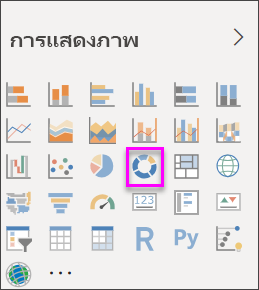
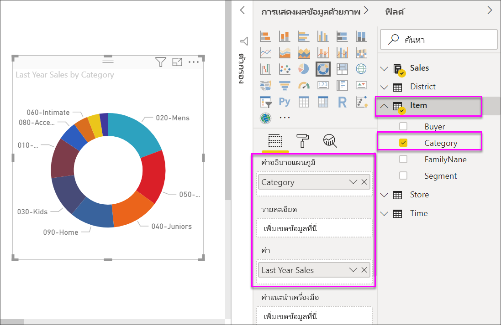

# สร้างและใช้แผนภูมิโดนัทใน Power BICreate and use doughnut charts in Power BI

[!INCLUDE[consumer-appliesto-nyyn](../includes/consumer-appliesto-nyyn.md)]

[!INCLUDE [power-bi-visuals-desktop-banner](../includes/power-bi-visuals-desktop-banner.md)]

แผนภูมิโดนัทจะคล้ายกับแผนภูมิวงกลมที่จะแสดงความสัมพันธ์ของข้อมูลองค์ประกอบต่างๆ กับข้อมูลทั้งหมดA doughnut chart is similar to a pie chart in that it shows the relationship of parts to a whole. ความแตกต่างเพียงประการเดียว คือ ส่วนตรงกลางนั้นว่างเปล่า และมีพื้นที่ว่างสำหรับระบุป้ายชื่อหรือไอคอนThe only difference is that the center is blank and allows space for a label or icon.

## เงื่อนไขเบื้องต้นPrerequisite

บทช่วยสอนนี้ใช้[ไฟล์ PBIX ตัวอย่างการวิเคราะห์การค้าปลีก](https://download.microsoft.com/download/9/6/D/96DDC2FF-2568-491D-AAFA-AFDD6F763AE3/Retail%20Analysis%20Sample%20PBIX.pbix)This tutorial uses the [Retail Analysis sample PBIX file](https://download.microsoft.com/download/9/6/D/96DDC2FF-2568-491D-AAFA-AFDD6F763AE3/Retail%20Analysis%20Sample%20PBIX.pbix).

1. จากด้านบนซ้ายของแถบเมนู เลือก **ไฟล์** > **เปิด**From the upper left section of the menubar, select **File** > **Open**
   
2. ค้นหาสำเนา **ไฟล์ PBIX ตัวอย่างการวิเคราะห์การค้าปลีก**Find your copy of the **Retail Analysis sample PBIX file**

1. เปิด **ไฟล์ PBIX ตัวอย่างการวิเคราะห์การค้าปลีก** ในมุมมองรายงาน Open the **Retail Analysis sample PBIX file** in report view .

1. เลือกSelect  หากต้องการเพิ่มหน้าใหม่to add a new page.

> [!NOTE]
> การแชร์รายงานของคุณกับผู้ร่วมงาน Power BI กำหนดให้คุณต้องมีสิทธิ์การใช้งาน Power BI Pro แต่ละรายการ หรือรายงานจะถูกบันทึกในความจุแบบพรีเมียมSharing your report with a Power BI colleague requires that you both have individual Power BI Pro licenses or that the report is saved in Premium capacity.    

## สร้างแผนภูมิโดนัทCreate a doughnut chart

1. เริ่มต้นที่หน้ารายงานเปล่า และจากบานหน้าต่างเขตข้อมูล เลือก **ยอดขาย** \> **ยอดขายปีล่าสุด**Start on a blank report page and from the Fields pane, select **Sales** \> **Last Year Sales**.  
   
3. ในส่วนบานหน้าต่างการแสดงภาพ ให้เลือกไอคอนสำหรับแผนภูมิโดนัท เพื่อแปลงแผนภูมิแท่งของคุณให้กลายเป็นแผนภูมิโดนัทFrom the Visualizations pane, select the icon for doughnut chart  to convert your bar chart to a doughnut chart. ถ้า **ยอดขายปีล่าสุด** ไม่อยู่ในพื้นที่ **ค่า** ให้ลากไปไว้ในส่วนนั้นIf **Last Year Sales** is not in the **Values** area, drag it there.
     
   

4. เลือก **หน่วยข้อมูล** \> **หมวดหมู่** เพิ่มเพิ่มรายการไปยังพื้นที่ **คำอธิบายแผนภูมิ**Select **Item** \> **Category** to add it to the **Legend** area. 
     
    

5. อีกวิธีหนึ่ง คือ [ปรับขนาดและสีของข้อความในแผนภูมิ](power-bi-visualization-customize-title-background-and-legend.md)Optionally, [adjust the size and color of the chart's text](power-bi-visualization-customize-title-background-and-legend.md). 

## ข้อควรพิจารณาและการแก้ไขปัญหาConsiderations and troubleshooting
* ผลรวมของค่าแผนภูมิโดนัทต้องเพิ่มเป็น 100%The sum of the doughnut chart values must add up to 100%.
* จำนวนประเภทที่มากเกินไปจะทำให้อ่านและตีความข้อมูลได้ยากToo many categories make it difficult to read and interpret.
* แผนภูมิโดนัทเหมาะอย่างยิ่งที่จะใช้เพื่อเปรียบเทียบข้อมูลส่วนใดส่วนหนึ่งกับข้อมูลทั้งหมด มากกว่าจะใช้เปรียบเทียบระหว่างข้อมูลแต่ละส่วนDoughnut charts are best used to compare a particular section to the whole, rather than comparing individual sections with each other. 

## ขั้นตอนถัดไปNext steps
[แผนภูมิกรวยใน Power BIFunnel charts in Power BI](power-bi-visualization-funnel-charts.md)

[ชนิดการแสดงภาพใน Power BIVisualization types in Power BI](power-bi-visualization-types-for-reports-and-q-and-a.md)

