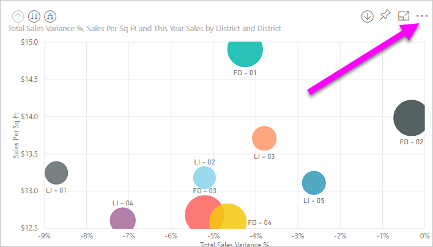
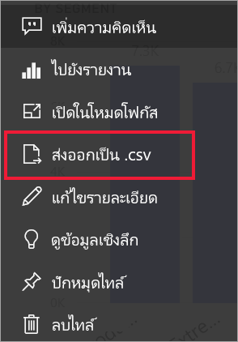
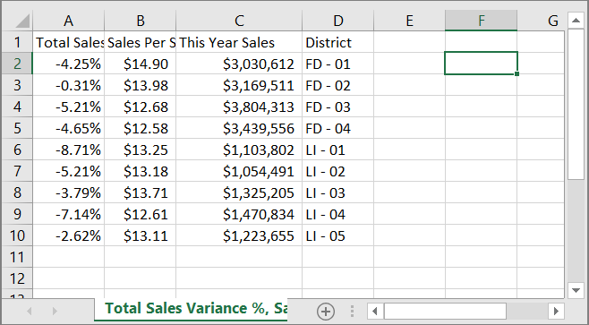
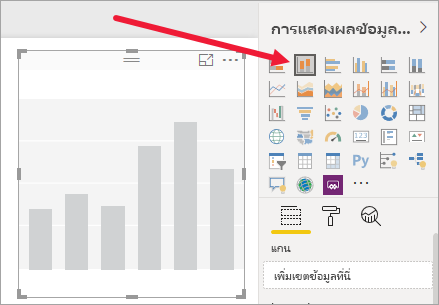
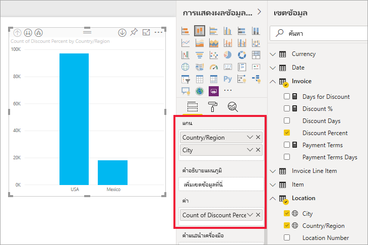
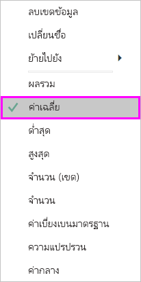
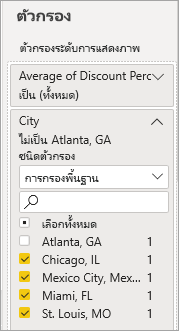
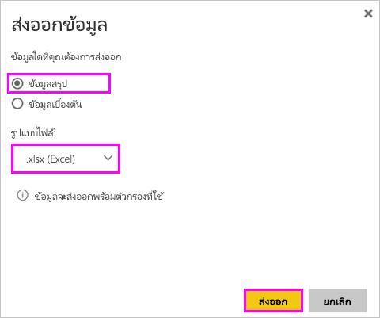
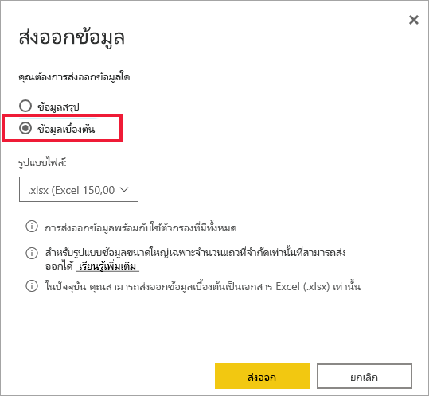
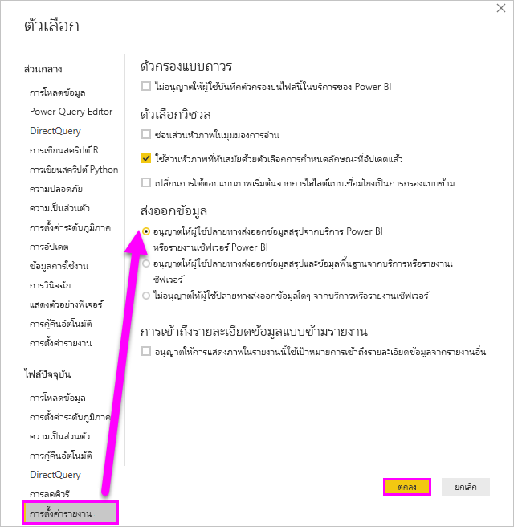

# ส่งออกข้อมูลที่ใช้เพื่อสร้างการแสดงผลข้อมูลด้วยภาพExport the data that was used to create a visualization

> [!IMPORTANT]
> ผู้ใช้ทั้งหมดไม่สามารถดูหรือส่งออกข้อมูลทั้งหมดได้Not all data can be viewed or exported by all users. มีระบบป้องกันที่ผู้ออกแบบรายงานและผู้ดูแลระบบใช้เมื่อสร้างแดชบอร์ดและรายงานThere are safeguards that report designers and administrators use when building dashboards and reports. ข้อมูลบางอย่างถูกจำกัด ซ่อน หรือเป็นความลับ และไม่สามารถมองเห็นหรือส่งออกโดยปราศจากข้ออนุญาตพิเศษSome data is restricted, hidden, or confidential, and cannot be seen or exported without special permissions. 

## ผู้ที่สามารถส่งออกข้อมูลได้Who can export data

ในกรณีที่คุณได้รับสิทธิ์อนุญาตสำหรับข้อมูลหนึ่ง ๆ คุณจะสามารถดูและส่งออกข้อมูลดังกล่าวที่ Power BI ใช้เพื่อสร้างการแสดงผลด้วยภาพได้If you have permissions to the data, you can see and export the data that Power BI uses to create a visualization. โดยข้อมูลมักจะเป็นความลับหรือจำกัดต่อผู้ใช้ที่ระบุOften, data is confidential or limited to specific users. ในกรณีดังกล่าว คุณจะไม่สามารถดูหรือส่งออกข้อมูลดังกล่าวได้In those cases, you will not be able to see or export that data. สำหรับรายละเอียดต่าง ๆ ดูที่ส่วน **ข้อจำกัดและข้อควรพิจารณา** ที่ส่วนท้ายของเอกสารนี้For details, see the **Limitations and considerations** section at the end of this document. 

## การดูและการส่งออกข้อมูลViewing and exporting data

ถ้าคุณต้องการดูข้อมูลที่ Power BI ใช้ในการสร้างการแสดงภาพ [คุณสามารถแสดงข้อมูลนั้นใน Power BI](service-reports-show-data.md)If you'd like to see the data that Power BI uses to create a visualization, [you can display that data in Power BI](service-reports-show-data.md). คุณยังสามารถส่งออกข้อมูลไปยัง Excel ในฐานะไฟล? *.xlsx* หรือ *.csv* ได้You can also export that data to Excel as an *.xlsx* or *.csv* file. ตัวเลือกในการส่งออกข้อมูลต้องมีสิทธิ์การใช้งานระดับ Pro หรือ Premium รวมถึงสิทธิในการแก้ไขชุดข้อมูลและรายงานThe option to export the data requires a Pro or Premium license as well as edit permissions to the dataset and report. ถ้าคุณมีการเข้าถึงแดชบอร์ดหรือรายงานแต่ข้อมูลมีการจัดประเภทเป็น *ความลับสูง* Power BI จะไม่อนุญาตให้คุณส่งออกข้อมูลIf you have access to the dashboard or report but the data is classified as *highly confidential*, Power BI will not allow you to export the data.

ดู Will ส่งออกข้อมูลจากหนึ่งในการแสดงภาพในรายงานของเขา บันทึกเป็นไฟล์  *.xlsx* และเปิดใน ExcelWatch Will export the data from one of the visualizations in his report, save it as an *.xlsx* file, and open it in Excel. แล้วทำตามคำแนะนำทีละขั้นตอนด้านล่างวิดีโอเพื่อลองทำด้วยตนเองThen follow the step-by-step instructions below the video to try it out yourself. โปรดทราบว่า วิดีโอนี้ใช้ Power BI เวอร์ชันเก่าNote that this video uses an older version of Power BI.

<iframe width="560" height="315" src="https://www.youtube.com/embed/KjheMTGjDXw" frameborder="0" allowfullscreen></iframe>

## ส่งออกข้อมูลจากแดชบอร์ด Power BIExport data from a Power BI dashboard

1. เลือกการดำเนินการเพิ่มเติม (...) จากมุมขวาบนของการแสดงภาพSelect More actions (...) from the upper-right corner of the visualization.

    

1. เลือกตัวเลือก **ส่งออกเป็น .csv**Choose the **Export to .csv** option.

    

1. Power BI ส่งออกข้อมูลเป็นไฟล์ *.csv*Power BI exports the data to a *.csv* file. หากคุณกรองการแสดงภาพ การส่งออกไฟล์ .csv จะถูกกรองเช่นกันIf you've filtered the visualization, then the .csv export will be filtered as well. 

1. เบราว์เซอร์ของคุณจะปรากฏขึ้นให้คุณบันทึกไฟล์Your browser will prompt you to save the file.  เมื่อบันทึกแล้ว เปิดไฟล์ *.csv* ใน ExcelOnce saved, open the *.csv* file in Excel.

    

## ส่งข้อมูลออกจากรายงานExport data from a report

เพื่อดำเนินการตามขั้นตอนนี้ เปิด [รายงานตัวอย่างการวิเคราะห์การจัดซื้อ](../create-reports/sample-procurement.md) ในบริการ Power BI ในมุมมองการแก้ไขTo follow along, open the [Procurement analysis sample report](../create-reports/sample-procurement.md) in the Power BI service in Editing view. เพิ่มหน้ารายงานเปล่าใหม่Add a new blank report page. จากนั้น ดำเนินการตามขั้นตอนต่าง ๆ ด้านล่างนี้เพื่อเพิ่มการรวม ลำดับชั้น และตัวกรองระดับการแสดงภาพThen follow the steps below to add an aggregation, hierarchy, and a visualization-level filter.

### สร้างแผนภูมิคอลัมน์แบบเรียงซ้อนCreate a stacked column chart

1. สร้าง **แผนภูมิคอลัมน์แบบเรียงซ้อน** ใหม่Create a new **Stacked column chart**.

    

1. จากบานหน้าต่าง **เขตข้อมูล** เลือก **ตำแหน่งที่ตั้ง > เมือง**, **ตำแหน่งที่ตั้ง > ประเทศ/ภูมิภาค** และ **ใบแจ้งหนี้ > เปอร์เซ็นต์ส่วนลด**From the **Fields** pane, select **Location > City**, **Location > Country/Region**, and **Invoice > Discount Percent**.  คุณอาจจำเป็นต้องย้าย **เปอร์เซ็นต์ส่วนลด** ลงในแอ่ง **ค่า** ดังกล่าวYou may have to move **Discount Percent** into the **Value** well.

    

1. เปลี่ยนการรวมสำหรับ **เปอร์เซ็นต์ส่วนลด** จาก **จำนวน** เป็น **ค่าเฉลี่ย**Change the aggregation for **Discount Percent** from **Count** to **Average**. ในแอ่ง **ค่า** เลือกลูกศรทางด้านขวาของ **เปอร์เซ็นต์ส่วนลด** (ที่อาจระบุว่า **จำนวนเปอร์เซ็นต์ส่วนลด**) และเลือก **ค่าเฉลี่ย** ได้In the **Value** well, select the arrow to the right of **Discount Percent** (it may say **Count of Discount Percent**), and choose **Average**.

    

1. เพิ่มตัวกรองที่ **เมือง** จากนั้นเลือกเมืองทั้งหมด และจากนั้น นำ **แอตแลนต้า** ออกAdd a filter to **City**, select all cities, and then remove **Atlanta**.

    

   
1. เจาะดูข้อมูลลงหนึ่งระดับในลำดับชั้นDrill down one level in the hierarchy. เปิดการเจาะข้อมูลและเจาะดูข้อมูลลงในระดับ **เมือง**Turn on drilling and drill down to the **City** level. 

    

ในตอนนี้เราก็พร้อมที่จะลองใช้ทั้งสองตัวเลือกสำหรับการส่งออกข้อมูลNow we're ready to try out both options for exporting data.

### ส่งออกข้อมูล\**_สรุป_* _Export \**_summarized_* _ data
เลือกตัวเลือกสำหรับ_ *ข้อมูลสรุป*\* หากคุณต้องการส่งออกข้อมูลที่คุณต้องการมองเห็นในวิชวลดังกล่าวSelect the option for _ *Summarized data*\* if you want to export data for what you see in that visual.  การส่งออกประเภทนี้จะแสดงเฉพาะข้อมูลดังกล่าว (คอลัมน์และการวัด) ที่ใช้ในการสร้างวิชวลเท่านั้นThis type of export shows you only the data (columns and measures) that are being used to create the visual.  ถ้าภาพมีการรวม คุณจะส่งออกข้อมูลรวมIf the visual has an aggregate, you'll export aggregated data. ตัวอย่างเช่น หากคุณมีแผนภูมิแท่งที่แสดงกราฟจำนวนสี่แท่ง คุณจะมีข้อมูล Excel จำนวนสี่แถวFor example, if you have a bar chart showing four bars, you'll get four rows of Excel data. ข้อมูลสรุปจะปรากฏในบริการ Power BI ในรูปแบบ *.xlsx* และ *.csv* และใน Power BI Desktop ในรูปแบบ .csvSummarized data is available in the Power BI service as *.xlsx* and *.csv* and in Power BI Desktop as .csv.

1. เลือกจุดไข่ปลาในมุมบนขวาของการแสดงภาพSelect the ellipsis in the upper-right corner of the visualization. เลือก **ส่งออกข้อมูล**Select **Export data**.

    

    ในบริการ Power BI เนื่องจากการแสดงภาพของคุณมีผลรวม (คุณเปลี่ยน **จำนวน** เป็น *ค่าเฉลี่ย*) คุณจะมีตัวเลือกจำนวนสองรายการ:In the Power BI service, since your visualization has an aggregate (you changed **Count** to *average*),  you'll have two options:

    - **ข้อมูลสรุป****Summarized data**

    - **ข้อมูลเบื้องต้น****Underlying data**

    สำหรับความช่วยเหลือในการทำความเข้าใจค่ารวม ดู[ค่ารวมใน Power BI](../create-reports/service-aggregates.md)For help understanding aggregates, see [Aggregates in Power BI](../create-reports/service-aggregates.md).

    > [!NOTE]
    > ใน Power BI Desktop คุณจะมีเพียงตัวเลือกในการส่งออกข้อมูลสรุปในรูปแบบไฟล์ .csvIn Power BI Desktop, you'll only have the option to export summarized data as a .csv file. 
    
    
1. จากเมนู **ส่งออกข้อมูล** ให้เลือก **ข้อมูลสรุป** แล้วเลือกไฟล์ *.xlsx* หรือ *.csv* จากนั้นเลือก **ส่งออก**From **Export data**, select **Summarized data**, either choose *.xlsx* or *.csv*, and then select **Export**. Power BI ส่งออกข้อมูลPower BI exports the data.

    

1. เมื่อคุณเลือก **ส่งออก** เบราว์เซอร์ของคุณจะปรากฏให้คุณบันทึกไฟล์ดังกล่าวWhen you select  **Export**, your browser prompts you to save the file. เมื่อบันทึกแล้ว เปิดไฟล์ดังกล่าวใน ExcelOnce saved, open the file in Excel. ถ้าคุณกำลังใช้แอป Power BI ใน Microsoft Teams คุณอาจไม่ได้รับพร้อมท์เดียวกันIf you're using the Power BI app in Microsoft Teams, you may not receive the same prompts. ไฟล์ที่ส่งออกของคุณจะถูกบันทึกไว้ในโฟลเดอร์ดาวน์โหลดภายในเครื่องของคุณYour exported file is saved in your local Downloads folder. 

    

    ในตัวอย่างนี้ การส่งออก Excel ของเราแสดงผลรวมหนึ่งสำหรับแต่ละเมืองIn this example, our Excel export shows one total for each city. เนื่องจากเราได้กรองรัฐแอตแลนต้าออกไป รัฐดังกล่าวจะไม่รวมอยู่ในผลลัพธ์Since we filtered out Atlanta, it isn't included in the results. แถวแรกของสเปรดชีตของคุณจะแสดงตัวกรองที่ Power BI ใช้เมื่อดึงข้อมูลThe first row of our spreadsheet shows the filters that Power BI used when extracting the data.
    
    - ข้อมูลทั้งหมดที่ใช้โดยลำดับชั้นจะถูกส่งออกไม่เพียงแค่ข้อมูลที่ใช้สำหรับระดับการเจาะปัจจุบันสำหรับการแสดงผลด้วยภาพAll the data used by the hierarchy is exported, not simply the data used for the current drill level for the visual. ตัวอย่างเช่น เราเจาะดูข้อมูลลึกลงในระดับเมือง แต่การส่งออกของเรารวมถึงข้อมูลประเทศเช่นกันFor example, we had drilled down to the city level, but our export includes country data as well.  

    - ข้อมูลที่ส่งออกของเราจะรวมไปด้วยOur exported data is aggregated. เราจะมีผลรวมทั้งหมด เป็นหนึ่งแถวสำหรับแต่ละเมืองWe get a total, one row, for each city.

    - เนื่องจากเราได้ปรับใช้ตัวกรองกับการแสดงภาพ ข้อมูลที่ส่งออกจึงจะส่งออกแบบกรองแล้วด้วยSince we applied filters to the visualization, the exported data will export as filtered. โปรดทราบว่าแถวแรกจะแสดง **ตัวกรองที่ปรับใช้: เมืองไม่ใช่แอตแลนตา รัฐจอร์เจีย**Notice that the first row displays **Applied filters: City is not Atlanta, GA**. 

### ส่งออกข้อมูล\**_เบื้องต้น_* _Export \**_underlying_* _ data

เลือกตัวเลือกนี้ หากคุณต้องการดูข้อมูลในวิชวล _\*_และ_\*_ ข้อมูลเพิ่มเติมจากชุดข้อมูล (ดูที่แผนภูมิด้านล่างสำหรับรายละเอียด)Select this option if you want to see the data in the visual _*_and_*_ additional data from the dataset (see chart below for details). ถ้าภาพของคุณมีการรวมค่า การเลือก_ \*ข้อมูลต้นแบบ\*\*จะลบการรวมค่าIf your visualization has an aggregate, selecting _ *Underlying data*\* removes the aggregate. ในตัวอย่างนี้ การส่งออก Excel จะแสดงหนึ่งแถวสำหรับทุกหนึ่งแถวของเมืองในชุดข้อมูลของเรา และเปอร์เซ็นต์ส่วนลดสำหรับรายการเดียวนั้นIn this example, the Excel export shows one row for every single City row in our dataset and the discount percent for that single entry. Power BI ปรับโครงสร้างข้อมูล แต่ไม่คิดผลรวมPower BI flattens the data, it doesn't aggregate it.  

เมื่อคุณเลือก **ส่งออก** Power BI จะส่งออกข้อมูลไปยังไฟล์ *.xlsx* และเบราว์เซอร์ของคุณจะปรากฏข้อความให้คุณบันทึกไฟล์When you select **Export**, Power BI exports the data to an *.xlsx* file and your browser prompts you to save the file. เมื่อบันทึกแล้ว เปิดไฟล์ดังกล่าวใน ExcelOnce saved, open the file in Excel.

1. เลือกจุดไข่ปลาจากมุมบนขวาของการแสดงภาพSelect the ellipsis from the upper-right corner of the visualization. เลือก **ส่งออกข้อมูล**Select **Export data**.

    

    ในบริการ Power BI เนื่องจากการแสดงภาพของคุณมีผลรวม (คุณเปลี่ยน **จำนวน** เป็น **ค่าเฉลี่ย**) คุณจะมีตัวเลือกจำนวนสองรายการ:In the Power BI service, since your visualization has an aggregate (you changed **Count** to **average**),  you'll have two options:

    - **ข้อมูลสรุป****Summarized data**

    - **ข้อมูลเบื้องต้น****Underlying data**

    สำหรับความช่วยเหลือในการทำความเข้าใจค่ารวม ดู[ค่ารวมใน Power BI](../create-reports/service-aggregates.md)For help understanding aggregates, see [Aggregates in Power BI](../create-reports/service-aggregates.md).

    > [!NOTE]
    > ใน Power BI Desktop คุณจะมีเพียงตัวเลือกในการส่งออกข้อมูลสรุปเท่านั้นIn Power BI Desktop, you'll only have the option to export summarized data. 
    
    
1. จาก **ส่งออกข้อมูล** เลือก **ข้อมูลเบื้องต้น** แล้วเลือก **ส่งออก**From **Export data**, select **Underlying data**, and then select **Export**. Power BI ส่งออกข้อมูลPower BI exports the data.

    

1. เมื่อคุณเลือก **ส่งออก** เบราว์เซอร์ของคุณจะปรากฏให้คุณบันทึกไฟล์ดังกล่าวWhen you select  **Export**, your browser prompts you to save the file. เมื่อบันทึกแล้ว เปิดไฟล์ดังกล่าวใน ExcelOnce saved, open the file in Excel.  ถ้าคุณกำลังใช้แอป Power BI ใน Microsoft Teams คุณอาจไม่ได้รับพร้อมท์เดียวกันIf you're using the Power BI app in Microsoft Teams, you may not receive the same prompts. ไฟล์ที่ส่งออกของคุณจะถูกบันทึกไว้ในโฟลเดอร์ดาวน์โหลดภายในเครื่องของคุณYour exported file is saved in your local Downloads folder. 

    
    
    - สกรีนช็อตนี้แสดงเฉพาะส่วนน้อยของไฟล Excel โดยมีแถวมากกว่า 100,000 แถวThis screenshot shows you only a small portion of the Excel file; it has more than 100,000 rows.  
    
    - ข้อมูลทั้งหมดที่ใช้โดยลำดับชั้นจะถูกส่งออกไม่เพียงแค่ข้อมูลที่ใช้สำหรับระดับการเจาะปัจจุบันสำหรับการแสดงผลด้วยภาพAll the data used by the hierarchy is exported, not simply the data used for the current drill level for the visual. ตัวอย่างเช่น เราเจาะดูข้อมูลลึกลงในระดับเมือง แต่การส่งออกของเรารวมถึงข้อมูลประเทศเช่นกันFor example, we had drilled down to the city level, but our export includes country data as well.  

    - เนื่องจากเราได้ปรับใช้ตัวกรองกับการแสดงภาพ ข้อมูลที่ส่งออกจึงจะส่งออกแบบกรองแล้วด้วยSince we applied filters to the visualization, the exported data will export as filtered. โปรดทราบว่าแถวแรกจะแสดง **ตัวกรองที่ปรับใช้: เมืองไม่ใช่แอตแลนตา รัฐจอร์เจีย**Notice that the first row displays **Applied filters: City is not Atlanta, GA**. 

## กำหนดค่าประสบการณ์ของผู้ใช้ข้อมูลการส่งออกCustomize the export data user experience

ผู้ใช้ที่ได้รับสิทธิการเข้าถึงรายงานจะ **ได้รับอนุญาตให้เข้าถึงชุดข้อมูลเบื้องต้นทั้งหมด** เว้นแต่ว่า [การรักษาความปลอดภัยระดับแถว (RLS)](../admin/service-admin-rls.md) จำกัดการเข้าถึงของพวกเขาUsers who are granted access to a report are **granted access to the entire underlying dataset**, unless [row-level security (RLS)](../admin/service-admin-rls.md) limits their access. ผู้สร้างรายงานและผู้ดูแลระบบ Power BI สามารถใช้ความสามารถที่อธิบายไว้ด้านล่างเพื่อปรับแต่งประสบการณ์ของผู้ใช้Report authors and Power BI administrators can use the capabilities described below to customize the user experience.

- ผู้สร้างรายงาน [ตัดสินใจว่า *ตัวเลือกการส่งออก*](#set-the-export-options)ใดที่พร้อมใช้งานสำหรับผู้ใช้Report authors [decide which *export options*](#set-the-export-options) are available to users.  

- ผู้ดูแลระบบ Power BI สามารถปิดการส่งออกข้อมูลทั้งหมดหรือบางส่วนสำหรับองค์กรของตนเองได้Power BI administrators can turn off some or all data export options for their organization.  

- เจ้าของชุดข้อมูลสามารถตั้งค่าการรักษาความปลอดภัยระดับแถว (RLS) ได้Dataset owners can set row level security (RLS). RLS จะจำกัดการเข้าถึงผู้ใช้แบบอ่านอย่างเดียวRLS will restrict access to read-only users. ถ้าคุณกำหนดค่าพื้นที่ทำงานแอปและให้สมาชิกมีสิทธิ์ในการแก้ไข จะไม่สามารถใช้บทบาท RLS กับพื้นที่ทำงานแอปนั้นได้But if you have configured an app workspace and given members edit permissions, RLS roles will not be applied to them. สำหรับข้อมูลเพิ่มเติม โปรดดู [การรักษาความปลอดภัยระดับแถว](../admin/service-admin-rls.md)For more information, see [Row-level security](../admin/service-admin-rls.md).

- ผู้สร้างรายงานสามารถซ่อนคอลัมน์ เพื่อไม่ให้แสดงในรายการ **เขตข้อมูล**Report authors can hide columns so that they don't show up in the **Fields** list. สำหรับข้อมูลเพิ่มเติม ดู [คุณสมบัติของชุดข้อมูล](../developer/automation/api-dataset-properties.md)For more information, see [Dataset properties](../developer/automation/api-dataset-properties.md)

**ประสบการณ์ผู้ใช้ที่กำหนดเองเหล่านี้ไม่จำกัดสิ่งที่ผู้ใช้สามารถเข้าถึงข้อมูลในชุดข้อมูล ใช้ [การรักษาความปลอดภัยระดับแถว (RLS)](../admin/service-admin-rls.md) ในชุดข้อมูลเพื่อให้ข้อมูลประจำตัวของแต่ละบุคคลกำหนดว่าข้อมูลใดที่พวกเขาสามารถเข้าถึงได้****These customized user experience do not restrict what data users can access in the dataset. Use [row-level security (RLS)](../admin/service-admin-rls.md) in the dataset so that each person's credentials determine which data they can access.**

## ปกป้องข้อมูลเมื่อมีการส่งออกจาก Power BIProtect data when it is exported out of Power BI

- ผู้เขียนรายงานสามารถจัดประเภทและรายงานป้ายชื่อโดยใช้ [ป้ายชื่อระดับความลับของ Microsoft Information Protection](../admin/service-security-data-protection-overview.md)Report authors can classify and label reports using Microsoft Information Protection [sensitivity labels](../admin/service-security-data-protection-overview.md). ถ้าป้ายชื่อระดับความลับมีการตั้งค่าการป้องกัน Power BI จะใช้การตั้งค่าการป้องกันเหล่านี้เมื่อส่งออกข้อมูลรายงานไปยัง Excel, PowerPoint หรือไฟล์ PDFIf the sensitivity label has protection settings, Power BI will apply these protection settings when export report data to Excel, PowerPoint, or PDF files. เฉพาะผู้ใช้ที่ได้รับอนุญาตเท่านั้นที่สามารถเปิดไฟล์ที่มีการป้องกันOnly authorized users can open protected files.

- ผู้ดูแลระบบ Power BI และความปลอดภัยสามารถใช้ [Microsoft Cloud App Security](../admin/service-security-data-protection-overview.md) เพื่อตรวจสอบการเข้าถึงและกิจกรรมของผู้ใช้ ดำเนินการวิเคราะห์ความเสี่ยงแบบเรียลไทม์ และตั้งค่าตัวควบคุมเฉพาะป้ายกำกับได้Security and Power BI a administrators can use [Microsoft Cloud App Security](../admin/service-security-data-protection-overview.md) to monitor user access and activity, perform real-time risk analysis, and set label-specific controls. ตัวอย่างเช่น องค์กรสามารถใช้ Microsoft Cloud App Security เพื่อกำหนดค่านโยบายที่ป้องกันไม่ให้ผู้ใช้ดาวน์โหลดข้อมูลที่ละเอียดอ่อนจาก Power BI ไปยังอุปกรณ์ที่ไม่มีการจัดการได้For example, organizations can use Microsoft Cloud App Security to configure a policy that prevents users from downloading sensitive data from Power BI to unmanaged devices.

## ส่งออกรายละเอียดข้อมูลต้นแบบExport underlying data details

สิ่งที่คุณเห็นเมื่อคุณเลือก **ข้อมูลต้นแบบ** อาจแตกต่างกันได้What you see when you select **Underlying data** can vary. การทำความเข้าใจรายละเอียดเหล่านี้อาจต้องการความช่วยเหลือจากผู้ดูแลระบบหรือแผนก IT ของคุณUnderstanding these details may require the help of your admin or IT department. 

>

| การแสดงภาพประกอบด้วยVisual contains | สิ่งที่คุณจะเห็นในการส่งออกWhat you'll see in export  |
|---------------- | ---------------------------|
| การรวมค่าAggregates | ข้อมูลการรวม *ครั้งแรก* และที่เปิดเผยจากตารางทั้งหมดสำหรับการรวมค่านั้นthe *first* aggregate and non-hidden data from the entire table for that aggregate |
| การรวมค่าAggregates | ข้อมูลที่เกี่ยวข้อง - ถ้าภาพใช้ข้อมูลจากตารางข้อมูลอื่นที่ *เกี่ยวข้อง* กับตารางข้อมูลที่ประกอบด้วยการรวมค่า (ตราบใดที่ความสัมพันธนั้นเป็น \*: 1 หรือ 1:1)related data - if the visual uses data from other data tables that are  *related* to the data table that contains the aggregate (as long as that relationship is \*:1 or 1:1) |
| หน่วยวัด\*Measures\* | หน่วยวัดทั้งหมดในภาพ *และ* หน่วยวัดทั้งหมดจากตารางข้อมูลใดๆที่ประกอบด้วยหน่วยวัดที่ใช้ในภาพall measures in the visual *and* all measures from any data table containing a measure used in the visual |
| หน่วยวัด\*Measures\* | ข้อมูลที่เปิดเผยทั้งหมดจากตารางที่ประกอบด้วยหน่วยวัด (ตราบใดที่ความสัมพันธ์นั้นเป็น\*: 1 หรือ 1:1)all non-hidden data from tables that contain that measure (as long as that relationship is \*:1 or 1:1) |
| หน่วยวัด\*Measures\* | ข้อมูลทั้งหมดจากตารางทั้งหมดที่เกี่ยวข้องกับตารางที่ประกอบด้วยหน่วยวัดผ่านทางสาย \*: 1 จาก 1:1)all data from all tables that are related to table(s) containing the measures via a chain of \*:1 of 1:1) |
| หน่วยวัดเท่านั้นMeasures only | คอลัมน์ที่เปิดเผยทั้งหมดจากตารางที่เกี่ยวข้องทั้งหมด (เมื่อต้องขยายหน่วยวัด)all non-hidden columns from all related tables (to expand the measure) |
| หน่วยวัดเท่านั้นMeasures only | ข้อมูลสรุปของแถวที่ซ้ำกันของหน่วยวัดรูปแบบข้อมูลsummarized data for any duplicate rows for model measures |

\* ในบริการหรือ Power BI Desktop ในมุมมองการรายงาน *หน่วยวัด* จะแสดงรายการ **เขตข้อมูล** ที่มีไอคอนเครื่องคิดเลข \* In Power BI Desktop or service, in the reporting view, a *measure* shows in the **Fields** list with a calculator icon . หน่วยวัดสามารถสร้างใน Power BI Desktop ได้Measures can be created in Power BI Desktop.

### ตั้งค่าตัวเลือกการส่งออกSet the export options

ตัวออกแบบรายงาน BI power ควบคุมชนิดของตัวเลือกการส่งออกข้อมูลที่ลูกค้าของพวกเขาสามารถใช้งานได้Power BI report designers control the types of data export options that are available for their consumers. ตัวเลือกคือ:The choices are:

- อนุญาตให้ผู้ใช้ปลายทางส่งออกข้อมูลสรุปจากบริการ Power BI หรือรายงานเซิฟเวอร์ Power BIAllow end users to export summarized data from the Power BI service or Power BI Report Server

- อนุญาตให้ผู้ใช้ปลายทางส่งออกข้อมูลสรุปและข้อมูลพื้นฐานจากบริการหรือรายงานเซิฟเวอร์Allow end users to export both summarized and underlying data from the service or Report Server

- ไม่อนุญาตให้ผู้ใช้ปลายทางส่งออกข้อมูลใดๆ จากบริการหรือรายงานเซิฟเวอร์Don't allow end users to export any data from the service or Report Server

    > [!IMPORTANT]
    > เราขอแนะนำให้ผู้ออกแบบรายงานทบทวนรายงานเก่าและตั้งค่าตัวเลือกการส่งออกด้วยตนเองตามความจำเป็นWe recommend that report designers revisit old reports and manually reset the export option as needed.

การตั้งค่าตัวเลือกเหล่านี้:To set these options:

1. เริ่มต้นใน Power BI DesktopStart in Power BI Desktop.

1. จากมุมบนซ้าย เลือก **แฟ้ม** > **ตัวเลือกและการตั้งค่า** > **ตัวเลือก**From the upper left corner, select **File** > **Options and Settings** > **Options**.

1. ภายใต้ **แฟ้มปัจจุบัน** เลือก **ตั้งค่ารายงาน**Under **CURRENT FILE**, select **Report settings**.

    

1. เลือกรายการจากเมนูส่วนของการ **ส่งออกข้อมูล**Make your selection from the **Export data** section.

นอกจากนี้ คุณยังสามารถอัปเดตการตั้งค่านี้ในบริการ Power BI ได้อีกด้วยYou can also update this setting in the Power BI service.

จำเป็นจะต้องทราบว่าหากการตั้งค่าพอร์ทัลของผู้ดูแลระบบ Power BI ขัดแย้งกับการตั้งค่ารายงานสำหรับส่งออกข้อมูล การตั้งค่าของผู้ดูแลระบบจะแทนที่การตั้งค่าการส่งออกข้อมูลIt's important to note that if the Power BI admin portal settings conflict with the report settings for export data, the admin settings will override the export data settings.

## ข้อจำกัดและข้อควรพิจารณาLimitations and considerations
ข้อจำกัดและข้อควรพิจารณาเหล่านี้สามารถนำไปใช้กับ Power BI Desktop และบริการของ Power BI รวมถึง Power BI Pro และ PremiumThese limitations and considerations apply to Power BI Desktop and the Power BI service, including Power BI Pro and Premium.

- หากต้องการส่งออกข้อมูลจากวิชวล คุณจำเป็นต้อง[สร้างสิทธิ์สำหรับชุดข้อมูลพื้นฐาน](../connect-data/service-datasets-build-permissions.md)To export the data from a visual, you need to have [Build permission for the underlying dataset](../connect-data/service-datasets-build-permissions.md).

-  จำนวนแถวสูงสุดที่สามารถส่งออกจาก **Power BI Desktop** และ **บริการ Power BI** สามารถส่งออกจาก **รายงานโหมดนำเข้า** ไปยังไฟล์ *.csv* คือ 30,000The maximum number of rows that **Power BI Desktop** and **Power BI service** can export from an **import mode report** to a *.csv* file is 30,000.

- จำนวนสูงสุดของแถวที่แอปพลิเคชันสามารถส่งออกจาก **รายงานโหมดนำเข้า** ไปยังไฟล์ *.xlsx* คือ 150,000The maximum number of rows that the applications can export from an **import mode report** to an *.xlsx* file is 150,000.

- ส่งออกโดยใช้ *ข้อมูลเบื้องต้น* จะไม่สามารถทำงานถ้าหาก:Export using *Underlying data* won't work if:

  - เวอร์ชันเก่ากว่าปี 2016the version is older than 2016.

  - ตารางในแบบจำลองไม่มีคีย์เฉพาะthe tables in the model don't have a unique key.
    
  -  ผู้ดูแลระบบหรือผู้ออกแบบรายงานได้ปิดใช้งานคุณลักษณะนี้an administrator or report designer has disabled this feature.

- การส่งออกโดยใช้ *ข้อมูลเบื้องต้น* จะไม่สามารถทำได้ถ้าคุณเปิดตัวเลือก *แสดงรายการที่ไม่มีข้อมูล* สำหรับการแสดงภาพ Power BI ที่ถูกกำลังส่งออกExport using *Underlying data* won't work if you enable the *Show items with no data* option for the visualization Power BI is exporting.

- เมื่อใช้ DirectQuery จำนวนข้อมูลที่ Power BI สามารถส่งออกได้สูงสุดคือ ข้อมูลที่ไม่บีบอัด 16 MBWhen using DirectQuery, the maximum amount of data that Power BI can export is 16-MB uncompressed data. ผลลัพธ์ไม่เป็นไปตามที่คาดหวังอาจเป็นเพราะคุณส่งออกข้อมูลน้อยกว่าจำนวนแถวสูงสุด 150,000 แถวAn unintended result may be that you export less than the maximum number of rows of 150,000. ซึ่งเป็นไปได้ที่จะเป็นเช่นนั้นหาก:This is likely if:

    - มีจำนวนคอลัมน์มากเกินไปThere are too many columns. ลองลดจำนวนคอลัมน์ลงและส่งออกอีกครั้งTry reducing the number of columns and exporting again.

    - มีข้อมูลที่ยากต่อการบีบอัดThere's data that is difficult to compress.

    - ปัจจัยอื่น ๆ ก็มีส่วนในการเพิ่มขนาดไฟล์และลดจำนวนแถวที่ Power BI สามารถส่งออก ได้Other factors are at play that increase file size and decrease the number of rows Power BI can export.

- ถ้าการแสดงภาพใช้ข้อมูลจากตารางข้อมูลมากกว่าหนึ่งตาราง และไม่มีความสัมพันธ์ระหว่างตารางเหล่านั้นในรูปแบบข้อมูล Power BI จะทำได้เพียงส่งออกข้อมูลสำหรับตารางแรกIf the visualization uses data from more than one data table, and no relationship exists for those tables in the data model, Power BI only exports data for the first table.

- ยังไม่สนับสนุนวิชวล Power BI และวิชวล R ในขณะนี้Power BI visuals and R visuals aren't currently supported.

- ใน Power BI คุณสามารถตั้งชื่อใหม่ให้กับเขตข้อมูล (คอลัมน์) โดยการดับเบิลคลิกที่เขตข้อมูล แล้วพิมพ์ชื่อใหม่In Power BI, you can rename a field (column) by double-clicking the field and typing a new name. Power BI จะอ้างอิงข้อมูลชื่อใหม่เป็นในฐานะ *นามแฝง*Power BI refers to the new name as an *alias*. อาจเป็นไปได้ว่า รายงาน Power BI สุดท้ายแล้วมีชื่อเขตข้อมูลที่ซ้ำกัน แต่ Excel ไม่อนุญาตให้มีชื่อที่ซ้ำกันIt's possible that a Power BI report can end up with duplicate field names, but Excel doesn't allow duplicates. ดังนั้น เมื่อPower BI ส่งออกข้อมูลไปยัง Excel นามแฝงของเขตข้อมูลถูกแปลงกลับไปเป็นชื่อเขตข้อมูล (คอลัมน์) เดิมSo when Power BI exports the data to Excel, the field aliases revert to their original field (column) names.  

- ถ้ามีอักขระ Unicode ในไฟล์ *.csv* ข้อความใน Excel อาจไม่แสดงอย่างเหมาะสมIf there are Unicode characters in the *.csv* file, the text in Excel may not display properly. ตัวอย่างของอักขระ Unicode คือสัญลักษณ์สกุลเงินและคำในภาษาต่างประเทศExamples of Unicode characters are currency symbols and foreign words. คุณสามารถเปิดไฟล์ใน Notepad และ Unicode ซึ่งจะแสดงผลอย่างถูกต้องYou can open the file in Notepad and the Unicode will display correctly. การแก้ไขปัญหาชั่วคราวคือการ นำเข้าไฟล์ *.csv* ถ้าคุณต้องการเปิดไฟล์ใน ExcelIf you want to open the file in Excel, the workaround is to import the *.csv*. การนำเข้าไฟล์ลงใน Excel:To import the file into Excel:

  1. เปิด ExcelOpen Excel.

  1. ไปที่แท็บ **ข้อมูล**Go to the **Data** tab.
  
  1. เลือก **รับข้อมูลภายนอก** > **จากข้อความ**Select **Get external data** > **From text**.
  
  1. ไปยังโฟลเดอร์เฉพาะที่จัดเก็บไฟล์และเลือกไฟล์ *.csv*Go to the local folder where the file is stored and select the *.csv*.

- เมื่อทำการส่งออกไปเป็นไฟล์ *csv* แล้ว อักขระบางตัวจะเลื่อนออกไปโดยมีเครื่องหมาย **'** นำหน้า เพื่อใช้ป้องกันการทำงานของสคริปต์เมื่อเปิดไฟล์ใน ExcelWhen exporting to *.csv*, certain characters will be escaped with a leading **'** to prevent script execution when opened in Excel. ซึ่งจะเกิดขึ้นเมื่อ:This happens when:
  - คุณกำหนดคอลัมน์ไว้เป็นชนิด "Text" (ข้อความ) ในแบบจำลองข้อมูล **_และ_**The column is defined as type "text" in the data model, **_and_**
  - อักขระตัวแรกของข้อความมีอักขระต่อไปนี้: **=, @, +,-**The first character of the text is one of the following: **=, @, +, -**

- ผู้ดูแลระบบ Power BI สามารถปิดการส่งออกข้อมูลได้Power BI admins can disable the export of data.

มีคำถามเพิ่มเติมหรือไม่More questions? [ลองถามชุมชน Power BITry asking the Power BI Community](https://community.powerbi.com/)