# สร้างและใช้แผนที่แถบสี (แผนที่ choropleths) ใน Power BICreate and use filled maps (choropleth maps) in Power BI

[!INCLUDE[consumer-appliesto-nyyn](../includes/consumer-appliesto-nyyn.md)]

[!INCLUDE [power-bi-visuals-desktop-banner](../includes/power-bi-visuals-desktop-banner.md)]

แผนที่แถบสีใช้เฉดสีหรือ หรือการปรับสีอ่อนแก่ หรือรูปแบบต่าง ๆ เพื่อแสดงว่าค่าแตกต่างกันมากเพียงใดในสัดส่วนทั่วทั้งภูมิศาสตร์หรือภูมิภาคA filled map uses shading or tinting or patterns to display how a value differs in proportion across a geography or region.  เพื่อแสดงความแตกต่างเหล่านี้ที่สัมพันธ์กับเฉดสีที่อยู่ในช่วงจากสีอ่อน (ความถี่น้อยกว่า/ต่ำกว่า) ไปถึงเข้ม (ความถี่มากกว่า/สูงกว่า) ได้อย่างรวดเร็วQuickly display these relative differences with shading that ranges from light (less-frequent/lower) to dark (more-frequent/more).    

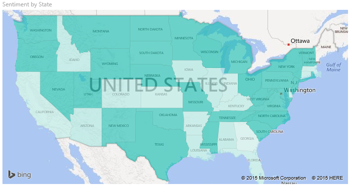

## สิ่งที่จะถูกส่งไปยัง BingWhat is sent to Bing
Power BI รวมเข้ากับ Bing เพื่อให้มีพิกัดแมปเริ่มต้น (กระบวนการที่เรียกว่า การกำหนดรหัสทางภูมิศาสตร์)Power BI integrates with Bing to provide default map coordinates (a process called geo-coding). เมื่อคุณสร้างการแสดงภาพของแผนที่ในบริการ Power BI หรือ Power BI Desktop ข้อมูลในบักเก็ต **ตำแหน่งที่ตั้ง** **ละติจูด** และ **ลองติจู** (ที่กำลังถูกใช้เพื่อสร้างการแสดงภาพนั้น) จะถูกส่งไปยัง BingWhen you create a map visualization in Power BI service or Power BI Desktop, the data in the **Location**, **Latitude**, and **Longitude** buckets (that is being used to create that visualization) is sent to Bing.

คุณหรือผู้ดูแลระบบของคุณอาจจำเป็นต้องอัปเดตไฟร์วอลล์ของคุณเพื่ออนุญาตให้เข้าถึง URL ที่ Bing ใช้สำหรับการกำหนดพิกัดทางภูมิศาสตร์You, or your administrator, may need to update your firewall to allow access to the URLs Bing uses for geocoding.  URL เหล่านั้นคือ:Those URLs are:
- https://dev.virtualearth.net/REST/V1/Locations    
- https://platform.bing.com/geo/spatial/v1/public/Geodata    
- https://www.bing.com/api/maps/mapcontrol

สำหรับข้อมูลเพิ่มเติมเกี่ยวกับข้อมูลที่ถูกส่งไปยัง Bing และสำหรับเคล็ดลับในการเพิ่มความสำเร็จการกำหนดรหัสทางภูมิศาสตร์ของคุณ ดู[คำแนะนำและเคล็ดลับสำหรับการแสดงภาพแผนที่](power-bi-map-tips-and-tricks.md)For more information about the data being sent to Bing, and for tips to increase your geo-coding success, see [Tips and tricks for map visualizations](power-bi-map-tips-and-tricks.md).

## เมื่อใดควรใช้แผนที่แถบสีWhen to use a filled map
แผนที่แถบสีเป็นทางเลือกที่เหมาะสมอย่างยิ่งในกรณีต่อไปนี้:Filled maps are a great choice:

* เมื่อต้องแสดงข้อมูลเชิงปริมาณบนแผนที่to display quantitative information on a map.
* เมื่อต้องแสดงรูปแบบเชิงพื้นที่และความสัมพันธ์to show spatial patterns and relationships.
* เมื่อข้อมูลของคุณคือข้อมูลมาตรฐานwhen your data is standardized.
* เมื่อทำงานกับข้อมูลด้านสังคมและเศรษฐกิจwhen working with socioeconomic data.
* เมื่อภูมิภาคที่กำหนดไว้มีความสำคัญwhen defined regions are important.
* เมื่อต้องดูภาพรวมของการกระจายทั่วทั้งตำแหน่งที่ตั้งทางภูมิศาสตร์to get an overview of the distribution across the geographic locations.

### ข้อกำหนดเบื้องต้นPrerequisites
บทช่วยสอนนี้ใช้[ไฟล์ PBIX ตัวอย่างการขายและการตลาด](https://download.microsoft.com/download/9/7/6/9767913A-29DB-40CF-8944-9AC2BC940C53/Sales%20and%20Marketing%20Sample%20PBIX.pbix)This tutorial uses the [Sales and Marketing sample PBIX file](https://download.microsoft.com/download/9/7/6/9767913A-29DB-40CF-8944-9AC2BC940C53/Sales%20and%20Marketing%20Sample%20PBIX.pbix).
1. จากด้านบนซ้ายของแถบเมนู เลือก **ไฟล์** > **เปิด**From the upper left section of the menu bar, select **File** > **Open**
   
2. ค้นหาสำเนาของ **ไฟล์ PBIX ตัวอย่างการขายและการตลาด** ของคุณFind your copy of the **Sales and Marketing sample PBIX file**

1. เปิด **ไฟล์ PBIX ตัวอย่างการขายและการตลาด** ในมุมมองรายงาน Open the **Sales and Marketing sample PBIX file** in report view .

1. เลือกSelect  หากต้องการเพิ่มหน้าใหม่to add a new page.

> [!NOTE]
> การแชร์รายงานของคุณกับผู้ร่วมงาน Power BI กำหนดให้คุณต้องมีสิทธิ์การใช้งาน Power BI Pro แต่ละรายการ หรือรายงานจะถูกบันทึกในความจุแบบพรีเมียมSharing your report with a Power BI colleague requires that you both have individual Power BI Pro licenses or that the report is saved in Premium capacity.    

### สร้างแผนที่แถบสีCreate a filled map
1. จากบานหน้าต่างเขตข้อมูล เลือกเขตข้อมูล **ภูมิศาสตร์**\>**รัฐ**From the Fields pane, select the **Geo** \> **State** field.    

   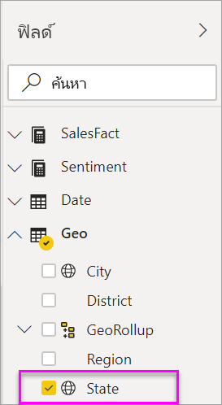
2. [แปลงแผนภูมิ](power-bi-report-change-visualization-type.md)ให้เป็นแผนภูมิแถบสี[Convert the chart](power-bi-report-change-visualization-type.md) to a filled map. โปรดสังเกตว่าตอนนี้ **รัฐ** อยู่ในแอ่ง **ตำแหน่งที่ตั้ง**Notice that **State** is now in the **Location** well. Bing Maps ใช้เขตข้อมูลในแอ่ง **ตำแหน่งที่ตั้ง** เพื่อสร้างแผนที่Bing Maps uses the field in the **Location** well to create the map.  ตำแหน่งที่ตั้งสามารถเป็นตำแหน่งที่ตั้งที่มีอยู่จริงต่าง ๆ: ประเทศ รัฐ เขต เมือง รหัสไปรษณีย์ หรืออื่น ๆ Bing Maps มีรูปร่างแผนผังแถบสีสำหรับตำแหน่งที่ตั้งต่าง ๆ ทั่วโลกThe location can be a variety of valid locations: countries, states, counties, cities, zip codes, or other postal codes etc. Bing Maps provides filled map shapes for locations around the world. หากรายการที่ใส่ในแอ่งตำแหน่งที่ตั้งไม่ถูกต้อง Power BI จะไม่สามารถสร้างแผนผังแถบสีได้Without a valid entry in the Location well, Power BI cannot create the filled map.  

   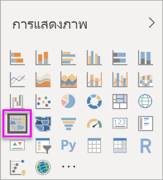
3. กรองแผนที่เพื่อแสดงเฉพาะแผ่นดินใหญ่สหรัฐอเมริกาFilter the map to display only the continental United States.

   a.a.  ที่ด้านซ้ายของช่องการแสดงภาพ ค้นหาพื้นที่ **ตัวกรอง**To the left of the Visualizations pane, look for the **Filters** pane. ขยายถ้ามีการย่อเล็กสุดExpand it if it is minimized

   b.b.  เลื่อนไปเหนือ **รัฐ** และเลือกเครื่องหมายรูปตัววี (V) ที่ขยายHover over **State** and select the expand chevron  
   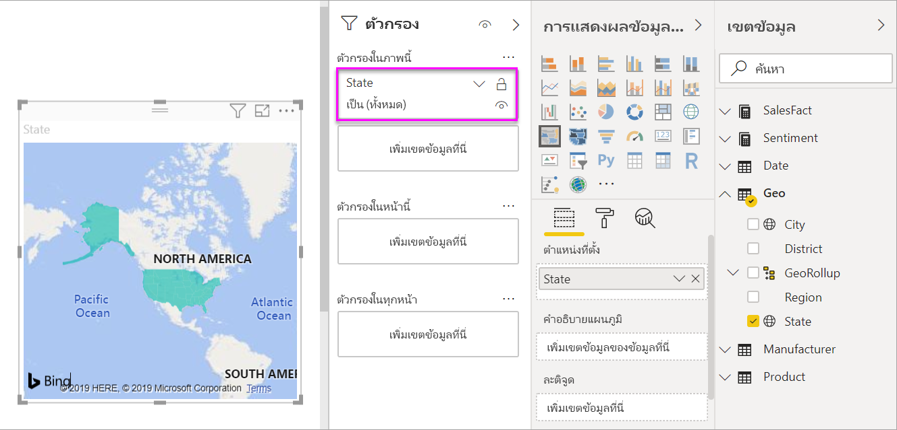

   c.c.  ทำเครื่องหมายถูกถัดจาก **ทั้งหมด** และนำเครื่องหมายถูกออกถัดจาก **AK**Place a check mark next to **All** and remove the check mark next to **AK**.

   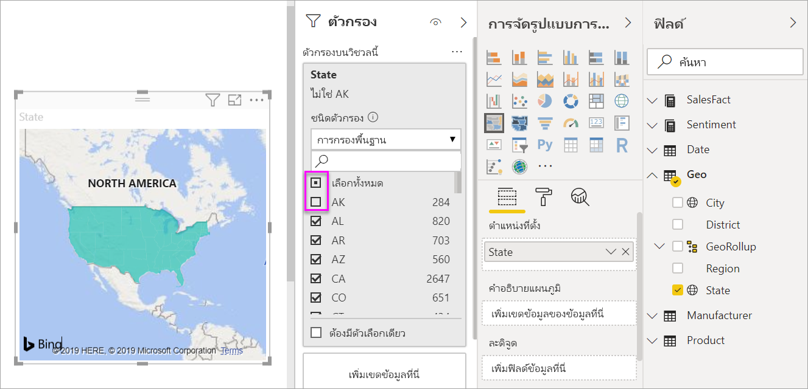
4. เลือกไอคอนแปรงลูกกลิ้งเพื่อเปิดบานหน้าต่างจัดรูปแบบ และเลือก **สีข้อมูล**Select the paint roller icon to open the Formatting pane, and choose **Data colors**.

    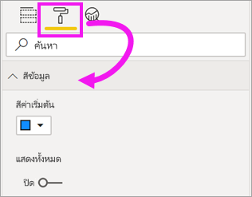

5. เลือกจุดแนวตั้งสามจุด แล้วเลือก **การจัดรูปแบบตามเงื่อนไข**Select the three vertical dots and choose **Conditional formatting**.

    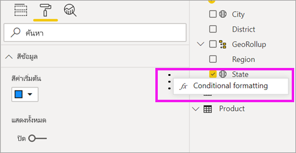

6. ใช้หน้าจอ **สีตามค่าเริ่มต้น - สีข้อมูล** เพื่อกำหนดวิธีการแรเงาแผนที่แถบสีของคุณUse the **Default color - Data colors** screen to determine how your filled map will be shaded. ตัวเลือกที่พร้อมใช้งานสำหรับคุณรวมถึงเขตข้อมูลที่ยึดตามฐานการแรเงา และวิธีการปรับใช้การแรเงาThe options available to you include which field to base the shading, and how to apply the shading. ในตัวอย่างนี้ เราจะใช้เขตข้อมูล **SalesFact** > **ความคิดเห็น** และการตั้งค่าต่ำสุดสำหรับความคิดเห็นเป็นสีส้มและค่าสูงสุดเป็นสีน้ำเงินIn this example we're using the field **SalesFact** > **Sentiment**, and setting the lowest value for sentiment as orange and the highest value as blue. ค่าที่อยู่ระหว่างค่าสูงสุด และค่าต่ำสุดจะมีแรเงาเป็นสีส้ม และสีน้ำเงินValues that fall between the maximum and minimum will be shades of orange and blue. ภาพประกอบที่ด้านล่างของหน้าจอจะแสดงช่วงของสีที่จะนำไปใช้The illustration at the bottom of the screen shows the range of colors that will be used. 

    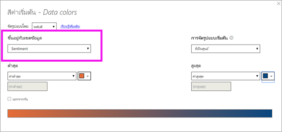

7. แผนที่แถบสีจะเป็นสีเขียวและแดง โดยที่สีแดงเป็นตัวแทนตัวเลขความคิดเห็นที่ต่ำกว่า และสีเขียวแสดงตัวเลขความคิดเห็นที่สูงกว่า ซึ่งหมายความว่ามีความเห็นในเชิงบวกมากกว่าThe filled map is shaded in green and red, with red representing the lower sentiment numbers and green representing the higher, more-positive sentiment.  เมื่อต้องแสดงรายละเอียดเพิ่มเติม ให้ลากเขตข้อมูลลงในแถบสีเหลืองเขียนคำอธิบายเวลาเอาเมาส์ไปชี้To display additional detail, drag a field into the Tooltips well.  ต่อไปนี้เราได้เพิ่ม **SalesFact** > **ช่องว่างความคิดเห็น**Here we've added **SalesFact** > **Sentiment gap**. การไฮไลท์ถึงสถานะของไอดาโฮ (ID) แสดงให้เราเห็นว่าช่องว่างความคิดเห็นนั้นอยู่ระดับต่ำสุดที่6Highlighting the state of Idaho (ID) shows us that sentiment gap is low, at 6.
   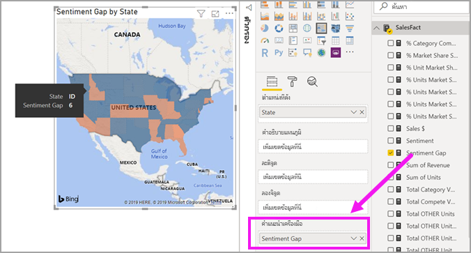

10. [บันทึกรายงาน](../create-reports/service-report-save.md)[Save the report](../create-reports/service-report-save.md).

Power BI ให้คุณควบคุมลักษณะที่ปรากฏของแผนที่ของคุณแถบสีได้มากมายPower BI gives you plenty of control over the appearance of your filled map. เล่นกับตัวควบคุมสีข้อมูลเหล่านี้จนกว่าคุณได้รับลักษณะที่คุณต้องการPlay around with these data color controls until you get the look you want. 

## การทำไฮไลท์และการกรองข้ามHighlighting and cross-filtering
สำหรับข้อมูลเกี่ยวกับการใช้บานหน้าต่างตัวกรอง โปรดดู[เพิ่มตัวกรองไปยังรายงาน](../create-reports/power-bi-report-add-filter.md)For information about using the Filters pane, see [Add a filter to a report](../create-reports/power-bi-report-add-filter.md).

การไฮไลต์ตำแหน่งที่ตั้งหนึ่งในแผนที่แถบสี จะกรองข้ามการแสดงภาพอื่น ๆ บนหน้ารายงานนั้น... และนอกจากนี้จะทำในทางกลับกันด้วยHighlighting a location in a filled map cross-filters the other visualizations on the report page... and vice versa.

1. เมื่อต้องการทำตามขั้นตอน ก่อนบันทึกรายงานนี้ โดยการเลือก **ไฟล์ > บันทึก**To follow along, first save this report by selecting **File > Save**. 

2. คัดลอกแผนที่แถบสีโดยใช้ CTRL CCopy the filled map using CTRL-C.

3. จากด้านล่างของพื้นที่รายงาน เลือกแท็บ **ความคิดเห็น** เพื่อเปิดหน้ารายงานความคิดเห็นFrom the bottom of the report canvas, select the **Sentiment** tab to open the Sentiment report page.

    

4. ย้ายและปรับขนาดการแสดงภาพบนหน้าเพื่อสร้างพื้นที่ว่าง แล้วกด CTRL V เพื่อวางแผนที่แถบสีจากรายงานก่อนหน้าMove and resize the visualizations on the page to make some room, then CTRL-V paste the filled map from the previous report. (ดูรูปภาพดังต่อไปนี้)(See the following images)

   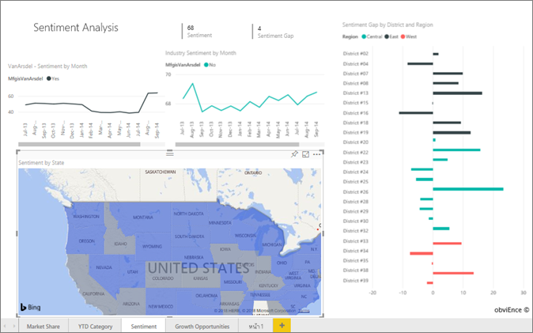

5. บนแผนที่แถบสี เลือกหนึ่งรัฐOn the filled map, select a state.  ซึ่งจะไฮไลต์เชื่อมโยงและตัวกรองเชื่อมโยงไปยังการแสดงภาพอื่น ๆ บนหน้าThis cross-highlights and cross-filters the other visualizations on the page. การเลือก **Texas** ตัวอย่างเช่น กรองข้ามการ์ดและไฮไลท์แผนภูมิแท่งSelecting **Texas**, for example, cross-filters the cards and cross-highlights the bar chart. จากนี้ฉันรู้ว่า ความคิดเห็นเป็น 75 และ Texas อยู่ในเขตกลาง #23From this, I know that Sentiment is 75 and that Texas is in the Central District #23.   
   
2. เลือกจุดข้อมูลบน VanArsdel ความคิดเห็นตามเดือนแผนภูมิเส้นSelect a data point on the VanArsdel - Sentiment by Month line chart. การทำเช่นนี้จะกรองแผนที่แถบสีเพื่อให้แสดงความคิดเห็นสำหรับ VanArsdel และไม่ใช่สำหรับการแข่งขันของ VanArsdelThis filters the filled map to show Sentiment data for VanArsdel and not their competition.  
   

## ข้อควรพิจารณาและการแก้ไขปัญหาConsiderations and troubleshooting
ข้อมูลในแผนที่อาจไม่ชัดเจนMap data can be ambiguous.  ตัวอย่างเช่น มีปารีส ประเทศฝรั่งเศส และยังมีปารีส ในรัฐเท็กซัสด้วยFor example, there's a Paris, France, but there's also a Paris, Texas. ข้อมูลทางภูมิศาสตร์ของคุณถูกเก็บไว้ในคอลัมน์แยกต่างหาก ไม่ว่าจะเป็น คอลัมน์สำหรับชื่อเมือง คอลัมน์สำหรับชื่อรัฐหรือจังหวัด และอื่น ๆ ดังนั้น Bing อาจไม่สามารถบอกได้ว่าเป็นปารีสที่ไหนYour geographic data is probably stored in separate columns – a column for city names, a column for state or province names, etc. – so Bing may not be able to tell which Paris is which. ถ้าชุดข้อมูลของคุณประกอบด้วยข้อมูลละติจูดและลองจิจูดอยู่แล้ว Power BI มีเขตข้อมูลพิเศษเพื่อช่วยทำให้ข้อมูลแผนที่ชัดเจนยิ่งขึ้นIf your dataset already contains latitude and longitude data, Power BI has special fields to help make the map data unambiguous. เพียงแค่ลากเขตข้อมูลที่ประกอบด้วยข้อมูลละติจูดของคุณลงในพื้นที่\>การแสดงภาพ > ละติจูดJust drag the field that contains your latitude data into the Visualizations \> Latitude area.  และทำเช่นเดียวกันสำหรับข้อมูลลองจิจูดของคุณAnd do the same for your longitude data.    

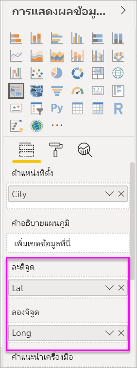

ถ้าคุณมีสิทธิ์แก้ไขชุดข้อมูลใน Power BI Desktop ดูวิดีโอนี้สำหรับความช่วยเหลือในการแก้ไขแผนที่ที่ไม่ชัดเจนIf you have permissions to edit the dataset in Power BI Desktop, watch this video for help with addressing map ambiguity.

ถ้าคุณไม่สามารถเข้าถึงข้อมูลละติจูดและลองจิจูดได้ แต่คุณสามารถเข้าถึงการแก้ไขในชุดข้อมูล [ทำตามคำแนะนำเหล่านี้เพื่ออัปเดตชุดข้อมูลของคุณ](https://support.office.com/article/Maps-in-Power-View-8A9B2AF3-A055-4131-A327-85CC835271F7)If you do not have access to latitude and longitude data, but you do have edit access to the dataset, [follow these instructions to update your dataset](https://support.office.com/article/Maps-in-Power-View-8A9B2AF3-A055-4131-A327-85CC835271F7).

สำหรับความช่วยเหลือเพิ่มเติมเกี่ยวกับการแสดงภาพของแผนที่ ดู[เคล็ดลับและคำแนะนำสำหรับการแสดงภาพของแผนที่](./power-bi-map-tips-and-tricks.md)For more help with Map visualizations, see [Tips and tricks for map visualizations](./power-bi-map-tips-and-tricks.md).

## ขั้นตอนถัดไปNext steps

[แผนที่รูปร่างShape map](desktop-shape-map.md)

[ชนิดการแสดงภาพใน Power BIVisualization types in Power BI](power-bi-visualization-types-for-reports-and-q-and-a.md)