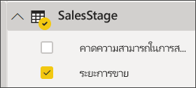
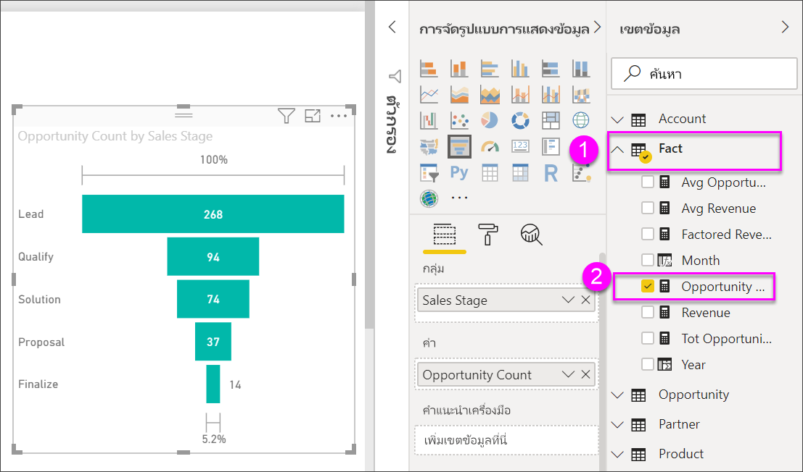

# สร้างและใช้แผนภูมิกรวยCreate and use funnel charts

[!INCLUDE[consumer-appliesto-nyyn](../includes/consumer-appliesto-nyyn.md)]

[!INCLUDE [power-bi-visuals-desktop-banner](../includes/power-bi-visuals-desktop-banner.md)]

แผนภูมิกรวยช่วยให้คุณแสดงกระบวนการเส้นตรง ที่แบ่งเป็นขั้นตอนที่เชื่อมต่อกันตามลำดับA funnel chart helps you visualize a linear process that has sequential connected stages. ยกตัวอย่างเช่น ช่วงระยะการขายที่มีการติดตามลูกค้าตามขั้นตอนดังนี้: ลูกค้าที่เป็นเป้าหมาย\>ลูกค้าเป้าหมายที่มีคุณสมบัติ\>ผู้ที่มีแนวโน้มจะเป็นลูกค้า\>ทำสัญญา\>ปิดลูกค้าFor example, a sales funnel that tracks customers through stages: Lead \> Qualified Lead \> Prospect \> Contract \> Close.  มองอย่างรวดเร็ว รูปร่างของกรวยบ่งบอกสุขภาพของกระบวนการที่คุณกำลังติดตามAt a glance, the shape of the funnel conveys the health of the process you're tracking.

แต่ละขั้นตอนกรวยการแสดงเปอร์เซ็นต์ของผลรวมEach funnel stage represents a percentage of the total. ดังนั้น ในกรณีส่วนใหญ่ แผนภูมิกรวยจะมีรูปเหมือนกรวย - ด้วยขั้นตอนแรกที่ใหญ่ที่สุด และขั้นตอนถัด ๆ มาเล็กกว่าขั้นตอนก่อนหน้าSo, in most cases, a funnel chart is shaped like a funnel -- with the first stage being the largest, and each subsequent stage smaller than its predecessor.  แผนภูมิเป็นรูปต้นแพร์จะยังมีประโยชน์ -- สามารถใช้ระบุปัญหาในกระบวนการได้A pear-shaped funnel is also useful -- it can identify a problem in the process.  แต่โดยทั่วไปแล้ว ขั้นแรกหรือขั้น "ทางเข้า" มีขนาดใหญ่ที่สุดBut typically, the first stage, the "intake" stage, is the largest.

> [!NOTE]
> การแชร์รายงานของคุณกับผู้ร่วมงาน Power BI กำหนดให้คุณต้องมีสิทธิ์การใช้งาน Power BI Pro แต่ละรายการ หรือรายงานจะถูกบันทึกในความจุแบบพรีเมียมSharing your report with a Power BI colleague requires that you both have individual Power BI Pro licenses or that the report is saved in Premium capacity.    

## เมื่อใดที่ใช้แผนภูมิกรวยWhen to use a funnel chart
แผนภูมิกรวยเป็นตัวเลือกที่ดีสำหรับ:Funnel charts are a great choice:

* เมื่อข้อมูลมีลำดับ และผ่านไปตามลำดับขั้นอย่างน้อย 4 ขั้นตอนwhen the data is sequential and moves through at least 4 stages.
* เมื่อจำนวนของ "รายการ" ในขั้นตอนแรกคาดว่า จะมีค่ามากกว่าจำนวนในขั้นตอนสุดท้ายwhen the number of "items" in the first stage is expected to be greater than the number in the final stage.
* เพื่อคำนวณโอกาสที่จะเกิดขึ้น (รายได้/ยอดขาย/ข้อตกลง/ฯลฯ) ตามลำดับขั้นto calculate potential (revenue/sales/deals/etc.) by stages.
* เพื่อคำนวณและติดตาม อัตราการแปลงและการรักษาสถานภาพto calculate and track conversion and retention rates.
* เพื่อเปิดเผยปัญหาคอขวดในกระบวนการที่เป็นเส้นตรงto reveal bottlenecks in a linear process.
* เพื่อติดตามเวิร์กโฟลว์ของตะกร้าสินค้าto track a shopping cart workflow.
* เพื่อติดตามความคืบหน้าและความสำเร็จของแคมเปญ การคลิกโฆษณา/การตลาดto track the progress and success of click-through advertising/marketing campaigns.

## การทำงานกับแผนภูมิกรวยWorking with funnel charts
แผนภูมิกรวย:Funnel charts:

* สามารถเรียงลำดับCan be sorted.
* สนับสนุนตัวเลขที่เป็นจำนวนเท่าSupport multiples.
* สามารถไฮไลต์เชื่อมโยง และกรองข้าม จากการแสดงภาพอื่น ๆ บนหน้ารายงานเดียวกันCan be highlighted and cross-filtered by other visualizations on the same report page.
* สามารถไฮไลต์เชื่อมโยง และกรองข้าม ไปยังการแสดงภาพอื่น ๆ บนหน้ารายงานเดียวกันCan be used to highlight and cross-filter other visualizations on the same report page.
   > [!NOTE]
   > รับชมวิดีโอนี้เพื่อดู Will จัดทำแผนภูมิกรวยโดยใช้ตัวอย่างด้านการขายและการตลาดWatch this video to see Will create a funnel chart using the Sales and Marketing sample. จากนั้นทำตามขั้นตอนด้านล่างวิดีโอเพื่อทดลองด้วยตัวเองโดยใช้ไฟล์ตัวอย่าง Opportunity Analysis PBIXThen follow the steps below the video to try it out yourself using the Opportunity Analysis PBIX sample file
   > 
   > 
## เงื่อนไขเบื้องต้นPrerequisite

บทช่วยสอนนี้ใช้ไฟล์ PBIX [Opportunity Analysis .PBIX ตัวอย่าง](https://download.microsoft.com/download/9/1/5/915ABCFA-7125-4D85-A7BD-05645BD95BD8/Opportunity%20Analysis%20Sample%20PBIX.pbix
)This tutorial uses the [Opportunity Analysis sample PBIX file](https://download.microsoft.com/download/9/1/5/915ABCFA-7125-4D85-A7BD-05645BD95BD8/Opportunity%20Analysis%20Sample%20PBIX.pbix
).

1. จากด้านบนซ็ายของแถบเมนู เลือก **ไฟล์** > **เปิด**From the upper left section of the menubar, select **File** > **Open**
   
2. ค้นหาสำเนา **ไฟล์ PBIX ตัวอย่างการวิเคราะห์โอกาส**Find your copy of the **Opportunity Analysis sample PBIX file**

1. เปิด **ไฟล์ PBIX ตัวอย่างการวิเคราะห์โอกาส** ในมุมมองรายงาน Open the **Opportunity Analysis sample PBIX file** in report view .

1. เลือกSelect  หากต้องการเพิ่มหน้าใหม่to add a new page.

## สร้างแผนภูมิกรวยพื้นฐานCreate a basic funnel chart
รับชมวิดีโอนี้เพื่อดู Will จัดทำแผนภูมิกรวยโดยใช้ตัวอย่างด้านการขายและการตลาดWatch this video to see Will create a funnel chart using the Sales and Marketing sample.

<iframe width="560" height="315" src="https://www.youtube.com/embed/qKRZPBnaUXM" frameborder="0" allow="autoplay; encrypted-media" allowfullscreen></iframe>

ตอนนี้ ลองสร้างแผนภูมิของคุณเอง ที่แสดงจำนวนโอกาสที่เรามีในแต่ละของขั้นตอนการขายของเราNow create your own funnel chart that shows the number of opportunities we have in each of our sales stages.

1. เริ่มต้นที่หน้ารายงานที่ว่างเปล่า แล้วเลือกเขตข้อมูล **SalesStage** \> **ขั้นตอนการขาย**Start on a blank report page and select the **SalesStage** \> **Sales Stage** field.
   
    

1. เลือกไอคอนกรวยSelect the funnel icon  การแปลงแผนภูมิคอลัมน์ให้เป็นแผนภูมิกรวยto convert the column chart to a funnel chart.

2. จากบานหน้าต่าง **เขตข้อมูล** เลือก **ข้อเท็จจริง** \> **จำนวนโอกาส**From the **Fields** pane, select **Fact** \> **Opportunity Count**.
   
    
4. โฮเวอร์เหนือแท่ง จะแสดงข้อมูลจำนวนมากออกมาHovering over a bar displays a wealth of information.
   
   * ชื่อของขั้นตอนThe name of the stage
   * จำนวนโอกาสทางการขายในขั้นตอนนี้Number of opportunities currently in this stage
   * อัตราการแปลงโดยรวม (% ของลูกค้าเป้าหมาย)Overall conversion rate (% of Lead) 
   * ขั้นตอน-ถึง-ขั้นตอน (หรืออัตราการดรอป) ซึ่งก็เป็น % ของขั้นตอนก่อนหน้า (ในกรณีนี้ ขั้นตอนข้อเสนอ/ขั้นตอนโซลูชัน)Stage-to-stage (also known as Drop Rate) which is the % of the previous stage (in this case, Proposal Stage/Solution Stage)
     
     

6. [บันทึกรายงาน](../create-reports/service-report-save.md)[Save the report](../create-reports/service-report-save.md).

## การทำไฮไลท์และการกรองข้ามHighlighting and cross-filtering
สำหรับข้อมูลเกี่ยวกับการใช้บานหน้าต่างตัวกรอง ดู[เพิ่มตัวกรองไปยังรายงาน](../create-reports/power-bi-report-add-filter.md)For information about using the Filters pane, see [Add a filter to a report](../create-reports/power-bi-report-add-filter.md).

ไฮไลต์แท่งในแผนภูมิกรวย จะกรองข้ามการแสดงภาพอื่น ๆ บนหน้ารายงาน... และในทางกลับกันHighlighting a bar in a funnel cross-filters the other visualizations on the report page... and vice versa. เพื่อทำตาม เพิ่มวิชวลอีกสองสามวิชวล บนหน้ารายงานที่มีแผนภูมิกรวยTo follow along, add a few more visuals to the report page that contains the funnel chart.

1. บนกรวย เลือกแท่ง **ข้อเสนอ**On the funnel, select the **Proposal** bar. ซึ่งจะไฮไลต์เชื่อมโยงไปยังการแสดงภาพอื่น ๆ บนหน้าThis cross-highlights the other visualizations on the page. ใช้ CTRL เพื่อเลือกหลายค่าUse CTRL to multi-select.
   
   
2. เพื่อกำหนดลักษณะ การไฮไลต์เชื่อมโยง และการกรองข้าม ระหว่างวิชวล ดู[การโต้ตอบระหว่างวิชวลใน Power BI](../create-reports/service-reports-visual-interactions.md)To set preferences for how visuals cross-highlight and cross-filter each other, see [Visual interactions in Power BI](../create-reports/service-reports-visual-interactions.md)

## ขั้นตอนถัดไปNext steps

[ตัววัดใน Power BIGauges in Power BI](power-bi-visualization-radial-gauge-charts.md)

[ชนิดการแสดงภาพใน Power BIVisualization types in Power BI](power-bi-visualization-types-for-reports-and-q-and-a.md)

