# สร้างการแสดงผลข้อมูลด้วยภาพของผู้มีอิทธิพลหลักCreate key influencers visualizations

[!INCLUDE[consumer-appliesto-nyyn](../includes/consumer-appliesto-nyyn.md)]    

[!INCLUDE [power-bi-visuals-desktop-banner](../includes/power-bi-visuals-desktop-banner.md)]

ภาพวิชวลของผู้มีอิทธิพลหลักช่วยให้คุณเข้าใจปัจจัยที่มีผลต่อเมตริกที่คุณสนใจThe key influencers visual helps you understand the factors that drive a metric you're interested in. ซึ่งช่วยวิเคราะห์ข้อมูลของคุณ จัดอันดับปัจจัยที่มีความสำคัญ และแสดงพวกเขาในฐานะที่เป็นผู้มีอิทธิพลหลักIt analyzes your data, ranks the factors that matter, and displays them as key influencers. ตัวอย่างเช่น สมมติว่าคุณต้องการค้นหาว่าสิ่งที่มีผลต่อการลาออกของพนักงาน ซึ่งเรียกอีกอย่างว่าการลาออกFor example, suppose you want to figure out what influences employee turnover, which is also known as churn. ปัจจัยหนึ่งอาจมาจากระยะเวลาของสัญญาจ้างงาน และอีกปัจจัยหนึ่งอาจเป็นอายุของพนักงานOne factor might be employment contract length, and another factor might be employee age. 
 
## เมื่อใดที่ควรใช้ผู้มีอิทธิพลหลักWhen to use key influencers 
ภาพวิชวลของผู้มีอิทธิพลหลักเป็นตัวเลือกที่ยอดเยี่ยมหากคุณต้องการที่จะ:The key influencers visual is a great choice if you want to: 
- ดูว่าปัจจัยใดที่ส่งผลกระทบต่อเมตริกที่กำลังวิเคราะห์See which factors affect the metric being analyzed.
- เปรียบเทียบความสำคัญที่เกี่ยวข้องของปัจจัยเหล่านี้Contrast the relative importance of these factors. ตัวอย่างเช่น สัญญาระยะสั้นมีผลต่อการลาออกของพนักงานมากกว่าสัญญาระยะยาวหรือไม่?For example, do short-term contracts have more impact on churn than long-term contracts? 

## คุณลักษณะของภาพวิชวลผู้มีอิทธิพลหลักFeatures of the key influencers visual

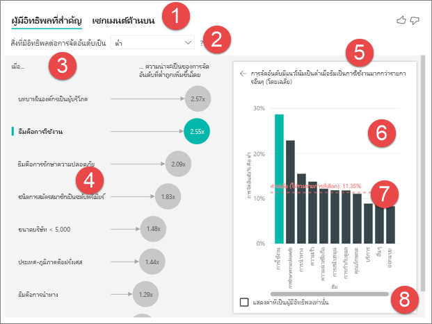

1. **แท็บ**: เลือกแท็บเพื่อสลับระหว่างมุมมอง**Tabs**: Select a tab to switch between views. **ผู้มีอิทธิพลหลัก** จะแสดงตัวช่วยที่มีส่วนร่วมสูงสุดต่อค่าเมตริกที่เลือก**Key influencers** shows you the top contributors to the selected metric value. **กลุ่มยอดนิยม** จะแสดงกลุ่มที่มีส่วนร่วมสูงสุดต่อค่าเมตริกที่เลือก**Top segments** shows you the top segments that contribute to the selected metric value. *กลุ่ม* สร้างขึ้นจากชุดของค่าA *segment* is made up of a combination of values. ตัวอย่างเช่น กลุ่มหนึ่งอาจเป็นผู้บริโภคที่เคยเป็นลูกค้ามาแล้วอย่างน้อย 20 ปีและอาศัยอยู่ในภาคตะวันตกFor example, one segment might be consumers who have been customers for at least 20 years and live in the west region. 

2. **กล่องดรอปดาวน์**: ค่าของเมตริกภายใต้การตรวจสอบ**Drop-down box**: The value of the metric under investigation. ในตัวอย่างนี้ ค้นหาเมตริก **การให้คะแนน** เมตริกIn this example, look at the metric **Rating**. ค่าที่เลือกคือ **ต่ำ**The selected value is **Low**.

3. **การกล่าวซ้ำ**: ช่วยเราตีความภาพวิชวลในบานหน้าต่างด้านซ้าย**Restatement**: It helps you interpret the visual in the left pane.

4. **บานหน้าต่างด้านซ้าย**: บานหน้าต่างด้านซ้ายประกอบด้วยภาพวิชวลหนึ่งภาพ**Left pane**: The left pane contains one visual. ในกรณีนี้ บานหน้าต่างด้านซ้ายจะแสดงรายชื่อของผู้ทรงอิทธิพลมากที่สุดIn this case, the left pane shows a list of the top key influencers.

5. **การกล่าวซ้ำ**: ช่วยเราตีความภาพวิชวลในบานหน้าต่างด้านขวา**Restatement**: It helps you interpret the visual in the right pane.

6. **บานหน้าต่างด้านขวา**: บานหน้าต่างด้านขวาประกอบด้วยภาพวิชวลหนึ่งภาพ**Right pane**: The right pane contains one visual. ในกรณีนี้ แผนภูมิคอลัมน์แสดงค่าทั้งหมดสำหรับผู้มีอิทธิพลหลัก, **ธีม** ที่เลือกไว้ในบานหน้าต่างด้านซ้ายIn this case, the column chart displays all the values for the key influencer **Theme** that was selected in the left pane. ค่าเฉพาะของ **ความสามารถในการใช้งาน** จากบานหน้าต่างด้านซ้ายจะแสดงเป็นสีเขียวThe specific value of **usability** from the left pane is shown in green. ค่าอื่น ๆ ทั้งหมดสำหรับ **ธีม** จะแสดงเป็นสีดำAll the other values for **Theme** are shown in black.

7. **เส้นเฉลี่ย**: เราใช้ค่าเฉลี่ยในการคำนวณค่าอื่น ๆ ที่เป็นไปได้ทั้งหมดสำหรับ **ธีม** ยกเว้น **ความสามารถในการใช้งาน** (ซึ่งเป็นผู้ทรงอิทธิพลที่เลือก)**Average line**: The average is calculated for all possible values for **Theme** except **usability** (which is the selected influencer). ดังนั้นการคำนวณจึงใช้กับค่าทั้งหมดเป็นสีดำSo the calculation applies to all the values in black. ซึ่งบอกคุณว่าเปอร์เซ็นต์ของ **ธีม** อื่นมีคะแนนต่ำแค่ไหนIt tells you what percentage of the other **Themes** had a low rating. ในกรณีนี้ 11.35% มีการให้คะแนนต่ำ (ซึ่งแสดงตามเส้นประ)In this case 11.35% had a low rating (shown by the dotted line).

8. **กล่องกาเครื่องหมาย**: กรองภาพวิชวลออกในบานหน้าต่างด้านขวาเพื่อแสดงเฉพาะค่าที่เป็นผู้มีอิทธิพลสำหรับเขตข้อมูลนั้น**Check box**: Filters out the visual in the right pane to only show values that are influencers for that field. ในตัวอย่างนี้จะกรองภาพวิชวลสำหรับความสามารถในการใช้งาน ความปลอดภัย และการนำทางIn this example, this would filter the visual to usability, security and navigation.

## วิเคราะห์เมตริกที่เป็นแบบจัดกลุ่มAnalyze a metric that is categorical
 
ดูวิดีโอนี้เพื่อเรียนรู้วิธีการสร้างภาพวิชวลของผู้มีอิทธิพลหลักด้วยเมตริกแบบจัดกลุ่มWatch this video to learn how to create a key influencers visual with a categorical metric. แล้วทำตามขั้นตอนเหล่านี้เพื่อสร้างภาพวิชวลThen follow these steps to create one. 

   > [!NOTE]
   > วิดีโอนี้ใช้ Power BI Desktop เวอร์ชันก่อนหน้านี้This video uses an earlier version of Power BI Desktop.
   > 
   > 
<iframe width="560" height="315" src="https://www.youtube.com/embed/fDb5zZ3xmxU" frameborder="0" allow="accelerometer; autoplay; encrypted-media; gyroscope; picture-in-picture" allowfullscreen></iframe>

ผู้จัดการผลิตภัณฑ์ของคุณต้องการให้คุณค้นหาว่าปัจจัยใดที่ทำให้ลูกค้าต้องแสดงความคิดเห็นเชิงลบเกี่ยวกับบริการคลาวด์ของคุณYour Product Manager wants you to figure out which factors lead customers to leave negative reviews about your cloud service. หากต้องการทำตาม ให้เปิด [ไฟล์ PBIX คำติชมของลูกค้า](https://github.com/microsoft/powerbi-desktop-samples/tree/main/Monthly%20Desktop%20Blog%20Samples/2019/customerfeedback.pbix) ใน Power BI DesktopTo follow along, open the [Customer Feedback PBIX file](https://github.com/microsoft/powerbi-desktop-samples/tree/main/Monthly%20Desktop%20Blog%20Samples/2019/customerfeedback.pbix) in Power BI Desktop. คุณยังสามารถดาวน์โหลด [ไฟล์ Excel คำติชมของลูกค้าสำหรับบริการ Power BI หรือ Power BI Desktop](https://github.com/microsoft/powerbi-desktop-samples/tree/main/Monthly%20Desktop%20Blog%20Samples/2019/customerfeedback.xlsx)You also can download the [Customer Feedback Excel file for Power BI service or Power BI Desktop](https://github.com/microsoft/powerbi-desktop-samples/tree/main/Monthly%20Desktop%20Blog%20Samples/2019/customerfeedback.xlsx). เลือกลิงก์ใดก็ได้จากนั้นเลือก **ดาวน์โหลด** จากหน้า GitHub ที่เปิดขึ้นSelect either link and then select **Download** from the GitHub page that opens.

> [!NOTE]
> ชุดข้อมูลคำติชมของลูกค้าขึ้นอยู่กับ [Moro et al., 2014] S. Moro, P. Cortez และ P. RitaThe Customer Feedback data set is based on [Moro et al., 2014] S. Moro, P. Cortez, and P. Rita. “แนวทางการขับเคลื่อนด้วยข้อมูลเพื่อทำนายความสำเร็จของการตลาดทางโทรศัพท์ของธนาคาร”"A Data-Driven Approach to Predict the Success of Bank Telemarketing." *ระบบสนับสนุนการตัดสินใจ*, Elsevier, 62:22-31, มิถุนายน 2014*Decision Support Systems*, Elsevier, 62:22-31, June 2014. 

1. เปิดรายงานและเลือกไอคอน **ผู้มีอิทธิพลหลัก**Open the report, and select the **Key influencers** icon. 

    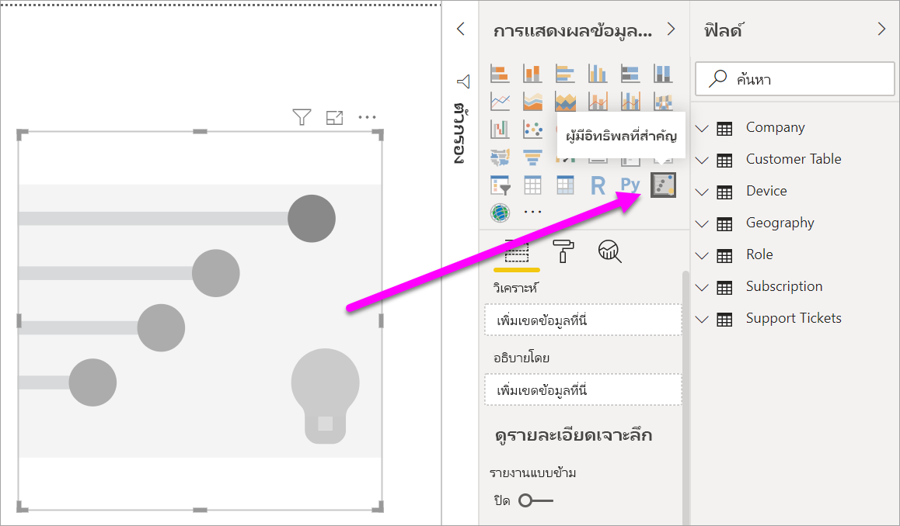

2. ย้ายเมตริกที่คุณต้องการตรวจสอบไปที่เขตข้อมูล **การวิเคราะห์**Move the metric you want to investigate into the **Analyze** field. เมื่อต้องการดูสิ่งที่มีผลต่อการให้คะแนนการบริการของลูกค้าต่ำ เลือก **ตารางลูกค้า** > **การให้คะแนน**To see what drives a customer rating of the service to be low, select **Customer Table** > **Rating**.

3. ย้ายเขตข้อมูลที่คุณคิดว่ามีผลต่อ **การให้คะแนน** เข้าไปที่เขตข้อมูล **อธิบายโดย**Move fields that you think might influence **Rating** into the **Explain by** field. คุณสามารถย้ายเขตข้อมูลได้มากเท่าที่คุณต้องการYou can move as many fields as you want. ในกรณีนี้ เริ่มต้นด้วย:In this case, start with:
    - ประเทศ-ภูมิภาคCountry-Region 
    - บทบาทในองค์กรRole in Org 
    - ชนิดการสมัครใช้งานSubscription Type 
    - ขนาดบริษัทCompany Size 
    - ธีมTheme
    
4. ปล่อยเขตข้อมูล **ขยายโดย** ว่างไว้Leave the **Expand by** field empty. เขตข้อมูลนี้จะใช้เฉพาะเมื่อทำการวิเคราะห์เขตข้อมูลการวัดหรือเขตข้อมูลสรุปThis field is only used when analyzing a measure or summarized field. 

5. เมื่อต้องการเน้นการให้คแนนติดลบ เลือก **ต่ำ** ในกล่องดรอปดาวน์ **สิ่งที่มีผลต่อการให้คะแนนที่จะเป็น**To focus on the negative ratings, select **Low** in the **What influences Rating to be** drop-down box.  

    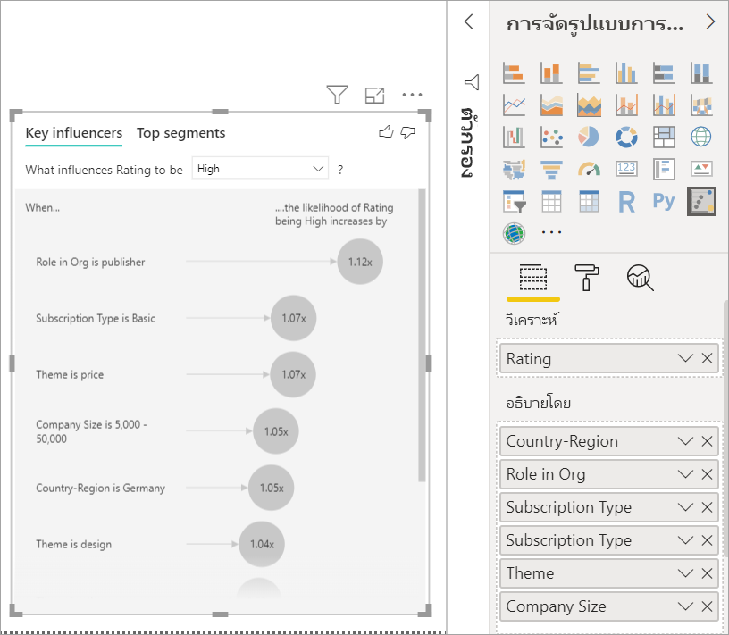

การวิเคราะห์จะทำงานในระดับตารางของเขตข้อมูลที่กำลังวิเคราะห์The analysis runs on the table level of the field that's being analyzed. ในกรณีนี้ เป็นเมตริก **การให้คะแนน**In this case, it's the **Rating** metric. เมตริกนี้ถูกกำหนดขึ้นในระดับลูกค้าThis metric is defined at a customer level. ลูกค้าแต่ละรายได้รับคะแนนสูงสุดหรือคะแนนต่ำEach customer has given either a high score or a low score. ปัจจัยการอธิบายทั้งหมดจะต้องกำหนดไว้ในระดับลูกค้าสำหรับภาพวิชวลเพื่อใช้ประโยชน์จากปัจจัยเหล่านั้นAll the explanatory factors must be defined at the customer level for the visual to make use of them. 

ในตัวอย่างก่อนหน้านี้ ปัจจัยการอธิบายทั้งหมดมีความสัมพันธ์แบบหนึ่งต่อหนึ่งหรือกลุ่มต่อหนึ่งกับเมตริกIn the previous example, all of the explanatory factors have either a one-to-one or a many-to-one relationship with the metric. ในกรณีนี้ ลูกค้าแต่ละรายกำหนดธีมเดี่ยวให้กับการให้คะแนนของพวกเขาIn this case, each customer assigned a single theme to their rating. ในทำนองเดียวกัน ลูกค้ามาจากประเทศหนึ่ง มีประเภทสมาชิกประเภทหนึ่ง และดำเนินบทบาทหนึ่งในองค์กรของพวกเขาSimilarly, customers come from one country, have one membership type, and perform one role in their organization. ปัจจัยการอธิบายนั้นเป็นแอตทริบิวต์ของลูกค้าอยู่แล้ว และไม่จำเป็นต้องมีการแปลงThe explanatory factors are already attributes of a customer, and no transformations are needed. ภาพวิชวลทำให้ปัจจัยเหล่านี้สามารถใช้ได้ทันทีThe visual can make immediate use of them. 

ต่อมาในบทช่วยสอน คุณจะได้ดูตัวอย่างที่ซับซ้อนมากขึ้นซึ่งมีความสัมพันธ์แบบหนึ่งต่อกลุ่มLater in the tutorial, you look at more complex examples that have one-to-many relationships. ในกรณีดังกล่าว คอลัมน์จะต้องถูกรวมเข้ากับระดับลูกค้าก่อนจึงจะสามารถทำการวิเคราะห์ได้In those cases, the columns have to first be aggregated down to the customer level before you can run the analysis. 

การวัดและผลรวมที่ใช้เป็นปัจจัยการอธิบายจะถูกประเมินที่ระดับตารางของเมตริก **การวิเคราะห์**Measures and aggregates used as explanatory factors are also evaluated at the table level of the **Analyze** metric. ตัวอย่างบางอย่างจะแสดงในภายหลังในบทความนี้Some examples are shown later in this article. 

## ตีความผู้มีอิทธิพลหลักตามประเภทInterpret categorical key influencers 
ลองมาดูที่ผู้มีอิทธิพลหลักสำหรับการให้คะแนนต่ำLet's take a look at the key influencers for low ratings. 

### ปัจจัยเดียวอันดับแรกที่มีผลต่อความน่าจะเป็นของการให้คะแนนต่ำTop single factor that influences the likelihood of a low rating

ลูกค้าในตัวอย่างนี้สามารถมีสามบทบาทได้แก่ ลูกค้า ผู้ดูแลระบบ และผู้เผยแพร่The customer in this example can have three roles: consumer, administrator, and publisher. การเป็นลูกค้าเป็นปัจจัยอันดับต้น ๆ ที่ส่งผลให้เกิดการให้คะแนนต่ำBeing a consumer is the top factor that contributes to a low rating. 

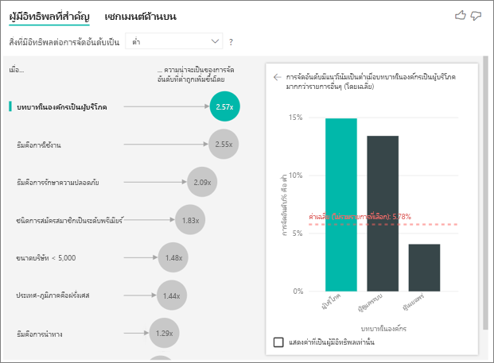

แม่นยำยิ่งขึ้น ลูกค้าของคุณมีแนวโน้มที่จะให้คะแนนการบริการติดลบ 2.57 เท่าMore precisely, your consumers are 2.57 times more likely to give your service a negative score. แผนภูมิผู้มีอิทธิพลหลักแสดง **บทบาทในองค์กรเป็นลูกค้า** ก่อนในรายการด้านซ้ายThe key influencers chart lists **Role in Org is consumer** first in the list on the left. จากการเลือก **บทบาทในองค์กรเป็นลูกค้า** Power BI จะแสดงรายละเอียดเพิ่มเติมในบานหน้าต่างด้านขวาBy selecting **Role in Org is consumer**, Power BI shows additional details in the right pane. แสดงผลการเปรียบเทียบของแต่ละบทบาทเกี่ยวกับความน่าจะเป็นของการให้คะแนนต่ำThe comparative effect of each role on the likelihood of a low rating is shown.
  
- ลูกค้า 14.93% ให้คะแนนต่ำ14.93% of consumers give a low score. 
- โดยเฉลี่ยบทบาทอื่น ๆ ทั้งหมดให้คะแนนของเวลาต่ำเท่ากับ 5.78%On average, all other roles give a low score 5.78% of the time.
- ลูกค้าจำนวน 2.57 เท่าที่มีแนวโน้มจะให้คะแนนต่ำเมื่อเทียบกับบทบาทอื่น ๆ ทั้งหมดConsumers are 2.57 times more likely to give a low score compared to all other roles. คุณสามารถตรวจสอบสิ่งนี้ได้โดยการแบ่งแถบสีเขียวด้วยเส้นประสีแดงYou can determine this by dividing the green bar by the red dotted line. 

### ปัจจัยเดียวอันดับที่สองที่มีผลต่อความน่าจะเป็นของการให้คะแนนต่ำSecond single factor that influences the likelihood of a low rating

ภาพวิชวลของผู้มีอิทธิพลหลักจะเปรียบเทียบและจัดลำดับปัจจัยจากตัวแปรที่แตกต่างมากมายได้The key influencers visual compares and ranks factors from many different variables. ผู้มีอิทธิพลลำดับที่สองไม่มีส่วนเกี่ยวข้องกับ **บทบาทในองค์กร** เลือกผู้มีอิทธิพลลำดับที่สองในรายการ ซึ่งก็คือ **ธีมเป็นความสามารถในการใช้งาน**The second influencer has nothing to do with **Role in Org**. Select the second influencer in the list, which is **Theme is usability**. 

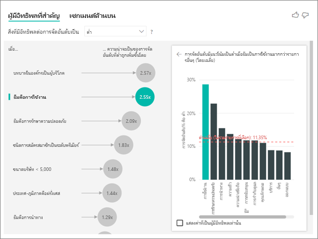

ปัจจัยที่สำคัญที่สุดลำดับที่สองเกี่ยวข้องกับธีมการรีวิวของลูกค้าThe second most important factor is related to the theme of the customer’s review. ลูกค้าที่แสดงความคิดเห็นเกี่ยวกับความสามารถในการใช้งานของผลิตภัณฑ์มีแนวโน้มที่จะให้คะแนนต่ำ 2.55 เท่าเมื่อเปรียบเทียบกับลูกค้าที่แสดงความคิดเห็นในหัวข้ออื่น ๆ เช่น ความน่าเชื่อถือ การออกแบบ หรือความเร็วCustomers who commented about the usability of the product were 2.55 times more likely to give a low score compared to customers who commented on other themes, such as reliability, design, or speed. 

ระหว่างภาพวิชวล ค่าเฉลี่ยซึ่งแสดงด้วยเส้นประสีแดงจะเปลี่ยนจาก 5.78% เป็น 11.34% ได้Between the visuals, the average, which is shown by the red dotted line, changed from 5.78% to 11.34%. ค่าเฉลี่ยเป็นแบบไดนามิกเนื่องจากเป็นไปตามค่าเฉลี่ยของค่าอื่นทั้งหมดThe average is dynamic because it's based on the average of all other values. สำหรับผู้มีอิทธิพลลำดับแรก ค่าเฉลี่ยจะแยกออกจากบทบาทของลูกค้าFor the first influencer, the average excluded the customer role. สำหรับผู้มีอิทธิพลลำดับที่สอง จะแยกออกจากธีมความสามารถในการใช้งานFor the second influencer, it excluded the usability theme. 
 
เลือกกล่องกาเครื่องหมาย **แสดงเฉพาะค่าที่เป็นผู้มีอิทธิพลเท่านั้น** เพื่อกรองข้อมูลโดยใช้เฉพาะค่าที่มีอิทธิพลSelect the **Only show values that are influencers** check box to filter by using only the influential values. ในกรณีนี้ พวกเขามีบทบาทที่มีผลทำให้คะแนนต่ำIn this case, they're the roles that drive a low score. ธีมสิบสองแบบจะลดลงเหลือสี่แบบที่ Power BI ระบุว่าเป็นธีมที่มีผลต่อการให้คะแนนต่ำTwelve themes are reduced to the four that Power BI identified as the themes that drive low ratings. 

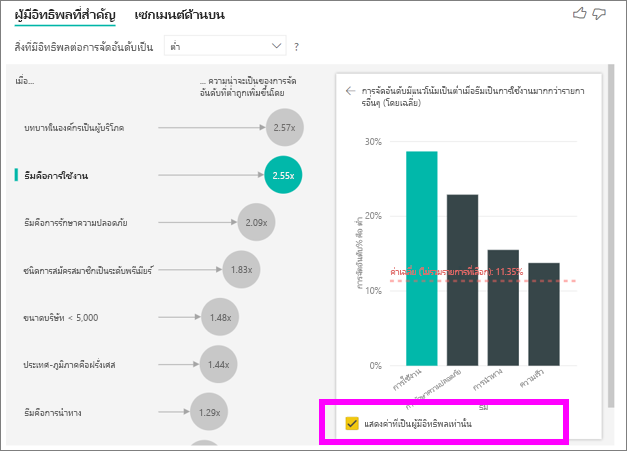

## โต้ตอบกับวิชวลอื่น ๆInteract with other visuals 
 
ทุกครั้งที่คุณเลือกตัวแบ่งส่วนข้อมูล ตัวกรอง หรือภาพวิชวลอื่น ๆ บนพื้นที่ทำงาน ผู้มีอิทธิพลหลักจะแสดงการวิเคราะห์ซ้ำในส่วนของข้อมูลใหม่Every time you select a slicer, filter, or other visual on the canvas, the key influencers visual reruns its analysis on the new portion of data. ตัวอย่างเช่น คุณสามารถย้าย **ขนาดบริษัท** เข้าไปที่รายงานและใช้เป็นตัวแบ่งส่วนข้อมูลFor example, you can move **Company Size** into the report and use it as a slicer. ใช้เพื่อดูว่าผู้มีอิทธิพลหลักสำหรับลูกค้าระดับองค์กรของคุณแตกต่างจากประชากรทั่วไปหรือไม่Use it to see if the key influencers for your enterprise customers are different than the general population. บริษัทขนาดใหญ่มีพนักงานมากกว่า 50,000 คนAn enterprise company size is larger than 50,000 employees.
 
การเลือก **> 50,000** จะเรียกใช้การวิเคราะห์อีกครั้งและคุณจะเห็นว่าผู้มีอิทธิพลมีการเปลี่ยนแปลงSelecting **>50,000** reruns the analysis, and you can see that the influencers changed. สำหรับลูกค้าระดับองค์กรขนาดใหญ่ ผู้มีอิทธิพลสูงสุดสำหรับการให้คะแนนต่ำมีธีมที่เกี่ยวข้องกับความปลอดภัยFor large enterprise customers, the top influencer for low ratings has a theme related to security. คุณอาจต้องการตรวจสอบเพิ่มเติมเพื่อดูว่ามีคุณลักษณะด้านความปลอดภัยที่เฉพาะเจาะจงที่ลูกค้ารายใหญ่ของคุณไม่พึงพอใจหรือไม่You might want to investigate further to see if there are specific security features your large customers are unhappy about. 

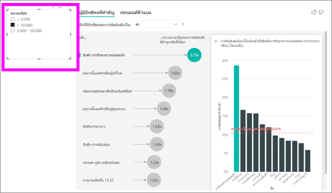

## ตีความผู้มีอิทธิพลหลักอย่างต่อเนื่องInterpret continuous key influencers 
 
จนถึงตอนนี้ คุณจะได้ทราบว่าวิธีการใช้ภาพวิชวลเพื่อสำรวจว่าเขตข้อมูลตามประเภทที่แตกต่างกันส่งผลต่อการให้คะแนนต่ำอย่างไรSo far, you've seen how to use the visual to explore how different categorical fields influence low ratings. นอกจากนี้ ยังอาจมีปัจจัยต่อเนื่องต่าง ๆ เช่น อายุ ความสูง และราคาในเขตข้อมูล **อธิบายโดย**It's also possible to have continuous factors such as age, height, and price in the **Explain by** field. มาดูกันว่าจะเกิดอะไรขึ้นถ้าเราย้าย **ระยะเวลาการครอบครอง** จากตารางลูกค้าไปที่ **อธิบายโดย**Let’s look at what happens when **Tenure** is moved from the customer table into **Explain by**. ระยะเวลาการครอบครองแสดงถึงระยะเวลาที่ลูกค้าใช้บริการTenure depicts how long a customer has used the service. 
 
เมื่อระยะเวลาการครอบครองเพิ่มขึ้น โอกาสที่จะได้รับการให้คะแนนต่ำลงก็เพิ่มขึ้นเช่นกันAs tenure increases, the likelihood of receiving a lower rating also increases. แนวโน้มนี้แสดงให้เห็นว่าลูกค้าระยะยาวมากขึ้นมีแนวโน้มมากที่จะให้คะแนนติดลบThis trend suggests that the longer-term customers are more likely to give a negative score. ข้อมูลเชิงลึกนี้น่าสนใจ และข้อมูลที่คุณอาจต้องการติดตามในภายหลังThis insight is interesting, and one that you might want to follow up on later. 
 
การแสดงภาพข้อมูลแสดงให้เห็นว่าทุกครั้งที่ระยะเวลาการครอบครองเพิ่มขึ้น 13.44 เดือน โดยเฉลี่ยความน่าจะเป็นของการให้คะแนนต่ำเพิ่มขึ้น 1.23 เท่าThe visualization shows that every time tenure goes up by 13.44 months, on average the likelihood of a low rating increases by 1.23 times. ในกรณีนี้ 13.44 เดือนแสดงถึงค่าเบี่ยงเบนมาตรฐานของระยะเวลาการครอบครองIn this case, 13.44 months depict the standard deviation of tenure. ดังนั้นข้อมูลเชิงลึกที่คุณได้รับจะทำให้ทราบว่าการเพิ่มระยะเวลาการครอบครองตามปริมาณมาตรฐาน ซึ่งเป็นค่าเบี่ยงเบนมาตรฐานของระยะเวลาการครอบครอง ส่งผลกระทบต่อโอกาสที่จะได้รับการให้คะแนนต่ำอย่างไรSo the insight you receive looks at how increasing tenure by a standard amount, which is the standard deviation of tenure, affects the likelihood of receiving a low rating. 
 
แผนภูมิกระจายในบานหน้าต่างด้านขวาจะกำหนดเปอร์เซ็นต์เฉลี่ยของการให้คะแนนต่ำสำหรับแต่ละค่าของระยะเวลาการครอบครองThe scatter plot in the right pane plots the average percentage of low ratings for each value of tenure. ซึ่งเน้นความชันด้วยเส้นแนวโน้มIt highlights the slope with a trend line.

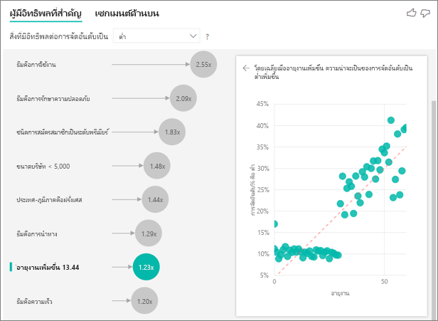

## ผู้มีอิทธิพลหลักอย่างต่อเนื่องที่จัดเก็บไว้Binned continuous key influencers

ในบางกรณี คุณอาจพบว่าปัจจัยแบบต่อเนื่องจะถูกเปลี่ยนเป็นปัจจัยตามประเภทโดยอัตโนมัติIn some cases you may find that your continuous factors were automatically turned into categorical ones. ทั้งนี้เนื่องจากเราตระหนักถึงความสัมพันธ์ระหว่างตัวแปรไม่ใช่เชิงเส้นและดังนั้นเราจึงไม่สามารถอธิบายความสัมพันธ์ได้ว่าเป็นการเพิ่มหรือลดลง (อย่างที่เราทำในตัวอย่างด้านบน)This is because we realized the relationship between the variables is not linear and so we cannot describe the relationship as simply increasing or decreasing (like we did in the example above).

เราใช้งานการทดสอบความสัมพันธ์เพื่อพิจารณาว่าผู้มีอิทธิพลเชิงเส้นเกี่ยวข้องกับเป้าหมายอย่างไรWe run correlation tests to determine how linear the influencer is with regard to the target. ถ้าเป้าหมายเป็นแบบต่อเนื่อง เราจะเรียกใช้ความสัมพันธ์แบบ Pearsons และถ้าเป้าหมายเป็นแบบจัดกลุ่ม เราจะดำเนินการทดสอบความสัมพันธ์แบบ Biserial PointIf the target is continuous, we run Pearson correlation and if the target is categorical, we run Point Biserial correlation tests. หากเราตรวจพบว่าความสัมพันธ์ไม่เป็นเชิงเส้นพอ เราจะดำเนินการจัดเก็บแบบควบคุม และสร้างช่องเก็บได้สูงสุด 5 ช่อง หากต้องการทราบว่าช่องเก็บใดที่เหมาะสมมากที่สุดที่เราจะใช้วิธีการ จัดเก็บแบบควบคุม ซึ่งดูที่ความสัมพันธ์ระหว่างปัจจัยการอธิบายและเป้าหมายที่กำลังวิเคราะห์If we detect the relationship is not sufficiently linear we conduct supervised binning and generate a maximum of 5 bins. To figure out which bins make the most sense we use a supervised binning method which looks at the relationship between the explanatory factor and the target being analyzed.

## ตีความการวัดและผลรวมเป็นผู้มีอิทธิพลหลักInterpret measures and aggregates as key influencers 
 
คุณสามารถใช้การวัดและผลรวมเป็นปัจจัยการอธิบายในการวิเคราะห์ของคุณได้You can use measures and aggregates as explanatory factors inside your analysis. ตัวอย่างเช่น คุณอาจต้องการดูว่าปัจจัยใดส่งผลกระทบต่อจำนวนตั๋วการสนับสนุนของลูกค้าหรือระยะเวลาเฉลี่ยของตั๋วเปิดที่มีต่อคะแนนที่คุณได้รับFor example, you might want to see what effect the count of customer support tickets or the average duration of an open ticket has on the score you receive. 
 
ในกรณีนี้ คุณต้องการดูว่าจำนวนตั๋วการสนับสนุนที่ลูกค้ามีอิทธิพลต่อคะแนนที่พวกเขาให้หรือไม่In this case, you want to see if the number of support tickets that a customer has influences the score they give. ตอนนี้ คุณสามารถใช้ **ID ตั๋วการสนับสนุน** จากตารางตั๋วการสนับสนุนได้Now you bring in **Support Ticket ID** from the support ticket table. เนื่องจากลูกค้าสามารถมีตั๋วการสนับสนุนได้หลายใบ คุณจึงต้องรวม ID กับระดับลูกค้าBecause a customer can have multiple support tickets, you aggregate the ID to the customer level. การรวมนี้มีความสำคัญเนื่องจากเรากำลังทำการวิเคราะห์ในระดับลูกค้า ดังนั้นจำเป็นต้องกำหนดตัวขับเคลื่อนทั้งหมดที่ระดับความละเอียดนั้นAggregation is important because the analysis runs on the customer level, so all drivers must be defined at that level of granularity. 
 
มาดูที่จำนวนของ IDLet's look at the count of IDs. ลูกค้าแต่ละแถวมีจำนวนตั๋วการสนับสนุนที่เกี่ยวข้องกันEach customer row has a count of support tickets associated with it. ในกรณีนี้ เมื่อจำนวนตั๋วการสนับสนุนเพิ่มขึ้น โอกาสในการให้คะแนนต่ำจะเพิ่มขึ้น 5.51 เท่าIn this case, as the count of support tickets increases, the likelihood of the rating being low goes up 5.51 times. ภาพวิชวลด้านขวาแสดงจำนวนตั๋วการสนับสนุนโดยเฉลี่ยตามค่า **การให้คะแนน** ที่ต่างกัน โดยประเมินที่ระดับลูกค้าThe visual on the right shows the average number of support tickets by different **Rating** values evaluated at the customer level. 

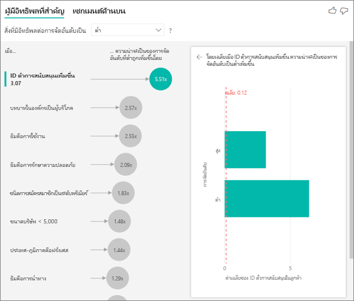

## ตีความผลลัพธ์: เซกเมนต์ด้านบนInterpret the results: Top segments 
 
คุณสามารถใช้แท็บ **ผู้มีอิทธิพลหลัก** เพื่อประเมินปัจจัยแต่ละรายการได้You can use the **Key influencers** tab to assess each factor individually. คุณยังสามารถใช้แท็บ **เซกเมนต์ด้านบน** เพื่อดูวิธีชุดปัจจัยมีผลต่อเมตริกที่คุณกำลังวิเคราะห์อยู่นั้นได้You also can use the **Top segments** tab to see how a combination of factors affects the metric that you're analyzing. 
 
เซกเมนต์ด้านบนเริ่มแสดงภาพรวมของเซกเมนต์ทั้งหมดที่ Power BI ค้นพบTop segments initially show an overview of all the segments that Power BI discovered. ตัวอย่างต่อไปนี้แสดงหกเซกเมนต์ที่ค้นพบThe following example shows that six segments were found. เซกเมนต์เหล่านี้จะถูกจัดอันดับตามเปอร์เซ็นต์ของการให้คะแนนต่ำภายในเซกเมนต์These segments are ranked by the percentage of low ratings within the segment. ตัวอย่างเช่น เซกเมนต์ 1 มีลูกค้าให้คะแนน 74.3% ซึ่งเป็นค่าที่ต่ำSegment 1, for example, has 74.3% customer ratings that are low. ยิ่งฟองสบู่สูงขึ้น สัดส่วนการจัดอันดับต่ำก็จะสูงขึ้นตามThe higher the bubble, the higher the proportion of low ratings. ขนาดของฟองสบู่แสดงถึงจำนวนลูกค้าที่อยู่ในเซกเมนต์The size of the bubble represents how many customers are within the segment. 

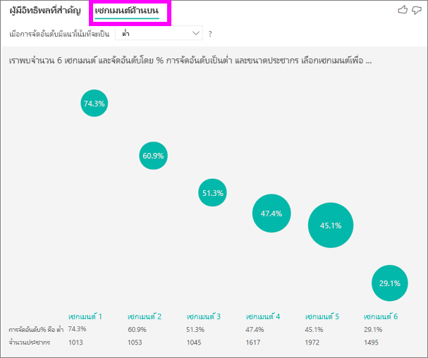

การเลือกฟองสบู่จะแสดงรายละเอียดของเซกเมนต์นั้นSelecting a bubble displays the details of that segment. ตัวอย่างเช่น ถ้าคุณเลือกเซกเมนต์ 1 คุณจะพบว่าเป็นเซกเมนต์ของลูกค้าที่มีชื่อเสียงIf you select Segment 1, for example, you find that it's made up of relatively established customers. ซึ่งพวกเขาเป็นลูกค้ามาแล้วกว่า 29 เดือน และมีตั๋วการสนับสนุนมากกว่า 4 ใบThey've been customers for over 29 months and have more than four support tickets. ท้ายที่สุด พวกเขาไม่ใช่ผู้เผยแพร่ ดังนั้นพวกเขาจึงเป็นได้ทั้งลูกค้าหรือผู้ดูแลระบบFinally, they're not publishers, so they're either consumers or administrators. 
 
ในกลุ่มนี้ 74.3% ของลูกค้าให้คะแนนต่ำIn this group, 74.3% of the customers gave a low rating. ลูกค้าโดยเฉลี่ยให้คะแนนต่ำ 11.7% ของเวลา ดังนั้นเซกเมนต์นี้มีสัดส่วนการให้คะแนนต่ำมากขึ้นThe average customer gave a low rating 11.7% of the time, so this segment has a larger proportion of low ratings. ซึ่งมีคะแนนร้อยละ 63 สูงขึ้นIt's 63 percentage points higher. นอกจากนี้เรายังพบว่ากลุ่มที่ 1 มีข้อมูลประมาณ 2.2% ของข้อมูลดังนั้นจึงเป็นส่วนที่สามารถระบุตำแหน่งของประชากรได้Segment 1 also contains approximately 2.2% of the data, so it represents an addressable portion of the population. 

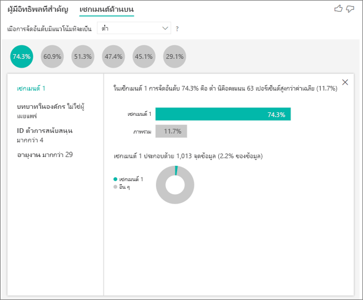

## การเพิ่มจำนวนAdding counts

ในบางครั้งผู้มีอิทธิพลอาจมีผลกระทบที่ใหญ่ แต่แสดงข้อมูลน้อยมากSometimes an influencer can have a big impact but represent very little of the data. ตัวอย่างเช่น **ธีม** คือ **ความสามารถในการใช้งาน** เป็นผู้มีอิทธิพลใหญ่ที่สุดเป็นอันดับสองสำหรับการให้คะแนนต่ำFor example, **Theme** is **usability** is the second biggest influencer for low ratings. อย่างไรก็ตามอาจมีลูกค้าจำนวนเล็กน้อยเท่านั้นที่บ่นเกี่ยวกับเรื่องความสามารถในการใช้งานHowever there might have only been a handful of customers who complained about usability. การนับจำนวนสามารถช่วยให้คุณจัดลำดับความสำคัญของผู้มีอิทธิพลที่คุณต้องการมุ่งความสนใจได้Counts can help you prioritize which influencers you want to focus on.

คุณสามารถเปิดใช้งานจำนวนผ่าน **บัตรการวิเคราะห์** ของบานหน้าต่างการจัดรูปแบบYou can turn counts on through the **Analysis card** of the formatting pane.

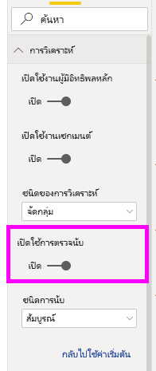

เมื่อมีการเปิดใช้งานจำนวนแล้ว คุณจะเห็นวงแหวนรอบ ๆ ฟองของผู้มีอิทธิพลแต่ละราย ซึ่งแสดงถึงเปอร์เซ็นต์ของข้อมูลโดยประมาณที่ผู้มีอิทธิพลประกอบอยู่ด้วยOnce counts are turned on, you’ll see a ring around each influencer’s bubble, which represents the approximate percentage of data that influencer contains. ยิ่งฟองของวงแหวนกลมมากขึ้นเท่าไหร่ ก็ยิ่งมีข้อมูลประกอบในนั้นมากขึ้นตามThe more of the bubble the ring circles, the more data it contains. เราสามารถเห็นได้ว่า **ธีม** มี **ความสามารถในการใช้งาน** ประกอบด้วยสัดส่วนข้อมูลที่มีขนาดเล็กมากWe can see that **Theme** is **usability** contains a very small proportion of data.

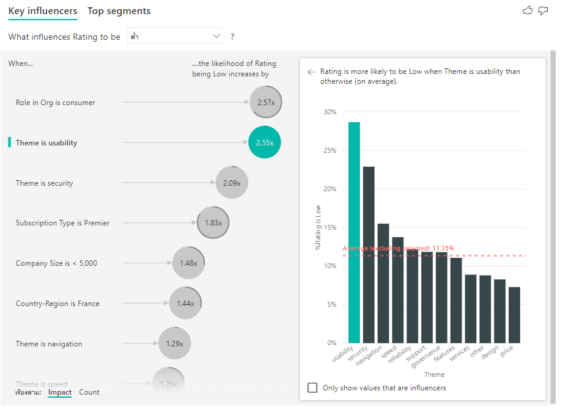

นอกจากนี้คุณยังสามารถใช้การเรียงลำดับด้วยการสลับที่ด้านล่างซ้ายของวิชวลเพื่อเรียงลำดับฟองตามจำนวนครั้งแรกแทนที่ผลกระทบYou can also use the Sort by toggle in the bottom left of the visual to sort the bubbles by count first instead of impact. **ชนิดการสมัครใช้งาน** คือ **Premier** คือ ผู้มีอิทธิพลสูงสุดยึดตามตามจำนวน**Subscription Type** is **Premier** is the top influencer based on count.

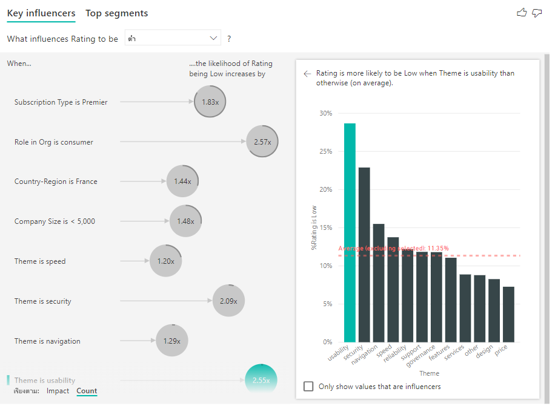

การมีวงแหวนแบบเต็มรอบวงกลมหมายความว่าผู้มีอิทธิพลนั้นประกอบด้วยข้อมูล 100%Having a full ring around the circle means the influencer contains 100% of the data. คุณสามารถเปลี่ยนชนิดจำนวนให้สัมพันธ์กับผู้มีอิทธิพลสูงสุดได้โดยใช้รายการเลือกแบบดึงลง **ชนิดจำนวน** ใน **การ์ดการวิเคราะห์** ของบานหน้าต่างการจัดรูปแบบYou can change the count type to be relative to the maximum influencer using the **Count type** dropdown in the **Analysis card** of the formatting pane. ตอนนี้ผู้มีอิทธิพลที่มีจำนวนข้อมูลมากที่สุดจะถูกแสดงด้วยวงแหวนแบบเต็มและจำนวนอื่น ๆ ทั้งหมดจะสัมพันธ์กับมันNow the influencer with the most amount of data will be represented by a full ring and all other counts will be relative to it.

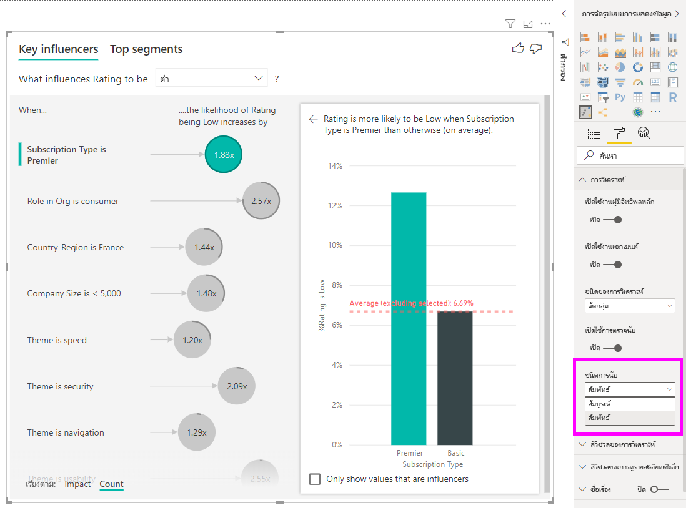

## วิเคราะห์เมตริกที่เป็นตัวเลขAnalyze a metric that is numeric

หากคุณย้ายเขตข้อมูลตัวเลขที่ไม่ได้สรุปไปยังเขตข้อมูล **การวิเคราะห์** คุณสามารถเลือกวิธีการจัดการสถานการณ์นั้นIf you move an unsummarized numerical field into the **Analyze** field, you have a choice how to handle that scenario. คุณสามารถเปลี่ยนลักษณะการทำงานของภาพวิชวลโดยการเข้าไปที่ **บานหน้าต่างการจัดรูปแบบ** และการสลับไปมาระหว่าง **ประเภทการวิเคราะห์ตามประเภท** และ **ประเภทการวิเคราะห์แบบต่อเนื่อง** ได้You can change the behavior of the visual by going into the **Formatting Pane** and switching between **Categorical Analysis Type** and **Continuous Analysis Type**.

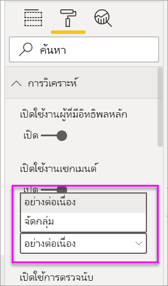

**ประเภทการวิเคราะห์ตามประเภท** จะมีลักษณะการทำงานตามที่อธิบายไว้ข้างต้นA **Categorical Analysis Type** behaves as described above. เช่น ถ้าคุณกำลังดูคะแนนการสำรวจตั้งแต่ 1 ถึง 10 คุณสามารถสอบถามว่า “สิ่งใดที่มีผลทำให้คะแนนการสำรวจได้ 1 คะแนน”For instance, if you were looking at survey scores ranging from 1 to 10, you could ask ‘What influences Survey Scores to be 1?’

**ประเภทการวิเคราะห์แบบต่อเนื่อง** จะเปลี่ยนคำถามเป็นคำถามแบบต่อเนื่องA **Continuous Analysis Type** changes the question to a continuous one. ในตัวอย่างด้านบน คำถามใหม่ของเราจะเป็น “สิ่งใดที่มีผลทำให้คะแนนการสำรวจเพิ่มขึ้น/ลดลง”In the example above, our new question would be ‘What influences Survey Scores to increase/decrease?’

ความแตกต่างนี้จะมีประโยชน์มากเมื่อคุณมีหลายค่าที่ไม่ซ้ำกันในเขตข้อมูลคุณกำลังวิเคราะห์อยู่นั้นThis distinction is very helpful when you have lots of unique values in the field you are analyzing. ในตัวอย่างด้านล่าง เราดูที่บ้านราคาIn the example below we look at house prices. ซึ่งไม่มีความหมายมากนักที่จะถามว่า “สิ่งใดที่มีผลทำให้ราคาบ้านเท่ากับ 156,214”It is not very meaningful to ask ‘What influences House Price to be 156,214?’ เนื่องจากคำถามดังกล่าวมีลักษณะที่เฉพาะเจาะจงมาก และเราไม่มีข้อมูลเพียงพอที่จะอนุมานรูปแบบได้as that is very specific and we are likely not to have enough data to infer a pattern.

แต่เราอาจต้องการถามว่า “สิ่งใดที่มีผลทำให้ราคาบ้านเพิ่มขึ้น”Instead we may want to ask, ‘What influences House Price to increase’? ซึ่งช่วยให้เราสามารถกำหนดราคาบ้านเป็นช่วง ๆ แทนค่าที่เฉพาะเจาะจงwhich allows us to treat house prices as a range rather than distinct values.

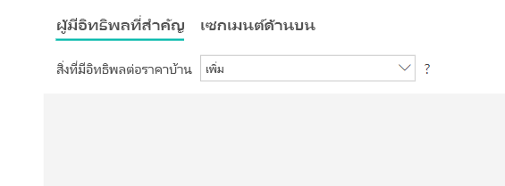

## ตีความผลลัพธ์: ผู้มีอิทธิพลที่สำคัญInterpret the results: Key influencers 

ในสถานการณ์นี้ เรามาดูว่า “สิ่งใดที่มีผลทำให้ราคาบ้านเพิ่มขึ้น”In this scenario we look at ‘What influences House Price to increase’. เราจะมาดูจำนวนปัจจัยการอธิบายที่อาจส่งผลต่อราคาในบ้านเช่น **ปีที่สร้าง** (ปีที่สร้างบ้าน), **KitchenQual** (คุณภาพของห้องครัว) และ **YearRemodAdd** (ปีที่ปรับปรุงบ้าน)We are looking at a number of explanatory factors that could impact a house price like **Year Built** (year the house was built), **KitchenQual** (kitchen quality) and **YearRemodAdd** (year the house was remodeled). 

ในตัวอย่างด้านล่าง เราจะดูที่ผู้มีอิทธิพลสูงสุดของเราซึ่งห้องครัวมีคุณภาพดีเยี่ยมIn the example below we look at our top influencer which is kitchen quality being Excellent. ผลลัพธ์จะคล้ายมากกับที่เราเห็นเมื่อเราได้วิเคราะห์เมตริกตามประเภทด้วยความแตกต่างที่สำคัญสองสามประการได้แก่:The results are very similar to the ones we saw when we were analyzing categorical metrics with a few important differences:

- แผนภูมิคอลัมน์ทางด้านขวาแสดงค่าเฉลี่ยแทนเปอร์เซ็นต์The column chart on the right is looking at the averages rather than percentages. ดังนั้นจึงแสดงให้เราเห็นราคาบ้านโดยเฉลี่ยของบ้านพร้อมห้องครัวที่คุณภาพดี (แถบสีเขียว) เทียบกับราคาบ้านโดยเฉลี่ยของบ้านที่ไม่มีห้องครัวที่คุณภาพดี (เส้นประ)It therefore shows us what the average house price of a house with an excellent kitchen is (green bar) compared to the average house price of a house without an excellent kitchen (dotted line)
- ตัวเลขในแผนภูมิฟองยังคงความแตกต่างระหว่างเส้นประสีแดงและแถบสีเขียว แต่จะแสดงเป็นตัวเลข ($158 49K) แทนความน่าเป็น (1.93 x)The number in the bubble is still the difference between the red dotted line and green bar but it’s expressed as a number ($158.49K) rather than a likelihood (1.93x). ดังนั้นโดยเฉลี่ยแล้ว บ้านพร้อมห้องครัวที่คุณภาพดีจะมีราคาเกือบ $160K แพงกว่าบ้านที่ไม่ห้องครัวที่คุณภาพดีSo on average, houses with excellent kitchens are almost $160K more expensive than houses without excellent kitchens.

ในตัวอย่างด้านล่าง เราจะดูผลกระทบที่ปัจจัยแบบต่อเนื่อง (ปีที่ปรับปรุงบ้าน) มีต่อราคาบ้านIn the example below we are looking at the impact a continuous factor (year house was remodeled) has on house price. ความแตกต่างเมื่อเทียบกับวิธีที่เราวิเคราะห์ผู้มีอิทธิพลแบบต่อเนื่องสำหรับเมตริกตามประเภทมีดังนี้:The differences compared to how we analyze continuous influencers for categorical metrics are as follows:

-   แผนภูมิกระจายในบานหน้าต่างด้านขวาจะกำหนดราคาบ้านโดยเฉลี่ยสำหรับค่าที่เฉพาะเจาะจงแต่ละค่าของปีที่ปรับปรุงThe scatter plot in the right pane plots the average house price for each distinct value of year remodeled. 
-   ค่าในแผนภูมิฟองจะแสดงตามจำนวนราคาบ้านโดยเฉลี่ยที่เพิ่มขึ้น (ในกรณีนี้คือ $2.87K) เมื่อจำนวนปีทีปรับปรุงบ้านเพิ่มขึ้นตามค่าเบี่ยงเบนมาตรฐาน (ในกรณีนี้คือ 20 ปี)The value in the bubble shows by how much the average house price increases (in this case $2.87k) when the year the house was remodeled increases by its standard deviation (in this case 20 years)

สุดท้าย ในกรณีของการวัด เราจะดูปีที่สร้างบ้านโดยเฉลี่ยFinally, in the case of measures we are looking at the average year a house was built. การวิเคราะห์ในที่นี่จะเป็นดังนี้:The analysis here is as follows:

-   แผนภูมิกระจายในบานหน้าต่างด้านขวาจะกำหนดราคาบ้านโดยเฉลี่ยสำหรับค่าที่เฉพาะเจาะจงแต่ละค่าในตารางThe scatterplot in the right pane plots the average house price for each distinct value in the table
-   ค่าในแผนภูมิฟองจะแสดงตามจำนวนราคาบ้านโดยเฉลี่ยที่เพิ่มขึ้น (ในกรณีนี้คือ $1.35K) เมื่อจำนวนปีโดยเฉลี่ยเพิ่มขึ้นตามค่าเบี่ยงเบนมาตรฐาน (ในกรณีนี้คือ 30 ปี)The value in the bubble shows by how much the average house price increases (in this case $1.35K) when the average year increases by its standard deviation (in this case 30 years)

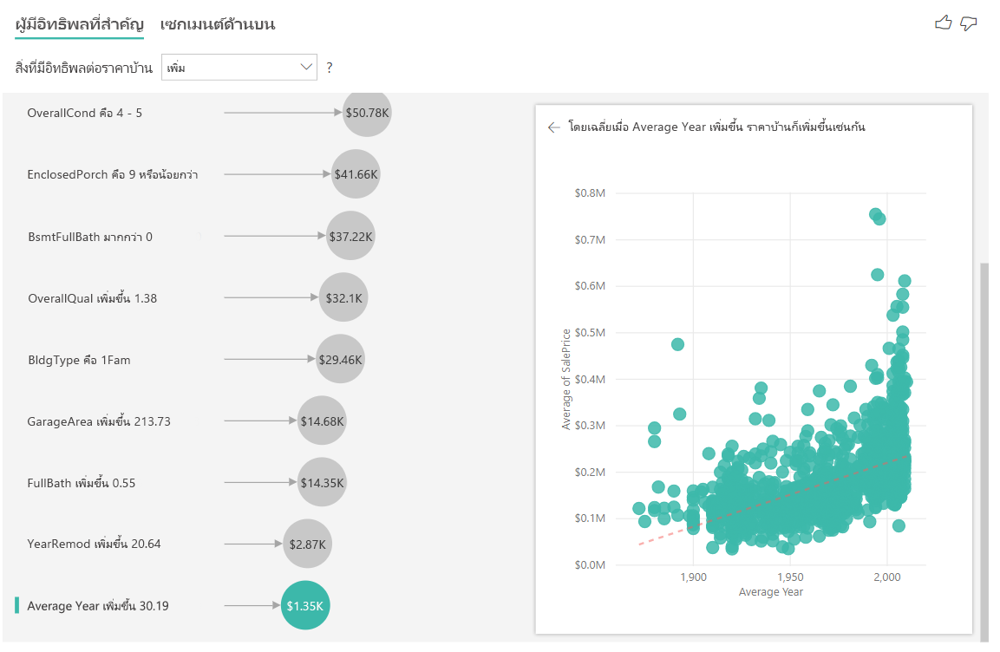

## ตีความผลลัพธ์: เซกเมนต์ด้านบนInterpret the results: Top Segments

เซกเมนต์ด้านบนสำหรับเป้าหมายที่เป็นตัวเลขแสดงกลุ่มที่มีราคาบ้านโดยเฉลี่ยสูงกว่าราคาบ้านในชุดข้อมูลโดยรวมTop segments for numerical targets show groups where the house prices on average are higher than in the overall dataset. ตัวอย่างเช่น ด้านล่างเราสามารถดูที่ **เซกเมนต์ 1** คือบ้านซึ่ง **GarageCars** (จำนวนรถยนต์พอดีกับที่จอด) มีค่ามากกว่า 2 และ **RoofStyle** คือ Hip ได้For example, below we can see that **Segment 1** is made up of houses where **GarageCars** (number of cars the garage can fit) is greater than 2 and the **RoofStyle** is Hip. บ้านที่มีลักษณะดังกล่าวมีราคาเฉลี่ย $355K เมื่อเทียบกับค่าเฉลี่ยโดยรวมในข้อมูลซึ่งเป็น $180KHouses with those characteristics have an average price of $355K compared to the overall average in the data which is $180K.

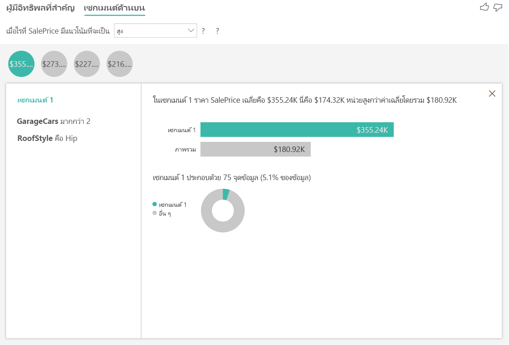

## วิเคราะห์เมตริกที่เป็นคอลัมน์หน่วยวัดหรือคอลัมน์สรุปAnalyze a metric that is a measure or a summarized column

ในกรณีของคอลัมน์หน่วยวัดหรือคอลัมน์สรุปการวิเคราะห์ที่เป็นค่าเริ่มต้นเป็น **ชนิดการวิเคราะห์อย่างต่อเนื่อง** ดังที่อธิบายไว้ [ด้านบน](#analyze-a-metric-that-is-numeric)In the case of a measure or summarized column the analysis defaults to the **Continuous Analysis Type** described [above](#analyze-a-metric-that-is-numeric). ซึ่งไม่สามารถเปลี่ยนแปลงได้This cannot be changed. ความแตกต่างที่ใหญ่ที่สุดระหว่างการวิเคราะห์คอลัมน์หน่วยวัด/คอลัมน์สรุปและคอลัมน์ตัวเลขที่ไม่ได้สรุปคือ ระดับที่มีการเรียกใช้การวิเคราะห์The biggest difference between analyzing a measure/summarized column and an unsummarized numeric column is the level at which the analysis runs.

ในกรณีของคอลัมน์ที่ไม่ได้สรุป การวิเคราะห์จะเรียกใช้ในระดับตารางเสมอIn the case of unsummarized columns, the analysis always runs at the table level. ในตัวอย่างราคาบ้านข้างต้น เราวิเคราะห์เมตริก **ราคาบ้าน** เพื่อดูว่าสิ่งใดที่มีอิทธิพลต่อการเพิ่มขึ้น/ลดลงของราคาบ้านIn the house price example above, we analyzed the **House Price** metric to see what influences a house price to increase/decrease. การวิเคราะห์จะเรียกใช้ในระดับตารางโดยอัตโนมัติThe analysis automatically runs on the table level. ตารางของเรามี ID ที่ไม่ซ้ำกันสำหรับบ้านแต่ละหลังเพื่อให้การวิเคราะห์เรียกใช้ ณ ระดับบ้านOur table has a unique ID for each house so the analysis runs at a house level.

สำหรับคอลัมน์หน่วยวัดและคอลัมน์สรุป เรายังไม่ทราบโดยทันทีว่าจะวิเคราะห์คอลัมน์เหล่านี้ระดับใดFor measures and summarized columns, we don't immediately know what level to analyze them at. หาก **ราคาบ้าน** ได้รับการสรุปเป็น **ค่าเฉลี่ย** เราจะต้องพิจารณาว่าเราต้องการคำนวณราคาบ้านเฉลี่ยนี้ที่ระดับใดIf **House Price** was summarized as an **Average**, we would need to consider what level we would like this average house price calculated. เป็นราคาบ้านเฉลี่ยในระดับใกล้เคียงหรือไม่Is it the average house price at a neighborhood level? หรืออาจจะเป็นระดับภูมิภาคใช่หรือไม่Or perhaps a regional level?

คอลัมน์หน่วยวัดและคอลัมน์สรุปจะได้รับการวิเคราะห์โดยอัตโนมัติที่ระดับของ **อธิบายโดย** เขตข้อมูลที่ใช้Measures and summarized columns are automatically analyzed at the level of the **Explain by** fields used. ลองจินตนาการว่าเรามีสามเขตข้อมูลใน **อธิบายโดย** ที่เราสนใจ: **คุณภาพห้องครัว** **ชนิดอาคาร** และ **เครื่องปรับอากาศ**Imagine we have three fields in **Explain By** we are interested in: **Kitchen Quality**, **Building Type** and **Air Conditioning**. จะมีการคำนวณ **ราคาบ้านเฉลี่ย** สำหรับการรวมที่ไม่ซ้ำกันของเขตข้อมูลทั้งสามเหล่านั้น**Average House Price** would be calculated for each unique combination of those three fields. ซึ่งมักจะเป็นประโยชน์ในการสลับไปยังมุมมองแบบตารางเพื่อดูว่าข้อมูลที่ทำการประเมินมีลักษณะอย่างไรIt is often helpful to switch to a table view to take a look at what the data being evaluated looks like.

การวิเคราะห์นี้ได้รับการสรุปมากมายและดังนั้นจึงเป็นเรื่องยากสำหรับแบบจำลองการถดถอยเพื่อค้นหารูปแบบใด ๆ ในข้อมูลที่แบบจำลองสามารถเรียนรู้ได้This analysis is very summarized and so it will be hard for the regression model to find any patterns in the data it can learn from. เราควรเรียกใช้การวิเคราะห์ที่ระดับที่มีรายละเอียดมากขึ้นเพื่อให้ได้ผลลัพธ์ที่ดีขึ้นWe should run the analysis at a more detailed level to get better results. หากเราต้องการวิเคราะห์ราคาบ้านที่ระดับบ้าน เราจะต้องเพิ่มเขตข้อมูล **ID** ลงในการวิเคราะห์อย่างชัดเจนIf we wanted to analyze the house price at the house level we would need to explicitly add the **ID** field to the analysis. อย่างไรก็ตาม เราไม่ต้องการพิจารณาให้ ID ของบ้านเป็นผู้มีอิทธิพลNevertheless, we don't want the house ID to be considered an influencer. ซึ่งไม่มีประโยชน์ที่จะเรียนรู้ว่าขณะที่ ID ของบ้านเพิ่มชึ้น ราคาของบ้านก็เพิ่มขึ้นด้วยIt is not helpful to learn that as house ID increases, the price of a house increase. นี่คือ ที่ ๆ ตัวเลือกแหล่งเขตข้อมูล **ขยายโดย** มาพร้อมประโยชน์This is where the **Expand By** field well option comes in handy. คุณสามารถใช้ **ขยายโดย** เพื่อเพิ่มเขตข้อมูลที่คุณต้องการใช้ในการตั้งค่าระดับของการวิเคราะห์โดยไม่ต้องค้นหาผู้มีอิทธิพลใหม่You can use **Expand By** to add fields you want to use for setting the level of the analysis without looking for new influencers.

ลองดูที่การแสดงภาพข้อมูลที่มีลักษณะเช่นเดียวกับครั้งที่เราเพิ่ม **ID** ไปยัง **ขยายโดย**Take a look at what the visualization looks like once we add **ID** to **Expand By**. หลังจากที่คุณได้กำหนดระดับที่คุณต้องการให้มีการประเมินผลหน่วยวัดของคุณ การแปลคำสั่งผู้มีอิทธิพลจะเหมือนกับ[คอลัมนตัวเลขที่ไม่ได้สรุป](#analyze-a-metric-that-is-numeric) อย่างชัดเจนOnce you have defined the level at which you want your measure evaluated, interpreting influencers is exactly the same as for [unsummarized numeric columns](#analyze-a-metric-that-is-numeric).

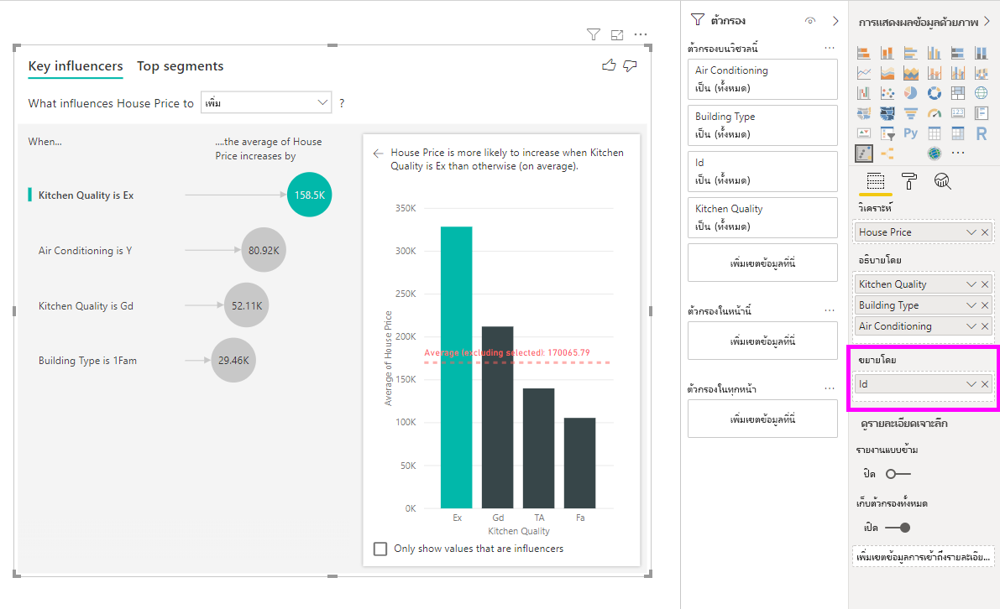

หากคุณต้องการเรียนรู้เพิ่มเติมเกี่ยวกับวิธีการที่คุณสามารถวิเคราะห์หน่วยวัดด้วยการแสดงภาพข้อมูลผู้มีอิทธิพลหลัก โปรดดูวิดีโอต่อไปนี้If you would like to learn more about how you can analyze measures with the key influencers visualization please watch the following video. หากต้องการเรียนรู้วิธีที่ Power BI ใช้ ML.NET ที่อยู่เบื้องหลังฉากเพื่อเหตุผลในข้อมูลเชิงลึกและพื้นผิวในลักษณะที่เป็นธรรมชาติ โปรดดู [Power BI ระบุอิทธิพลที่สำคัญโดยใช้ ML.NET](https://dotnet.microsoft.com/apps/machinelearning-ai/ml-dotnet/customers/power-bi)To learn how Power BI uses ML.NET behind the scenes to reason over data and surface insights in a natural way, see [Power BI identifies key influencers using ML.NET](https://dotnet.microsoft.com/apps/machinelearning-ai/ml-dotnet/customers/power-bi).

<iframe width="1167" height="631" src="https://www.youtube.com/embed/2X1cW8oPtc8" frameborder="0" allow="accelerometer; autoplay; encrypted-media; gyroscope; picture-in-picture" allowfullscreen></iframe>

## ข้อควรพิจารณาและการแก้ไขปัญหาConsiderations and troubleshooting 
 
**ข้อจำกัดสำหรับวิชวลคืออะไร****What are the limitations for the visual?** 
 
วิชวลของผู้มีอิทธิพลหลักมีข้อจำกัดบางอย่าง:The key influencers visual has some limitations:

- ไม่สนับสนุน Direct QueryDirect Query is not supported
- การเชื่อมต่อสดไปยัง Azure Analysis Services และ SQL Server Analysis Services ไม่ได้รับการสนับสนุนLive Connection to Azure Analysis Services and SQL Server Analysis Services is not supported
- ไม่รองรับการเผยแพร่บนเว็บPublish to web is not supported
- จำเป็นต้องมี .NET Framework 4.6 หรือสูงกว่า.NET Framework 4.6 or higher is required
- การฝัง SharePoint Online ยังไม่ได้รับการสนับสนุนSharePoint Online embedding isn't supported

**ฉันเห็นข้อผิดพลาดเนื่องจากไม่พบผู้มีอิทธิพลหรือเซกเมนต์ เหตุใดจึงเป็นเช่นนั้น****I see an error that no influencers or segments were found. Why is that?** 

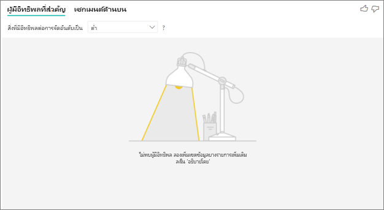

ข้อผิดพลาดนี้เกิดขึ้นเมื่อคุณได้รวมเขตข้อมูลใน **อธิบายโดย** แต่ไม่พบผู้มีอิทธิพลThis error occurs when you included fields in **Explain by** but no influencers were found. 
- คุณได้รวมเมตริกที่คุณกำลังวิเคราะห์ทั้งใน **การวิเคราะห์** และ **อธิบายโดย**You included the metric you were analyzing in both **Analyze** and **Explain by**. เอาเมตริกออกจาก **อธิบายโดย**Remove it from **Explain by**. 
- เขตข้อมูลการอธิบายของคุณมีหมวดหมู่มากเกินไปโดยมีข้อสังเกตเพียงเล็กน้อยYour explanatory fields have too many categories with few observations. สถานการณ์นี้ทำให้ยากสำหรับการแสดงภาพข้อมูลเพื่อกำหนดปัจจัยที่เป็นผู้มีอิทธิพลThis situation makes it hard for the visualization to determine which factors are influencers. ซึ่งเป็นการยากที่จะลงความเห็นตามข้อสังเกตเพียงสองสามข้อIt’s hard to generalize based on only a few observations. ถ้าคุณกำลังวิเคราะห์เขตข้อมูลตัวเลข คุณอาจต้องการสลับจาก **การวิเคราะห์ตามประเภท** เป็น **การวิเคราะห์แบบต่อเนื่อง** ใน **บานหน้าต่างการจัดรูปแบบ** ภายใต้การ์ด **การวิเคราะห์**If you are analyzing a numeric field you may want to switch from **Categorical Analysis** to **Continuous Analysis** in the **Formatting Pane** under the **Analysis** card.
- ปัจจัยการอธิบายของคุณมีจำนวนข้อสังเกตเพียงพอที่จะลงความเห็น แต่การสร้างภาพข้อมูลไม่พบความสัมพันธ์ที่มีความหมายใด ๆ ต่อรายงานYour explanatory factors have enough observations to generalize, but the visualization didn't find any meaningful correlations to report.
 
**ฉันเห็นข้อผิดพลาดซึ่งเมตริกที่ฉันกำลังวิเคราะห์มีข้อมูลไม่เพียงพอที่จะทำการวิเคราะห์ เหตุใดจึงเป็นเช่นนั้น****I see an error that the metric I'm analyzing doesn't have enough data to run the analysis on. Why is that?** 

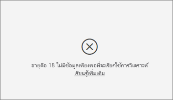

การแสดงภาพข้อมูลจะทำงานโดยดูที่รูปแบบในข้อมูลสำหรับกลุ่มหนึ่งเปรียบเทียบกับกลุ่มอื่นThe visualization works by looking at patterns in the data for one group compared to other groups. ตัวอย่างเช่น จะค้นหาลูกค้าที่ให้คะแนนต่ำเมื่อเปรียบเทียบกับลูกค้าทีให้คะแนนสูงFor example, it looks for customers who gave low ratings compared to customers who gave high ratings. หากข้อมูลในแบบจำลองของคุณมีข้อสังเกตสองสามข้อ จึงเป็นเรื่องยากที่จะค้นหาIf the data in your model has only a few observations, patterns are hard to find. หากการแสดงภาพข้อมูลไม่มีข้อมูลเพียงพอที่จะค้นหาผู้มีอิทธิพลที่มีความหมาย แสดงว่าจำเป็นต้องใช้ข้อมูลเพิ่มเติมเพื่อทำการวิเคราะห์If the visualization doesn’t have enough data to find meaningful influencers, it indicates that more data is needed to run the analysis. 

เราขอแนะนำว่าคุณมีข้อสังเกตอย่างน้อย 100 ข้อสำหรับสถานะเลือกไว้We recommend that you have at least 100 observations for the selected state. ในกรณีนี้ สถานะคือลูกค้าทียกเลิกบริการIn this case, the state is customers who churn. นอกจากนี ้คุณยังต้องมีข้อสังเกตอย่างน้อย 10 ข้อสำหรับสถานะที่คุณใช้สำหรับการเปรียบเทียบYou also need at least 10 observations for the states you use for comparison. ในกรณีนี้ สถานะการเปรียบเทียบคือลูกค้าที่ไม่ยกเลิกบริการIn this case, the comparison state is customers who don't churn.

ถ้าคุณกำลังวิเคราะห์เขตข้อมูลตัวเลข คุณอาจต้องการสลับจาก **การวิเคราะห์ตามประเภท** เป็น **การวิเคราะห์แบบต่อเนื่อง** ใน **บานหน้าต่างการจัดรูปแบบ** ภายใต้การ์ด **การวิเคราะห์**If you are analyzing a numeric field you may want to switch from **Categorical Analysis** to **Continuous Analysis** in the **Formatting Pane** under the **Analysis** card.

**ฉันเห็นข้อผิดพลาดที่เมื่อ ' วิเคราะห์ ' ไม่ได้รับการสรุป การวิเคราะห์จะเรียกใช้ที่ระดับแถวของตารางหลักเสมอ ไม่อนุญาตให้เปลี่ยนระดับนี้ผ่านเขตข้อมูล 'ขยายโดย' เหตุใดจึงเป็นเช่นนั้น****I see an error that when 'Analyze' is not summarized, the analysis always runs at the row level of its parent table. Changing this level via 'Expand by' fields is not allowed. Why is that?**

เมื่อทำการวิเคราะห์คอลัมน์ตัวเลขหรือคอลัมนจัดกลุ่ม การวิเคราะห์จะเรียกใช้ในระดับตารางเสมอWhen analyzing a numeric or categorical column, the analysis always runs at the table level. ตัวอย่างเช่น หากคุณกำลังวิเคราะห์ราคาบ้านและตารางของคุณประกอบด้วยคอลัมน์ ID การวิเคราะห์จะเรียกใช้โดยอัตโนมัติที่ระดับ ID บ้านFor example, if you are analyzing house prices and your table contains an ID column, the analysis will automatically run at the house ID level. 

เมื่อคุณกำลังวิเคราะห์คอลัมน์หน่วยวัดหรือคอลัมน์สรุป คุณต้องระบุว่าคุณต้องการให้การวิเคราะห์เรียกใช้ที่ระดับใดWhen you are analyzing a measure or summarized column, you need to explicitly state at which level you would like the analysis to run at. คุณสามารถใช้ **ขยายโดย** เพื่อเปลี่ยนระดับของการวิเคราะห์สำหรับคอลัมน์หน่วยวัดและคอลัมน์สรุปโดยไม่ต้องเพิ่มผู้มีอิทธิพลใหม่You can use **Expand by** to change the level of the analysis for measures and summarized columns without adding new influencers. หาก **ราคาบ้าน** ได้รับการกำหนดเป็นหน่วยวัด คุณสามารถเพิ่มคอลัมน์ ID บ้านไปยังเขตข้อมูล **ขยายโดย** เพื่อเปลี่ยนระดับการวิเคราะห์ได้If  **House price** was defined as a measure you could add the house ID column to **Expand by** to change the level of the analysis.

**ฉันเห็นข้อผิดพลาดว่าเขตข้อมูลใน *อธิบายโดย* ไม่เกี่ยวข้องกับตารางที่มีเมตริกที่ฉันกำลังวิเคราะห์โดยเฉพาะ เหตุใดจึงเป็นเช่นนั้น****I see an error that a field in *Explain by* isn't uniquely related to the table that contains the metric I'm analyzing. Why is that?**
 
การวิเคราะห์จะทำงานในระดับตารางของเขตข้อมูลที่กำลังวิเคราะห์The analysis runs on the table level of the field that's being analyzed. ตัวอย่างเช่น หากคุณวิเคราะห์ความคิดเห็นของลูกค้าสำหรับบริการของคุณ คุณอาจมีตารางที่บอกคุณว่าลูกค้าให้คะแนนสูงหรือต่ำFor example, if you analyze customer feedback for your service, you might have a table that tells you whether a customer gave a high rating or a low rating. ในกรณีนี้ การวิเคราะห์ของคุณจะทำงานที่ระดับตารางลูกค้าIn this case, your analysis is running at the customer table level. 

หากคุณมีตารางที่เกี่ยวข้องซึ่งกำหนดไว้ในระดับที่ละเอียดมากกว่าตารางที่มีเมตริกของคุณ คุณจะพบข้อผิดพลาดนี้If you have a related table that's defined at a more granular level than the table that contains your metric, you see this error. ตัวอย่างมีดังนี้:Here's an example: 
 
- คุณจะต้องวิเคราะห์สิ่งที่มีผลทำให้ลูกค้าให้คะแนนการบริการของคุณต่ำYou analyze what drives customers to give low ratings of your service.
- คุณต้องการดูว่าอุปกรณ์ที่ลูกค้าใช้บริการมีผลต่อการรีวิวที่พวกเขาให้หรือไม่You want to see if the device on which the customer is consuming your service influences the reviews they give.
- ลูกค้าสามารถใช้บริการได้หลายวิธีที่แตกต่างกันA customer can consume the service in multiple different ways.
- ในตัวอย่างต่อไปนี้ ลูกค้า 10000000 รายใช้ทั้งเบราว์เซอร์และแท็บเล็ตเพื่อโต้ตอบกับบริการIn the following example, customer 10000000 uses both a browser and a tablet to interact with the service.

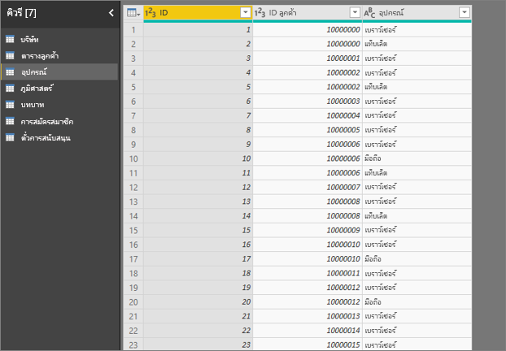

หากคุณพยายามใช้คอลัมน์อุปกรณ์เป็นปัจจัยการอธิบาย คุณจะเห็นข้อผิดพลาดต่อไปนี้:If you try to use the device column as an explanatory factor, you see the following error: 

ข้อผิดพลาดนี้ปรากฏขึ้นเนื่องจากอุปกรณ์ไม่ได้ถูกกำหนดไว้ในระดับลูกค้าThis error appears because the device isn't defined at the customer level. ลูกค้าหนึ่งรายสามารถใช้บริการได้บนหลายอุปกรณ์One customer can consume the service on multiple devices. สำหรับการแสดงภาพข้อมูลเพื่อหารูปแบบ อุปกรณ์ต้องเป็นแอตทริบิวต์ของลูกค้าFor the visualization to find patterns, the device must be an attribute of the customer. มีวิธีแก้ไขปัญหาหลากหลาย ทั้งนี้ขึ้นอยู่กับความเข้าใจเกี่ยวกับธุรกิจของคุณ:There are several solutions that depend on your understanding of the business: 
 
- คุณสามารถเปลี่ยนการสรุปอุปกรณ์เป็นการนับYou can change the summarization of devices to count. ตัวอย่างเช่น ใช้การนับถ้าจำนวนอุปกรณ์อาจส่งผลต่อคะแนนที่ลูกค้าให้For example, use count if the number of devices might affect the score that a customer gives. 
- คุณสามารถหมุนคอลัมน์อุปกรณ์เพื่อดูว่าการใช้บริการบนอุปกรณ์เฉพาะนั้นมีผลต่อการให้คะแนนของลูกค้าหรือไม่You can pivot the device column to see if consuming the service on a specific device influences a customer’s rating.
 
ในตัวอย่างนี้ ข้อมูลจะถูกควบคุมการแสดงผลอย่างสั้นเพื่อสร้างคอลัมน์ใหม่สำหรับเบราว์เซอร์ อุปกรณ์เคลื่อนที่ และแท็บเล็ต (ตรวจสอบให้แน่ใจว่าคุณได้ลบและสร้างความสัมพันธ์ของคุณในมุมมองการสร้างแบบจำลองใหม่หลังจากการควบคุมการแสดงผลของข้อมูลอย่างสั้น)In this example, the data was pivoted to create new columns for browser, mobile, and tablet (make sure you delete and re-create your relationships in the modeling view after pivoting your data). ตอนนี้คุณสามารถใช้อุปกรณ์เฉพาะเหล่านี้ใน **อธิบายโดย** ได้You can now use these specific devices in **Explain by**. อุปกรณ์ทั้งหมดกลายเป็นผู้มีอิทธิพล และเบราว์เซอร์มีผลกระทบต่อคะแนนของลูกค้ามากที่สุดAll devices turn out to be influencers, and the browser has the largest effect on customer score.

แม่นยำยิ่งขึ้น ลูกค้าที่ไม่ได้ใช้เบราว์เซอร์เพื่อใช้บริการมีแนวโน้มที่จะให้คะแนนต่ำกว่าลูกค้าที่ใช้ 3.79 เท่าMore precisely, customers who don't use the browser to consume the service are 3.79 times more likely to give a low score than the customers who do. เมื่อลดรายการสำหรับมือถือลง การผกผันจะเป็นจริงLower down in the list, for mobile the inverse is true. ลูกค้าที่ใช้แอปมือถือมีแนวโน้มที่จะให้คะแนนต่ำกว่าลูกค้าที่ไม่ได้ใช้Customers who use the mobile app are more likely to give a low score than the customers  who don’t. 

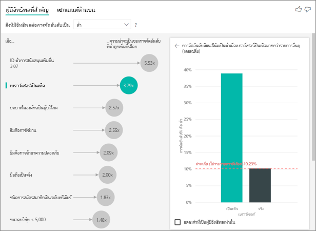

**ฉันเห็นคำเตือนว่าการวัดไม่ได้รวมอยู่ในการวิเคราะห์ของฉัน เหตุใดจึงเป็นเช่นนั้น****I see a warning that measures weren't included in my analysis. Why is that?** 

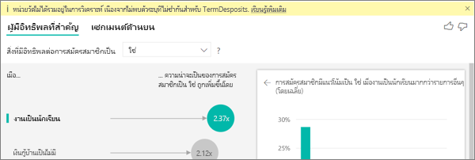

การวิเคราะห์จะทำงานในระดับตารางของเขตข้อมูลที่กำลังวิเคราะห์The analysis runs on the table level of the field that's being analyzed. หากคุณวิเคราะห์การเลิกใช้บริการของลูกค้า คุณอาจมีตารางที่บอกคุณว่าลูกค้าเลิกใช้บริการหรือไม่If you analyze customer churn, you might have a table that tells you whether a customer churned or not. ในกรณีนี้ การวิเคราะห์ของคุณจะทำงานที่ระดับตารางลูกค้าIn this case, your analysis runs at the customer table level.
 
การวัดและผลรวมจะถูกวิเคราะห์ตามค่าเริ่มต้นที่ระดับตารางนั้นMeasures and aggregates are by default analyzed at the table level. หากมีการวัดสำหรับค่าใช้จ่ายรายเดือนเฉลี่ย ระบบจะวิเคราะห์ในระดับตารางลูกค้าIf there were a measure for average monthly spending, it would be analyzed at the customer table level. 

หากตารางลูกค้าไม่มีตัวระบุที่ไม่ซ้ำกัน คุณจะไม่สามารถประเมินการวัดได้และจะถูกละเว้นโดยการวิเคราะห์If the customer table doesn't have a unique identifier, you can't evaluate the measure and it's ignored by the analysis. เมื่อต้องการหลีกเลี่ยงเหตุการณ์เช่นนี้ ให้แน่ใจว่าตารางที่มีเมตริกของคุณมีตัวระบุที่ไม่ซ้ำกันTo avoid this situation, make sure the table with your metric has a unique identifier. ในกรณีนี้ ตารางลูกค้าและตัวระบุที่ไม่ซ้ำกันคือ ID ลูกค้าIn this case, it's the customer table and the unique identifier is customer ID. นอกจากนี้ ยังง่ายต่อการเพิ่มคอลัมน์ดัชนีโดยใช้ Power QueryIt’s also easy to add an index column by using Power Query.
 
**ฉันเห็นคำเตือนว่าเมตริกที่ฉันกำลังวิเคราะห์มีค่ามากกว่า 10 ค่าที่ไม่ซ้ำกันและจำนวนนี้อาจส่งผลกระทบต่อคุณภาพการวิเคราะห์ของฉัน เหตุใดจึงเป็นเช่นนั้น****I see a warning that the metric I'm analyzing has more than 10 unique values and that this amount might affect the quality of my analysis. Why is that?** 

การแสดงภาพข้อมูล AI สามารถวิเคราะห์เขตข้อมูลตามประเภทและเขตข้อมูลตัวเลขThe AI visualization can analyze categorical fields and numeric fields. ในกรณีของเขตข้อมูลตามประเภท ตัวอย่างอาจเป็น Churn ใช่หรือไม่ และความพึงพอใจของลูกค้าอาจสูง ปานกลาง หรือต่ำได้In the case of categorical fields, an example may be Churn is Yes or No, and Customer Satisfaction is High, Medium, or Low. การเพิ่มจำนวนประเภทเพื่อวิเคราะห์หมายความว่ามีข้อสังเกตน้อยลงสำหรับแต่ละประเภทIncreasing the number of categories to analyze means there are fewer observations per category. สถานการณ์นี้ทำให้ยุ่งยากมากขึ้นในการแสดงภาพข้อมูลเพื่อค้นหารูปแบบในข้อมูลThis situation makes it harder for the visualization to find patterns in the data. 

เมื่อทำการวิเคราะห์เขตข้อมูลตัวเลข คุณจะมีตัวเลือกในระหว่างการจัดการเขตข้อมูลตัวเลขเช่น ข้อความ ในกรณีที่คุณจะเรียกใช้การวิเคราะห์เดียวกันกับที่คุณดำเนินการสำหรับข้อมูลตามประเภท (**การวิเคราะห์ตามประเภท**)When analyzing numeric fields you have a choice between treating the numeric fields like text in which case you will run the same analysis as you do for categorical data (**Categorical Analysis**). ถ้าคุณมีค่าที่เฉพาะเจาะจงจำนวนมาก เราขอแนะนำให้คุณสลับการวิเคราะห์เป็น **การวิเคราะห์แบบต่อเนื่อง** ซึ่งหมายความว่าเราสามารถอนุมานรูปแบบจากเมื่อตัวเลขเพิ่มขึ้นหรือลดลงแทนการจัดการตัวเลขเหล่านั้นในรูปแบบค่าที่เฉพาะเจาะจงIf you have lots of distinct values we recommend you switch the analysis to **Continuous Analysis** as that means we can infer patterns from when numbers increase or decrease rather than treating them as distinct values. คุณสามารถสลับจาก **การวิเคราะห์ตามประเภท** เป็น **การวิเคราะห์แบบต่อเนื่อง** ใน **บานหน้าต่างการจัดรูปแบบ** ภายใต้การ์ด **การวิเคราะห์**You can switch from **Categorical Analysis** to **Continuous Analysis** in the **Formatting Pane** under the **Analysis** card.

หากต้องการค้นหาผู้มีอิทธิพลที่แข็งแกร่ง เราแนะนำให้จัดกลุ่มค่าที่คล้ายกันไว้ในหน่วยเดียวTo find stronger influencers, we recommend that you group similar values into a single unit. ตัวอย่างเช่น หากคุณมีเมตริกสำหรับราคา คุณจะได้ผลลัพธ์ที่ดีขึ้นโดยการจัดกลุ่มราคาที่คล้ายกัน เช่น กลุ่มราคาสูง กลุ่มราคาปานกลาง และกลุ่มราคาต่ำเทียบกับการเลือกใช้จุดราคาแต่ละจุดFor example, if you have a metric for price, you're likely to obtain better results by grouping similar prices into High, Medium, and Low categories vs. using individual price points. 

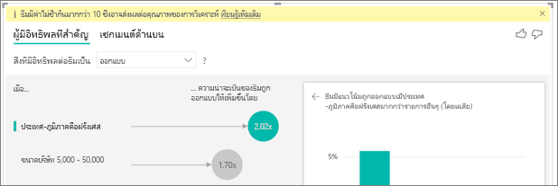

**มีปัจจัยในข้อมูลของฉันที่ดูเหมือนว่าปัจจัยดังกล่าวควรจะเป็นผู้มีอิทธิพลหลัก แต่ว่าไม่ใช่ สถานการณ์เช่นนั้นเกิดขึ้นได้อย่างไร****There are factors in my data that look like they should be key influencers, but they aren't. How can that happen?**

ในตัวอย่างต่อไปนี้ ลูกค้าที่เป็นผู้บริโภคมีผลต่อการให้คะแนนต่ำ โดยให้คะแนน 14.93% ซึ่งถือว่าต่ำIn the following example, customers who are consumers drive low ratings, with 14.93% of ratings that are low. บทบาทของผู้ดูแลระบบยังมีสัดส่วนสูงในการให้คะแนนต่ำ 13.42% แต่ไม่ถือว่าเป็นผู้มีอิทธิพลThe administrator role also has a high proportion of low ratings, at 13.42%, but it isn't considered an influencer. 

เหตุผลในการพิจารณานี้คือการแสดงภาพข้อมูลนั้นคำนึงถึงจำนวนของจุดข้อมูลด้วยเมื่อค้นหาผู้มีอิทธิพลThe reason for this determination is that the visualization also considers the number of data points when it finds influencers. ตัวอย่างต่อไปนี้มีลูกค้ามากกว่า 29,000 คน และมีผู้ดูแลระบบน้อยกว่า 10 เท่า ประมาณ 2,900 คนThe following example has more than 29,000 consumers and 10 times fewer administrators, about 2,900. มีเพียง 390 คนเท่านั้นที่ให้คะแนนต่ำOnly 390 of them gave a low rating. ภาพวิชวลนั้นไม่มีข้อมูลเพียงพอที่จะพิจารณาว่าเป็นรูปแบบที่มีการให้คะแนนโดยผู้ดูแลระบบหรือเป็นเพียงการค้นหาโอกาสเท่านั้นThe visual doesn’t have enough data to determine whether it found a pattern with administrator ratings or if it’s just a chance finding. 

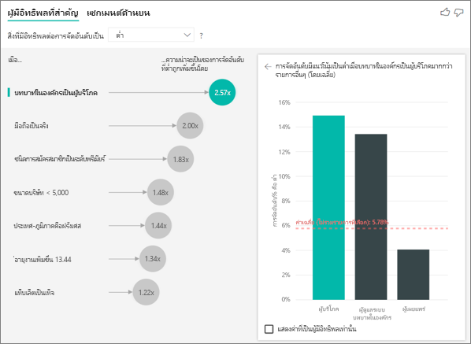

**ขีดจำกัดจุดข้อมูลสำหรับผู้มีอิทธิพลหลักคืออะไร****What are the data point limits for key influencers?**
เราเรียกใช้การวิเคราะห์เกี่ยวกับตัวอย่างของจุดข้อมูล 10,000 รายการWe run the analysis on a sample of 10,000 data points. ฟองอากาศด้านหนึ่งแสดงถึงผู้มีอิทธิพลทั้งหมดที่พบThe bubbles on the one side show all the influencers that were found. แผนภูมิคอลัมน์และ scatterplots ในอีกด้านหนึ่งจะปฏิบัติตามกลยุทธ์การสุ่มตัวอย่างสำหรับวิชวลหลักเหล่านั้นThe column charts and scatterplots on the other side abide by the sampling strategies for those core visuals.

**คุณจะคำนวณผู้มีอิทธิพลหลักสำหรับการวิเคราะห์ตามประเภทได้อย่างไร****How do you calculate key influencers for categorical analysis?**

ในเบื้องหลัง การแสดงภาพข้อมูล AI จะใช้ [ML.NET](https://dotnet.microsoft.com/apps/machinelearning-ai/ml-dotnet) เพื่อประมวลผลการถดถอยโลจิสติกส์เพื่อคำนวณผู้มีอิทธิพลหลักBehind the scenes, the AI visualization uses [ML.NET](https://dotnet.microsoft.com/apps/machinelearning-ai/ml-dotnet) to run  a logistic regression to calculate the key influencers. การถดถอยโลจิสติกเป็นรูปแบบทางสถิติที่เปรียบเทียบกลุ่มที่แตกต่างกันA logistic regression is a statistical model that compares different groups to each other. 

หากคุณต้องการเห็นสิ่งที่มีผลต่อการให้คะแนนต่ำ การถดถอยโลจิสติกส์จะพิจารณาว่าลูกค้าที่ให้คะแนนต่ำแตกต่างจากลูกค้าที่ให้คะแนนสูงอย่างไรIf you want to see what drives low ratings, the logistic regression looks at how customers who gave a low score differ from the customers who gave a high score. หากคุณมีหลายหมวดหมู่เช่น คะแนนสูง คะแนนปานกลาง และคะแนนต่ำ คุณจะต้องพิจารณาว่าลูกค้าที่ให้คะแนนต่ำแตกต่างจากลูกค้าที่ไม่ได้ให้คะแนนต่ำอย่างไรIf you have multiple categories, such as high, neutral, and low scores, you look at how the customers who gave a low rating differ from the customers who didn't give a low rating. ในกรณีน ี้ลูกค้าที่ให้คะแนนต่ำแตกต่างจากลูกค้าที่ให้คะแนนสูงหรือคะแนนปานกลางอย่างไรIn this case, how do the customers who gave a low score differ from the customers who gave a high rating or a neutral rating? 
 
การถดถอยโลจิสติกจะค้นหารูปแบบในข้อมูลและค้นหาว่าลูกค้าที่ให้คะแนนต่ำอาจแตกต่างจากลูกค้าที่ให้คะแนนสูงอย่างไรThe logistic regression searches for patterns in the data and looks for how customers who gave a low rating might differ from the customers who gave a high rating. ตัวอย่างเช่น อาจพบว่าลูกค้าที่มีตั๋วการสนับสนุนมากกว่าจะให้คะแนนต่ำกว่าลูกค้าที่มีตั๋วการสนับสนุนน้อยหรือไม่มีเลยIt might find, for example, that customers with more support tickets give a higher percentage of low ratings than customers with few or no support tickets.
 
การถดถอยโลจิสติกส์ยังคำนึงถึงจำนวนจุดข้อมูลที่มีอยู่ด้วยThe logistic regression also considers how many data points are present. ตัวอย่างเช่น หากลูกค้าที่มีบทบาทผู้ดูแลระบบให้คะแนนติดเชิงลบมากกว่าตามสัดส่วน แต่มีผู้ดูแลระบบเพียงไม่กี่คน ปัจจัยนี้ไม่ถือว่ามีอิทธิพลFor example, if customers who play an admin role give proportionally more negative scores but there are only a few administrators, this factor isn't considered influential. การกำหนดนี้เกิดขึ้นเนื่องจากมีจุดข้อมูลไม่เพียงพอที่จะอนุมานรูปแบบThis determination is made because there aren't enough data points available to infer a pattern. การทดสอบทางสถิติหรือที่รู้จักกันในชื่อการทดสอบ Wald นั้นใช้เพื่อพิจารณาว่าปัจจัยใดที่ถือว่าเป็นผู้มีอิทธิพลA statistical test, known as a Wald test, is used to determine whether a factor is considered an influencer. ภาพวิชวลใช้ค่า p เป็น 0.05 เพื่อกำหนดเกณฑ์The visual uses a p-value of 0.05 to determine the threshold. 

**คุณจะคำนวณผู้มีอิทธิพลหลักสำหรับการวิเคราะห์เชิงตัวเลขได้อย่างไร****How do you calculate key influencers for numeric analysis?**

ในเบื้องหลัง การแสดงภาพข้อมูล AI จะใช้ [ML.NET](https://dotnet.microsoft.com/apps/machinelearning-ai/ml-dotnet) เพื่อประมวลผลการถดถอยเชิงเส้นเพื่อคำนวณผู้มีอิทธิพลหลักBehind the scenes, the AI visualization uses [ML.NET](https://dotnet.microsoft.com/apps/machinelearning-ai/ml-dotnet) to run a linear regression to calculate the key influencers. การถดถอยเชิงเส้นเป็นแบบจำลองเชิงสถิติที่พิจารณาว่าผลลัพธ์ของเขตข้อมูลที่คุณกำลังวิเคราะห์มีการเปลี่ยนแปลงตามปัจจัยการอธิบายของคุณอย่างไรA linear regression is a statistical model that looks at how the outcome of the field you are analyzing changes based on your explanatory factors.

ตัวอย่างเช่น ถ้าเรากำลังวิเคราะห์ราคาบ้าน การถดถอยเชิงเส้นจะพิจารณาถึงอิทธิพลจากการมีห้องครัวที่ดีเยี่ยมจะมีผลต่อราคาบ้านFor example, if we are analyzing house prices, a linear regression will look at the impact having an excellent kitchen will have on the house price. บ้านที่มีห้องครัวที่ดีเยี่ยมมักมีราคาบ้านที่ต่ำกว่าหรือสูงกว่าเมื่อเทียบกับบ้านที่ไม่มีห้องครัวที่ดีเยี่ยมใช่หรือไม่Do houses with excellent kitchens generally have lower or higher house prices compared to houses without excellent kitchens?

การถดถอยเชิงเส้นยังพิจารณาจำนวนของจุดข้อมูลด้วยThe linear regression also considers the number of data points. ตัวอย่างเช่น หากบ้านที่มีสนามเทนนิสมีราคาสูงกว่า แต่เรามีบ้านน้อยมากที่มีสนามเทนนิส ปัจจัยนี้จะไม่ถือว่ามีอิทธิพลFor example, if houses with tennis courts have higher prices but we  have very few houses that have a tennis court, this factor is not considered influential. การกำหนดนี้เกิดขึ้นเนื่องจากมีจุดข้อมูลไม่เพียงพอที่จะอนุมานรูปแบบThis determination is made because there aren't enough data points available to infer a pattern. การทดสอบทางสถิติหรือที่รู้จักกันในชื่อการทดสอบ Wald นั้นใช้เพื่อพิจารณาว่าปัจจัยใดที่ถือว่าเป็นผู้มีอิทธิพลA statistical test, known as a Wald test, is used to determine whether a factor is considered an influencer. ภาพวิชวลใช้ค่า p เป็น 0.05 เพื่อกำหนดเกณฑ์The visual uses a p-value of 0.05 to determine the threshold. 

**คุณคำนวณกลุ่มอย่างไร****How do you calculate segments?**

ในเบื้องหลัง การแสดงภาพข้อมูล AI ใช้[ML.NET](https://dotnet.microsoft.com/apps/machinelearning-ai/ml-dotnet)เพื่อเรียกใช้แผนภูมิการตัดสินใจเพื่อค้นหากลุ่มย่อยที่น่าสนใจBehind the scenes, the AI visualization uses [ML.NET](https://dotnet.microsoft.com/apps/machinelearning-ai/ml-dotnet) to run a decision tree to find interesting subgroups. วัตถุประสงค์ของแผนภูมิการตัดสินใจคือการจบด้วยกลุ่มย่อยของจุดข้อมูลที่ค่อนข้างสูงในเมตริกที่คุณสนใจThe objective of the decision tree is to end up with a subgroup of data points that's relatively high in the metric you're interested in. ซึ่งอาจเป็นลูกค้าที่ให้คะแนนต่ำหรือบ้านที่มีราคาสูงThis could be customers with low ratings or houses with high prices.

แผนภูมิการตัดสินใจใช้ปัจจัยการอธิบายแต่ละตัวและพยายามหาเหตุผลว่าปัจจัยใดที่มี *การแยก* ที่ดีที่สุดThe decision tree takes each explanatory factor and tries to reason which factor gives it the best *split*. ตัวอย่างเช่น หากคุณกรองข้อมูลเพื่อรวมเฉพาะลูกค้าองค์กรขนาดใหญ่จะแยกลูกค้าที่ให้คะแนนสูงกับคะแนนต่ำหรือไม่For example, if you filter the data to include only large enterprise customers, will that separate out customers who gave a high rating vs. a low rating? หรืออาจจะดีกว่าถ้ากรองข้อมูลเพื่อรวมเฉพาะลูกค้าที่แสดงความคิดเห็นเกี่ยวกับความปลอดภัยเท่านั้นใช่หรือไม่Or perhaps is it better to filter the data to include only customers who commented about security? 

หลังจากทำการแบ่งแผนภูมิการตัดสินใแล้ว ระบบจะใช้กลุ่มย่อยของข้อมูลและกำหนดการแยกที่ดีที่สุดในลำดับถัดไปสำหรับข้อมูลนั้นAfter the decision tree does a split, it takes the subgroup of data and determines the next best split for that data. ในกรณีนี้ กลุ่มย่อยคือลูกค้าที่แสดงข้อคิดเห็นเกี่ยวกับความปลอดภัยIn this case, the subgroup is customers who commented on security. หลังจากการแยกแต่ละครั้ง ระบบจะพิจารณาว่ามีจุดข้อมูลเพียงพอหรือไม่สำหรับกลุ่มนี้ที่จะเป็นตัวแทน ซึ่งเพียงพอที่จะอนุมานรูปแบบหรืออาจเป็นความผิดปกติของข้อมูลและไม่ใช่เซกเมนต์จริงหรือไม่After each split, it also considers whether it has enough data points for this group to be representative enough to infer a pattern from or whether it's an anomaly in the data and not a real segment. ใช้การทดสอบทางสถิติอื่นเพื่อตรวจสอบนัยสำคัญทางสถิติของเงื่อนไขการแยกด้วยค่า p เท่ากับ 0.05Another statistical test is applied to check for the statistical significance of the split condition with p-value of 0.05. 

หลังจากแผนภูมิการตัดสินใจทำงานเสร็จสิ้น ระบบจะใช้การแยกทั้งหมดเช่น ความคิดเห็นด้านความปลอดภัยและองค์กรขนาดใหญ่ รวมถึงสร้างตัวกรอง Power BIAfter the decision tree finishes running, it takes all the splits, such as security comments and large enterprise, and creates Power BI filters. มีการรวมแพคเกจชุดตัวกรองเป็นกลุ่มในภาพวิชวลThis combination of filters is packaged up as a segment in the visual. 
 
**เหตุใดปัจจัยบางอย่างจึงกลายเป็นผู้มีอิทธิพลหรือหยุดการเป็นผู้มีอิทธิพลเมื่อฉันย้ายเขตข้อมูลไปที่ *อธิบายโดย*****Why do certain factors become influencers or stop being influencers as I move more fields into the *Explain by* field?**

การแสดงภาพข้อมูลประเมินปัจจัยอธิบายทั้งหมดเข้าด้วยกันThe visualization evaluates all explanatory factors together. ปัจจัยอาจเป็นผู้มีอิทธิพลด้วยตัวเอง แต่เมื่อพิจารณาด้วยปัจจัยอื่น ๆ อาจไม่เป็นเช่นนั้นA factor might be an influencer by itself, but when it's considered with other factors it might not. สมมติว่าคุณต้องการวิเคราะห์สิ่งที่ทำให้ราคาบ้านสูงด้วยห้องนอนและขนาดบ้านเป็นปัจจัยการอธิบาย:Suppose you want to analyze what drives a house price to be high, with bedrooms and house size as explanatory factors:

- โดยตัวเองแล้ว การมีห้องนอนมากขึ้นอาจเป็นตัวผลักดันให้ราคาบ้านสูงขึ้นBy itself, more bedrooms might be a driver for house prices to be high.
- การรวมขนาดบ้านในการวิเคราะห์หมายความว่าตอนนี้คุณจะต้องพิจารณาว่าเกิดอะไรขึ้นกับห้องนอนในขณะที่ขนาดบ้านยังคงไม่เปลี่ยนแปลงIncluding house size in the analysis means you now look at what happens to bedrooms while house size remains constant.
- หากบ้านมีขนาดคงที่ 1,500 ตารางฟุต ไม่น่าเป็นไปได้ที่การเพิ่มจำนวนห้องนอนมากขึ้นอย่างต่อเนื่องจะเพิ่มราคาบ้านอย่างมากIf house size is fixed at 1,500 square feet, it's unlikely that a continuous increase in the number of bedrooms will dramatically increase the house price. 
- ห้องนอนอาจไม่สำคัญเท่าปัจจัยก่อนที่จะพิจารณาขนาดบ้านBedrooms might not be as important of a factor as it was before house size was considered. 

การแชร์รายงานของคุณกับผู้ร่วมงาน Power BI กำหนดให้คุณต้องมีสิทธิ์การใช้งาน Power BI Pro แต่ละรายการ หรือรายงานจะถูกบันทึกในความจุแบบพรีเมียมSharing your report with a Power BI colleague requires that you both have individual Power BI Pro licenses or that the report is saved in Premium capacity. ดู [การแชร์รายงาน](../collaborate-share/service-share-reports.md)See [sharing reports](../collaborate-share/service-share-reports.md).

## ขั้นตอนถัดไปNext steps
- [แผนภูมิผสมใน Power BICombo charts in Power BI](power-bi-visualization-combo-chart.md)
- [ชนิดการแสดงภาพใน Power BIVisualization types in Power BI](power-bi-visualization-types-for-reports-and-q-and-a.md)
- [วิธีการที่ Power BI ใช้ ML.NET เพื่อระบุอิทธิพลที่สำคัญHow Power BI uses ML.NET to identify key influencers](https://dotnet.microsoft.com/apps/machinelearning-ai/ml-dotnet/customers/power-bi)