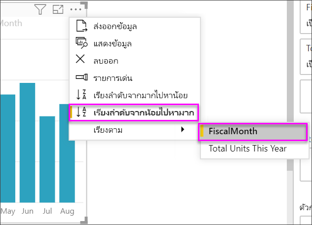
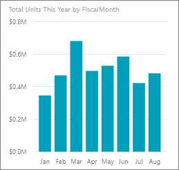
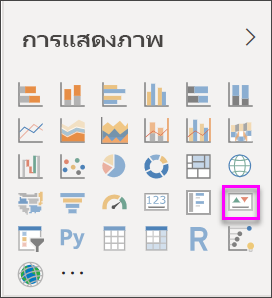
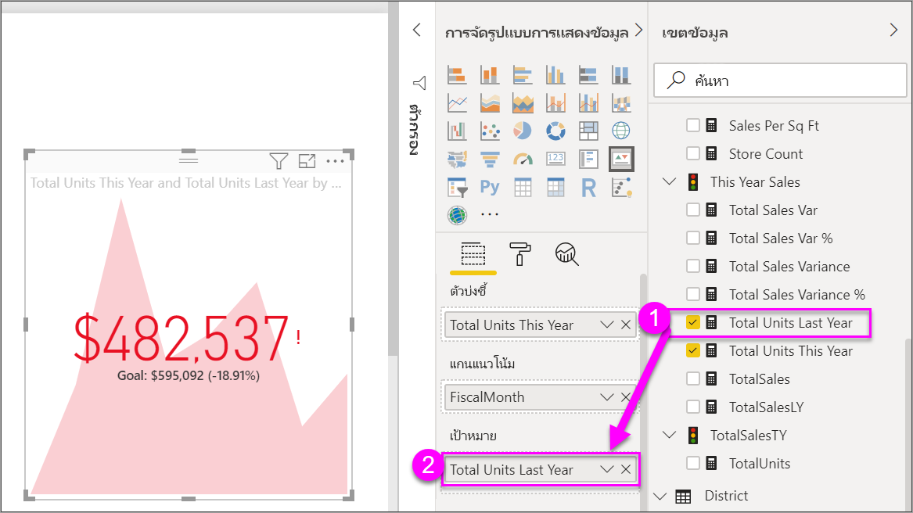

# สร้างการแสดงภาพตัวบ่งชี้ประสิทธิภาพหลัก (KPI)Create key performance indicator (KPI) visualizations

[!INCLUDE[consumer-appliesto-nyyn](../includes/consumer-appliesto-nyyn.md)]

[!INCLUDE [power-bi-visuals-desktop-banner](../includes/power-bi-visuals-desktop-banner.md)]

ดัชนีประสิทธิภาพหลัก (KPI) เป็นภาพสัญลักษณ์ที่แสดงปริมาณความก้าวหน้าของงานที่ทำเพื่อมุ่งไปยังเป้าหมายที่วัดผลได้A Key Performance Indicator (KPI) is a visual cue that communicates the amount of progress made toward a measurable goal. สำหรับข้อมูลเพิ่มเติมเกี่ยวกับ KPI โปรดดู [ตัวบ่งชี้ประสิทธิภาพหลัก (KPI) ใน PowerPivot](https://support.office.com/en-us/article/Key-Performance-Indicators-KPIs-in-Power-Pivot-E653EDEF-8A21-40E4-9ECE-83A6C8C306AA)For more about KPIs, see [Key Performance Indicators (KPIs) in PowerPivot](https://support.office.com/en-us/article/Key-Performance-Indicators-KPIs-in-Power-Pivot-E653EDEF-8A21-40E4-9ECE-83A6C8C306AA).

## เมื่อต้องการใช้ KPIWhen to use a KPI

KPI เป็นตัวเลือกที่ดีที่สุด:KPIs are a great choice:

* การวัดความคืบหน้าTo measure progress. ตอบคำถาม "ฉันน้ำนำหน้าหรือตามหลังสิ่งใดอยู่"?Answers the question, "What am I ahead or behind on?"

* การวัดระยะห่างเป้าหมายTo measure distance to a goal. ตอบคำถาม "ฉันน้ำนำหน้าหรือตามหลังอยู่ไกลเท่าใด"?Answers the question, "How far ahead or behind am I?"

## ข้อกำหนดของ KPIKPI requirements

ตัวออกแบบวัดภาพ KPI ตามหน่วยวัดเฉพาะA designer bases a KPI visual on a specific measure. เป้าหมายของ KPI คือช่วยให้คุณประเมินค่าและสถานะปัจจุบันเทียบกับเป้าหมายที่กำหนดThe intention of the KPI is to help you evaluate the current value and status of a metric against a defined target. ภาพ KPI จำเป็นต้องมีการวัด *พื้นฐาน* ที่ประเมินเป็นค่าและการวัดหรือค่า *เป้าหมาย* *ค่าเกณฑ์* หรือ *จุดหมาย*A KPI visual requires a *base* measure that evaluates to a value, a *target* measure or value, and a *threshold* or *goal*.

ชุดข้อมูล KPI จำเป็นต้องประกอบด้วยค่าเป้าหมายสำหรับ KPIA KPI dataset needs to contain goal values for a KPI. ถ้าชุดข้อมูลของคุณไม่ประกอบด้วยค่าเป้าหมาย คุณสามารถสร้างค่าเป้าหมายโดยการเพิ่มแผ่นงาน Excel ที่แสดงค่าเป้าหมาย ให้กับรูปแบบข้อมูลหรือไฟล์ PBIX ของคุณIf your dataset doesn't contain goal values, you can create them by adding an Excel sheet with goals to your data model or PBIX file.

## ข้อกำหนดเบื้องต้นPrerequisites

บทช่วยสอนนี้ใช้[ไฟล์ PBIX ตัวอย่างการวิเคราะห์การค้าปลีก](https://download.microsoft.com/download/9/6/D/96DDC2FF-2568-491D-AAFA-AFDD6F763AE3/Retail%20Analysis%20Sample%20PBIX.pbix)This tutorial uses the [Retail Analysis sample PBIX file](https://download.microsoft.com/download/9/6/D/96DDC2FF-2568-491D-AAFA-AFDD6F763AE3/Retail%20Analysis%20Sample%20PBIX.pbix).

1. จากด้านบนซ้ายของแถบเมนู เลือก **ไฟล์** > **เปิด**From the upper left section of the menubar, select **File** > **Open**

1. ค้นหาสำเนา **ไฟล์ PBIX ตัวอย่างการวิเคราะห์การค้าปลีก**Find your copy of the **Retail Analysis sample PBIX file**

1. เปิด **ไฟล์ PBIX ตัวอย่างการวิเคราะห์ด้านการขายปลีก** ในมุมมองรายงานOpen the **Retail Analysis sample PBIX file** in report view. 

1. เลือ **+** เพื่อเพิ่มหน้าใหม่Select **+** to add a new page. 

> [!NOTE]
> การแชร์รายงานของคุณกับผู้ร่วมงาน Power BI กำหนดให้คุณต้องมีสิทธิ์การใช้งาน Power BI Pro แต่ละรายการ หรือรายงานจะถูกบันทึกในความจุแบบพรีเมียมSharing your report with a Power BI colleague requires that you both have individual Power BI Pro licenses or that the report is saved in Premium capacity.    

## วิธีการสร้าง KPIHow to create a KPI

ในตัวอย่างนี้ คุณจะสร้าง KPI เพื่อวัดความคืบหน้าที่คุณได้ทำเพื่อบรรลุเป้าหมายยอดขายIn this example, you'll create a KPI that measures the progress you've made toward a sales goal.

1. จากบานหน้าต่าง **เขตข้อมูล** ให้เลือก **ยอดขาย > หน่วยรวมปีนี้**From the **Fields** pane, select **Sales > Total Units This Year**.  ค่านี้จะเป็นตัวดัชนีThis value will be the indicator.

1. เพิ่ม **เวลา > เดือนการเงิน**Add **Time > FiscalMonth**.  ค่านี้จะแสดงแนวโน้มThis value will represent the trend.

1. ในมุมขวาบนของภาพ เลือกจุดไข่ปลา และตรวจสอบว่า Power BI เรียงลำดับคอลัมน์ตาม **เดือนงบประมาณ**In the upper-right corner of the visual, select the ellipsis and check that Power BI sorted the columns in ascending order by **FiscalMonth**.

    > [!IMPORTANT]
    > เมื่อคุณแปลงการแสดงภาพเป็น KPI จึง **ไม่มี** ตัวเลือกการเรียงลำดับOnce you convert the visualization to a KPI, there's **no** option to sort. คุณต้องเรียงลำดับอย่างถูกต้องในขณะนี้You must sort it correctly now.

    

    เมื่อเรียงลำดับอย่างถูกต้อง ภาพของคุณจะมีลักษณะดังนี้:Once sorted correctly, your visual will look like this:

    

1. แปลงภาพเป็น KPI โดยเลือกไอคอน **KPI** จากบานหน้าต่าง **การแสดงภาพ**Convert the visual to a KPI by selecting the **KPI** icon from the **Visualization** pane.

    

1. หากต้องการเพิ่งเป้าหมาย ลาก **หน่วยรวมปีที่แล้ว** ไปยังเขตข้อมูล **เป้าหมาย**To add a goal, drag **Total Units Last Year** to the **Target goals** field.

    

1. อีกทางหนึ่งคือ จัดรูปแบบ KPI โดยเลือกไอคอน ลูกกลิ้งทาสี เพื่อเปิดบานหน้าต่างการจัดรูปแบบOptionally, format the KPI by selecting the paint roller icon to open the Formatting pane.

    * **ตัวดัชนี** - ควบคุมหน่วยแสดงผลของตัวดัชนีและตำแหน่งทศนิยม**Indicator** - controls the indicator’s display units and decimal places.

    * **แกนแนวโน้ม** - เมื่อตั้งค่าเป็น **เปิด** ภาพจะแสดงแกนแนวโน้มเป็นพื้นหลังของภาพ KPI**Trend axis** - when set to **On**, the visual shows the trend axis as the background of the KPI visual.  

    * **เป้าหมาย** - เมื่อตั้งค่าเป็น **เปิด** ภาพจะแสดงเป้าหมายและระยะห่างจากเป้าหมายเป็นเปอร์เซ็นต์**Goals** - when set to **On**, the visual shows the goal and the distance from the goal as a percentage.

    * **รหัสสี > ทิศทาง** - ผู้คนจะพิจารณา KPI บางส่วนว่า ดีกว่า เมื่อมีค่า *สูงกว่า* และพิจารณา KPI บางส่วนว่า *ดีกว่า* เมื่อมีค่าต่ำกว่า**Color coding > Direction** - people consider some KPIs better for *higher* values and consider some better for *lower* values. ตัวอย่างเช่น กำไรเทียบกับเวลารอFor example, earnings versus wait time. โดยทั่วไปแล้ว กำไรที่สูงขึ้นจะดีกว่าเมื่อเทียบกับค่าสูงขึ้นของเวลารอTypically a higher value of earnings is better versus a higher value of wait time. เลือก **สูงขึ้นดีกว่า** และเลือกเปลี่ยนการตั้งค่าสีได้Select **high is good** and, optionally, change the color settings.

KPI ยังมีให้บริการในบริการของ Power BI และจากอุปกรณ์มือถือของคุณและติดตั้งได้ง่ายๆKPIs are also available in the Power BI service and on your mobile devices. ช่วยให้คุณสามารถเลือกที่จะเชื่อมต่อกับความคืบหน้าของธุรกิจของคุณได้ตลอดเวลาIt gives you the option to be always connected to your business's heartbeat.

## ข้อควรพิจารณาและการแก้ไขปัญหาConsiderations and troubleshooting

ถ้า KPI ของคุณไม่มีลักษณะคล้ายกับด้านบน อาจเป็นเพราะคุณไม่ได้จัดเรียงตาม **เดือนงบประมาณ**If your KPI doesn't look like the one above, it may be because you didn't sort by **FiscalMonth**. KPI ไม่มีตัวเลือกการจัดเรียงKPIs don't have a sort option. คุณจะต้องเริ่มต้นใหม่อีกครั้งและจัดเรียงตาม **FiscalMonth** *ก่อน* ที่คุณจะแปลงการแสดงภาพของคุณเป็น KPIYou'll need to start again and sort by **FiscalMonth** *before* you convert your visualization to a KPI.

## ขั้นตอนถัดไปNext steps

* [เคล็ดลับและลูกเล่นในการแสดงข้อมูลแผนที่ Power BITips and Tricks for Power BI Map visualizations](power-bi-map-tips-and-tricks.md)

* [ชนิดการแสดงภาพใน Power BIVisualization types in Power BI](power-bi-visualization-types-for-reports-and-q-and-a.md)

มีคำถามเพิ่มเติมหรือไม่More questions? [ลองไปที่ชุมชน Power BITry the Power BI Community](https://community.powerbi.com/)
