# บทช่วยสอน: ฝังวิชวล Power App ในรายงาน Power BITutorial: Embed a Power Apps visual in a Power BI report

ในการแนะนำวิธีการใช้นี้ คุณใช้วิชวล Power Apps สร้างแอปใหม่ที่ถูกฝังในตัวอย่างรายงาน Power BIIn this tutorial, you use the Power Apps visual to create a new app that is embedded in a sample Power BI report. แอปนี้โต้ตอบกับวิชวลอื่นในรายงานดังกล่าวThis app interacts with other visuals in that report.

หากคุณไม่มีการสมัครสมาชิก Power Apps [สร้างบัญชีฟรี](https://make.powerapps.com/signup?redirect=marketing&email=) ก่อนที่คุณจะเริ่มใช้งานIf you don't have a Power Apps subscription, [create a free account](https://make.powerapps.com/signup?redirect=marketing&email=) before you begin.

ในบทช่วยสอนนี้ คุณจะเรียนรู้วิธีการ:In this tutorial, you learn how to:
> [!div class="checklist"]
> * เพิ่มวิชวล Power Apps ไปยังรายงาน Power BIAdd a Power Apps visual to a Power BI report
> * ทำงานใน Power Apps เพื่อสร้างแอปใหม่ที่ใช้ข้อมูลจากรายงาน Power BIWork in Power Apps to create a new app that uses data from the Power BI report
> * ดูและโต้ตอบกับวิชวล Power Apps ในรายงานView and interact with the Power Apps visual in the report

## ข้อกำหนดเบื้องต้นPrerequisites

* เบราว์เซอร์ [Google Chrome](https://www.google.com/chrome/browser/) หรือ [Microsoft Edge](https://www.microsoft.com/windows/microsoft-edge)[Google Chrome](https://www.google.com/chrome/browser/) or [Microsoft Edge](https://www.microsoft.com/windows/microsoft-edge) browser
* [การสมัครใช้งาน Power BI](../fundamentals/service-self-service-signup-for-power-bi.md) ที่ติดตั้ง [ตัวอย่างการวิเคราะห์โอกาสทางการขาย](../create-reports/sample-opportunity-analysis.md#get-the-content-pack-for-this-sample)A [Power BI subscription](../fundamentals/service-self-service-signup-for-power-bi.md), with the [Opportunity Analysis Sample](../create-reports/sample-opportunity-analysis.md#get-the-content-pack-for-this-sample) installed
* การเข้าใจวิธีการ [สร้างแอปใน Power Apps](/powerapps/maker/canvas-apps/data-platform-create-app-scratch) และวิธีการ [แก้ไขรายงาน Power BI](../create-reports/service-the-report-editor-take-a-tour.md)An understanding of how to [create apps in Power Apps](/powerapps/maker/canvas-apps/data-platform-create-app-scratch) and how to [edit Power BI reports](../create-reports/service-the-report-editor-take-a-tour.md)

## สร้างแอปใหม่Create a new app
เมื่อคุณเพิ่มวิชวล Power Apps ไปยังรายงานของคุณ ระบบจะเปิดใช้งาน Power Apps Studio ด้วยการเชื่อมต่อข้อมูลสดระหว่าง Power Apps และ Power BIWhen you add the Power Apps visual to your report, it launches Power Apps Studio with a live data connection between Power Apps and Power BI.

1. เปิดตัวอย่างรายงานตัวอย่างการวิเคราะห์โอกาสทางการขายและเลือกหน้า *โอกาสที่จะเข้ามาถึง*Open the Opportunity Analysis sample report and select the *Upcoming Opportunities* page. 

2. เคลื่อนย้ายและปรับขนาดบางไทล์รายงานเพื่อสร้างช่องว่างสำหรับวิชวลใหม่Move and resize some of the report tiles to make space for the new visual.

    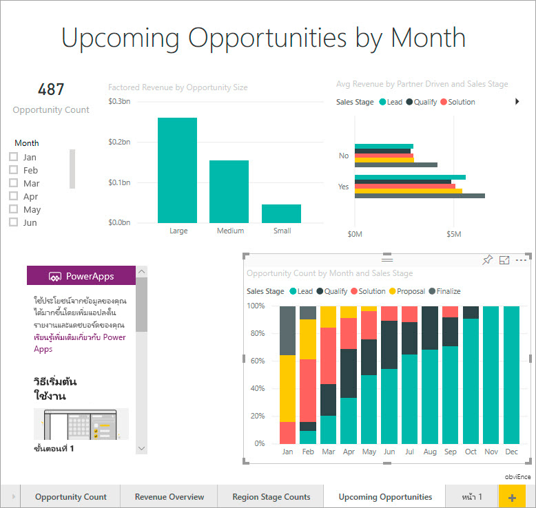

2. จากแผงการแสดงผลด้วยภาพ เลือกไอคอน Power Apps แล้วรปับขนาดวิชวลให้พอดีกับช่องว่างที่คุณสร้างFrom the Visualizations pane, select the Power Apps icon, then resize the visual to fit the space you made.

    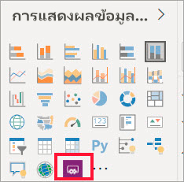

3. ในบานหน้าต่าง **เขตข้อมูล** ให้เลือก **ชื่อ** **รหัสผลิตภัณฑ์** และ **ขั้นตอนการขาย**In the **Fields** pane, select **Name**, **Product Code**, and **Sales Stage**. 

    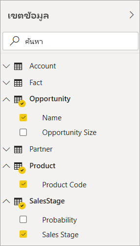

4. ในวิชวล Power Apps เลือกสภาพแวดล้อม Power Apps ที่คุณต้องการสร้างแอป จากนั้นเลือก **สร้างขึ้นใหม่**.On the Power Apps visual, select the Power Apps environment where you want to create the app, then select **Create new**.

    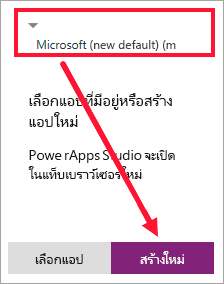

    ใน Power Apps Studio  คุณจะพบแอปเบื้องต้นที่สร้างไว้แล้ว ที่ *แกลเลอรี* ที่จะแสดงหนึ่งในเขตข้อมูลที่คุณเลือกใน Power BI.In Power Apps Studio, you see that a basic app is created, with a *gallery* that shows one of the fields you selected in Power BI.

    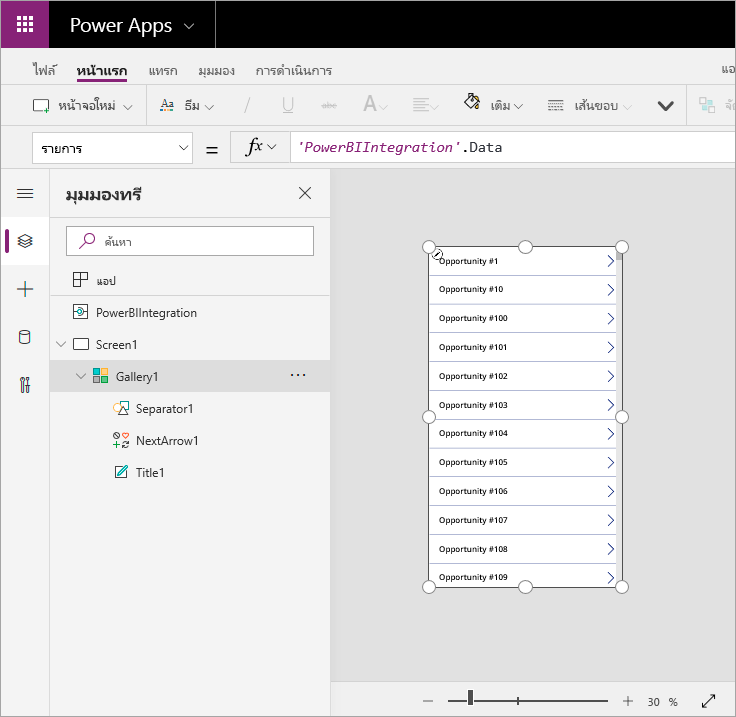

5.  ปรับขนาดแกลเลอรีเพื่อให้ใช้พื้นที่เพียงครึ่งหนึ่งของหน้าจอResize the gallery so it takes up only half of the screen. 

6. ในแผงด้านซ้าย เลือก **หน้าจอ1** จากนั้นตั้งค่าคุณสมบัติ **การเพิ่ม** ของหน้าจอเป็น "แสงสีฟ้า" (ดังที่แสดงขึ้นในรายงาน)In the left pane, select **Screen1**, then set the screen's **Fill** property to "LightBlue" (so it shows up better in the report).

    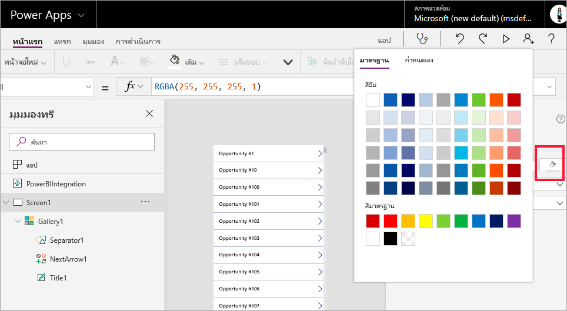

6. สร้างบางพื้นที่ว่างสำหรับการควบคุมป้ายMake some room for a label control. 

    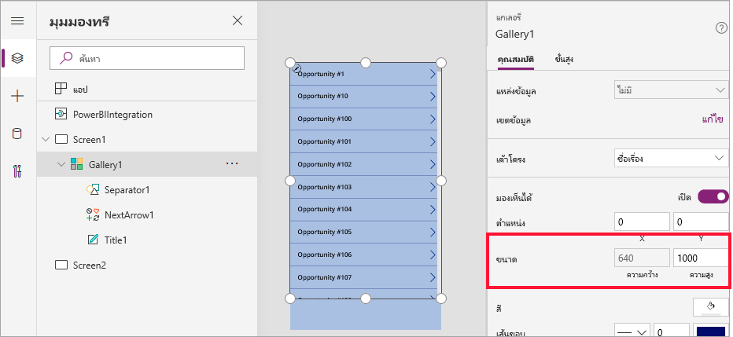

8. ใต้ **แกลเลอรี** ให้แทรกการควบคุมป้ายข้อความUnder **gallery**, insert a text label control.

   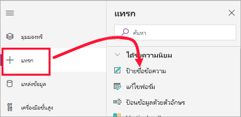

7. ลากป้ายไปยังด้านล่างของวิชวลของคุณDrag the label to the bottom of your visual. Set the **Text** property to `"Opportunity Count: " & CountRows(Gallery1.AllItems)`.Set the **Text** property to `"Opportunity Count: " & CountRows(Gallery1.AllItems)`. ในตอนนี้ จะแสดงจำนวนโอกาสทั้งหมดในชุดข้อมูลIt now shows the total number of opportunities in the data set.

    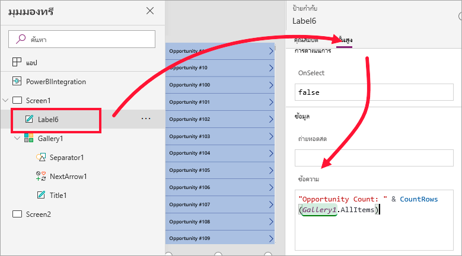

    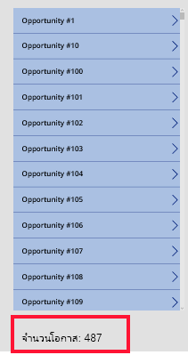

7. บันทึกแอปด้วยชื่อของ "แอปโอกาสทางการขาย"Save the app with the name "Opportunities app". 

    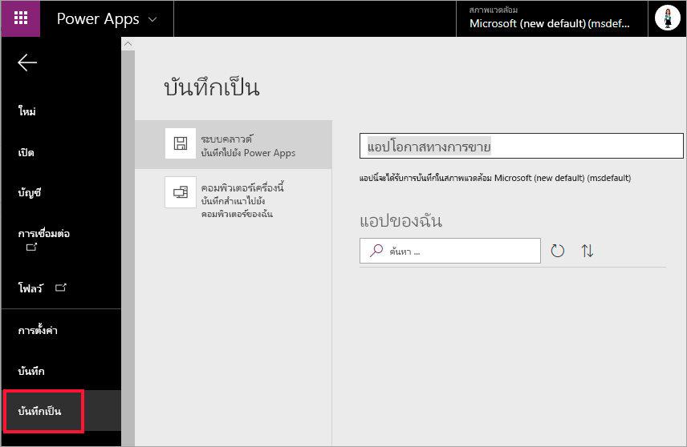

## ดูแอปในรายงานView the app in the report
แอปสามารถใช้งานได้แล้วในรายงาน Power BI และสามารถโต้ตอบกับวิชวลอื่นๆ เพราะว่าสามารถแชร์แหล่งข้อมูลเดียวกันได้The app is now available in the Power BI report, and it interacts with other visuals because it shares the same data source.

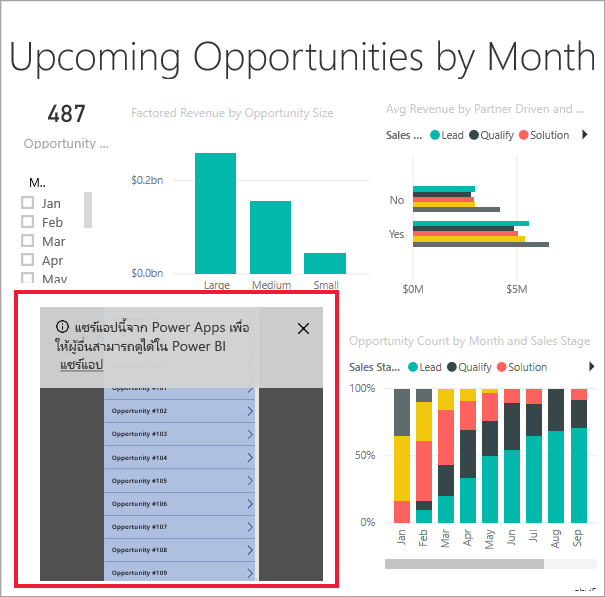

ในรายงาน Power BI ให้เลือก **ม.ค.** ในตัวแบ่งส่วนข้อมูล ซึ่งจะกรองทั้งหมด รวมถึงข้อมูลในแอปIn the Power BI report, select **Jan** in the slicer, which filters the whole report, including the data in the app.

โปรดสังเกตว่าจำนวนโอกาสในแอปจะตรงกับจำนวนที่มุมซ้ายบนของรายงานNotice that the opportunity count in the app matches the count in the upper left of the report. คุณสามารถเลือกรายการอื่นๆ ในรายงาน และข้อมูลในแอปจะอัปเดตYou can select other items in the report, and the data in the app updates.

## ล้างแหล่งข้อมูลClean up resources
ถ้าคุณไม่ต้องการใช้ตัวอย่างการวิเคราะห์โอกาสทางการขายอีกต่อไป คุณสามารถลบแดชบอร์ด รายงาน และชุดข้อมูลได้If you don't want to use the Opportunity Analysis Sample anymore, you can delete the dashboard, report, and dataset.

## ข้อจำกัดและข้อควรพิจารณาLimitations and considerations
สำหรับข้อมูลการแก้ไขปัญหา โปรดดูที่ [วิชวล Power Apps สำหรับ Power BI](/powerapps/maker/canvas-apps/powerapps-custom-visual#limitations-of-the-power-apps-visual)For troubleshooting information, see [Power Apps visual for Power BI](/powerapps/maker/canvas-apps/powerapps-custom-visual#limitations-of-the-power-apps-visual)

## ขั้นตอนถัดไปNext steps
[วิชวลการถามตอบ](power-bi-visualization-types-for-reports-and-q-and-a.md)  [Q&A visual](power-bi-visualization-types-for-reports-and-q-and-a.md)    
[บทช่วยสอน: ฝังวิชวล Power Apps ในรายงาน Power BITutorial: Embed a Power Apps visual in a Power BI report](/powerapps/maker/canvas-apps/powerapps-custom-visual)