# สร้างวิชวลถามตอบใน Power BICreate a Q&A visual in Power BI

[!INCLUDE[consumer-appliesto-nyyn](../includes/consumer-appliesto-nyyn.md)]    

วิชวลถามตอบช่วยให้ผู้ใช้สามารถถามคำถามที่เป็นภาษาธรรมชาติและรับคำตอบในรูปแบบของวิชวลได้The Q&A visual allows users to ask natural language questions and get answers in the form of a visual. *ผู้บริโภค* สามารถใช้วิชวลถามตอบเพื่อหาคำตอบสำหรับข้อมูลของตนเองได้อย่างรวดเร็ว*Consumers* can use it to quickly get answers to their data. *นักออกแบบ* ยังสามารถใช้วิชวลถามตอบเพื่อสร้างวิชวลได้อย่างรวดเร็ว*Designers* can also use it to create visuals quickly. หากคุณเป็นนักออกแบบรายงาน บทความนี้เหมาะสำหรับคุณIf you're a report designer, this article is for you. คุณสามารถดับเบิลคลิกที่ใดก็ได้ในรายงาน และใช้ภาษาธรรมชาติเพื่อเริ่มต้นYou can double-click anywhere on a report and use natural language to get started. ในบทความนี้ คุณจะได้สร้าง จัดรูปแบบ และปรับแต่งวิชวลถามตอบIn this article, you create, format, and customize a Q&A visual. วิชวลถามตอบยังสนับสนุนธีมและตัวเลือกการจัดรูปแบบเริ่มต้นอื่น ๆ ที่พร้อมใช้งานภายใน Power BIIt supports themes and other default formatting options available inside Power BI. หลังจากที่คุณสร้างแล้ว วิชวลถามตอบนี้จะทำงานเหมือนกับวิชวลอื่น ๆ โดยการสนับสนุนการกรองข้าม การไฮไลต์ข้าม และบุ๊กมาร์กAfter you create it, it behaves like any other visual, supporting cross-filtering, cross-highlighting, and bookmarks. 

กำลังมองหาพื้นหลังเพิ่มเติมเกี่ยวกับถามตอบใน Power BI ใช่หรือไม่Looking for more background about Q&A in Power BI? ดู[บทนำการถามตอบ](../natural-language/q-and-a-intro.md)Check out [Introduction to Q&A](../natural-language/q-and-a-intro.md). 

[!INCLUDE [power-bi-visuals-desktop-banner](../includes/power-bi-visuals-desktop-banner.md)]

วิชวลถามตอบประกอบด้วยสี่องค์ประกอบหลัก:The Q&A visual consists of four core components:

- กล่องคำถามThe question box. กล่องนี้เป็นตำแหน่งที่ผู้ใช้สามารถพิมพ์คำถามของตน และจะแสดงคำแนะนำเพื่อช่วยตอบคำถามของพวกเขาThis is where users type in their question and are shown suggestions to help them complete their question.
- รายการของคำถามที่แนะนำที่มีการเติมข้อมูลไว้ล่วงหน้าA pre-populated list of suggested questions.
- ไอคอนเพื่อแปลงวิชวลถามตอบเป็นวิชวลมาตรฐานIcon to convert the Q&A visual into a standard visual. 
- ไอคอนเพื่อเปิดการใช้เครื่องมือถามตอบ ซึ่งช่วยให้ผู้ออกแบบสามารถกำหนดค่ากลไกจัดการภาษาธรรมชาติเบื้องต้นได้Icon to open Q&A tooling, which allows designers to configure the underlying natural language engine.

## สิ่งที่จำเป็นต้องมีPrerequisites

1. ดาวน์โหลด [ไฟล์ PBIX ตัวอย่างการขายและการตลาด](https://download.microsoft.com/download/9/7/6/9767913A-29DB-40CF-8944-9AC2BC940C53/Sales%20and%20Marketing%20Sample%20PBIX.pbix) เพื่อทำตามDownload [Sales & Marketing sample PBIX file](https://download.microsoft.com/download/9/7/6/9767913A-29DB-40CF-8944-9AC2BC940C53/Sales%20and%20Marketing%20Sample%20PBIX.pbix) to follow along.

1. ในส่วนซ้ายบนของ Power BI Desktop ให้เลือก **ไฟล์** > **เปิด**In the upper left section of the Power BI Desktop, select **File** > **Open**.
   
2. ค้นหาสำเนาของ **ไฟล์ PBIX ตัวอย่างการขายและการตลาด**Find your copy of the **Sales & Marketing sample PBIX file**.

1. เปิดไฟล์ในมุมมองรายงานOpen the file in report view ..

1. เลือกเครื่องหมายบวกSelect the plus sign  หากต้องการเพิ่มหน้าใหม่to add a new page.

หากคุณเห็นข้อผิดพลาดขณะที่สร้างวิชวลถามตอบ คุณต้องตรวจสอบบทความ [ข้อจำกัดการถามตอบ](../natural-language/q-and-a-limitations.md) เพื่อดูว่ามีการรองรับการกำหนดค่าแหล่งข้อมูลหรือไม่If you see an error when creating a Q&A visual, be sure to check the [Q&A limitations](../natural-language/q-and-a-limitations.md) article to see if the data source configuration is supported.    

> [!NOTE]
> คุณจำเป็นต้องมีสิทธิ์การใช้งาน Power BI Pro แต่ละรายการหรือคุณต้องบันทึกรายงานในพื้นที่ทำงานที่มีความจุแบบพรีเมียมเพื่อแชร์รายงานของคุณกับผู้ร่วมงาน Power BISharing your report with a Power BI colleague requires that either you both have individual Power BI Pro licenses or you save the report in a Premium capacity workspace. ดู [การแชร์รายงาน](../collaborate-share/service-share-dashboards.md)See [sharing reports](../collaborate-share/service-share-dashboards.md).

## สร้างวิชวลถามตอบโดยใช้คำถามที่แนะนำCreate a Q&A visual using a suggested question
ในแบบฝึกหัดนี้ เราจะเลือกหนึ่งในคำถามที่แนะนำเพื่อสร้างวิชวลถามตอบIn this exercise, we'll select one of the suggested questions to create our Q&A visual. 

1. เริ่มต้นบนหน้ารายงานที่ว่างเปล่าและเลือกไอคอนวิชวลถามตอบจากบานหน้าต่างการแสดงภาพStart on a blank report page and select the Q&A visual icon from the Visualizations pane.

    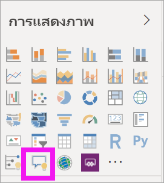

2. ลากเส้นขอบเพื่อปรับขนาดวิชวลDrag the border to resize the visual.

    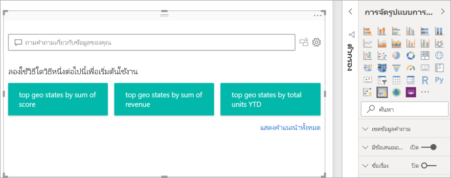

3. หากต้องการสร้างวิชวล เลือกหนึ่งในคำถามที่แนะนำหรือเริ่มพิมพ์ลงในกล่องคำถามTo create the visual, select one of the suggested questions or start typing in the question box. ในตัวอย่างนี้ เราได้เลือก **รัฐทางภูมิศาสตร์ตามผลรวมของรายได้**.In this example, we've selected **top geo states by sum of revenue**. Power BI เหมาะที่สุดในการเลือกชนิดของวิชวลที่จะใช้Power BI does its best to select which visual type to use. ในกรณีนี้ คือแผนที่In this case, it's a map.

    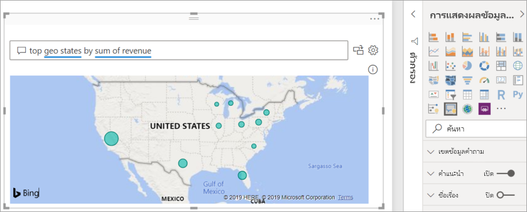

    แต่คุณสามารถบอก Power BI ว่าจะใช้วิชวลชนิดใดโดยการเพิ่มลงในคิวรีภาษาธรรมชาติของคุณBut you can tell Power BI which visual type to use by adding it to your natural language query. โปรดทราบว่าไม่ใช่วิชวลทุกชนิดที่จะทำงานหรือเข้ากับข้อมูลของคุณKeep in mind that not all visual types will work or make sense with your data. ตัวอย่างเช่น ข้อมูลนี้จะไม่สร้างแผนภูมิแบบกระจายที่มีความหมายFor example, this data wouldn't produce a meaningful scatter chart. แต่จะใช้เป็นแผนที่แบบเติมBut it works as a filled map.

    

## สร้างวิชวลถามตอบโดยใช้คิวรีภาษาธรรมชาติCreate a Q&A visual using a natural language query
ในตัวอย่างข้างต้น เราได้เลือกหนึ่งในคำถามที่แนะนำเพื่อสร้างวิชวลถามตอบIn the example above, we selected one of the suggested questions to create our Q&A visual.  ในแบบฝึกหัดนี้ เราจะพิมพ์คำถามของเราเองIn this exercise, we'll type our own question. ในขณะที่เราพิมพ์คำถามของเรา Power BI จะช่วยเราด้วยการกรอกข้อมูลอัตโนมัติ การให้คำแนะนำ และคำติชมAs we type our question, Power BI helps us with autocomplete, suggestion, and feedback.

ถ้าคุณไม่แน่ใจว่าคำถามประเภทใดที่ต้องถามหรือคำศัพท์ที่ต้องใช้ ให้ขยาย **แสดงคำแนะนำทั้งหมด** หรือค้นหาในบานหน้าต่างเขตข้อมูลทางด้านขวาของพื้นที่ทำงานIf you're unsure what type of questions to ask or terminology to use, expand **Show all suggestions** or look through the Fields pane along the right side of the canvas. บานหน้าต่างเขตข้อมูลนี้จะทำให้คุณคุ้นเคยกับศัพท์และเนื้อหาของชุดข้อมูลการขายและการตลาดThe Fields pane will get you familiar with the terms and content of the Sales & Marketing dataset.

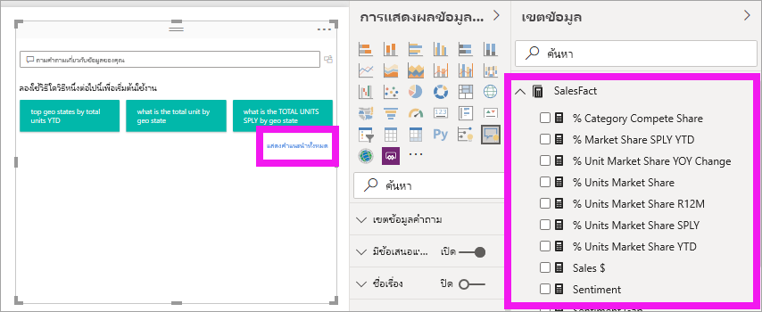

1. พิมพ์คำถามในเขตข้อมูลถามตอบType a question in the Q&A field. Power BI เพิ่มขีดเส้นใต้สีแดงเป็นคำที่ไม่รู้จักPower BI adds a red underline to words it does not recognize. เมื่อใดก็ตามที่เป็นไปได้ Power BI จะช่วยกำหนดคำที่ไม่รู้จักWhenever possible, Power BI helps define unrecognized words.  ในตัวอย่างแรกด้านล่าง ให้เลือกคำแนะนำใดก็ตามที่จะใช้ได้กับเราIn the first example below, selecting either of the suggestions will work for us.  

    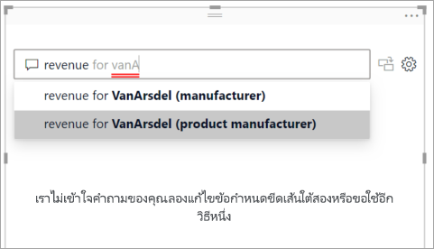

2. ในขณะที่เราพิมพ์คำถามเพิ่มเติม Power BI ช่วยให้เราทราบว่าระบบไม่เข้าใจคำถามและพยายามช่วยเหลือAs we type more of the question, Power BI lets us know that it doesn't understand the question, and tries to help. ในตัวอย่างด้านล่าง Power BI จะถามเราว่า "คุณหมายถึง ..." และแสดงให้เห็นวิธีการที่แตกต่างกันในการตั้งคำถามของเราโดยใช้ศัพท์จากชุดข้อมูลของเราIn the example below, Power BI asks us "Did you mean..." and suggests a different way to word our question using terminology from our dataset. 

    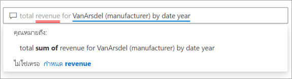

5. ด้วยความช่วยเหลือของ Power BI เราสามารถตั้งคำถามด้วยศัพท์ที่เป็นที่รู้จักทั้งหมดได้With Power BI's help, we were able to ask a question with all recognizable terms. Power BI จะแสดงผลลัพธ์เป็นแผนภูมิเส้นPower BI displays the results as a line chart. 

    

6. ลองเปลี่ยนวิชวลเป็นแผนภูมิคอลัมน์Let's change the visual to a column chart. 

    

7.  เพิ่มวิชวลเพิ่มเติมในหน้ารายงานและดูว่าวิชวลถามตอบ (Q&A) โต้ตอบกับวิชวลอื่น ๆ ในหน้าได้อย่างไรAdd more visuals to the report page and see how the Q&A visual interacts with the other visuals on the page. ในตัวอย่างนี้ วิชวลถามตอบ (Q&A) ได้กรองแผนภูมิเส้นแบบกรองข้าม และแมปและไฮไลท์ข้ามแผนภูมิแท่งIn this example, the Q&A visual has cross-filtered the line chart and map and cross-highlighted the bar chart.

    

## จัดรูปแบบและปรับแต่งวิชวลถามตอบFormat and customize the Q&A visual
วิชวลถามตอบสามารถปรับแต่งได้โดยใช้บานหน้าต่างการจัดรูปแบบและโดยการใช้ธีมThe Q&A visual can be customized using the formatting pane, and by applying a theme. 

### นำธีมไปใช้Apply a theme
เมื่อคุณเลือกธีม ธีมดังกล่าวจะถูกนำไปใช้กับหน้ารายงานทั้งหมดWhen you select a theme, that theme is applied to the entire report page. มีธีมมากมายให้เลือก ลองใช้จนกว่าคุณจะได้รูปลักษณ์ที่คุณต้องการThere are many themes to choose from, so try them out until you get the look you desire. 

1. ในแถบเมนู ให้เลือกแท็บ **หน้าแรก** และเลือก **สลับธีม**.In the menu bar, select the **Home** tab and choose **Switch theme**. 

    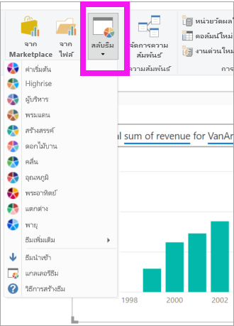

    
    
2. ในตัวอย่างนี้ เราได้เลือก **ธีมเพิ่มเติม** > **ปลอดภัยสำหรับคนตาบอดสี**In this example, we've selected **More themes** > **Color blind safe**.

    

### จัดรูปแบบวิชวลถามตอบFormat the Q&A visual
จัดรูปแบบวิชวลถามตอบ เขตข้อมูลคำถาม และวิธีการแสดงคำแนะนำFormat the Q&A visual, the question field, and the way suggestions are displayed. คุณสามารถเปลี่ยนทุกอย่างจากพื้นหลังของชื่อเรื่องให้เป็นสีโฮเวอร์สำหรับคำที่ไม่รู้จักYou can change everything from the background of a title to the hover color for unrecognized words. ต่อไปนี้เราได้เพิ่มพื้นหลังสีเทาลงในกล่องคำถามและเปลี่ยนเส้นใต้เป็นสีเหลืองและสีเขียวHere we've added a grey background to the question box and changed the underlines to yellow and green. ชื่อเรื่องอยู่กึ่งกลางและมีพื้นหลังสีเหลืองThe title is centered and has a yellow background. 

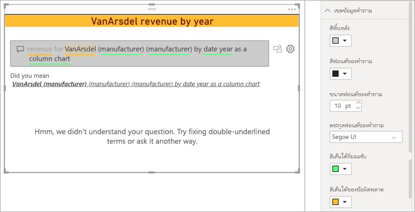

## แปลงวิชวลถามตอบเป็นวิชวลมาตรฐานConvert your Q&A visual into a standard visual
เราได้จัดรูปแบบวิชวลของแผนภูมิคอลัมน์ที่ปลอดภัยสำหรับคนตาบอดสีแล้วเล็กน้อย: เราเพิ่มชื่อเรื่องและเส้นขอบแล้วWe've formatted our color blind safe column chart visual a bit: We added a title and a border. ในตอนนี้ เราพร้อมที่จะแปลงเป็นวิชวลมาตรฐานในรายงานของเราและยังมีการปักหมุดไปยังแดชบอร์ดด้วยNow we're ready to convert it to a standard visual in our report and also pin it to a dashboard.

เลือกไอคอน เพื่อ **เปลี่ยนผลการถามตอบนี้เป็นวิชวลมาตรฐาน**Select the icon  to **Turn this Q&A result into a standard visual**.

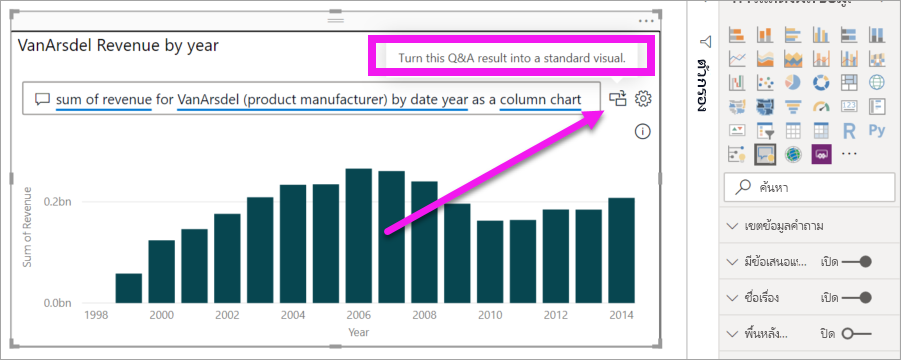

วิชวลนี้ไม่ใช่วิชวลถามตอบอีกต่อไป แต่เป็นแผนภูมิคอลัมน์มาตรฐานThis visual is no longer a Q&A visual but is a standard column chart. ซึ่งสามารถปักหมุดไปยังแดชบอร์ดIt can be pinned to a dashboard. ในรายงาน วิชวลนี้จะทำงานเหมือนกับวิชวลมาตรฐานอื่นๆIn the report, this visual behaves the same as other standard visuals. โปรดทราบว่าบานหน้าต่างการแสดงภาพจะแสดงไอคอนแผนภูมิคอลัมน์ที่เลือกไว้แทนไอคอนวิชวลถามตอบNotice that the Visualizations pane shows a Column chart icon selected instead of the Q&A visual icon.

ถ้าคุณกำลังใช้\**_บริการของ Power BI_* _ คุณสามารถปักหมุดวิชวลไปยังแดชบอร์ดโดยการเลือกไอคอนปักหมุดได้ในขณะนี้If you're using the \**_Power BI Service_* _, you can now pin the visual to a dashboard by selecting the pin icon. 

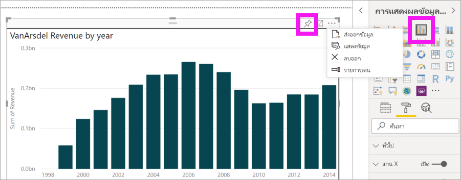

## คุณลักษณะขั้นสูงของวิชวลถามตอบAdvanced features of the Q&A visual
การเลือกไอคอนรูปเฟืองจะเปิดบานหน้าต่างเครื่องมือวิชวลถามตอบSelecting the cog icon opens the Q&A visual Tooling pane. 

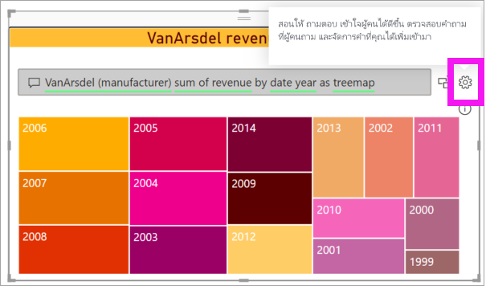

ใช้บานหน้าต่างเครื่องมือเพื่อสอนศัพท์ถามตอบที่เครื่องมือไม่รู้จัก จัดการกับศัพท์เหล่านั้น และจัดการคำถามที่แนะนำสำหรับชุดข้อมูลและรายงานนี้Use the Tooling pane to teach Q&A terms it doesn't recognize, to manage those terms, and to manage the suggested questions for this dataset and report. ในบานหน้าต่างการใช้เครื่องมือ คุณยังสามารถตรวจสอบคำถามที่ผู้ใช้ถามไว้ในวิชวลถามตอบนี้ และดูคำถามต่าง ๆ ที่ผู้ใช้ตั้งค่าสถานะไว้In the Tooling pane, you can also review questions that users have asked in this Q&A visual and see questions that users have flagged. หากต้องการเรียนรู้เพิ่มเติม ให้ดูข้อมูลที่ [บทนำการใช้เครื่องมือถามตอบเพื่อฝึกฝนการถามตอบ Power BI](../natural-language/q-and-a-tooling-intro.md)To learn more, see [Intro to Q&A tooling to train Power BI Q&A](../natural-language/q-and-a-tooling-intro.md).

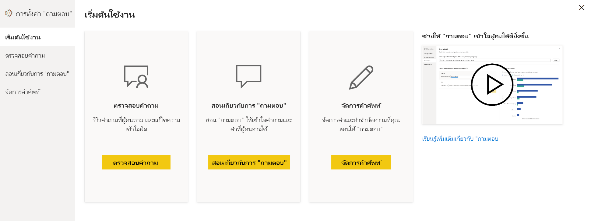

## ข้อควรพิจารณาและการแก้ไขปัญหาConsiderations and troubleshooting
วิชวลถามตอบจะทำงานร่วมกับ Office และ Bing เพื่อพยายามจับคู่คำทั่วไปที่ไม่รู้จักกับเขตข้อมูลในชุดข้อมูลของคุณThe Q&A visual integrates with Office and Bing to attempt to match unrecognized common words with fields in your dataset.  

## ขั้นตอนถัดไปNext steps

มีหลายวิธีการที่คุณสามารถรวมภาษาธรรมชาติได้There are several ways you can integrate natural language. สำหรับข้อมูลเพิ่มเติม ให้ดูบทความต่อไปนี้:For more information, see the following articles:

_ [เครื่องมือถามตอบ](../natural-language/q-and-a-tooling-intro.md)_ [Q&A Tooling](../natural-language/q-and-a-tooling-intro.md)
* [แนวทางปฏิบัติที่ดีที่สุดของการถามตอบQ&A Best Practices](../natural-language/q-and-a-best-practices.md)
