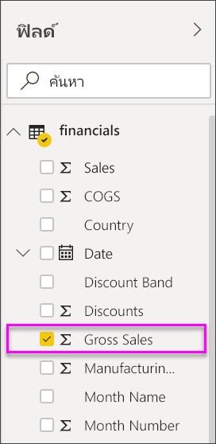
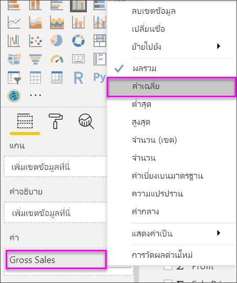
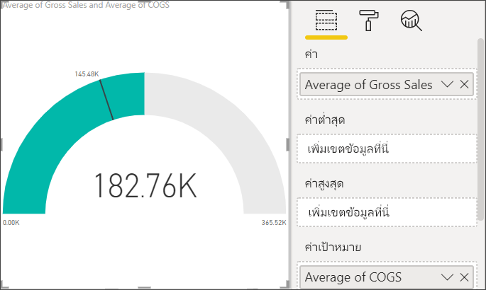
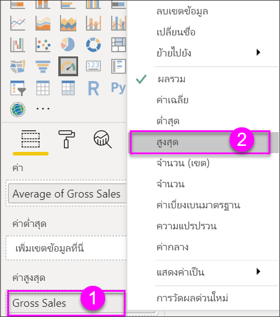
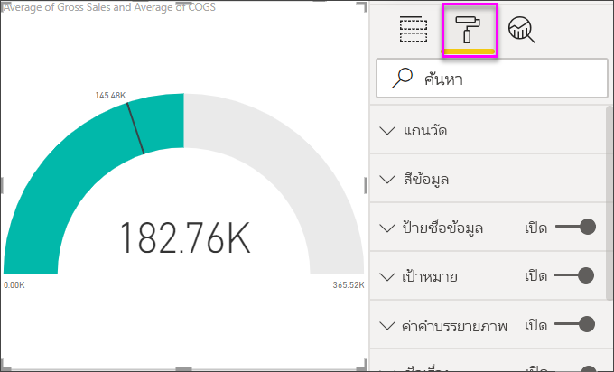
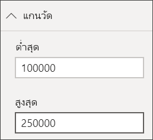
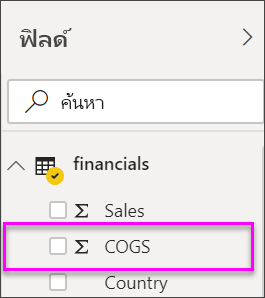
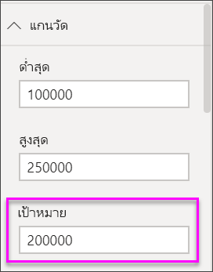
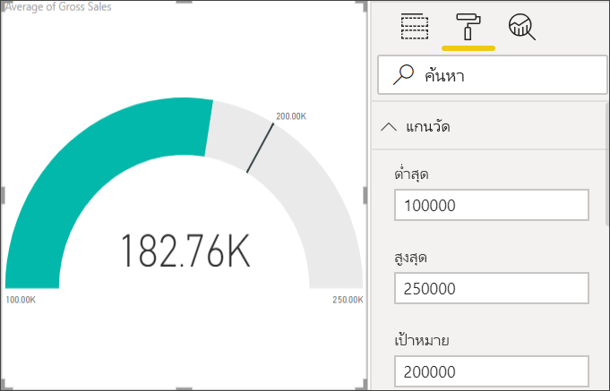

# แผนภูมิหน้าปัดความเร็วใน Power BIRadial gauge charts in Power BI

[!INCLUDE[consumer-appliesto-nyyn](../includes/consumer-appliesto-nyyn.md)]

[!INCLUDE [power-bi-visuals-desktop-banner](../includes/power-bi-visuals-desktop-banner.md)]

แผนภูมิหน้าปัดความเร็วมีโค้งวงกลมและแสดงเป็นค่าเดียวที่วัดความคืบหน้าตามเพื่อไปสู่เป้าหมาย Key Performance Indicator (KPI)A radial gauge chart has a circular arc and shows a single value that measures progress toward a goal or a Key Performance Indicator (KPI). เส้น (หรือ *เข็ม*) แทนค่าเป้าหมายหรือปลายทางThe line (or *needle*) represents the goal or target value. การแรเงาแทนด้วยความคืบหน้าสู่เป้าหมายThe shading represents the progress toward that goal. ค่าภายในส่วนโค้งแทนค่าความคืบหน้าThe The value inside the arc represents the progress value. Power BI แพร่ค่าที่เป็นไปได้ทั้งหมดจะกระจายเท่าๆ กันตามส่วนโค้ง จากค่าต่ำสุด (ค่าซ้ายสุด) ไปสู่ค่าสูงสุด (ค่าขวาสุด)Power BI spreads all possible values evenly along the arc, from the minimum (left-most value) to the maximum (right-most value).

ในตัวอย่างนี้ เรามีผู้ค้าปลีกรถยนต์ที่กำลังติดตามการขายเฉลี่ยของทีมขายต่อเดือนIn this example, you're a car retailer tracking the sales team's average sales per month. เข็มแสดงเป้าหมายทางการขายรถยนต์ให้ได้ 140 คันThe needle represents a 140 cars sales goal. การขายเฉลี่ยที่เป็นไปได้น้อยที่สุดคือ 0 และสูงสุดเป็น 200 คันThe minimum possible average sales is 0 and the maximum is 200.  การแรเงาสีน้ำเงินแสดงว่า ตอนนี้เราประมาณการว่ามีการขาย 120 คันในเดือนนี้The blue shading shows that the team is averaging approximately 120 sales this month. โชคดี มีสัปดาห์อื่นยังที่สามารถไปถึงเป้าหมายได้Luckily, there's still another week to reach the goal.

> [!NOTE]
> การแชร์รายงานของคุณกับผู้ร่วมงาน Power BI กำหนดให้คุณต้องมีสิทธิ์การใช้งาน Power BI Pro แต่ละรายการ หรือรายงานจะถูกบันทึกในความจุแบบพรีเมียมSharing your report with a Power BI colleague requires that you both have individual Power BI Pro licenses or that the report is saved in Premium capacity.

## เมื่อต้องการใช้แผนภูมิหน้าปัดความเร็วWhen to use a radial gauge

แผนภูมิหน้าปัดความเร็วเป็นทางเลือกที่ดีสำหรับRadial gauges are a great choice to:

* แสดงความคืบหน้าเพื่อจะบรรลุเป้าหมายShow progress toward a goal.

* แสดงการวัดร้อยละ เช่น KPIRepresent a percentile measure, like a KPI.

* แสดงความสมบูรณ์ของการวัดเดี่ยวShow the health of a single measure.

* แสดงข้อมูลเพื่อที่คุณสามารถสแกนและทำความเข้าใจอย่างรวดเร็วDisplay information you can quickly scan and understand.

## ข้อกำหนดเบื้องต้นPrerequisites

บทช่วยสอนนี้ใช้[ไฟล์ Excel ตัวอย่างทางการเงิน](https://go.microsoft.com/fwlink/?LinkID=521962)This tutorial uses the [Financial sample Excel file](https://go.microsoft.com/fwlink/?LinkID=521962).

1. จากด้านบนซ้ายของแถบเมนู ให้เลือก **รับข้อมูล** > **Excel**From the upper left section of the menubar, select **Get Data** > **Excel**
   
2. ค้นหาสำเนา **ไฟล์ Excel ตัวอย่างด้านการเงินของคุณ**Find your copy of the **Financial sample Excel file**

1. เปิด **ไฟล์ Excel ตัวอย่างด้านการเงิน** ในมุมมองรายงานOpen the **Financial sample Excel file** in report view .

1. เลือก **การเงิน** และ **Sheet1**Select **financials** and **Sheet1**

1. คลิก **โหลด**Click **Load**

1. เลือกSelect  หากต้องการเพิ่มหน้าใหม่to add a new page.

## สร้างแผนภูมิหน้าปัดความเร็วแบบพื้นฐานCreate a basic radial gauge

### ขั้นตอนที่ 1: สร้างตัววัดแบบหน้าปัดความเร็วเพื่อติดตามยอดขายรวมStep 1: Create a gauge to track Gross Sales

1. เริ่มต้นบน หน้ารายงานเปล่าStart on a blank report page

1. ในบานหน้าต่างของ **เขตข้อมูล** ให้เลือก **ยอดขายรวม**From the **Fields** pane, select **Gross Sales**.

   

1. เปลี่ยนการรวมข้อมูลเป็น **หาค่าเฉลี่ย**Change the aggregation to **Average**.

   

1. เลือกไอคอนตัววัดSelect the gauge icon  การแปลงแผนภูมิคอลัมน์ให้เป็นแผนภูมิตัววัดto convert the column chart to a gauge chart.

    

    ขึ้นอยู่กับเมื่อคุณดาวน์โหลดไฟล์ **ตัวอย่างการเงิน** คุณอาจเห็นตัวเลขที่ไม่ตรงกับตัวเลขเหล่านี้ได้Depending on when you download the **Financial Sample** file, you may see numbers that don't match these numbers.

    > [!TIP]
    > ตามค่าเริ่มต้น Power BI สร้างแผนภูมหน้าปัดความเร็วที่คาดการณ์ตามค่าปัจจุบัน (ในกรณีนี้คือ **ค่าเฉลี่ยของผลรวมขาย**) จะถือว่าเป็นจุดกลิ่งกลางของหน้าปัดBy default, Power BI creates a gauge chart where it assumes the current value (in this case, **Average of Gross Sales**) is at the halfway point on the gauge. เนื่องจากค่า **ยอดขายรวมค่าเฉลี่ย** คือ $182.76K ค่าเริ่มต้น (ต่ำสุด) ถูกตั้งค่าเป็น 0 และค่าสิ้นสุด (สูงสุด) ถูกตั้งค่าเป็นคู่ค่าปัจจุบันSince the **Average of Gross Sales** value is $182.76K, the start value (Minimum) is set to 0 and the end value (Maximum) is set to double the current value.

### ขั้นตอนที่ 3: ตั้งค่าเป้าหมายStep 3: Set a target value

1. ลาก **COGS** จากบานหน้าต่าง **เขตข้อมูล** เพื่อตั้ง **ค่าเป้าหมาย** ที่ดีDrag **COGS** from the **Fields** pane to the **Target value** well.

1. เปลี่ยนการรวมข้อมูลเป็น **หาค่าเฉลี่ย**Change the aggregation to **Average**.

   Power BI เพิ่มเข็มเพื่อแสดงค่าเป้าหมาย **$145.48K** ของเราPower BI adds a needle to represent our target value of **$145.48K**.

   

    โปรดสังเกตว่าเราได้เกินเป้าหมายของเราแล้วNotice that we've exceeded our target.

   > [!NOTE]
   > คุณสามารถใส่ค่าเป้าหมายด้วยตนเองYou can also manually enter a target value. ดู [ใช้ตัวเลือกของการจัดรูปแบบเพื่อตั้งค่าต่ำสุด สูงสุด และส่วนของค่าเป้าหมาย](#use-manual-format-options-to-set-minimum-maximum-and-target-values)See the [Use manual format options to set Minimum, Maximum, and Target values](#use-manual-format-options-to-set-minimum-maximum-and-target-values) section.

### ขั้นตอนที่ 4: ตั้งค่าสูงสุดStep 4: Set a maximum value

ในขั้นตอนที่ 2 Power BI ให้ใช้เขตข้อมูลที่ตั้ง **ค่า** ต่ำสุด(เริ่มต้น) และค่าสูงสุด(สิ้นสุด)โดยอัตโนมัติIn Step 2, Power BI used the **Value** field to automatically set minimum and maximum values. จะเกิดอะไรขึ้นถ้าคุณต้องการตั้งค่าสูงสุดของคุณเองWhat if you want to set your own maximum value? สมมติว่าแทนที่จะใช้่ค่าปัจจุบันคุณสองเป็นค่าที่เป็นไปได้สูงสุด คุณต้องการตั้งค่าเป็นตัวเลขยอดขายรวมสูงสุดในชุดข้อมูลของคุณหรือไม่Let's say that, instead of using double the current value as the maximum possible value, you want to set it to the highest Gross Sales number in your dataset.

1. ลาก **ยอดขายรวม** จากหน้าต่าง **เขตข้อมูล** ไปยัง **ค่าสูงสุด**Drag **Gross Sales** from the **Fields** pane to the **Maximum value** well.

1. เปลี่ยนการรวมข้อมูลเป็น **หาค่าสูงสุด**Change the aggregation to **Maximum**.

   

   รูปฟน้าปัดวัดถูกวาดอีกครั้ง ด้วยค่าสุดท้ายใหม่ คือ 1.21 ล้านของยอดขายรวมThe gauge is redrawn with a new end value, 1.21 million in gross sales.

   

### ขั้นตอนที่ 5: บันทึกรายงานของคุณStep 5: Save your report

1. [บันทึกรายงาน](../create-reports/service-report-save.md)[Save the report](../create-reports/service-report-save.md).

## ใช้ตัวเลือกของการจัดรูปแบบเพื่อตั้งค่าต่ำสุด สูงสุด และค่าเป้าหมายUse manual format options to set Minimum, Maximum, and Target values

1. ลาก **ยอดขายรวมมากที่สุด** จาก **ค่าสูงสุด**Remove **Max of Gross Sales** from the **Maximum value** well.

1. เลือกไอคอนแปรงลูกกลิ้งเพื่อเปิดแถบ **จัดรูปร่าง**Select the paint roller icon to open the **Format** pane.

   

1. ขยาย **แกนตัววัด** และใส่ค่า **ต่ำสุด** และ **สูงสุด**Expand **Gauge axis** and enter values for **Min** and **Max**.

    

1. ล้างตัวเลือก **COGS** ในบานหน้าต่าง **เขตข้อมูล** เพื่อนำค่าเป้าหมายออกClear the **COGS** option in the **Fields** pane to remove the target value.

    

1. เมื่อเขตข้อมูล **เป้าหมาย** ปรากฏภายใต้ **แกนตัววัด** ให้ใส่ค่าWhen the **Target** field appears under **Gauge axis**, enter a value.

     

1. จัดรูปแบบแผนภูมหน้าปัดต่อไป ก็สามารถทำได้Optionally, continue formatting your gauge chart.

เมื่อคุณทำเสร็จแล้วทำตามขั้นตอนเหล่านี้ คุณจะมีแผนภูมิตัววัดที่มีลักษณะดังนี้:Once you're done with these steps, you'll have a gauge chart that looks something like this:

## ขั้นตอนถัดไปNext step

* [Key Performance Indicator (KPI) วิชวลKey Performance Indicator (KPI) visuals](power-bi-visualization-kpi.md)

* [ชนิดการแสดงภาพใน Power BIVisualization types in Power BI](power-bi-visualization-types-for-reports-and-q-and-a.md)

มีคำถามเพิ่มเติมหรือไม่More questions? [ลองไปที่ชุมชน Power BITry the Power BI Community](https://community.powerbi.com/)

