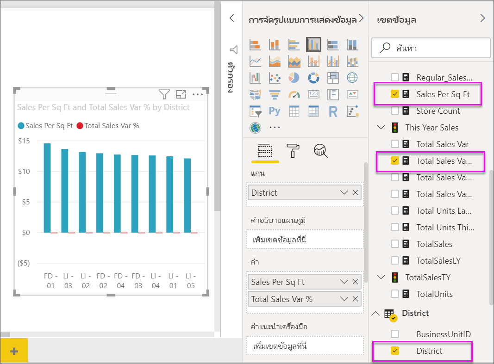
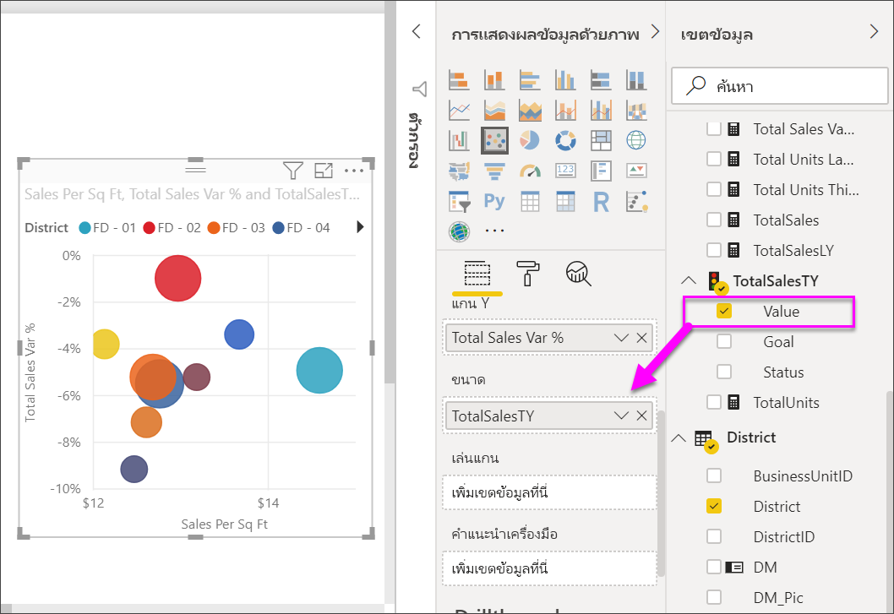
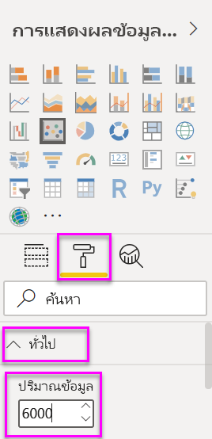
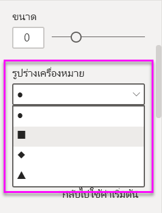
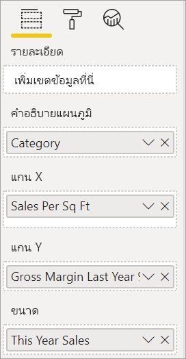
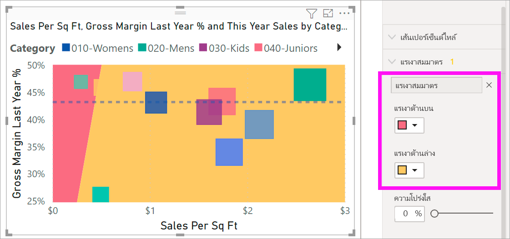
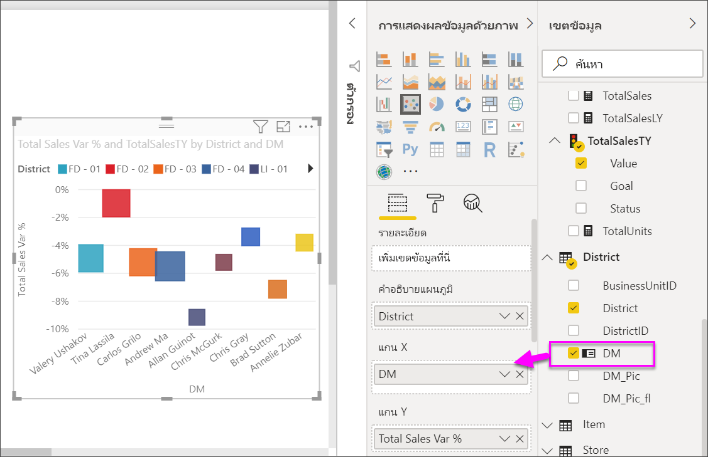
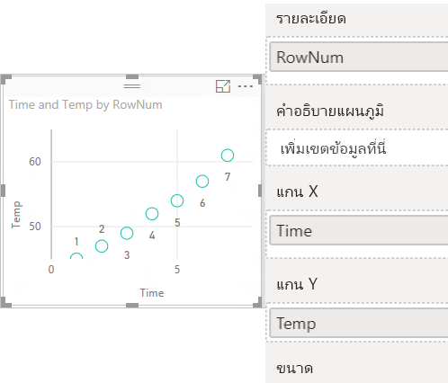
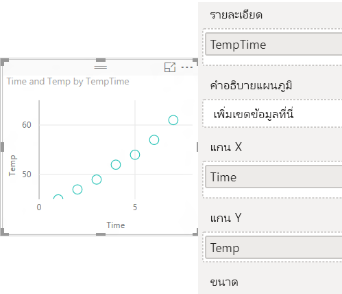

# แผนภูมิกระจาย แผนภูมิฟองอากาศ และแผนภูมิลงจุดใน Power BIScatter charts, bubble charts, and dot plot charts in Power BI

[!INCLUDE[consumer-appliesto-nyyn](../includes/consumer-appliesto-nyyn.md)]

[!INCLUDE [power-bi-visuals-desktop-banner](../includes/power-bi-visuals-desktop-banner.md)]

แผนภูมิกระจายจะมีแกนค่าสองแกนเสมอเพื่อแสดงข้อมูลตัวเลขหนึ่งชุดตามแกนแนวนอนและอีกชุดของค่าตัวเลขตามแกนแนวตั้งA scatter chart always has two value axes to show: one set of numerical data along a horizontal axis and another set of numerical values along a vertical axis. แผนภูมิแสดงจุดที่จุดตัดของค่าตัวเลข x และ y เพื่อรวมค่าเหล่านี้ลงในจุดข้อมูลเดียวThe chart displays points at the intersection of an x and y numerical value, combining these values into single data points. Power BI อาจกระจายจุดข้อมูลสม่ำเสมอกันหรืออาจไม่สม่ำเสมอกันตามแกนแนวนอนPower BI may distribute these data points evenly or unevenly across the horizontal axis. ขึ้นอยู่กับข้อมูลที่แสดงในแผนภูมิIt depends on the data the chart represents.

คุณสามารถตั้งค่าจำนวนของจุดข้อมูลได้สูงสุดถึง 10,000 จุดYou can set the number of data points, up to a maximum of 10,000.  

## เมื่อต้องใช้แผนภูมิกระจายหรือแผนภูมิฟองอากาศหรือแผนภูมิการลงจุดWhen to use a scatter chart, bubble chart, or a dot plot chart

### แผนภูมิกระจายและแผนภูมิฟองScatter and bubble charts

แผนภูมิกระจายแสดงความสัมพันธ์ระหว่างสองค่าตัวเลขA scatter chart shows the relationship between two numerical values. แผนภูมิฟองอากาศจะแทนที่จุดข้อมูลด้วยฟองอากาศ และ *ขนาด* ของฟองอากาศแสดงข้อมูลสามมิติเพิ่มเติมA bubble chart replaces data points with bubbles, with the bubble *size* representing an additional third data dimension.

แผนภูมิกระจายเป็นตัวเลือกที่ดีที่สุด:Scatter charts are a great choice:

* ในการแสดงความสัมพันธ์ระหว่างค่าตัวเลขสองค่าTo show relationships between two numerical values.

* ในการทำผังตัวเลขสองกลุ่มให้เป็นหนึ่งชุดข้อมูลของพิกัด X และ YTo plot two groups of numbers as one series of x and y coordinates.

* แทนที่จะใช้เป็นแผนภูมิเส้นเมื่อคุณต้องการเปลี่ยนมาตราส่วนของแกนแนวนอนTo use instead of a line chart when you want to change the scale of the horizontal axis.

* เมื่อต้องเปลี่ยนแกนแนวนอนเป็นมาตราส่วนลอการิทึมTo turn the horizontal axis into a logarithmic scale.

* เมื่อต้องการแสดงข้อมูลในแผ่นงานซึ่งรวมถึงชุดค่าที่เป็นคู่หรือเป็นกลุ่มTo display worksheet data that includes pairs or grouped sets of values.

    > [!TIP]
    > ในแผนภูมิกระจาย คุณสามารถปรับระดับอิสระของแกนเพื่อเผยให้เห็นข้อมูลเพิ่มเติมเกี่ยวกับค่าที่จัดกลุ่มได้In a scatter chart, you can adjust the independent scales of the axes to reveal more information about the grouped values.

* การแสดงรูปแบบสำหรับชุดข้อมูลจำนวนมากตัวอย่างเช่น โดยการแสดงแนวโน้มแบบเส้นตรง หรือที่ไม่ใช่เชิงเส้น แบบกลุ่ม และนอกขอบเขตTo show patterns in large sets of data, for example by showing linear or non-linear trends, clusters, and outliers.

* เพื่อเปรียบเทียบตัวเลขขนาดใหญ่ของจุดข้อมูลโดยไม่คำนึงถึงเวลาTo compare large numbers of data points without regard to time.  ยิ่งคุณใส่ข้อมูลเพิ่มเติมในแผนภูมิกระจายมากเท่าไหร่ คุณยิ่งสามารถทำการเปรียบเทียบได้ดีเท่านั้นThe more data that you include in a sScatter chart, the better the comparisons that you can make.

นอกเหนือจากสิ่งที่แผนภูมิกระจายสามารถให้คุณได้ แผนภูมิฟองถือเป็นตัวเลือกที่ดี:In addition to what Scatter charts can do for you, bubble charts are a great choice:

* ถ้าข้อมูลของคุณมีชุดข้อมูล 3 ชุดที่แต่ละชุดประกอบด้วยชุดของค่าIf your data has three data series that each contains a set of values.

* การนำเสนอข้อมูลทางการเงินTo present financial data.  ฟองอากาศที่มีขนาดแตกต่างกันเป็นประโยชน์สำหรับการเน้นให้เห็นค่าเฉพาะบางค่าDifferent bubble sizes are useful to visually emphasize specific values.

* การใช้กับจตุภาคTo use with quadrants.

### แผนภูมิการลงจุดDot plot charts

แผนภูมิลงจุดนั้นเหมือนกันกับแผนภูมิฟองอากาศและแผนภูมิกระจาย แต่จะใช้เพื่อลงข้อมูลเชิงหมวดหมู่ตามแกน XA dot plot chart is similar to a bubble chart and scatter chart, but is instead used to plot categorical data along the X-Axis.

แผนภูมิการลงจุดเป็นตัวเลือกที่ดีในกรณีที่คุณต้องการลงข้อมูลเชิงหมวดหมู่ที่แกน X ด้วยThey're a great choice if you want to include categorical data along the X-Axis.

## ข้อกำหนดเบื้องต้นPrerequisites

บทช่วยสอนนี้ใช้[ไฟล์ PBIX ตัวอย่างการวิเคราะห์การค้าปลีก](https://download.microsoft.com/download/9/6/D/96DDC2FF-2568-491D-AAFA-AFDD6F763AE3/Retail%20Analysis%20Sample%20PBIX.pbix)This tutorial uses the [Retail Analysis sample PBIX file](https://download.microsoft.com/download/9/6/D/96DDC2FF-2568-491D-AAFA-AFDD6F763AE3/Retail%20Analysis%20Sample%20PBIX.pbix).

1. จากด้านบนซ้ายของแถบเมนู เลือก **ไฟล์** > **เปิด**From the upper left section of the menubar, select **File** > **Open**
   
2. ค้นหาสำเนา **ไฟล์ PBIX ตัวอย่างการวิเคราะห์การค้าปลีก**Find your copy of the **Retail Analysis sample PBIX file**

1. เปิด **ไฟล์ PBIX ตัวอย่างการวิเคราะห์การค้าปลีก** ในมุมมองรายงาน Open the **Retail Analysis sample PBIX file** in report view .

1. เลือกSelect  หากต้องการเพิ่มหน้าใหม่to add a new page.

> [!NOTE]
> การแชร์รายงานของคุณกับผู้ร่วมงาน Power BI กำหนดให้คุณต้องมีสิทธิ์การใช้งาน Power BI Pro แต่ละรายการ หรือรายงานจะถูกบันทึกในความจุแบบพรีเมียมSharing your report with a Power BI colleague requires that you both have individual Power BI Pro licenses or that the report is saved in Premium capacity.    

## สร้างแผนภูมิกระจายCreate a scatter chart

1. เริ่มจากหน้ารายงานเปล่า และจากแถบคำสั่ง **เขตข้อมูล** เลือกเขตข้อมูลต่อไปนี้Start on a blank report page and from the **Fields** pane, select these fields:

    * **ยอดขาย** > **ยอดขายต่อตารางฟุต****Sales** > **Sales Per Sq Ft**

    * **ยอดขาย** > **ร้อยละผลต่างยอดขายรวม****Sales** > **Total Sales Variance %**

    * **เขต** > **เขต****District** > **District**

    

1. ในพื้นที่ **การแสดงภาพ** เลือกIn the **Visualization** pane, select   เมื่อต้องแปลงแผนภูมิคอลัมน์คลัสเตอร์เป็นแผนภูมิกระจายto convert the cluster column chart to a scatter chart.

   

1. ลาก **เขต** จาก **รายละเอียด** ไปยัง **คำอธิบายแผนภูมิ**Drag **District** from **Details** to **Legend**.

    Power BI จะแสดงแผนภูมิกระจายที่ทำผัง **ร้อยละผลต่างของยอดขายรวม** ตามแกน Y และทำผัง **ยอดขายต่อตารางฟุต** บนแกน XPower BI displays a scatter chart that plots **Total Sales Variance %** along the Y-Axis, and plots **Sales Per Square Feet** along the X-Axis. จุดสีข้อมูลแสดงถึงเขตต่าง ๆ:The data point colors represent districts:

    

ตอนนี้เรามาเพิ่มมิติที่สามกันNow let's add a third dimension.

## สร้างแผนภูมิฟองอากาศCreate a bubble chart

1. จากช่อง **ข้อมูล** ลาก **ยอดขาย** > **ค่ายอดขายของปีนี้** > **ไปยัง** พื้นที่ **ขนาด**From the **Fields** pane, drag **Sales** > **This Year Sales** > **Value** to the **Size** well. จุดข้อมูลขยายไปยังปริมาณที่เป็นสัดส่วนกันกับมูลค่ายอดขายThe data points expand to volumes proportionate with the sales value.

   

1. เลื่อนไปเหนือฟองอากาศHover over a bubble. ขนาดของฟองอากาศแสดงค่าของ **ยอดขายของปีนี้**The size of the bubble reflects the value of **This Year Sales**.

    

1. ในการตั้งค่าจำนวนของจุดข้อมูลที่จะแสดงในแผนภูมิฟองอากาศ ในหัวข้อ **รูปแบบ** ของพื้นที่การ **แสดงภาพ** ขยาย **ทั่วไป** และปรับ **ปริมาณข้อมูล**To set the number of data points to show in your bubble chart, in the **Format** section of the **Visualizations** pane, expand **General**, and adjust the **Data Volume**.

    

    คุณสามารถตั้งค่าปริมาณข้อมูลสูงสุดเป็นตัวเลขใด ๆ จนถึง 10,000You can set the max data volume to any number up to 10,000. เมื่อคุณใช้ตัวเลขที่สูงขึ้น เราแนะนำให้ทดสอบก่อนเพื่อให้แน่ใจว่ายังมีประสิทธิภาพที่ดีAs you get into the higher numbers, we suggest testing first to ensure good performance.

    > [!NOTE]
    > จุดข้อมูลเพิ่มอาจหมายถึงเวลาการโหลดที่นานขึ้นMore data points can mean a longer loading time. ถ้าคุณเลือกที่จะเผยแพร่รายงาน ด้วยขีดจำกัดที่สูงกว่าจุดสิ้นสุดของสเกล คุณต้องแน่ใจว่าได้ทดสอบลางรายงานผลของคุณไปทั่วทั้งเว็บ และอุปกรณ์เคลื่อนที่แล้วIf you do choose to publish reports with limits at the higher end of the scale, make sure to test out your reports across the web and mobile as well. คุณต้องการยืนยันว่า ประสิทธิภาพการทำงานของแผนภูมิตรงกับความคาดหวังของผู้ใช้งานของคุณYou want to confirm that the performance of the chart matches your users' expectations.

1. จัดรูปแบบสี ป้ายชื่อ ชื่อเรื่อง พื้นหลัง และอื่น ๆ ของการแสดงภาพต่อไปContinue formatting the visualization colors, labels, titles, background, and more. การ[ปรับปรุงการเข้าถึง](../create-reports/desktop-accessibility-overview.md) ให้พิจารณาเพิ่มรูปร่างเครื่องหมายไปยังแต่ละบรรทัดTo [improve accessibility](../create-reports/desktop-accessibility-overview.md), consider adding marker shapes to each line. การเลือกรูปร่างเครื่องหมาย ขยาย **รูปร่าง** เลือก **รูปร่างตัวทำเครื่องหมาย** แล้วจึงเลือกรูปร่างTo select the marker shape, expand **Shapes**, select **Marker shape**, and select a shape.

    

    เปลี่ยนรูปร่างเครื่องหมายเป็นข้าวหลามตัด สามเหลี่ยม หรือสี่เหลี่ยมจัตุรัสChange the marker shape to a diamond, triangle, or square. ใช้รูปร่างเครื่องหมายที่แตกต่างกันสำหรับแต่ละเส้น ทำให้ง่ายสำหรับผู้บริโภครายงาน เพื่อแยกแยะเส้น (หรือพื้นที่) ออกจากกันUsing a different marker shape for each line makes it easier for report consumers to differentiate lines (or areas) from each other.

1. เปิดบานหน้าต่างการวิเคราะห์Open the Analytics pane  เพื่อเพิ่มข้อมูลเพิ่มเติมลงในการแสดงภาพของคุณto add additional information to your visualization.  
    - เพิ่มเส้นมัธยฐานAdd a Median line. เลือก **เส้นมัธยฐาน** > **เพิ่ม**Select **Median line** > **Add**. ตามค่าเริ่มต้น Power BI จะเพิ่มเส้นมัธยฐานสำหรับ *ยอดขายต่อตารางฟุต* การดำเนินการนี้ไม่ค่อยมีประโยชน์เนื่องจากเราเห็นว่ามีจุดข้อมูล 10 จุด และรู้ว่าค่ามัธยฐานจะถูกสร้างขึ้นด้วยจุดข้อมูลห้าจุดในแต่ละด้านBy default, Power BI adds a median line for *Sales per sq ft*. This isn't very helpful since we can see that there are 10 data points and know that the median will be created with five data points on each side. ให้เปลี่ยน **หน่วยวัด** เป็น *% ผลต่างของยอดขายทั้งหมด* แทนInstead, switch the **Measure** to *Total sales variance %*.  

        

    - เพิ่มแรเงาสมมาตรเพื่อแสดงจุดที่มีค่าสูงกว่าของหน่วยวัดแกน x เมื่อเทียบกับหน่วยวัดแกน y ในทางกลับกันAdd symmetry shading to show which points have a higher value of the x-axis measure compared to the y-axis measure, and vice-versa. เมื่อคุณเปิดการแรเงาสมมาตรในบานหน้าต่างการวิเคราะห์ Power BI จะแสดงพื้นหลังของแผนภูมิกระจายของคุณแบบสมมาตรตามขอบเขตด้านบนและด้านล่างของแกนปัจจุบันWhen you turn symmetry shading on in the Analytics pane, Power BI shows you the background of your scatter chart symmetrically based on your current axis upper and lower boundaries. วิธีการนี้เป็นวิธีที่รวดเร็วมากในการระบุแกนใดที่วัดจุดข้อมูลที่เน้น โดยเฉพาะอย่างยิ่งเมื่อคุณมีช่วงแกนที่แตกต่างกันสำหรับแกน x และ y ของคุณThis is a very quick way to identify which axis measure a data point favors, especially when you have a different axis range for your x- and y-axis.

        a.a. เปลี่ยน **% ผลต่างของยอดขายรวม** เป็น **% กำไรขั้นต้นของปีที่แล้ว**Change the **Total sales variance %** field to **Gross margin last year %**

        

        b.b. จากบานหน้าต่างการวิเคราะห์ เพิ่ม **แรเงาสมมาตร**From the Analytics pane, add **Symmetry shading**. เราสามารถดูจากการแรเงาที่ร้านขายเครื่องถุงเท้า (ฟองสีเขียวในพื้นที่แรเงาสีชมพู) เป็นประเภทเดียวที่เน้นกำไรขั้นต้นแทนที่ยอดขายต่อตารางฟุตของร้านค้าWe can see from the shading that Hosiery (the green bubble in the pink shaded area) is the only category that favors  gross margin rather than its sales per store square footage. 

        

    - สำรวจบานหน้าต่างการวิเคราะห์เพื่อค้นหาข้อมูลเชิงลึกที่น่าสนใจในข้อมูลของคุณต่อไปContinue exploring the Analytics pane to discover interesting insights in your data. 

        

## สร้างแผนภูมิการลงจุดCreate a dot plot chart

เมื่อต้องการสร้างแผนภูมิการลงจุดให้แทนที่เขตข้อมูล **แกน X** เชิงตัวเลขด้วยเขตข้อมูลเชิงหมวดหมู่To create a dot plot chart, replace the numerical **X-Axis** field with a categorical field.

จากแผง **แกน X** ให้ลบ **ยอดขายต่อตารางฟุต** และแทนที่ด้วย **เขต**  > **ตัวจัดการเขต**From the **X-Axis** pane, remove **Sales per sq ft** and replace it with **District** > **District Manager**.

## ข้อควรพิจารณาและการแก้ไขปัญหาConsiderations and troubleshooting

### แผนภูมิกระจายของคุณมีจุดข้อมูลเดียวเท่านั้นYour scatter chart has only one data point

แผนภูมิกระจายของคุณที่มีจุดข้อมูลเดียวเท่านั้น เป็นแผนภูมิที่รวมค่าทั้งหมดบนแกน X และ Y หรือไม่?Does your scatter chart have only one data point that aggregates all the values on the X- and Y-axes?  หรืออาจเป็นแผนภูมิที่รวมค่าทั้งหมดตามเส้นแนวนอนหรือแนวตั้งเดียว?Or maybe it aggregates all the values along a single horizontal or vertical line?

เพิ่มเขตข้อมูลไปยัง **รายละเอียด** ได้ดีเพื่อที่จะบอกวิธีการจัดกลุ่มค่า Power BIAdd a field to the **Details** well to tell Power BI how to group the values. ช่องข้อมูลต้องไม่ซ้ำกันสำหรับแต่ละจุดที่คุณต้องการลรทำผังThe field must be unique for each point you want to plot. เตัวเลขแถวอย่างง่ายหรือช่องข้อมูล ID ที่จะสามารถทำได้A simple row number or ID field will do.

ถ้าคุณไม่มีในข้อมูลของคุณ ให้สร้างช่องข้อมูลที่รวมค่า X และ Y เข้าด้วยกันลงในสิ่งที่ไม่ซ้ำกันสำหรับแต่ละจุด:If you don't have that in your data, create a field that concatenates your X and Y values together into something unique per point:

การสร้างเขตข้อมูลใหม่[ใช้ตัวแก้ไขแบบสอบถามของ Power BI Desktop เพืื่อเพิ่มคอลัมน์ดัชนี](../create-reports/desktop-add-custom-column.md)ไปยังชุดข้อมูลของคุณTo create a new field, [use the Power BI Desktop Query Editor to add an Index Column](../create-reports/desktop-add-custom-column.md) to your dataset. จากนั้นเพิ่มคอลัมน์นี้ไปยังพื้นที่การแสดงภาพ **รายละเอียด** ของคุณได้ดีThen add this column to your visualization's **Details** well.

## ขั้นตอนถัดไปNext steps

คุณอาจสนใจบทความต่อไปนี้:You might also be interested in the following articles:

* [การสุ่มตัวอย่างความหนาแน่นสูงในแผนภูมิกระจาย Power BIHigh-density sampling in Power BI scatter charts](../create-reports/desktop-high-density-scatter-charts.md)
* [ชนิดการแสดงภาพใน Power BIVisualization types in Power BI](power-bi-visualization-types-for-reports-and-q-and-a.md)
* [เคล็ดลับในการเรียงลำดับและเผยแพร่แผนพลอตข้อมูลในรายงาน Power BITips to sort and distribute data plots in Power BI reports](../guidance/report-tips-sort-distribute-data-plots.md)

มีคำถามเพิ่มเติมหรือไม่More questions? [ลองไปที่ชุมชน Power BITry the Power BI Community](https://community.powerbi.com/)
