# ตัวแบ่งส่วนข้อมูลใน Power BISlicers in Power BI

[!INCLUDE [applies-to](../includes/applies-to.md)] [!INCLUDE [yes-desktop](../includes/yes-desktop.md)] [!INCLUDE [yes-service](../includes/yes-service.md)][!INCLUDE [applies-to](../includes/applies-to.md)] [!INCLUDE [yes-desktop](../includes/yes-desktop.md)] [!INCLUDE [yes-service](../includes/yes-service.md)]

สมมติว่าคุณต้องการให้ผู้อ่านรายงานของคุณสามารถดูภาพรวมของเมทริกซ์การขาย แต่ยังเน้นประสิทธิภาพการทำงานของผู้จัดการเขตแต่ละคน และกรอบเวลาที่แตกต่างกันSuppose you want your report readers to be able to look at overall sales metrics, but also highlight performance for individual district managers and different time frames. คุณสามารถสร้างหลายรายงานแยกต่างหากกัน หรือแผนภูมิเปรียบเทียบYou could create separate reports or comparative charts. คุณสามารถเพิ่มตัวกรองในบานหน้าต่างตัวกรองYou could add filters in the Filters pane. หรือคุณสามารถใช้ *ตัวแบ่งส่วนข้อมูล* ได้Or you could use *slicers*. ตัวแบ่งส่วนข้อมูลเป็นอีกวิธีหนึ่งของการกรองSlicers are another way of filtering. ซึ่งจะจำกัดส่วนของชุดข้อมูลที่แสดงในการจัดรูปแบบรายงานอื่นๆThey narrow the portion of the dataset that is shown in the other report visualizations. 

บทความนี้จะแสดงข้อมูลการสร้างและจัดรูปแบบตัวแบ่งส่วนข้อมูลพื้นฐาน โดยใช้ [ตัวอย่างการวิเคราะห์การค้าปลีก](../create-reports/sample-retail-analysis.md) ฟรีThis article walks through creating and formatting a basic slicer, using the free [Retail Analysis Sample](../create-reports/sample-retail-analysis.md). นอกจากนี้ยังครอบคลุมถึงการควบคุมวิชวลที่ได้รับผลกระทบจากตัวแบ่งส่วนข้อมูล การซิงค์กับแบ่งส่วนข้อมูลในหน้าอื่นๆ และการกรองและการจัดรูปแบบแบ่งส่วนข้อมูลIt also covers controlling which visuals are affected by a slicer, syncing with slicers on other pages, and filtering and formatting slicers.

บทความอื่นๆ เหล่านี้อธิบายวิธีการสร้างประเภทเฉพาะของตัวแบ่งส่วนข้อมูล:These other articles explain how to make specific types of slicers:

- [ตัวแบ่งส่วนข้อมูลช่วงตัวเลข](../create-reports/desktop-slicer-numeric-range.md)[Numeric range slicers](../create-reports/desktop-slicer-numeric-range.md).
- [ตัวแบ่งส่วนข้อมูลวันที่สัมพัทธ์](desktop-slicer-filter-date-range.md)[Relative date slicers](desktop-slicer-filter-date-range.md).
- [ตัวแบ่งส่วนเวลาแบบสัมพัทธ์](../create-reports/slicer-filter-relative-time.md)[Relative time slicers](../create-reports/slicer-filter-relative-time.md).
- [ตัวแบ่งส่วนข้อมูลที่ปรับขนาด](../create-reports/power-bi-slicer-filter-responsive.md)และตอบสนองได้Responsive, [resizable slicers](../create-reports/power-bi-slicer-filter-responsive.md).
- [ตัวแบ่งส่วนข้อมูลลำดับชั้น](../create-reports/power-bi-slicer-hierarchy-multiple-fields.md) ที่มีหลายเขตข้อมูล[Hierarchy slicers](../create-reports/power-bi-slicer-hierarchy-multiple-fields.md) with multiple fields.

## เมื่อไรที่ควรใช้ตัวแบ่งส่วนข้อมูลWhen to use a slicer
ตัวแบ่งส่วนข้อมูล คือตัวเลือกที่ดีที่สุดเมื่อคุณต้องการ:Slicers are a great choice when you want to:

* แสดงตัวกรองที่ใช้งานบ่อยหรือสำคัญบนพื้นที่รายงานเพื่อให้ง่ายต่อการเข้าถึงDisplay commonly used or important filters on the report canvas for easier access.
* ทำให้การดูสถานะตัวกรองปัจจุบันได้ง่ายขึ้น โดยไม่ต้องเปิดรายการดรอปดาวน์Make it easier to see the current filtered state without having to open a drop-down list. 
* กรองตามคอลัมน์ที่ไม่จำเป็นและซ่อนอยู่ในตารางข้อมูลFilter by columns that are unneeded and hidden in the data tables.
* สร้างรายงานที่มุ่งเน้นมากขึ้นโดยใส่ตัวแบ่งส่วนข้อมูลถัดจากวิชวลที่สำคัญCreate more focused reports by putting slicers next to important visuals.

ตัวแบ่งส่วนข้อมูล Power BI ไม่สนับสนุน:Power BI slicers don't support:

- เขตข้อมูลป้อนเข้าInput fields
- ดูรายละเอียดแนวลึกDrilldown

## สร้างตัวแบ่งส่วนข้อมูลCreate a slicer

ตัวแบ่งส่วนข้อมูลนี้จะกรองข้อมูล โดยแยกตามผู้จัดการเขตThis slicer filters data by district manager. หากคุณต้องการปฏิบัติตามขั้นตอนนี้ ให้ดาวน์โหลด [ไฟล์ PBIX ตัวอย่างการวิเคราะห์การค้าปลีก](https://download.microsoft.com/download/9/6/D/96DDC2FF-2568-491D-AAFA-AFDD6F763AE3/Retail%20Analysis%20Sample%20PBIX.pbix)If you want to follow along with this procedure, download the [Retail Analysis sample PBIX file](https://download.microsoft.com/download/9/6/D/96DDC2FF-2568-491D-AAFA-AFDD6F763AE3/Retail%20Analysis%20Sample%20PBIX.pbix).

1. เปิด Power BI Desktop และเลือก **ไฟล์** > **เปิด** จากแถบเมนูOpen Power BI Desktop, and from the menu bar, select **File** > **Open**.
   
1. เรียกดูไฟล์ **Retail Analysis sample PBIX.pbix** จากนั้นเลือก **เปิด**Browse to the **Retail Analysis sample PBIX.pbix** file, then select **Open**.

1. ในบานหน้าต่างด้านซ้าย เลือกไอคอน **รายงาน** On the left pane, select the **Report** icon  วิธีเปิดไฟล์ในมุมมองรายงานto open the file in report view.

1. ในหน้า **ภาพรวม** โดยไม่ได้เลือกอะไรบนพื้นที่ทำงาน เลือกไอคอน **ตัวแบ่งส่วนข้อมูล** On the **Overview** page, with nothing selected on the report canvas, select the **Slicer** icon  ในบานหน้าต่าง **การแสดงภาพ** เพื่อสร้างตัวแบ่งส่วนข้อมูลใหม่in the **Visualizations** pane to create a new slicer. 

1. เมื่อเลือกตัวแบ่งส่วนข้อมูลใหม่จากบานหน้าต่าง **เขตข้อมูล** ให้เลือก **เขต** > **DM** เพื่อรวบรวมข้อมูลตัวแบ่งส่วนข้อมูลWith the new slicer selected, from the **Fields** pane, select **District** > **DM** to populate the slicer. 

    ในตอนนี้ ตัวแบ่งส่วนข้อมูลใหม่จะถูกเติมข้อมูลด้วยรายชื่อผู้จัดการเขตและกล่องการเลือกของพวกเขาThe new slicer is now populated with a list of district manager names and their selection boxes.
    
    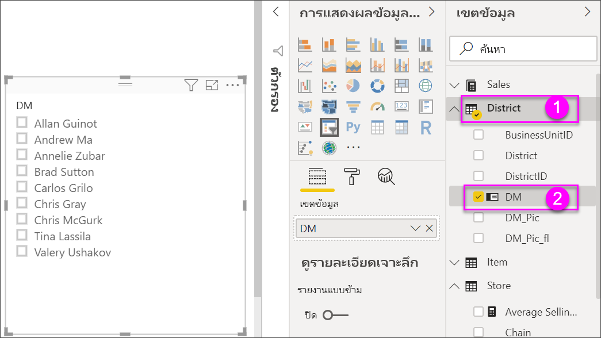
    
1. ปรับขนาด และลากองค์ประกอบต่าง ๆ บนพื้นที่ทำงาน เพื่อให้มีพื้นที่สำหรับตัวแบ่งส่วนข้อมูลนี้Resize and drag the elements on the canvas to make room for the slicer. โปรดทราบว่าถ้าคุณปรับขนาดของตัวแบ่งส่วนข้อมูลให้เล็กเกินไป หน่วยข้อมูลของตัวแบ่งส่วนข้อมูลจะถูกตัดออกNote that if you resize the slicer too small, its items are cut off. 

1. เลือกชื่อบนตัวแบ่งส่วนข้อมูล และดูผลกระทบที่มีต่อการแสดงภาพอื่น ๆ บนหน้าSelect names on the slicer and notice the effects on the other visualizations on the page. เลือกชื่ออีกครั้งเพื่อยกเลิกการเลือก หรือกดแป้น **Ctrl** ค้างไว้เพื่อเลือกมากกว่าหนึ่งชื่อSelect names again to deselect them, or hold down the **Ctrl** key to select more than one name. การเลือกชื่อทั้งหมดมีผลเหมือนกับการไม่เลือกเลยSelecting all names has the same effect as selecting none. 

1. อีกวิธีหนึ่งคือเลือก **รูปแบบ** (ไอคอนลูกกลิ้งทาสี) ในบานหน้าต่าง **การแสดงภาพ** เพื่อจัดรูปแบบตัวแบ่งส่วนข้อมูลของคุณAlternately, select **Format** (paint roller icon) in the **Visualizations** pane to format your slicer. 

   มีทางเลือกมากเกินไปในการอธิบายสิ่งทั้งหมดที่นี่ ให้ลองทดสอบและสร้างตัวแบ่งส่วนข้อมูลที่เหมาะกับคุณThere are too many options to describe them all here; experiment and create a slicer that works for you. ในภาพต่อไปนี้ ตัวแบ่งส่วนข้อมูลแรกจะใช้การวางแนวตามแนวนอนและใช้ภาพพื้นหลังแบบสีสำหรับหน่วยข้อมูลต่าง ๆIn the following image, the first slicer has a horizontal orientation and colored backgrounds for the items. ตัวแบ่งส่วนข้อมูลที่สองมีการวางแนวตามแนวตั้งและข้อความสีสำหรับการดูมาตรฐานมากขึ้นThe second slicer has a vertical orientation and colored text for a more standard look.

   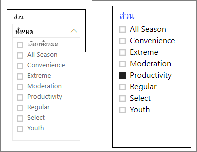

   >[!TIP]
   >หน่วยข้อมูลรายการตัวแบ่งส่วนข้อมูลจะเรียงลำดับจากน้อยไปหามากตามค่าเริ่มต้นSlicer list items are sorted in ascending order, by default. ในการกลับลำดับการจัดเรียงให้เป็นจากมากไปหาน้อย ให้เลือกจุดไข่ปลา ( **...** ) ในมุมขวาบนของตัวแบ่งส่วนข้อมูล แล้วเลือก **เรียงลำดับจากมากไปหาน้อย**To reverse the sort order to descending, select the ellipsis (**...**) in the top right corner of the slicer and choose **Sort descending**.

## ตัวควบคุมว่าวิชวลในหน้าไหนได้รับผลจากตัวแบ่งส่วนข้อมูลControl which page visuals are affected by slicers
ตามค่าเริ่มต้น ตัวแบ่งส่วนข้อมูลบนหน้ารายงานมีผลต่อการแสดงภาพอื่น ๆ บนหน้านั้น รวมถึงผลระหว่างตัวแบ่งส่วนข้อมูลด้วยกันBy default, slicers on report pages affect all the other visualizations on that page, including each other. เมื่อคุณเลือกค่าในรายการและแถบเลื่อนวันที่ที่คุณเพิ่งสร้าง สังเกตผลที่มีต่อการแสดงภาพอื่น ๆAs you choose values in the list and date sliders you just created, notice the effects on the other visualizations. ข้อมูลกรองแล้วคือ จุดตัดของค่าที่เลือกในตัวแบ่งส่วนข้อมูลทั้งสองThe filtered data is an intersection of the values selected in both slicers. 

ใช้การโต้ตอบกับภาพเพื่อแยกการแสดงภาพบางหน้าออกจากผลของตัวแบ่งส่วนในหน้าอื่นUse visual interactions to exclude some page visualizations from being affected by others. บนหน้า **ภาพรวม** แผนภูมิ **ผลต่างของยอดขายรวม ตาม FiscalMonth และผู้จัดการเขต** จะแสดงข้อมูลเปรียบเทียบโดยรวมสำหรับผู้จัดการเขตตามเดือน ซึ่งคุณต้องการให้ปรากฏอยู่ตลอดเวลาOn the **Overview** page, the **Total Sales Variance by FiscalMonth and District Manager** chart shows overall comparative data for district managers by month, which you want to keep visible at all times. ใช้การโต้ตอบกับภาพเพื่อให้สามารถเลือกตัวแบ่งส่วนข้อมูลจากการกรองแผนภูมินี้ได้Use visual interactions to keep slicer selections from filtering this chart. 

1. ไปที่หน้า **ภาพรวม** ของรายงาน จากนั้นเลือกตัวแบ่งส่วนข้อมูล **DM** ที่คุณสร้างไว้ก่อนหน้านี้Go to the **Overview** page of the report, and then select the **DM** slicer you previously created.

1. ในเมนู Power BI Desktop เลือกเมนู **รูปแบบ** ภายใต้ **เครื่องมือการแสดงผล** แล้วเลือก **แก้ไขการโต้ตอบ**On the Power BI Desktop menu, select the **Format** menu under **Visual Tools**, and then select **Edit interactions**.
   
   ตัวควบคุมการกรอง แต่ละรายการที่มี **ตัวกรอง** และตัวเลือก **ไม่มี** จะปรากฎอยู่เหนือวิชวลทั้งหมดบนหน้าFilter controls , each with a **Filter** and a **None** option, appear above all the visuals on the page. ในตอนเริ่มต้น ตัวเลือก **ตัวกรอง** จะถูกเลือกไว้ล่วงหน้าในตัวควบคุมทั้งหมดInitially, the **Filter** option is preselected on all the controls.
   
1. เลือกตัวเลือก **ไม่มี** ในตัวควบคุมตัวกรองที่อยู่เหนือแผนภูมิ **ผลต่างของยอดขายรวมตาม FiscalMonth และผู้จัดการเขต** เพื่อทำให้ตัวแบ่งส่วนข้อมูล **DM** หยุดกรองแผนภูมินั้นSelect the **None** option in the filter control above the **Total Sales Variance by FiscalMonth and District Manager** chart to stop the **DM** slicer from filtering it. 

1. เลือกตัวแบ่งส่วนข้อมูล **OpenDate** เพื่อเลือกตัวเลือก **ไม่มี** ที่อยู่เหนือแผนภูมิ **ผลต่างของยอดขายรวมตาม FiscalMonth และผู้จัดการเขต** เพื่อทำให้ตัวแบ่งส่วนข้อมูลนี้หยุดกรองแผนภูมินั้นSelect the **OpenDate** slicer, and then select the **None** option above the **Total Sales Variance by FiscalMonth and District Manager** chart to stop this slicer from filtering it. 

   ตอนนี้ เมื่อคุณเลือกชื่อและช่วงวันที่ในตัวแบ่งส่วนข้อมูล แผนภูมิ **ผลต่างของยอดขายรวมตาม FiscalMonth และผู้จัดการเขต** จะไม่เปลี่ยนแปลงNow, as you select names and date ranges in the slicers, the **Total Sales Variance by FiscalMonth and District Manager** chart is unchanged.

สำหรับข้อมูลเพิ่มเติมเกี่ยวกับการแก้ไขการโต้ตอบ โปรดดู [เปลี่ยนวิธีการโต้ตอบของวิชวลในรายงาน Power BI](../create-reports/service-reports-visual-interactions.md)For more information about editing interactions, see [Change how visuals interact in a Power BI report](../create-reports/service-reports-visual-interactions.md).

## ซิงค์ และใช้ตัวแบ่งส่วนข้อมูลบนหน้าอื่น ๆSync and use slicers on other pages
คุณสามารถซิงค์ตัวแบ่งส่วนข้อมูลและใช้ได้ในทุกหน้าหรือทั้งหมดในรายงานYou can sync a slicer and use it on any or all pages in a report. 

ในรายงานปัจจุบัน หน้า **ยอดขายรายเดือนของเขต** ยังมีตัวแบ่งส่วนข้อมูล **ผู้จัดการเขต** แต่ถ้าเรายังต้องการให้มีตัวแบ่งส่วนข้อมูลอยู่ในหน้า **ร้านค้าใหม่** ด้วยจะเป็นอย่างไรIn the current report, the **District Monthly Sales** page has a **District Manager** slicer, but what if we also wanted that slicer on the **New Stores** page? หน้า **ร้านค้าใหม่** มีตัวแบ่งส่วนข้อมูล แต่จะมีเฉพาะข้อมูล **ชื่อร้านค้า** เท่านั้นThe **New Stores** page has a slicer, but it provides only **Store Name** information. ด้วยบานหน้าต่าง **ซิงค์ตัวแบ่งส่วนข้อมูล** คุณสามารถซิงค์ตัวแบ่งส่วนข้อมูล **ผู้จัดการเขต** เพื่อให้การเลือกตัวแบ่งส่วนข้อมูลบนหน้าใด ๆ มีผลต่อแสดงภาพบนทั้งสามหน้าได้With the **Sync slicers** pane, you can sync the **District Manager** slicer to these pages, so that slicer selections on any page affect visualizations on all three pages.

1. ในเมนู **มุมมอง** ของ Power BI Desktop ให้เลือก **ซิงค์ตัวแบ่งส่วนข้อมูล**On the Power BI Desktop **View** menu, select **Sync slicers**.

    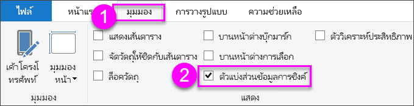

    บานหน้าต่าง **ซิงค์ตัวแบ่งส่วนข้อมูล** จะปรากฏขึ้นระหว่างบานหน้าต่าง **ตัวกรอง** และบานหน้าต่าง **การแสดงภาพ**The **Sync slicers** pane appears between the **Filters** and **Visualizations** panes.

    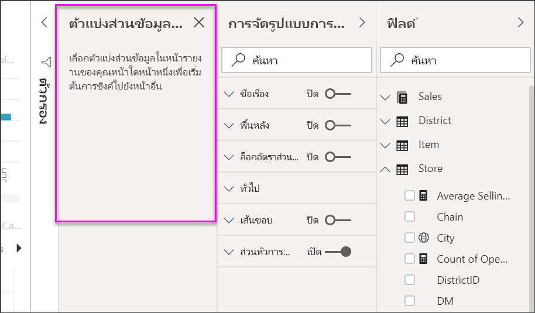

1. ในหน้า **ยอดขายรายเดือนของเขต** ของรายงาน ให้เลือกตัวแบ่งส่วนข้อมูล **ผู้จัดการเขต**On the **District Monthly Sales** page of the report, select the **District Manager** slicer. 

    เนื่องจากคุณได้สร้างตัวแบ่งส่วน **ผู้จัดการเขต** (**DM**) บนหน้า **ภาพรวม** บานหน้าต่าง **ซิงค์ตัวแบ่งส่วนข้อมูล** จะปรากฏขึ้นดังนี้:Because you've already created a **District Manager** (**DM**) slicer on the **Overview** page, the **Sync slicers** pane appears as follows:
    
    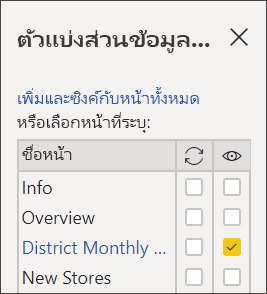
    
1. ในคอลัมน์ **ซิงค์** ของบานหน้าต่าง **ซิงค์ตัวแบ่งส่วนข้อมูล** ให้เลือกหน้า **ภาพรวม** **ยอดขายรายเดือนของเขต** และ **ร้านค้าใหม่**In the **Sync** column of the **Sync slicers** pane, select the **Overview**, **District Monthly Sales**, and **New Stores** pages. 

    การเลือกนี้จะทำให้ตัวแบ่งส่วนข้อมูล **ยอดขายรายเดือนของเขต** ซิงค์ในสามหน้าเหล่านี้This selection causes the **District Monthly Sales** slicer to sync across these three pages. 
    
1. ในคอลัมน์ **ที่มองเห็นได้** ของบานหน้าต่าง **ซิงค์ตัวแบ่งส่วนข้อมูล** ให้เลือกหน้า **ร้านค้าใหม่**In the **Visible** column of the **Sync slicers** pane, select the **New Stores** page. 

    การเลือกนี้จะทำให้สามารถมองเห็นตัวแบ่งส่วนข้อมูล **ยอดขายรายเดือนของเขต** ได้ในสามหน้าเหล่านี้ได้This selection causes the **District Monthly Sales** slicer to be visible in these three pages. ตอนนี้บานหน้าต่าง **ซิงค์ตัวแบ่งส่วนข้อมูล** ปรากฏขึ้นดังนี้:The **Sync slicers** pane now appears as follows:

    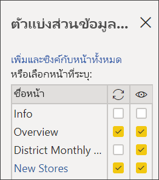

1. สังเกตผลของการซิงค์ตัวแบ่งส่วนข้อมูล และการทำให้มองเห็นได้บนหน้าอื่น ๆObserve the effects of syncing the slicer and making it visible on the other pages. บนหน้า **ยอดขายรายเดือนของเขต** โปรดทราบว่าตัวแบ่งส่วนข้อมูล **ผู้จัดการเขต** ตอนนี้แสดงตัวเลือกเดียวกับตัวแบ่งส่วนข้อมูลบนหน้า **ภาพรวม**On the **District Monthly Sales** page, notice that the **District Manager** slicer now shows the same selections as on the **Overview** page. บนหน้า **ร้านค้าใหม่** ตอนนี้ตัวแบ่งส่วนข้อมูล **ผู้จัดการเขต** จะปรากฏขึ้นและการเลือกจะส่งผลกระทบต่อการเลือกที่สามารถมองเห็นได้ในตัวแบ่งส่วนข้อมูล **ชื่อร้านค้า**On the **New Stores** page, the **District Manager** slicer is now visible and it selections affect the selections that are visible in the **Store Name** slicer. 
    
    >[!TIP]
    >ถึงแม้ว่าตัวแบ่งส่วนข้อมูล จะปรากฏบนหน้าที่ซิงค์ด้วยขนาดและตำแหน่งที่เหมือนกับหน้าเดิมในตอนแรก คุณสามารถย้าย, ปรับขนาด และจัดรูปแบบตัวแบ่งส่วนข้อมูลที่ซิงค์บนหน้าต่าง ๆ ได้อิสระจากกันAlthough the slicer initially appears on the synced pages at the same size and position as on the original page, you can move, resize, and format synced slicers on the various pages independently. 

    >[!NOTE]
    >ถ้าคุณซิงค์ตัวแบ่งส่วนข้อมูลไปยังหน้า แต่ไม่ทำให้มองเห็นได้บนหน้านั้น การเลือกตัวแบ่งส่วนข้อมูลบนหน้าอื่นยังคงกรองข้อมูลในหน้าIf you sync a slicer to a page but don't make it visible on that page, slicer selections made on the other pages still filter the data on the page.
 
## ตัวแบ่งส่วนข้อมูลการกรองFiltering slicers
คุณสามารถนำตัวกรองระดับวิชวลไปใช้กับตัวแบ่งส่วนข้อมูลเพื่อลดรายการของค่าที่แสดงในตัวแบ่งส่วนข้อมูลYou can apply visual-level filters to slicers to reduce the list of values that are displayed in the slicer. ตัวอย่างเช่น คุณอาจกรองค่าว่างจากตัวแบ่งส่วนข้อมูลรายการ หรือกรองวันที่ที่แน่นอนจากตัวแบ่งส่วนข้อมูลช่วงFor example you might filter out blank values from a list slicer, or filter out certain dates from a range slicer. เมื่อคุณทำเช่นนี้จะมีผลต่อ *ค่าที่แสดงในตัวแบ่งส่วนข้อมูล* เท่านั้นไม่ใช่ *ตัวกรองที่ใช้กับวิชวลอื่นๆ* เมื่อคุณทำการเลือกWhen you do this it only affects *the values that are shown in the slicer*, not *the filter that the slicer applies to other visuals* when you make a selection. ตัวอย่างเช่น สมมติว่าคุณนำตัวกรองไปใช้กับตัวแบ่งส่วนข้อมูลเพื่อแสดงเฉพาะบางวันเท่านั้นFor example, let's say you apply a filter to a range slicer to only show certain dates. การเลือกบนตัวแบ่งส่วนข้อมูลจะแสดงวันที่แรกและสุดท้ายจากช่วงนั้น แต่คุณยังคงสามารถดูวันที่อื่นๆ ในวิชวลอื่นๆ ได้The selection on the slicer will only show the first and last dates from that range, but you would still see other dates in your other visuals. เมื่อคุณเปลี่ยนช่วงที่เลือกในตัวแบ่งส่วนข้อมูลแล้ว คุณจะเห็นการอัปเดตวิชวลอื่นๆOnce you change the selected range in the slicer you'll see the other visuals update. การล้างตัวแบ่งส่วนข้อมูลจะแสดงวันที่ทั้งหมดอีกครั้งClearing the slicer would show all the dates again.

โปรดดู [ชนิดตัวกรอง](../create-reports/power-bi-report-filter-types.md) สำหรับข้อมูลเพิ่มเติมเกี่ยวกับตัวกรองระดับวิชวลSee [Filter types](../create-reports/power-bi-report-filter-types.md) for more information on visual-level filters.

## จัดรูปแบบตัวแบ่งส่วนข้อมูลFormat slicers
ตัวเลือกการจัดรูปแบบที่แตกต่างกันจะพร้อมใช้งาน โดยขึ้นอยู่กับชนิดตัวแบ่งส่วนข้อมูลDifferent formatting options are available, depending on the slicer type. โดยใช้การจัดแนว **แนวนอน** เค้าโครง **ตอบสนอง** และการกำหนดสี **รายการ** คุณสามารถสร้างปุ่ม หรือไทล์แทนที่จะเป็นรายการมาตรฐาน และทำให้รายการในตัวแบ่งส่วนข้อมูล ปรับขนาดให้พอดีกับขนาดหน้าจอและเค้าโครงต่าง ๆBy using **Horizontal** orientation, **Responsive** layout, and **Item** coloring, you can produce buttons or tiles rather than standard list items, and make slicer items resize to fit different screen sizes and layouts.  

1. เมื่อเลือกตัวแบ่งส่วนข้อมูล **ผู้จัดการเขต** บนหน้าใด ๆ ในบานหน้าต่าง **การจัดรูปแบบการแสดงข้อมูล** เลือกไอคอน **รูปแบบ** With the **District Manager** slicer selected on any page, in the **Visualizations** pane, select the **Format** icon  วิธีแสดงตัวควบคุมการจัดรูปแบบto display the formatting controls. 
    
    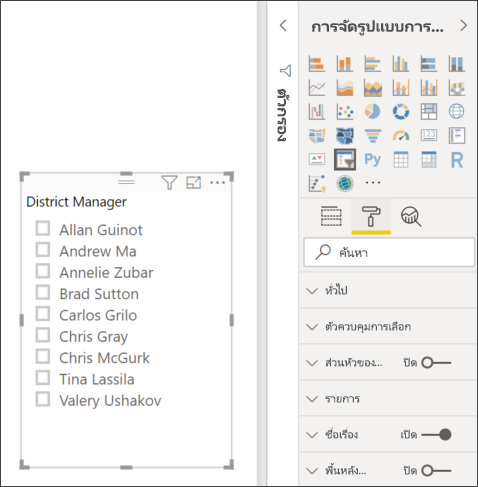
    
1. เลือกที่ลูกศรดรอปดาวน์ที่อยู่ถัดจากแต่ละประเภท เพื่อแสดงและแก้ไขตัวเลือกSelect the drop-down arrows next to each category to display and edit the options. 

### ตัวเลือกทั่วไปGeneral options
1. ภายใต้ **รูปแบบ** เลือก **ทั่วไป** เลือกสีแดงภายใต้ **สีแบบเส้นขอบ** และจากนั้นเปลี่ยน **ความหนาของเส้นขอบ** เป็น *2*Under **Format**, select **General**, select a red color under **Outline color**, and then change **Outline weight** to *2*. 

    การตั้งค่านี้จะเปลี่ยนสีและความหนาของส่วนหัว รวมถึงเส้นกรอบและการขีดเส้นใต้ของหน่วยข้อมูลThis setting changes the color and thickness of the header and item outlines and underlines.

1. ภายใต้ **การจัดแนว** เลือก **แนวตั้ง** เป็นค่าเริ่มต้นFor **Orientation**, **Vertical** is selected by default. เลือก **แนวนอน** เพื่อสร้างตัวแบ่งส่วนข้อมูลที่มีไทล์หรือปุ่มจัดเรียงอยู่ในแนวนอน และลูกศรเลื่อนเพื่อเข้าถึงหน่วยข้อมูลที่ไม่พอดีกับตัวแบ่งส่วนข้อมูลSelect **Horizontal** to produce a slicer with horizontally arranged tiles or buttons, and scroll arrows to access items that don't fit in the slicer.
    
    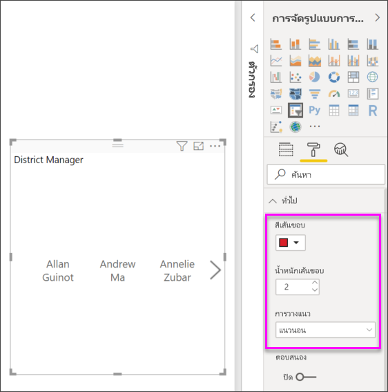
    
1. **เปิดใช้งาน** เค้าโครง **แบบตอบสนอง** เพื่อเปลี่ยนขนาดและการจัดเรียงของหน่วยข้อมูลในตัวแบ่งส่วนข้อมูลตามขนาดของหน้าจอและตัวแบ่งส่วนข้อมูลTurn **On** the **Responsive** layout to change the size and arrangement of slicer items according to the view screen and slicer size. 

    สำหรับตัวแบ่งส่วนข้อมูลรายการ เค้าโครงแบบตอบสนองป้องกันไม่ให้หน่วยข้อมูลถูกตัดออกบนหน้าจอขนาดเล็กFor list slicers, responsive layout prevents items from being cut off on small screens. พร้อมใช้งานเฉพาะในแนวนอนเท่านั้นIt's available only in horizontal orientations. สำหรับตัวแบ่งส่วนข้อมูลแถบเลื่อนช่วง การจัดรูปแบบแบบตอบสนองจะเปลี่ยนสไตล์ของแถบเลื่อน และให้การปรับขนาดที่ยืดหยุ่นมากขึ้นFor range slider slicers, responsive formatting changes the style of the slider and provides more flexible resizing. ตัวแบ่งส่วนข้อมูลทั้งสองชนิดจะกลายเป็นไอคอนตัวกรองเมื่อมีขนาดเล็กBoth types of slicers become filter icons at small sizes.
    
    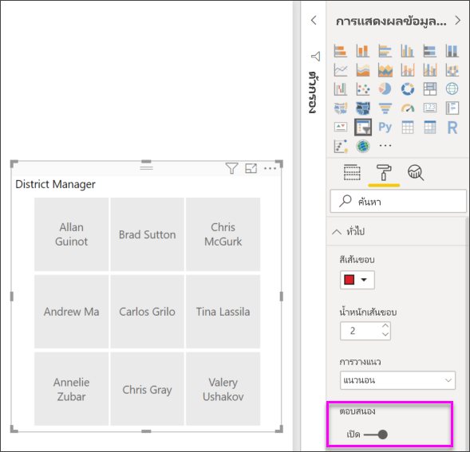
    
    >[!NOTE]
    >การเปลี่ยนแปลงเค้าโครงแบบตอบสนองสามารถเปลี่ยนการจัดรูปแบบหัวเรื่องหรือหน่วยข้อมูลที่คุณตั้งค่าไว้ได้Responsive layout changes can override specific heading and item formatting that you set. 
    
1. ภายใต้ **ตำแหน่ง X**, **ตำแหน่ง Y**, **ความกว้าง** และ **ความสูง** หรือย้ายและปรับขนาดตัวแบ่งส่วนข้อมูลบนพื้นที่ทำงานโดยตรงUnder **X Position**, **Y Position**, **Width**, and **Height**, set the slicer position and size with numeric precision, or move and resize the slicer directly on the canvas. 

    ทดลองกับขนาดและการจัดเรียงรายการแบบต่าง ๆ และสังเกตการเปลี่ยนแปลงที่สอดคล้องกัน ของการจัดรูปแบบแบบตอบสนองExperiment with different item sizes and arrangements, and note how the responsive formatting changes accordingly. ตัวเลือกเหล่านี้จะพร้อมใช้งานเฉพาะเมื่อคุณเลือกการวางแนวนอนเท่านั้นThese options are available only when you select horizontal orientations. 

    

สำหรับข้อมูลเพิ่มเติมเกี่ยวกับแนวนอนและเค้าโครงแบบตอบสนอง โปรดดู[สร้างตัวแบ่งส่วนข้อมูลแบบตอบสนองที่คุณสามารถปรับขนาดใน Power BI ได้](../create-reports/power-bi-slicer-filter-responsive.md)For more information about horizontal orientations and responsive layouts, see [Create a responsive slicer you can resize in Power B I](../create-reports/power-bi-slicer-filter-responsive.md).

### ตัวเลือกตัวควบคุมการเลือก (ตัวแบ่งส่วนข้อมูลรายการเท่านั้น)Selection controls options (list slicers only)
1. ภายใต้ **ตัวควบคุมการเลือก** ให้เปลี่ยน **แสดงตัวเลือก "เลือกทั้งหมด"** เป็น **เปิด** เพื่อเพิ่มหน่วยข้อมูล **เลือกทั้งหมด** ไปยังตัวแบ่งส่วนข้อมูลUnder **Selection controls**, turn **Show "Select all" option** to **On** to add a **Select All** item to the slicer. 

    **แสดงตัวเลือก "เลือกทั้งหมด"** เป็น **ปิด** ตามค่าเริ่มต้น**Show "Select all" option** is **Off** by default. เมื่อเปิดใช้งานแล้ว ตัวเลือกนี้เมื่อสลับ เลือกหรือยกเลิกเฉพาะหน่วยข้อมูลทั้งหมดWhen enabled, this option, when toggled, selects or deselects all items. หากคุณเลือกทุกหน่วยข้อมูล การเลือกหน่วยข้อมูลจะยกเลิกการเลือกหน่วยข้อมูลนั้น ซึ่งจะเป็นตัวกรองแบบ *is-not*If you select all items, selecting an item deselects it, allowing an *is-not* type of filter.
    
    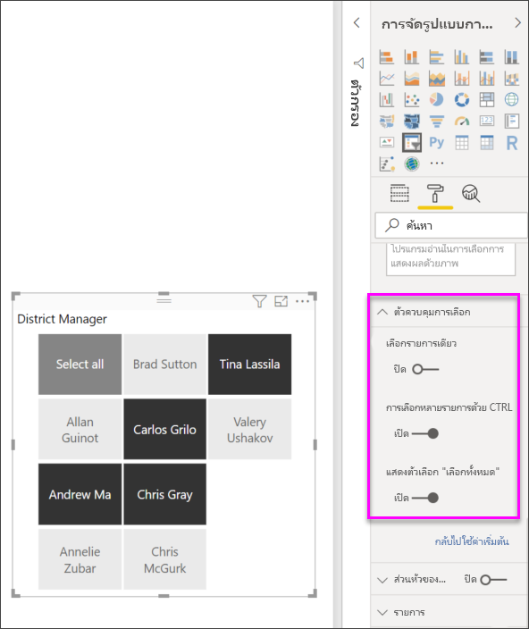
    
1. เปลี่ยน **เลือกรายการเดียว** ให้เป็น **ปิด** เพื่อให้คุณสามารถเลือกหลายรายการโดยไม่ต้องกดปุ่ม **Ctrl** ค้างไว้Turn **Single select** to **Off** to allow you to select multiple items without needing to hold down the **Ctrl** key. 

    ตามค่าเริ่มต้น **เลือกรายการเดียว** จะ **เปิด****Single select** is **On** by default. การเลือกหน่วยข้อมูลจะเป็นการเลือกหน่วยข้อมูลนั้น และการกดปุ่ม **Ctrl** ค้างไว้จะเป็นการเลือกหลายรายการSelecting an item selects it, and holding down the **Ctrl** key selects multiple items. การเลือกหน่วยข้อมูลอีกครั้งจะยกเลิกการเลือกดังกล่าวSelecting item again deselects it.

### ตัวเลือกสำหรับชื่อเรื่องTitle options
**ชื่อ** เป็น **เปิด** ตามค่าเริ่มต้น**Title** is **On** by default. การเลือกนี้แสดงชื่อเขตข้อมูลที่ด้านบนของตัวแบ่งส่วนข้อมูลThis selection shows the data field name at the top of the slicer. คุณสามารถแก้ไขชื่อได้เช่นกันซึ่งเป็นประโยชน์โดยเฉพาะอย่างยิ่งสำหรับตัวแบ่งส่วนลำดับชั้นYou can edit the title, too, which is especially useful for hierarchy slicers. โปรดดู[เปลี่ยนชื่อ](../create-reports/power-bi-slicer-hierarchy-multiple-fields.md#change-the-title)ในบทความ "เพิ่มหลายเขตข้อมูลลงในตัวแบ่งส่วนลำดับชั้น" สำหรับรายละเอียดSee [Change the title](../create-reports/power-bi-slicer-hierarchy-multiple-fields.md#change-the-title) in the article "Add multiple fields to a hierarchy slicer" for details.

- สำหรับบทความนี้ ให้จัดรูปแบบข้อความชื่อเรื่องดังนี้:For this article, format the title text as follows: 
   - **สีแบบอักษร**: สีแดง**Font color**: red
   - **ขนาดของข้อความ**: **14 pt****Text size**: **14 pt**
   - **การจัดแนว**: **กึ่งกลาง****Alignment**: **Center**
   - **ชุดแบบอักษร**: **Arial Black****Font family**: **Arial Black**

### ตัวเลือกรายการItems options

ตัวเลือกรายการจะพร้อมใช้งานสำหรับตัวแบ่งส่วนข้อมูลรายการเท่านั้นItems options are only available for list slicers.

1. สำหรับบทความนี้ ให้จัดรูปแบบตัวเลือก **หน่วยข้อมูล** ดังนี้:For this article, format the **Items** options as follows:
    - **สีแบบอักษร**: สีดำ**Font color**: black
    - **พื้นหลัง**: สีแดงอ่อน**Background**: light red
    - **ขนาดของข้อความ**: **10 pt****Text size**: **10 pt**
    - **ชุดแบบอักษร**: **Arial****Font family**: **Arial**
 
1. ภายใต้ **เส้นกรอบ** เลือก **กรอบ** เพื่อวาดเส้นขอบรอบ ๆ แต่ละหน่วยข้อมูลด้วยขนาดและสีที่คุณตั้งค่าภายใต้ตัวเลือก **ทั่วไป**For **Outline**, choose **Frame** to draw a border around each item with the size and color you set under the **General** options. 
    
    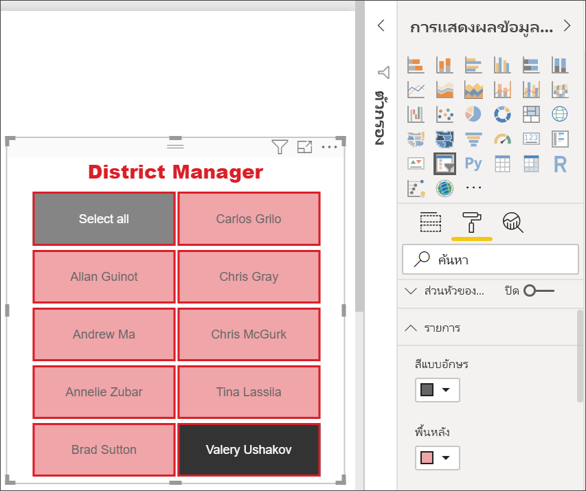
    
    >[!TIP]
    >- เมื่อเลือก **การจัดแนว** > **ทั่วไป** > **แนวนอน** รายการที่ยกเลิกการเลือกจะแสดงข้อความและสีพื้นหลังที่เลือกWith **General** > **Orientation** > **Horizontal** selected, deselected items show the chosen text and background colors. รายการที่เลือกจะใช้ค่าเริ่มต้นของระบบซึ่งมักจะเป็นพื้นหลังสีดำกับข้อความสีขาวSelected items use the system default, usually a black background with white text.
    >- ด้วย **ทั่วไป** > **การจัดแนว > แนวตั้ง** ที่เลือก หน่วยข้อมูลจะแสดงสีที่เลือกและกล่องกาเครื่องหมายให้เป็นสีดำเสมอเมื่อเลือกWith **General** > **Orientation > Vertical** selected, items always show the selected colors, and check boxes are always black when selected. 

### ตัวเลือกข้อมูลป้อนเข้าวันที่/ตัวเลขและแถบเลื่อนDate/numeric inputs and slider options

ตัวเลือกป้อนข้อมูลวันที่/ตัวเลขและแถบเลื่อนพร้อมใช้งานสำหรับตัวแบ่งส่วนข้อมูลแถบเลื่อนช่วงเท่านั้นDate/numeric inputs and slider options are only available for range slider slicers.

- สำหรับตัวแบ่งส่วนข้อมูลรายการ ตัวเลือกป้อนวันที่/ตัวเลข จะเหมือนกับในตัวเลือก **หน่วยข้อมูล** ยกเว้นไม่มีตัวเลือกเส้นกรอบหรือขีดเส้นใต้For list slicers, date/numeric input options are the same as **Items** options except that there's no outline or underline options.
- ตัวเลือก **แถบเลื่อน** อนุญาตให้คุณสามารถตั้งค่าสีของแถบเลื่อนช่วง หรือเลื่อนแถบเลื่อนให้เป็น **ปิด** เพื่อให้ป้อนข้อมูลตัวเลขได้อย่างเดียว**Slider** options allow you to set the color of the range slider, or turn the slider to **Off**, leaving only the numeric inputs.

### ตัวเลือกการจัดรูปแบบอื่น ๆOther formatting options
ตัวเลือกจัดรูปแบบอื่น ๆ เป็น **ปิด** ตามค่าเริ่มต้นThe other formatting options are **Off** by default. **เปิด** ตัวเลือกเหล่านี้เพื่อควบคุมหน่วยข้อมูล:Turn **On** these options to control them: 

- **พื้นหลัง**: เพิ่มสีพื้นหลังไปยังตัวแบ่งส่วนข้อมูล และตั้งค่าความโปร่งใส**Background**: Add a background color to the slicer and sets its transparency.
- **ล็อกอัตราส่วน:** รักษาความสูงและความกว้างสัมพัทธ์ของตัวแบ่งส่วนข้อมูลถ้ามีการปรับขนาด**Lock aspect**: Retain the relative height and width of the slicer if it's resized.
- **ขอบ:** เพิ่มขอบรอบ ๆ ตัวแบ่งส่วนข้อมูล และตั้งค่าสีขอบ**Border**: Add a border around the slicer and sets its color. ขอบตัวแบ่งส่วนข้อมูลนี้แยกต่างหาก และไม่มีผลจากการตั้งค่า **ทั่วไป**This slicer border is separate from and unaffected by the **General** settings.
- **เงา**: เพิ่มเงาแบบหล่นลงไปยังแถบเลื่อน**Shadow**: Add a drop shadow to the slider.

## ขั้นตอนถัดไปNext steps
สำหรับข้อมูลเพิ่มเติมเกี่ยวกับแบ่งส่วนข้อมูล โปรดดูบทความต่อไปนี้:For more about slicers, see the following articles:

- [ตัวแบ่งส่วนข้อมูลช่วงตัวเลขNumeric range slicers](../create-reports/desktop-slicer-numeric-range.md)
- [ตัวแบ่งส่วนข้อมูลวันที่สัมพัทธ์Relative date slicers](desktop-slicer-filter-date-range.md)
- [ตัวแบ่งส่วนข้อมูลเวลาที่สัมพันธ์กันRelative time slicers](../create-reports/slicer-filter-relative-time.md)
- [ตัวแบ่งส่วนข้อมูลที่ปรับขนาด](../create-reports/power-bi-slicer-filter-responsive.md)และตอบสนองได้Responsive, [resizable slicers](../create-reports/power-bi-slicer-filter-responsive.md)
- [ตัวแบ่งส่วนลำดับชั้น](../create-reports/power-bi-slicer-hierarchy-multiple-fields.md)ที่มีหลายเขตข้อมูล[Hierarchy slicers](../create-reports/power-bi-slicer-hierarchy-multiple-fields.md) with multiple fields
