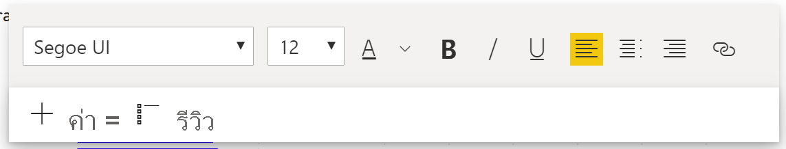
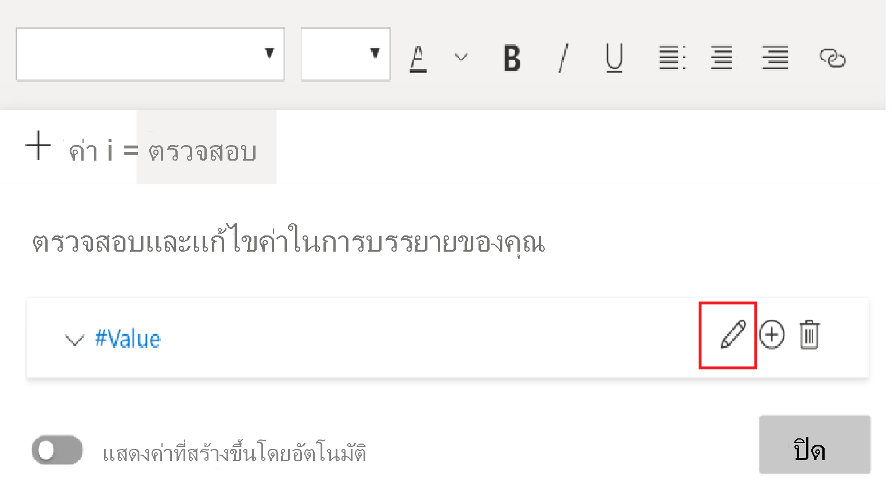
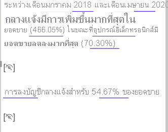

# สร้างสรุปคำบรรยายอัจฉริยะ (ตัวอย่าง)

[!INCLUDE[consumer-appliesto-nyyn](../includes/consumer-appliesto-nyyn.md)]    

[!INCLUDE [power-bi-visuals-desktop-banner](../includes/power-bi-visuals-desktop-banner.md)]

การแสดงภาพคำบรรยายอัจฉริยะช่วยให้คุณสามารถสรุปวิชวลและรายงานได้อย่างรวดเร็ว ซึ่งคุณสามารถกำหนดข้อมูลเชิงลึกที่เกี่ยวข้องได้ด้วยตนเอง

ใช้การสรุปคำบรรยายอัจฉริยะในรายงานของคุณเพื่อระบุประเด็นสำคัญ ชี้แนวโน้ม และเพื่อแก้ไขภาษาและรูปแบบสำหรับผู้ชมเฉพาะกลุ่ม ใน PowerPoint คุณสามารถเพิ่มคำบรรยายที่มีการอัปเดตในทุกครั้งที่รีเฟรชได้ แทนการวางสกรีนช็อตประเด็นสำคัญของรายงานของคุณ ผู้ชมของคุณสามารถการสรุปเพื่อทำความเข้าใจข้อมูล เข้าใจสาระสำคัญได้รวดเร็วยิ่งขึ้น และอธิบายข้อมูลให้กับผู้อื่นได้

>[!NOTE]
> เนื่องจากคุณลักษณะคำบรรยายอัจฉริยะอยู่ในการแสดงตัวอย่าง คุณจะต้องเปิดใช้งานหากต้องการใช้งานจริง ใน Power BI ไปที่ **ไฟล์** > **ตัวเลือกและการตั้งค่า** > **ตัวเลือก** > **คุณลักษณะตัวอย่าง** จากนั้นเลือก **วิชวลคำบรรยายอัจฉริยะ**
>
>

## เริ่มใช้งาน 
ชม Justyna แสดงวิธีใช้เรื่องเล่าที่ชาญฉลาด จากนั้นลองใช้ด้วยตัวเองโดยใช้บทช่วยสอนด้านล่างวิดีโอ  หากต้องการทำตามบทช่วยสอนนี้ ให้ดาวน์โหลด [ไฟล์ตัวอย่าง](https://github.com/microsoft/powerbi-desktop-samples/blob/main/Monthly%20Desktop%20Blog%20Samples/2020/2020SU09%20Blog%20Demo%20-%20September.pbix) ของสถานการณ์การขายออนไลน์

<iframe width="560" height="315" src="https://www.youtube.com/embed/01UrT-z37sw" frameborder="0" allow="accelerometer; autoplay; clipboard-write; encrypted-media; gyroscope; picture-in-picture" allowfullscreen></iframe>

ในบานหน้าต่าง **การแสดงภาพ** เลือกไอคอน **คำบรรยายอัจฉริยะ** เพื่อสร้างสรุปโดยอัตโนมัติ

คุณจะเห็นคำบรรยายที่สร้างขึ้นโดยยึดตามวิชวลทั้งหมดบนหน้า ตัวอย่างเช่นในไฟล์ตัวอย่าง คำบรรยายอัจฉริยะสามารถสร้างข้อมูลสรุปของวิชวลของรายงาน โดยระบุรายได้ การเยี่ยมชมเว็บไซต์ และการขายได้ โดยอัตโนมัติ Power BI วิเคราะห์แนวโน้มโดยอัตโนมัติเพื่อแสดงให้เห็นว่าทั้งรายได้และการเยี่ยมชมมีการเติบโตขึ้น นอกจากนี้ยังคำนวณการเติบโต ซึ่งในกรณีนี้คือ 72 เปอร์เซ็นต์
 

 
หากต้องการสร้างคำบรรยายอัจฉริยะของวิชวล ให้คลิกขวาแล้วเลือก **สรุป** ตัวอย่างเช่นในไฟล์ตัวอย่าง ลองสรุปแผนภูมิกระจายที่แสดงการประกอบธุรกรรมต่างๆ Power BI วิเคราะห์ข้อมูลและแสดงว่าเมืองหรือภูมิภาคใดมีรายได้สูงสุดต่อธุรกรรม และมีจำนวนธุรกรรมสูงสุด คำบรรยายอัจฉริยะยังแสดงช่วงค่าที่คาดไว้สำหรับเมตริกเหล่านี้ คุณจะเห็นว่าเมืองส่วนใหญ่ทำรายได้ได้น้อยกว่า $45 ต่อธุรกรรม และมีธุรกรรมน้อยกว่า 10 รายการ
 
  

 
## แก้ไขสรุป
 
สรุปคำบรรยายอัจฉริยะสามารถปรับแต่งได้หลากหลาย คุณสามารถแก้ไขหรือเพิ่มข้อความที่มีอยู่โดยใช้คำสั่งกล่องข้อความ ตัวอย่างเช่น คุณสามารถทำให้ข้อความเป็นตัวหนาหรือเปลี่ยนสีข้อความได้
 

  
หากต้องการปรับแต่งการสรุปและเพิ่มข้อมูลเชิงลึกของคุณเอง ให้ใช้ *ค่าแบบไดนามิก* คุณสามารถโยงข้อความไปยังเขตข้อมูลและหน่วยวัดที่มีอยู่ หรือใช้ภาษาธรรมชาติเพื่อกำหนดหน่วยวัดใหม่ที่จะโยงไปยังข้อความ ตัวอย่างเช่น เมื่อต้องการเพิ่มข้อมูลเกี่ยวกับจำนวนของรายการที่ส่งคืนในไฟล์ตัวอย่าง ให้ทำการเพิ่มค่า 

ในขณะที่คุณพิมพ์ชื่อค่า คุณสามารถเลือกจากรายการคำแนะนำตามที่คุณทำในวิชวลคำถามและคำตอบได้ ดังนั้นนอกเหนือจากการถามคำถามเกี่ยวกับข้อมูลของคุณในวิชวลคำถามและคำตอบแล้ว ตอนนี้คุณสามารถสร้างการคำนวณของคุณเองโดยไม่ต้องใช้ Data Analysis Expressions (DAX) 
  

  
คุณยังสามารถจัดรูปแบบค่าไดนามิกได้ ตัวอย่างเช่นในไฟล์ตัวอย่าง คุณสามารถแสดงค่าเป็นสกุลเงิน ระบุตำแหน่งทศนิยม และเลือกตัวคั่นสำหรับหลักพัน 
   

   
เมื่อต้องการจัดรูปแบบค่าแบบไดนามิก ให้เลือกค่าในสรุปเพื่อดูตัวเลือกการแก้ไขของคุณบนแท็บ **ตรวจสอบ** หรือในกล่องข้อความที่อยู่ถัดจากค่าที่คุณต้องการแก้ไข ให้เลือกปุ่มแก้ไข 
   

   
คุณยังสามารถใช้แท็บ **ตรวจสอบ** เพื่อตรวจสอบ ลบ หรือนำค่าที่กำหนดไว้ก่อนหน้านี้มาใช้ใหม่ได้อีกด้วย เลือกเครื่องหมายบวก (+) เพื่อแทรกค่าลงในข้อมูลสรุป คุณยังสามารถแสดงค่าที่สร้างขึ้นโดยอัตโนมัติโดยการเปิดตัวเลือกที่ด้านล่างของแท็บ **ตรวจสอบ**

บางครั้งสัญลักษณ์สรุปที่ซ่อนอยู่จะปรากฏในคำบรรยายอัจฉริยะ ซึ่งแสดงว่าข้อมูลและตัวกรองปัจจุบันไม่มีผลลัพธ์สำหรับค่า สรุปจะว่างเปล่าเมื่อไม่มีข้อมูลเชิงลึกที่พร้อมใช้งาน ตัวอย่างเช่นในแผนภูมิเส้นของไฟล์ตัวอย่าง สรุปของค่าสูงและต่ำอาจว่างเปล่าเมื่อเส้นของแผนภูมิเป็นแบบแบน แต่สรุปอาจปรากฏขึ้นภายใต้เงื่อนไขอื่นๆ สัญลักษณ์สรุปที่ซ่อนไว้จะมองเห็นได้เฉพาะเมื่อคุณพยายามแก้ไขสรุป

   
## การโต้ตอบกับวิชวล
สรุปเป็นระบบแบบไดนามิก ซึ่งสามารถอัปเดตข้อความและค่าไดนามิกที่เพิ่มเข้ามาได้โดยอัตโนมัติเมื่อคุณใช้ตัวกรองแบบข้าม ตัวอย่างเช่น ถ้าคุณเลือกผลิตภัณฑ์อิเล็กทรอนิกส์ในแผนภูมิโดนัทของไฟล์ตัวอย่าง ส่วนที่เหลือของรายงานจะเปลี่ยนเป็นตัวกรองแบบข้ามและข้อสรุปจะยังกรองข้ามเพื่อโฟกัสในผลิตภัณฑ์อิเล็กทรอนิกส์  

ในกรณีนี้ การเยี่ยมชมและรายได้มีแนวโน้มที่แตกต่างกัน ดังนั้นข้อความสรุปจึงได้รับการอัปเดตเพื่อแสดงให้เห็นในเรื่องนี้ จำนวนของค่าที่ส่งกลับที่เราเพิ่มจะได้รับการอัปเดตเป็น $4196 เมื่อคุณใช้การกรองข้าม จะสามารถอัปเดตส่วนการสรุปที่ว่างเปล่า
   

   
คุณยังสามารถทำการกรองในขั้นสูงกว่า ตัวอย่างเช่นในไฟล์ตัวอย่าง ดูที่วิชวลของแนวโน้มสำหรับหลายผลิตภัณฑ์ ถ้าคุณสนใจเฉพาะในแนวโน้มสำหรับไตรมาสใดไตรมาสหนึ่ง ให้เลือกจุดข้อมูลที่เกี่ยวข้องเพื่ออัปเดตสรุปสำหรับแนวโน้มนั้น
   

   
## ข้อจำกัด

คุณลักษณะคำบรรยายอัจฉริยะไม่สนับสนุนฟังก์ชันการทำงานต่อไปนี้:
- ปักหมุดเข้าแดชบอร์ด 
- การใช้ค่าแบบไดนามิกและการจัดรูปแบบตามเงื่อนไข (ตัวอย่างเช่น ชื่อเรื่องที่ผูกกับข้อมูล)
- Azure Analysis Services และ AS ในองค์กร
- KPI, การ์ด, การ์ดหลายแถว, แผนที่, ตาราง, เมตริก, วิชวล R หรือ วิชวล Python, วิชวลแบบกำหนดเอง 
- สรุปของวิชวลที่มีการจัดกลุ่มคอลัมน์ตามคอลัมน์อื่น และวิชวลที่สร้างขึ้นบนเขตข้อมูลของกลุ่ม 
- การกรองข้ามนอกวิชวล
- การเปลี่ยนชื่อค่าไดนามิกหรือการแก้ไขค่าไดนามิกโดยอัตโนมัติ
- สรุปของวิชวลที่ประกอบด้วยการคำนวณพร้อมใช้ เช่น QnA เลขคณิต และเปอร์เซ็นต์ของยอดรวมทั้งหมด 
- [เวลาการคำนวณ](/analysis-services/tabular-models/calculation-groups)
   

