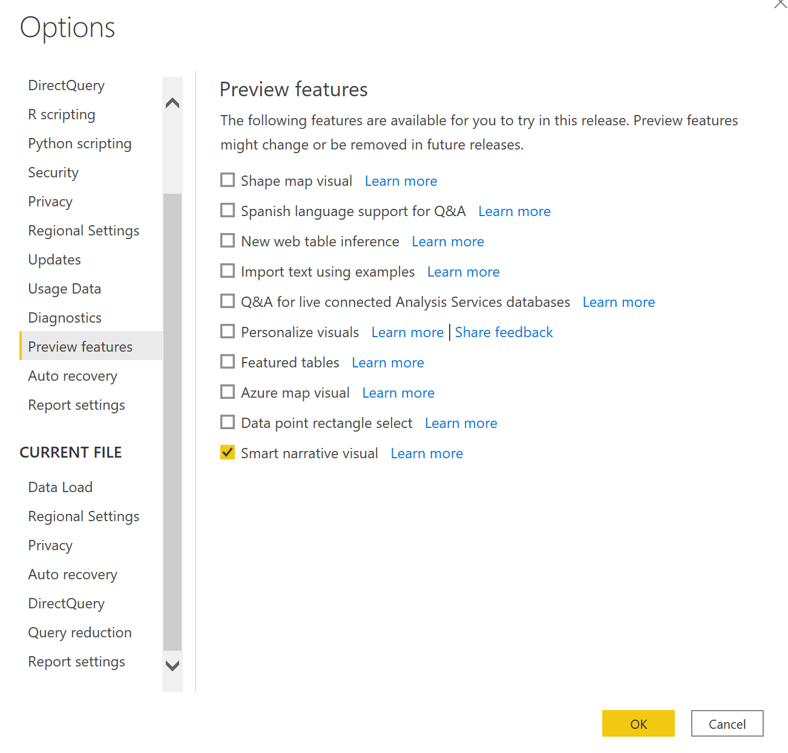

# สร้างสรุปคำบรรยายอัจฉริยะ (ตัวอย่าง)Create smart narrative summaries (preview)

[!INCLUDE[consumer-appliesto-nyyn](../includes/consumer-appliesto-nyyn.md)]    

[!INCLUDE [power-bi-visuals-desktop-banner](../includes/power-bi-visuals-desktop-banner.md)]

การแสดงภาพคำบรรยายอัจฉริยะช่วยให้คุณสามารถสรุปวิชวลและรายงานได้อย่างรวดเร็วThe smart narrative visualization helps you quickly summarize visuals and reports. ซึ่งคุณสามารถกำหนดข้อมูลเชิงลึกที่เกี่ยวข้องได้ด้วยตนเองIt provides relevant innovative insights that you can customize.

ใช้การสรุปคำบรรยายอัจฉริยะในรายงานของคุณเพื่อระบุประเด็นสำคัญ ชี้แนวโน้ม และเพื่อแก้ไขภาษาและรูปแบบสำหรับผู้ชมเฉพาะกลุ่มUse smart narrative summaries in your reports to address key takeaways, to point out trends, and to edit the language and format for a specific audience. ใน PowerPoint คุณสามารถเพิ่มคำบรรยายที่มีการอัปเดตในทุกครั้งที่รีเฟรชได้ แทนการวางสกรีนช็อตประเด็นสำคัญของรายงานของคุณIn PowerPoint, instead of pasting a screenshot of your report's key takeaways, you can add narratives that are updated with every refresh. ผู้ชมของคุณสามารถการสรุปเพื่อทำความเข้าใจข้อมูล เข้าใจสาระสำคัญได้รวดเร็วยิ่งขึ้น และอธิบายข้อมูลให้กับผู้อื่นได้Your audience can use the summaries to understand the data, get to key points faster, and explain the data to others.

>[!NOTE]
> เนื่องจากคุณลักษณะคำบรรยายอัจฉริยะอยู่ในการแสดงตัวอย่าง คุณจะต้องเปิดใช้งานหากต้องการใช้งานจริงBecause the smart narrative feature is in preview, you must turn it on if you want to use it. ใน Power BI ไปที่ **ไฟล์** > **ตัวเลือกและการตั้งค่า** > **ตัวเลือก** > **คุณลักษณะตัวอย่าง**In Power BI, go to **File** > **Options and Settings** > **Options** > **Preview features**. จากนั้นเลือก **วิชวลคำบรรยายอัจฉริยะ**Then select **Smart narrative visual**.
>
>

## เริ่มใช้งานGet started 
ชม Justyna แสดงวิธีใช้เรื่องเล่าที่ชาญฉลาด จากนั้นลองใช้ด้วยตัวเองโดยใช้บทช่วยสอนด้านล่างวิดีโอWatch Justyna show you how to use smart narratives, then try it out yourself using the tutorial, below the video.  หากต้องการทำตามบทช่วยสอนนี้ ให้ดาวน์โหลด [ไฟล์ตัวอย่าง](https://github.com/microsoft/powerbi-desktop-samples/blob/main/Monthly%20Desktop%20Blog%20Samples/2020/2020SU09%20Blog%20Demo%20-%20September.pbix) ของสถานการณ์การขายออนไลน์To follow along with this tutorial, download the [sample file](https://github.com/microsoft/powerbi-desktop-samples/blob/main/Monthly%20Desktop%20Blog%20Samples/2020/2020SU09%20Blog%20Demo%20-%20September.pbix) of an online-sales scenario.

<iframe width="560" height="315" src="https://www.youtube.com/embed/01UrT-z37sw" frameborder="0" allow="accelerometer; autoplay; clipboard-write; encrypted-media; gyroscope; picture-in-picture" allowfullscreen></iframe>

ในบานหน้าต่าง **การแสดงภาพ** เลือกไอคอน **คำบรรยายอัจฉริยะ** เพื่อสร้างสรุปโดยอัตโนมัติIn the **Visualizations** pane, select the **Smart narrative** icon to automatically generate a summary.

คุณจะเห็นคำบรรยายที่สร้างขึ้นโดยยึดตามวิชวลทั้งหมดบนหน้าYou see a narrative that's based on all of the visuals on the page. ตัวอย่างเช่นในไฟล์ตัวอย่าง คำบรรยายอัจฉริยะสามารถสร้างข้อมูลสรุปของวิชวลของรายงาน โดยระบุรายได้ การเยี่ยมชมเว็บไซต์ และการขายได้ โดยอัตโนมัติFor example, in the sample file, smart narratives can automatically generate a summary of the report's visuals that address revenue, website visits, and sales. Power BI วิเคราะห์แนวโน้มโดยอัตโนมัติเพื่อแสดงให้เห็นว่าทั้งรายได้และการเยี่ยมชมมีการเติบโตขึ้นPower BI automatically analyzes trends to show that revenue and visits have both grown. นอกจากนี้ยังคำนวณการเติบโต ซึ่งในกรณีนี้คือ 72 เปอร์เซ็นต์It even calculates growth, which in this case is 72 percent.
 

 
หากต้องการสร้างคำบรรยายอัจฉริยะของวิชวล ให้คลิกขวาแล้วเลือก **สรุป**To generate a smart narrative of a visualization, right-click it and then select **Summarize**. ตัวอย่างเช่นในไฟล์ตัวอย่าง ลองสรุปแผนภูมิกระจายที่แสดงการประกอบธุรกรรมต่างๆFor example, in the sample file, try summarizing a scatter chart that shows various transactions. Power BI วิเคราะห์ข้อมูลและแสดงว่าเมืองหรือภูมิภาคใดมีรายได้สูงสุดต่อธุรกรรม และมีจำนวนธุรกรรมสูงสุดPower BI analyzes the data and shows which city or region has the highest revenue per transaction and the highest number of transactions. คำบรรยายอัจฉริยะยังแสดงช่วงค่าที่คาดไว้สำหรับเมตริกเหล่านี้The smart narrative also shows the expected range of values for these metrics. คุณจะเห็นว่าเมืองส่วนใหญ่ทำรายได้ได้น้อยกว่า $45 ต่อธุรกรรม และมีธุรกรรมน้อยกว่า 10 รายการYou see that most cities produce less than $45 per transaction and have fewer than 10 transactions.
 
  

 
## แก้ไขสรุปEdit the summary
 
สรุปคำบรรยายอัจฉริยะสามารถปรับแต่งได้หลากหลายThe smart narrative summary is highly customizable. คุณสามารถแก้ไขหรือเพิ่มข้อความที่มีอยู่โดยใช้คำสั่งกล่องข้อความYou can edit or add to the existing text by using the text box commands. ตัวอย่างเช่น คุณสามารถทำให้ข้อความเป็นตัวหนาหรือเปลี่ยนสีข้อความได้For example, you can make the text bold or change its color.
 

  
หากต้องการปรับแต่งการสรุปและเพิ่มข้อมูลเชิงลึกของคุณเอง ให้ใช้ *ค่าแบบไดนามิก*To customize the summary or add your own insights, use *dynamic values*. คุณสามารถโยงข้อความไปยังเขตข้อมูลและหน่วยวัดที่มีอยู่ หรือใช้ภาษาธรรมชาติเพื่อกำหนดหน่วยวัดใหม่ที่จะโยงไปยังข้อความYou can map text to existing fields and measures or use natural language to define a new measure to map to text. ตัวอย่างเช่น เมื่อต้องการเพิ่มข้อมูลเกี่ยวกับจำนวนของรายการที่ส่งคืนในไฟล์ตัวอย่าง ให้ทำการเพิ่มค่าFor example, to add information about the number of returned items in the sample file, add a value. 

ในขณะที่คุณพิมพ์ชื่อค่า คุณสามารถเลือกจากรายการคำแนะนำตามที่คุณทำในวิชวลคำถามและคำตอบได้As you type a value name, you can choose from a list of suggestions as you do in a Q&A visual. ดังนั้นนอกเหนือจากการถามคำถามเกี่ยวกับข้อมูลของคุณในวิชวลคำถามและคำตอบแล้ว ตอนนี้คุณสามารถสร้างการคำนวณของคุณเองโดยไม่ต้องใช้ Data Analysis Expressions (DAX)So, in addition to asking questions of your data in a Q&A visual, you can now create your own calculations without even using Data Analysis Expressions (DAX). 
  

  
คุณยังสามารถจัดรูปแบบค่าไดนามิกได้You can also format dynamic values. ตัวอย่างเช่นในไฟล์ตัวอย่าง คุณสามารถแสดงค่าเป็นสกุลเงิน ระบุตำแหน่งทศนิยม และเลือกตัวคั่นสำหรับหลักพันFor example, in the sample file, you can show values as currency, specify decimal places, and choose a separator for thousands. 
   

   
เมื่อต้องการจัดรูปแบบค่าแบบไดนามิก ให้เลือกค่าในสรุปเพื่อดูตัวเลือกการแก้ไขของคุณบนแท็บ **ตรวจสอบ** หรือในกล่องข้อความที่อยู่ถัดจากค่าที่คุณต้องการแก้ไข ให้เลือกปุ่มแก้ไขTo format a dynamic value, select the value in the summary to see your editing options on the **Review** tab. Or in the text box, next to the value that you want to edit, select the edit button. 
   

   
คุณยังสามารถใช้แท็บ **ตรวจสอบ** เพื่อตรวจสอบ ลบ หรือนำค่าที่กำหนดไว้ก่อนหน้านี้มาใช้ใหม่ได้อีกด้วยYou can also use the **Review** tab to review, delete, or reuse previously defined values. เลือกเครื่องหมายบวก (+) เพื่อแทรกค่าลงในข้อมูลสรุปSelect the plus sign (+) to insert the value into the summary. คุณยังสามารถแสดงค่าที่สร้างขึ้นโดยอัตโนมัติโดยการเปิดตัวเลือกที่ด้านล่างของแท็บ **ตรวจสอบ**You can also show automatically generated values by turning on the option at the bottom of the **Review** tab.

บางครั้งสัญลักษณ์สรุปที่ซ่อนอยู่จะปรากฏในคำบรรยายอัจฉริยะSometimes a hidden-summary symbol appears in the smart narrative. ซึ่งแสดงว่าข้อมูลและตัวกรองปัจจุบันไม่มีผลลัพธ์สำหรับค่าIt indicates that current data and filters produce no result for the value. สรุปจะว่างเปล่าเมื่อไม่มีข้อมูลเชิงลึกที่พร้อมใช้งานA summary is empty when no insights are available. ตัวอย่างเช่นในแผนภูมิเส้นของไฟล์ตัวอย่าง สรุปของค่าสูงและต่ำอาจว่างเปล่าเมื่อเส้นของแผนภูมิเป็นแบบแบนFor example, in the sample file's line chart, a summary of high and low values might be empty when the chart's line is flat. แต่สรุปอาจปรากฏขึ้นภายใต้เงื่อนไขอื่นๆBut the summary might appear under other conditions. สัญลักษณ์สรุปที่ซ่อนไว้จะมองเห็นได้เฉพาะเมื่อคุณพยายามแก้ไขสรุปHidden-summary symbols are visible only when you try to edit a summary.

   
## การโต้ตอบกับวิชวลVisual interactions
สรุปเป็นระบบแบบไดนามิกA summary is dynamic. ซึ่งสามารถอัปเดตข้อความและค่าไดนามิกที่เพิ่มเข้ามาได้โดยอัตโนมัติเมื่อคุณใช้ตัวกรองแบบข้ามIt automatically updates the generated text and dynamic values when you cross-filter. ตัวอย่างเช่น ถ้าคุณเลือกผลิตภัณฑ์อิเล็กทรอนิกส์ในแผนภูมิโดนัทของไฟล์ตัวอย่าง ส่วนที่เหลือของรายงานจะเปลี่ยนเป็นตัวกรองแบบข้ามและข้อสรุปจะยังกรองข้ามเพื่อโฟกัสในผลิตภัณฑ์อิเล็กทรอนิกส์For example, if you select electronics products in the sample file's donut chart, the rest of the report is cross-filtered, and the summary is also cross-filtered to focus on the electronics products.  

ในกรณีนี้ การเยี่ยมชมและรายได้มีแนวโน้มที่แตกต่างกัน ดังนั้นข้อความสรุปจึงได้รับการอัปเดตเพื่อแสดงให้เห็นในเรื่องนี้In this case, the visits and revenues have different trends, so the summary text is updated to reflect the trends. จำนวนของค่าที่ส่งกลับที่เราเพิ่มจะได้รับการอัปเดตเป็น $4196The count-of-returns value that we added is updated to $4196. เมื่อคุณใช้การกรองข้าม จะสามารถอัปเดตส่วนการสรุปที่ว่างเปล่าEmpty summaries can be updated when you cross-filter.
   

   
คุณยังสามารถทำการกรองในขั้นสูงกว่าYou can also do more advanced filtering. ตัวอย่างเช่นในไฟล์ตัวอย่าง ดูที่วิชวลของแนวโน้มสำหรับหลายผลิตภัณฑ์For example, in the sample file, look at the visual of trends for multiple products. ถ้าคุณสนใจเฉพาะในแนวโน้มสำหรับไตรมาสใดไตรมาสหนึ่ง ให้เลือกจุดข้อมูลที่เกี่ยวข้องเพื่ออัปเดตสรุปสำหรับแนวโน้มนั้นIf you're interested only in a trend for a certain quarter, then select the relevant data points to update the summary for that trend.
   

   
## ข้อจำกัดLimitations

คุณลักษณะคำบรรยายอัจฉริยะไม่สนับสนุนฟังก์ชันการทำงานต่อไปนี้:The smart narrative feature doesn't support the following functionality:
- ปักหมุดเข้าแดชบอร์ดPinning to a dashboard 
- การใช้ค่าแบบไดนามิกและการจัดรูปแบบตามเงื่อนไข (ตัวอย่างเช่น ชื่อเรื่องที่ผูกกับข้อมูล)Using dynamic values and conditional formatting (for example, data bound title)
- Azure Analysis Services และ AS ในองค์กรAzure Analysis Services, on-premises AS
- KPI, การ์ด, การ์ดหลายแถว, แผนที่, ตาราง, เมตริก, วิชวล R หรือ วิชวล Python, วิชวลแบบกำหนดเองKPIs, cards, multiple-row cards, maps, tables, matrices, R visuals or Python visuals, custom visuals 
- สรุปของวิชวลที่มีการจัดกลุ่มคอลัมน์ตามคอลัมน์อื่น และวิชวลที่สร้างขึ้นบนเขตข้อมูลของกลุ่มSummaries of visuals whose columns are grouped by other columns and for visuals that are built on a data group field 
- การกรองข้ามนอกวิชวลCross-filtering out of a visual
- การเปลี่ยนชื่อค่าไดนามิกหรือการแก้ไขค่าไดนามิกโดยอัตโนมัติRenaming dynamic values or editing automatically generated dynamic values
- สรุปของวิชวลที่ประกอบด้วยการคำนวณพร้อมใช้ เช่น QnA เลขคณิต และเปอร์เซ็นต์ของยอดรวมทั้งหมดSummaries of visuals that contain on-the-fly calculations like QnA arithmetic and percentage of grand total 
- [เวลาการคำนวณCalculation groups](/analysis-services/tabular-models/calculation-groups)
   

