# การทำงานกับตารางในรายงานและแดชบอร์ด Power BITables in Power BI reports and dashboards

[!INCLUDE[consumer-appliesto-nyyn](../includes/consumer-appliesto-nyyn.md)]

[!INCLUDE [power-bi-visuals-desktop-banner](../includes/power-bi-visuals-desktop-banner.md)]

ตารางคือ เส้นตารางที่ประกอบด้วยข้อมูลที่เกี่ยวข้องในชุดที่สมเหตุผลของแถวและคอลัมน์A table is a grid that contains related data in a logical series of rows and columns. ซึ่งอาจยังประกอบด้วยส่วนหัวและแถวสำหรับผลรวมด้วยIt may also contain headers and a row for totals. ตารางทำงานได้ดีกับข้อเปรียบเทียบเชิงปริมาณซึ่งเป็นการที่คุณดูหลายค่าสำหรับหนึ่งประเภทTables work well with quantitative comparisons where you're looking at many values for a single category. ตัวอย่างเช่น ตารางนี้แสดงการวัดที่แตกต่างกันห้าการวัดสำหรับ **ประเภท**For example, this table displays five different measures for **Category**.

สร้างตารางในรายงานและองค์ประกอบการไฮไลต์เชื่อมโยงภายในตารางด้วยวิชวลอื่น ในหน้ารายงานหน้าเดียวกันCreate tables in reports and cross-highlight elements within the table with other visuals on the same report page. คุณสามารถเลือกแถว คอลัมน์ และแม้แต่ละเซลล์ และทำไฮไลต์เชื่อมโยงYou can select rows, columns, and even individual cells and cross-highlight. สามารถคัดลอกและวางเซลล์เดียวและหลายเซลล์ลงในแอปพลิเคชันอื่นได้You can also copy and paste individual cells and multiple cell selections into other applications.

## เมื่อต้องการใช้ตารางWhen to use a table

ตารางเป็นตัวเลือกที่ดีมาก:Tables are a great choice:

* เมื่อต้องการดูและเปรียบเทียบข้อมูลโดยละเอียดและค่าที่แน่นอน (แทนการนำเสนอแบบเป็นภาพ)To see and compare detailed data and exact values (instead of visual representations).

* เพื่อแสดงข้อมูลในรูปแบบตารางTo display data in a tabular format.

* เพื่อแสดงข้อมูลตัวเลขตามประเภทTo display numerical data by categories.

## เงื่อนไขเบื้องต้นPrerequisite

บทช่วยสอนนี้ใช้[ไฟล์ PBIX ตัวอย่างการวิเคราะห์การค้าปลีก](https://download.microsoft.com/download/9/6/D/96DDC2FF-2568-491D-AAFA-AFDD6F763AE3/Retail%20Analysis%20Sample%20PBIX.pbix)This tutorial uses the [Retail Analysis sample PBIX file](https://download.microsoft.com/download/9/6/D/96DDC2FF-2568-491D-AAFA-AFDD6F763AE3/Retail%20Analysis%20Sample%20PBIX.pbix).

1. จากด้านบนซ้ายของแถบเมนู เลือก **ไฟล์** > **เปิด**From the upper left section of the menubar, select **File** > **Open**
   
2. ค้นหาสำเนา **ไฟล์ PBIX ตัวอย่างการวิเคราะห์การค้าปลีก**Find your copy of the **Retail Analysis sample PBIX file**

1. เปิด **ไฟล์ PBIX ตัวอย่างการวิเคราะห์การค้าปลีก** ในมุมมองรายงาน Open the **Retail Analysis sample PBIX file** in report view .

1. เลือกSelect  หากต้องการเพิ่มหน้าใหม่to add a new page.

> [!NOTE]
> การแชร์รายงานของคุณกับผู้ร่วมงาน Power BI กำหนดให้คุณต้องมีสิทธิ์การใช้งาน Power BI Pro แต่ละรายการ หรือรายงานจะถูกบันทึกในความจุแบบพรีเมียมSharing your report with a Power BI colleague requires that you both have individual Power BI Pro licenses or that the report is saved in Premium capacity.

## สร้างตารางCreate a table

คุณจะสร้างตารางที่มีภาพแสดงอยู่บริเวณส่วนแรกของบทความเพื่อแสดงมูลค่ายอดขายตามประเภทรายการสินค้าYou'll create the table pictured at the beginning of the article to display sales values by item category.

1. ในบานหน้าต่างของ **เขตข้อมูล** ให้เลือก **ประเภท** > **รายการสินค้า**From the **Fields** pane, select **Item** > **Category**.

    Power BI จะสร้างตารางที่แสดงรายการทุกประเภทโดยอัตโนมัติPower BI automatically creates a table that lists all the categories.

    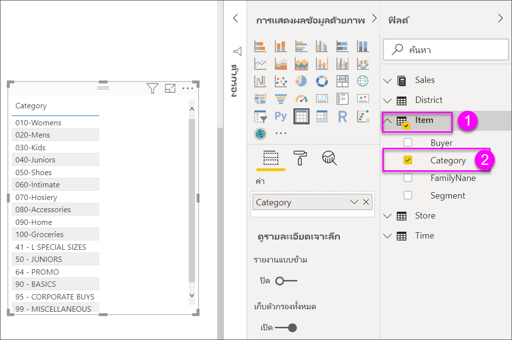

1. เลือก **ยอดขาย > ราคาต่อหน่วยเฉลี่ย** และ **ยอดขาย > ยอดขายปีที่ผ่านมา**Select **Sales > Average Unit Price** and **Sales > Last Year Sales**

1. จากนั้นเลือก **ยอดขาย > ยอดขายของปีนี้** และเลือกตัวเลือกทั้งสาม: **ค่า**, **เป้าหมาย** และ **สถานะ**Then select **Sales > This Year Sales** and select all three options: **Value**, **Goal**, and **Status**.

1. ในบานหน้าต่าง **การแสดงผลด้วยภาพ** ค้นหาแอ่ง **ค่า** แล้วเลือกค่าจนกว่าลำดับของคอลัมน์แผนภูมิของคุณตรงกับรูปภาพแรกในหน้านี้In the **Visualizations** pane, locate the **Values** well and select the values until the order of your chart columns matches the first image on this page. ลากค่าดังกล่าวไปยังอ่างดังกล่าวตามความเหมาะสมDrag the values in the well if needed. **ค่า** ของคุณด้วยจะมีลักษณะดังนี้Your **Values** well will look like this:

    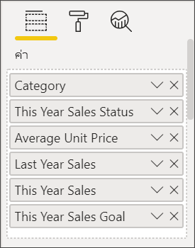

## จัดรูปแบบตารางFormat the table

มีหลายวิธีในการจัดรูปแบบตารางThere are many ways to format a table. มีเพียงไม่กี่ส่วนที่ครอบคลุมในส่วนนี้Only a few are covered here. วิธีที่ยอดเยี่ยมในการเรียนรู้เกี่ยวกับตัวเลือกอื่น ๆ ในการจัดรูปแบบคือการเปิด **บานหน้าต่าง** การจัดรูปแบบ (ไอคอนลูกกลิ้ง ) และสำรวจA great way to learn about the other formatting options is to open the **Format** pane (paint roller icon ) and explore.

* ลองจัดรูปแบบเส้นตารางTry formatting the table grid. ที่นี่เราได้เพิ่มเส้นตารางแนวตั้งสีน้ำเงิน เพิ่มช่องว่างในแถว และเพิ่มเค้าโครง และขนาดข้อความHere you'll add a blue vertical grid, add space to the rows, and increase the outline and text size.

    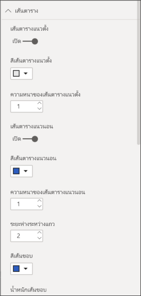

    

* สำหรับส่วนหัวของคอลัมน์ เปลี่ยนสีพื้นหลัง เพิ่มเค้าโครง และเพิ่มขนาดฟอนต์For the column headers, change the background color, add an outline, and increase the font size.

    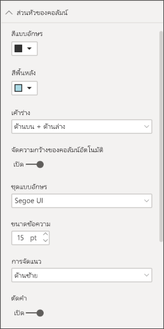

    

* คุณยังสามารถจัดรูปแบบกับ แต่ละคอลัมน์ และส่วนหัวของคอลัมน์You can even apply formatting to individual columns and column headers. เริ่มต้นด้วยการขยาย **การจัดรูปแบบเขตข้อมูล** และเลือกคอลัมน์เพื่อจัดรูปแบบจากรายการดรอปดาวน์Start by expanding **Field formatting** and selecting the column to format from the drop-down. ขึ้นอยู่กับค่าของคอลัมน์ **การจัดรูปแบบเขตข้อมูล** ช่วยให้คุณตั้งค่าสิ่งต่างๆ เช่น: หน่วยแสดงผล, สีฟอนต์, จำนวนตำแหน่งทศนิยม, พื้นหลัง, การจัดแนว และอื่นๆDepending on the column values, **Field formatting** lets you set things like: display units, font color, number of decimal places, background, alignment, and more. เมื่อคุณได้ปรับการตั้งค่าแล้ว ตัดสินใจว่าจะใช้การตั้งค่าเหล่านั้นกับส่วนหัวและแถวผลรวมได้เช่นกันOnce you've adjusted the settings, decide whether to apply those settings to the header and totals row as well.

    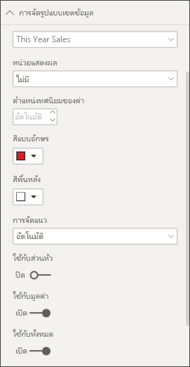

    

* หลังการปรับรูปแบบเพิ่มเติมบางส่วน ต่อไปนี้คือตารางขั้นสุดท้ายที่ได้After some additional formatting, here is our final table.

    

### การจัดรูปแบบแบบมีเงื่อนไขConditional formatting

*การจัดรูปแบบตามเงื่อนไข* คือการจัดรูปแบบชนิดหนึ่ง*Conditional formatting* is one type of formatting. Power BI สามารถปรับใช้การจัดรูปแบบตามเงื่อนไขกับเขตข้อมูลใดๆ ที่คุณเพิ่มลงใน **ค่า** ของบานหน้าต่าง **การแสดงผล**Power BI can apply conditional formatting to any of the fields that you added to the **Values** well of the **Visualizations** pane.

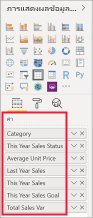

ด้วยการจัดรูปแบบตามเงื่อนไขสำหรับตาราง คุณสามารถระบุไอคอน URL สีพื้นหลังของเซลล์และสีฟอนต์ได้ด้วยตนเองโดยยึดตามค่าของเซลล์ รวมถึงการใช้สีไล่ระดับสีWith conditional formatting for tables, you can specify icons, URLs, cell background colors, and font colors based on cell values, including using gradient colors.

1. ในบานหน้าต่าง **รูปแบบ** เปิดการ์ด **การจัดรูปแบบตามเงื่อนไข**In the **Format** pane, open the **Conditional formatting** card.

    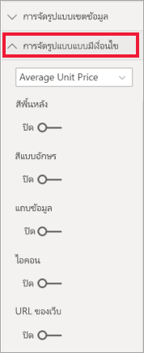

1. เลือกเขตข้อมูลที่จะจัดรูปแบบ และเลื่อนแถบเลื่อนสำหรับ **สีพื้นหลัง** เป็น เปิดSelect a field to format, and turn the slider for **Background color** to On. Power BI ปรับใช้การไล่ระดับสีที่ยึดตามค่าในคอลัมน์Power BI applies a gradient based on the values in the column. เมื่อต้องการเปลี่ยนสีเริ่มต้น ให้เลือก **ตัวควบคุมขั้นสูง**To change the default colors, select **Advanced controls**.

    หากคุณเลือกตัวเลือก **แยกจากกัน** คุณสามารถกำหนดค่า **ศูนย์กลาง** ที่เป็นทางเลือกได้เช่นกันIf you select the **Diverging** option, you can configure an optional **Center** value as well.

    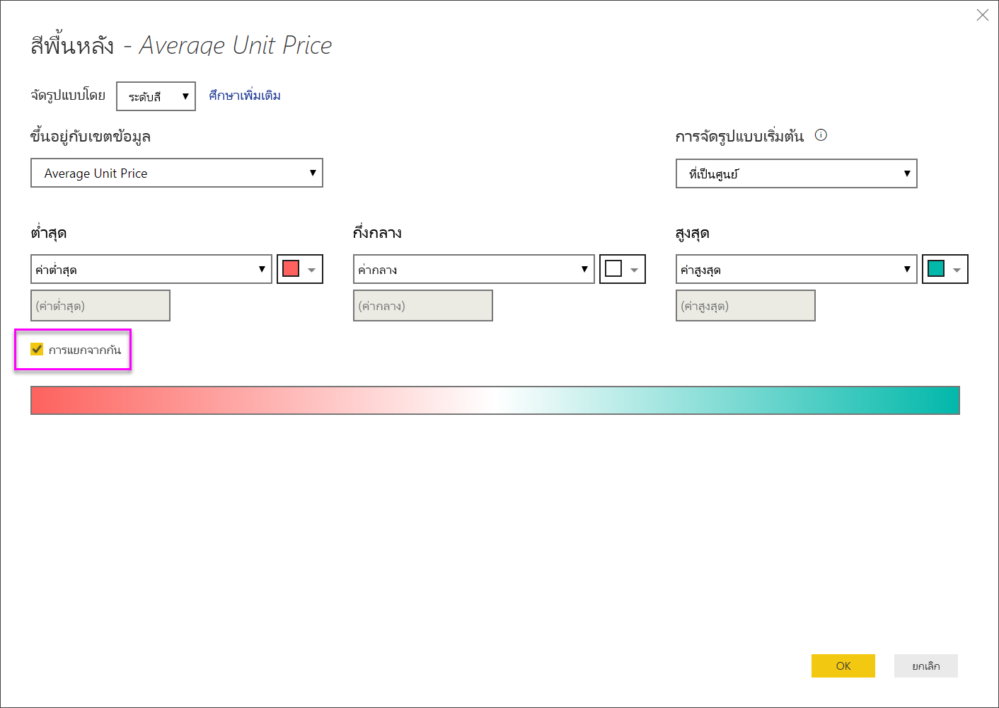

    เราลองใช้การจัดรูปแบบแบบกำหนดเองไปยังค่าของค่าเฉลี่ยราคาต่อหน่วยของเราLet's apply some custom formatting to our Average Unit Price values. เลือก **แยกจากกัน** เพิ่มสีเล็กน้อย และเลือก **ตกลง**Select **Diverging**, add some colors, and select **OK**.

    
1. เพิ่มเขตข้อมูลใหม่ไปยังตารางที่มีทั้งค่าบวกและค่าลบAdd a new field to the table that has both positive and negative values. เลือก **ยอดขาย > ผลต่างยอดขายรวม**Select **Sales > Total Sales Variance**.

    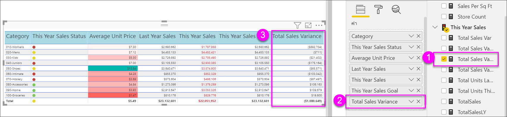

1. เพิ่มการจัดรูปแบบตามเงื่อนไขของแถบข้อมูลโดยการเลื่อนแถบเลื่อน **แถบข้อมูล** เป็น เปิดAdd data bar conditional formatting by turning the **Data bars** slider to On.  

    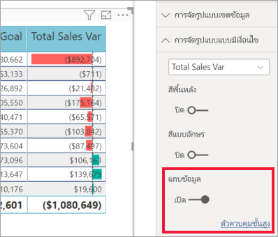

1. หากต้องการปรับแต่งแถบข้อมูล เลือก **ตัวควบคุมขั้นสูง**To customize the data bars, select **Advanced controls**. ในกล่องโต้ตอบที่ปรากฏขึ้น ตั้งค่าสีสำหรับ **แถบค่าบวก** และ **แถบค่าลบ** เลือกตัวเลือก **แสดงแถบเท่านั้น** และทำการเปลี่ยนแปลงอื่นๆ ที่คุณต้องการIn the dialog that appears, set colors for **Positive bar** and **Negative bar**, select the **Show bar only** option, and make any other changes you'd like.

    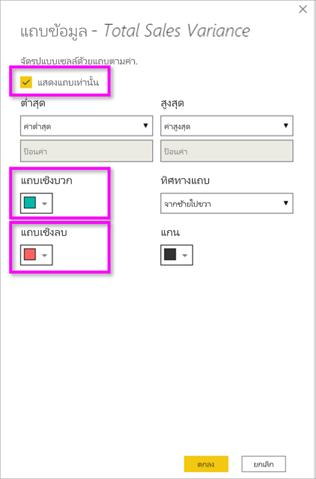

1. เลือก **ตกลง**Select **OK**.

    แถบข้อมูลจะแทนค่าตัวเลขในตารางที่ทำให้ง่ายต่อการสแกนData bars replace the numerical values in the table, making it easier to scan.

    

1. เพิ่มการแสดงภาพลงในตารางของคุณด้วย *ไอคอนแบบมีเงื่อนไข*Add visual cues to your table with *conditional icons*.  ในการ์ด **การจัดรูปแบบตามเงื่อนไข** เลือก **ยอดขายของปีนี้** จากรายการแบบเลื่อนลงIn the **Conditional formatting** card, select **This year sales** from the dropdown. เลื่อนแถบเลื่อน **ไอคอน** เป็น **เปิด**Turn the **Icons** slider to **On**.  หากต้องการปรับแต่งไอคอนต่างๆ เลือก **ตัวควบคุมขั้นสูง**To customize the icons, select **Advanced controls**.

    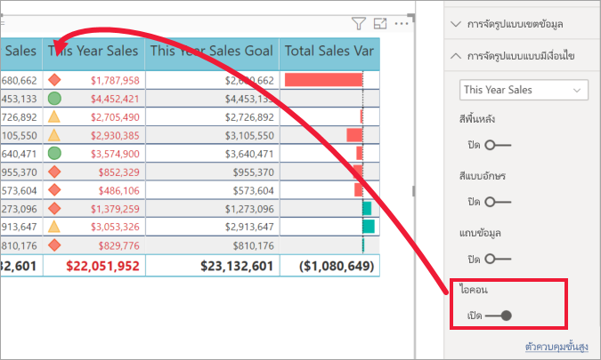

## คัดลอกค่าจากตาราง Power BI เพื่อนำไปใช้ในแอปพลิเคชันอื่นCopy values from Power BI tables for use in other applications

ตารางหรือเมทริกซ์ของคุณอาจมีเนื้อหาที่คุณต้องการใช้ในแอปพลิเคชันอื่น เช่น Dynamics CRM, Excel และแม้แต่รายงาน Power BI อื่นๆYour table or matrix may have content that you'd like to use in other applications, like Dynamics CRM, Excel, and even other Power BI reports. ใน Power BI เมื่อคุณคลิกขวาในเซล คุณสามารถคัดลอกข้อมูลในเซลเดียวหรือเซลตามที่เลือกไปยังคลิปบอร์ดของคุณ และวางในแอปพลิเคชันอื่นIn Power BI, when you right-click inside a cell, you can copy the data in a single cell or a selection of cells onto your clipboard, and paste it into the other applications.

เมื่อต้องการคัดลอกค่าของเซลล์เดียว:To copy the value of a single cell:

1. เลือกเซลล์คุณต้องการคัดลอกSelect the cell you want to copy.

1. คลิกขวาภายในเซลล์Right-click inside the cell.

1. เลือก **คัดลอก** > **คัดลอกค่า**Select **Copy** > **Copy value**.

    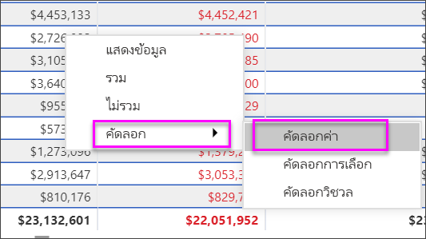

    คุณสามารถวางค่าที่คัดลอกลงในแอปพลิเคชันอื่นได้ โดยจะได้ค่าเซลล์ที่ไม่ได้จัดรูปแบบในคลิปบอร์ดWith the unformatted cell value on your clipboard, you can paste it into another application.

เมื่อต้องการคัดลอกมากกว่าเซลล์เดียว:To copy more than a single cell:

1. เลือกช่วงเซลล์ หรือใช้ปุ่ม **CTRL** เพื่อเลือกเซลล์อย่างน้อยหนึ่งเซลล์Select a range of cells or use **Ctrl** to select one or more cells.

1. คลิกขวาภายในหนึ่งเซลล์คุณเลือกRight-click inside one of the cells you selected.

1. เลือก **คัดลอก** > **คัดลอกส่วนที่เลือก**Select **Copy** > **Copy selection**.

    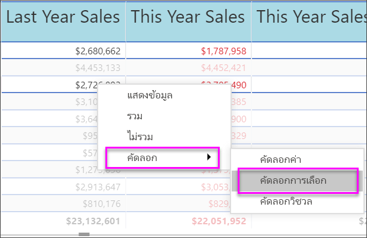

## ปรับความกว้างคอลัมน์ของตารางAdjust the column width of a table

ในบางครั้ง Power BI จะตัดส่วนหัวของคอลัมน์ในรายงาน และแดชบอร์ดออกSometimes Power BI will truncate a column heading in a report and on a dashboard. หากต้องการแสดงชื่อคอลัมน์ทั้งหมด เลื่อนพื้นที่ดังกล่าวไปทางด้านขวาของส่วนหัวเพื่อแสดงลูกศรคู่ เลือกแล้วลากTo show the entire column name, hover over the space to the right of the heading to reveal the double arrows, select, and drag.

## ข้อควรพิจารณาและการแก้ไขปัญหาConsiderations and troubleshooting

* เมื่อใช้การจัดรูปแบบคอลัมน์ คุณสามารถเลือกตัวเลือกการจัดแนวเพียงหนึ่งตัวเลือกต่อคอลัมน์: **อัตโนมัติ**, **ซ้าย**, **กึ่งกลาง**, **ขวา**When applying column formatting, you can only choose one alignment option per column: **Auto**, **Left**, **Center**, **Right**. โดยปกติแล้วจะ คอลัมน์ประกอบด้วยข้อความทั้งหมด หรือตัวเลขทั้งหมด และไม่ผสมกันUsually, a column contains all text or all numbers, and not a mix. ในกรณีที่คอลัมน์ที่ประกอบด้วยทั้งตัวเลขและข้อความ **อัตโนมัติ** จะจัดชิดซ้ายสำหรับข้อความ และชิดขวาสำหรับตัวเลขIn cases where a column contains both numbers and text, **Auto** will align left for text and right for numbers. พฤติกรรมนี้สนับสนุนภาษาที่คุณอ่านจากซ้ายไปขวาThis behavior supports languages where you read left-to-right.

* หากข้อมูลข้อความในเซลล์หรือส่วนหัวของตารางของคุณมีอักขระบรรทัดใหม่ อักขระเหล่านั้นจะถูกละเว้นถ้าคุณสลับตัวเลือก 'การตัดคำ' ในการ์ดบานหน้าต่างการจัดรูปแบบที่เกี่ยวข้องขององค์ประกอบIf the text data in your table's cells or headers contain new line characters, those characters will be ignored unless you toggle on the 'Word Wrap' option in the element's associated formatting pane card. 

* Power BI คำนวณขนาดเซลล์สูงสุดตามยี่สิบคอลัมน์แรกและห้าสิบแถวแรกPower BI calculates maximum cell size based on the first twenty columns and the first fifty rows. เซลล์ที่อยู่นอกเหนือจุดเหล่านั้นอาจมีขนาดไม่เหมาะสมCells beyond those points may not be appropriately sized.

## ขั้นตอนถัดไปNext steps

* [แผนผังต้นไม้ใน Power BITree maps in Power BI](power-bi-visualization-treemaps.md)

* [ชนิดการแสดงภาพใน Power BIVisualization types in Power BI](power-bi-visualization-types-for-reports-and-q-and-a.md)
