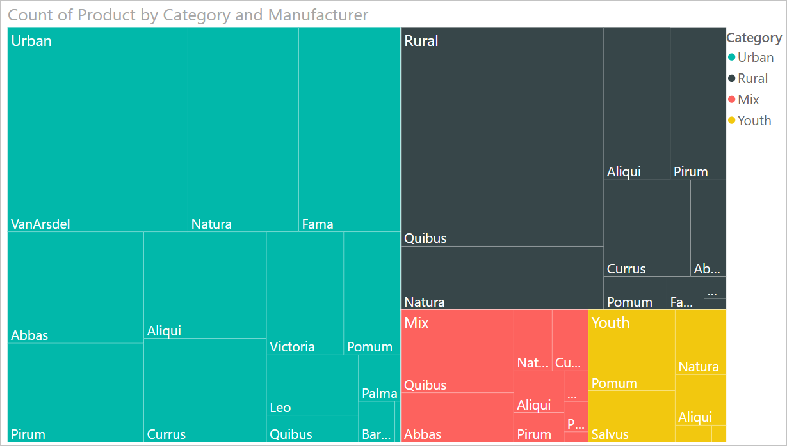
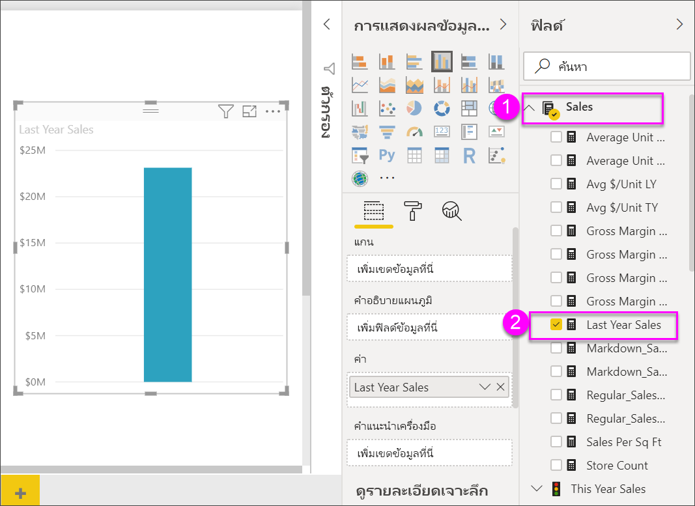
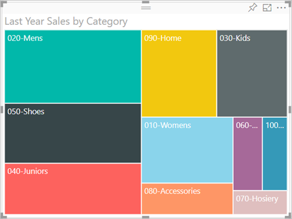
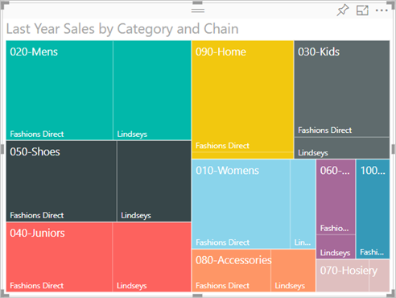
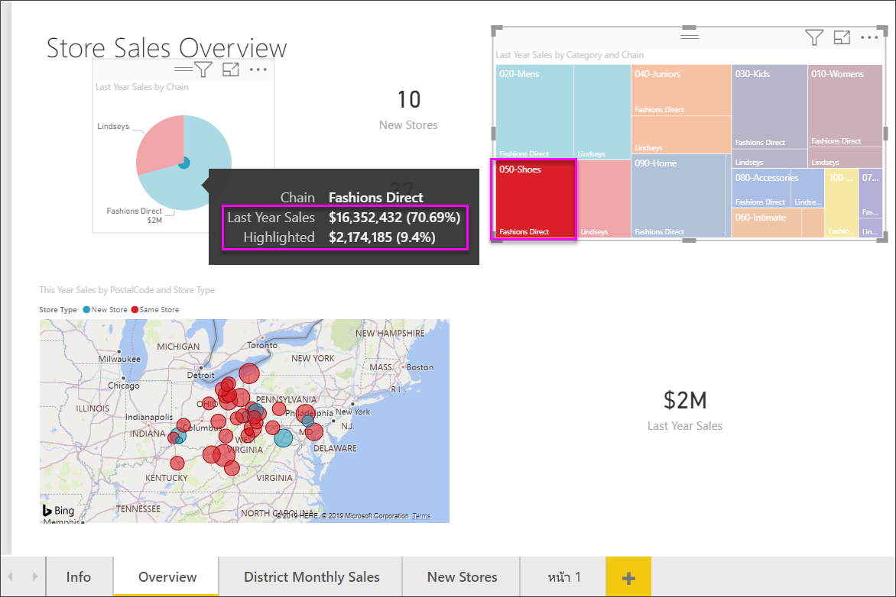

# แผนที่ต้นไม้ใน Power BITreemaps in Power BI

[!INCLUDE[consumer-appliesto-nyyn](../includes/consumer-appliesto-nyyn.md)]

[!INCLUDE [power-bi-visuals-desktop-banner](../includes/power-bi-visuals-desktop-banner.md)]

ทรีแมปจะแสดงข้อมูลแบบลำดับชั้นเป็นชุดของสี่เหลี่ยมผืนผ้าที่วางเรียงต่อๆ กันTreemaps display hierarchical data as a set of nested rectangles. แต่ละระดับของลำดับชั้นจะแสดงเป็นสี่เหลี่ยมสีต่างๆ (กิ่ง) ซึ่งประกอบด้วยสี่เหลี่ยมเล็กๆ ("ใบ")Each level of the hierarchy is represented by a colored rectangle (branch) containing smaller rectangles (leaves). Power BI จะกำหนดขนาดพื้นที่ด้านในรูปสี่เหลี่ยมแต่ละรูปตามค่าที่วัดไว้Power BI bases the size of the space inside each rectangle on the measured value. สี่เหลี่ยมเรียงตัวกันตามขนาดจากซ้ายบน (ใหญ่ที่สุด) ไปจนถึงขวาล่าง (เล็กสุด)The rectangles are arranged in size from top left (largest) to bottom right (smallest).

เช่น หากคุณกำลังวิเคราะห์ยอดขายของคุณ คุณอาจใช้กิ่งระดับสูงๆ สำหรับประเภทเสื้อผ้า: **เขตเมือง** **ชนบท** **เยาวชน** และ **รวมกัน**For example, if you're analyzing your sales, you might have top-level branches for the clothing categories: **Urban**, **Rural**, **Youth**, and **Mix**. Power BI จะแบ่งสี่เหลี่ยมบ่งบอกประเภทของคุณออกเป็นใบไม้หลายๆ ใบ สำหรับผู้ผลิตเสื้อผ้าในประเภทนั้นๆPower BI would split your category rectangles into leaves, for the clothing manufacturers within that category. ใบไม้เหล่านี้จะปรับขนาดและและขนาดตามจำนวนสินค้าที่ขายได้These leaves would be sized and shaded based on the number sold.

ในกิ่ง **เขตเมือง** ด้านบน เสื้อผ้า **VanArsdel** ขายได้เป็นจำนวนมากIn the **Urban** branch above, lots of **VanArsdel** clothing was sold. **Natura** และ **Fama** ขายได้จำนวนน้อยกว่าLess **Natura** and **Fama** was sold. **Leo** ขายได้จำนวนเล็กน้อยเท่านั้นOnly a few **Leo** were sold. ดังนั้น กิ่ง **เขตเมือง** ในทรีแมปของคุณจึงมี:So, the **Urban** branch of your Treemap has:

* สี่เหลี่ยมอันใหญ่ที่สุดหมายถึง **VanArsdel** ในมุมซ้ายบนThe largest rectangle for **VanArsdel** in the top-left corner.

* สี่เหลี่ยมอันเล็กกว่าเล็กน้อยหมายถึง  **Natura** และ **Fama**Slightly smaller rectangles for **Natura** and **Fama**.

* สี่เหลี่ยมอันอื่นๆ แทนเสื้อผ้าแบรนด์อื่นๆ ที่ขายได้Lots of other rectangles for all the other clothing sold.

* สี่เหลี่ยมขนาดเล็กแทน  **Leo**A tiny rectangle for **Leo**.

คุณสามารถนำจำนวนสินค้าที่ขายไปเปรียบเทียบกับเสื้อผ้าประเภทอื่นๆ ด้วยการเปรียบเทียบขนาดและเฉดสีของโหนดปลายสุด สี่เหลี่ยมที่ใหญ่กว่าและเข้มกว่าหมายถึงค่าที่สูงกว่าYou could compare the number of items sold across the other clothing categories by comparing the size and shading of each leaf node; larger and darker rectangles mean higher value.

## เราจะใช้ทรีแมปในกรณีใดWhen to use a treemap

ทรีแมปเป็นทางเลือกที่เหมาะสมอย่างยิ่ง ในกรณีต่อไปนี้:Treemaps are a great choice:

* เมื่อต้องการแสดงข้อมูลแบบลำดับชั้นเป็นจำนวนมากTo display large amounts of hierarchical data.

* เมื่อไม่สามารถใช้แผนภูมิแท่งในการนำเสนอข้อมูลจำนวนมากได้อย่างมีประสิทธิภาพWhen a bar chart can't effectively handle the large number of values.

* เมื่อต้องการแสดงสัดส่วนระหว่างแต่ละองค์ประกอบกับข้อมูลทั้งหมดTo show the proportions between each part and the whole.

* เมื่อต้องการแสดงรูปแบบของการแจกแจงข้อมูลของข้อมูลตัวเลขในแต่ละระดับของประเภทในลำดับชั้นTo show the pattern of the distribution of the measure across each level of categories in the hierarchy.

* เมื่อต้องการแสดงแอตทริบิวต์ที่ใช้การแสดงรหัสด้วยสีและขนาดTo show attributes using size and color coding.

* เมื่อต้องการกำหนดรูปแบบ ค่าผิดปกติ ปัจจัยสนับสนุนที่สำคัญอย่างยิ่งและและข้อยกเว้นTo spot patterns, outliers, most-important contributors, and exceptions.

## เงื่อนไขเบื้องต้นPrerequisite

บทช่วยสอนนี้ใช้[ไฟล์ PBIX ตัวอย่างการวิเคราะห์การค้าปลีก](https://download.microsoft.com/download/9/6/D/96DDC2FF-2568-491D-AAFA-AFDD6F763AE3/Retail%20Analysis%20Sample%20PBIX.pbix)This tutorial uses the [Retail Analysis sample PBIX file](https://download.microsoft.com/download/9/6/D/96DDC2FF-2568-491D-AAFA-AFDD6F763AE3/Retail%20Analysis%20Sample%20PBIX.pbix).

1. จากด้านบนซ้ายของแถบเมนู เลือก **ไฟล์** > **เปิด**From the upper left section of the menubar, select **File** > **Open**
   
2. ค้นหาสำเนา **ไฟล์ PBIX ตัวอย่างการวิเคราะห์การค้าปลีก**Find your copy of the **Retail Analysis sample PBIX file**

1. เปิด **ไฟล์ PBIX ตัวอย่างการวิเคราะห์การค้าปลีก** ในมุมมองรายงาน Open the **Retail Analysis sample PBIX file** in report view .

1. เลือกSelect  หากต้องการเพิ่มหน้าใหม่to add a new page.

> [!NOTE]
> การแชร์รายงานของคุณกับผู้ร่วมงาน Power BI กำหนดให้คุณต้องมีสิทธิ์การใช้งาน Power BI Pro แต่ละรายการ หรือรายงานจะถูกบันทึกในความจุแบบพรีเมียมSharing your report with a Power BI colleague requires that you both have individual Power BI Pro licenses or that the report is saved in Premium capacity.    

หลังจากที่คุณเรียกดูชุดข้อมูล **ตัวอย่างการวิเคราะห์ร้านค้าปลีก** คุณจะสามารถเริ่มใช้งานได้After you get the **Retail Analysis Sample** dataset, you can get started.

## สร้างทรีแมปแบบพื้นฐานCreate a basic treemap

คุณจะสร้างรายงาน และเพิ่มทรีแมปแบบพื้นฐานYou'll create a report and add a basic treemap.

1. ในบานหน้าต่าง **เขตข้อมูล** ให้เลือกมาตรวัด **ยอดขาย** > **ยอดขายของปีที่ผ่านมา**From the **Fields** pane, select the **Sales** > **Last Year Sales** measure.

   

1. เลือกไอคอนทรีแมปSelect the treemap icon  การแปลงแผนภูมิเป็นทรีแมปto convert the chart to a treemap.

   

1. เลือก **รายการ** > **หมวดหมู่** ที่จะเพิ่ม **หมวหมู่** ไปยัง **กลุ่ม**Select **Item** > **Category** which will add **Category** to the **Group** well.

    Power BI จะสร้างแผนที่ต้นไม้ โดยที่ขนาดของสี่เหลี่ยมผืนผ้าจะแสดงถึงยอดขายรวม และสีจะแสดงถึงประเภทPower BI creates a treemap where the size of the rectangles is based on total sales and the color represents the category. แท้จริงแล้ว คุณได้สร้างลำดับชั้นที่อธิบายขนาดสัมพัทธ์ของยอดขายรวมจำแนกตามประเภทได้อย่างชัดเจนIn essence you've created a hierarchy that visually describes the relative size of total sales by category. ประเภท **ผู้ชาย** มียอดขายสูงสุด และ **ถุงเท้าและชุดชั้นใน** มียอดขายต่ำที่สุดThe **Men's** category has the highest sales and the **Hosiery** category has the lowest.

    

1. เลือก **ร้านค้า** > **เครือข่าย** เพื่อเพิ่ม **เครือข่าย** ไปยัง **รายละเอียด** เพื่อเติมแผนผังทรีของคุณSelect **Store** > **Chain** which will add **Chain** to the **Details** well to complete your treemap. ตอนนี้คุณก็สามารถเปรียบเทียบยอดขายของปีล่าสุดจำแนกตามประเภทกับร้านค้าเครือข่ายสาขาได้แล้วYou can now compare last year's sales by category and chain.

   

   > [!NOTE]
   > ไม่สามารถใช้ความเข้มของสีและรายละเอียดในเวลาเดียวกันได้Color Saturation and Details cannot be used at the same time.

1. โฮเวอร์เหนือพื้นที่ **ร้านเครือข่ายสาขา** เพื่อดูคำแนะนำเครื่องมือสำหรับส่วนนั้นๆ ของ **ประเภท**Hover over a **Chain** area to reveal the tooltip for that portion of the **Category**.

    ตัวอย่าง เหนือ **Fashions Direct** ใน **090 Home** สี่เหลี่ยมผืนผ้าแสดงคำแนะนำสำหรับสัดส่วนของ Fashions Direct ของประเภทของบ้านFor example, hovering over **Fashions Direct** in the **090-Home** rectangle reveals the tooltip for Fashion Direct's portion of the Home category.

   

## การทำไฮไลท์และการกรองข้ามHighlighting and cross-filtering

แรเงาเลือก **หมวดหมู่** หรือ **รายละเอียด** จากแผนผังทรี แรเงาและกรองโยงสว่นการแสดงผลอื่น ๆ ในหน้ารายงานHighlighting a **Category** or **Detail** in a treemap cross-highlights and cross-filters the other visualizations on the report page. เมื่อต้องการทำตามขั้นตอน เพิ่มภาพบางภาพไปยังหน้ารายงานนี้ หรือคัดลอกทรีแมปไปยังหน้าอื่นๆ ในรายงานนี้To follow along, either add some visuals to this report page or copy the treemap to one of the other pages in this report. ภาพแผนผังทรีด้านล่างถูกคัดลอกไปที่หน้า **ภาพรวม**The below image the treemap was copied over to the **Overview** page. 

1. ในทรีแมป ให้เลือก **ประเภท** หรือ **ร้านในเครือ** ภายใน **ประเภท**On the treemap, select either a **Category** or a **Chain** within a **Category**. ซึ่งจะไฮไลต์ข้ามการแสดงภาพอื่นๆ บนหน้าThat will cross-highlight the other visualizations on the page. ตัวอย่างเช่น การเลือก **050-Shoes** จะแสดงให้เห็นว่ายอดขายของรองเท้าของปีที่แล้วมีมูลค่า **16,352,432 ดอลลาร์** โดยที่ **การขายตรงสินค้าแฟชั่น** คิดเป็นมูลค่า **2,174,185 ดอลลาร์** ของยอดขายเหล่านั้นSelecting **050-Shoes**, for example, shows you that last year's sales for shoes was **$16,352,432** with **Fashions Direct** accounting for **$2,174,185** of those sales.

   

1. ในแผนภูมิวงกลม **ยอดขายปีล่าสุดในร้านค้าเครือข่ายสาขา** เมื่อเลือกชิ้นวงกลม **การขายตรงสินค้าแฟชั่น** จะกรองข้ามทรีแมปIn the **Last Year Sales by Chain** pie chart, selecting the **Fashions Direct** slice, cross-filters the treemap.
   

1. เมื่อต้องการจัดการวิธีการที่แผนภูมิไฮไลต์ข้ามและกรองข้ามระหว่างกัน โปรดดู [การเปลี่ยนแปลงวิธีการโต้ตอบของการแสดงภาพในรายงาน Power BI](../create-reports/service-reports-visual-interactions.md)To manage how charts cross-highlight and cross-filter each other, see [Change how visuals interact in a Power BI report](../create-reports/service-reports-visual-interactions.md).

## ขั้นตอนถัดไปNext steps

* [แผนภูมิแบบน้ำตกใน Power BIWaterfall charts in Power BI](power-bi-visualization-waterfall-charts.md)

* [ชนิดการแสดงภาพใน Power BIVisualization types in Power BI](power-bi-visualization-types-for-reports-and-q-and-a.md)

