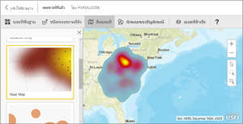
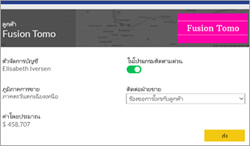
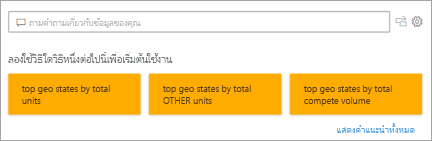
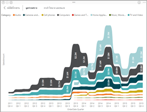
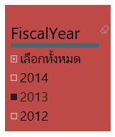
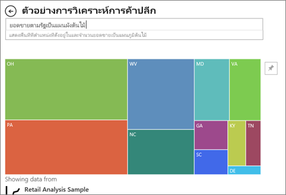

# ชนิดการแสดงภาพใน Power BIVisualization types in Power BI
## การแสดงภาพ Power BIPower BI visualizations
เราจะเพิ่มการแสดงภาพใหม่ โปรดติดตามต่อไป!We'll be adding new visualizations, stay tuned!

และดูที่ [Microsoft AppSource](https://appsource.microsoft.com/marketplace/apps?product=power-bi-visuals) ซึ่งคุณจะพบรายการ[วิชวล Power BI](../developer/visuals/power-bi-custom-visuals.md) ที่เพิ่มจำนวนขึ้นเรื่อย ๆ คุณสามารถดาวน์โหลดและใช้ในแดชบอร์ดและรายงานของคุณเองได้And check out the [Microsoft AppSource](https://appsource.microsoft.com/marketplace/apps?product=power-bi-visuals) , where you'll find a growing list of [Power BI visuals](../developer/visuals/power-bi-custom-visuals.md) you can download and use in your own dashboards and reports. รู้สึกมีความคิดสร้างสรรค์?Feeling creative? [เรียนรู้วิธีการสร้างและเพิ่มภาพของคุณเองไปยังเว็บไซต์ชุมชนนี้](../developer/visuals/office-store.md)[Learn how to create and add your own visuals to this community site](../developer/visuals/office-store.md).  

## รายการของการแสดงภาพที่พร้อมใช้งานใน Power BIList of visualizations available in Power BI
การแสดงภาพเหล่านี้ทั้งหมดสามารถถูกเพิ่มลงในรายงาน Power BI ที่ระบุในการถามตอบ และปักหมุดไปยังแดชบอร์ดได้All of these visualizations can be added to Power BI reports, specified in Q&A, and pinned to dashboards.

### แผนภูมิพื้นที่: พื้นฐาน (เป็นชั้น) และแบบเรียงซ้อนArea charts: Basic (Layered) and Stacked

>[!TIP]
>แผนภูมิพื้นที่พื้นฐานจะยึดตามแผนภูมิเส้นที่มีพื้นที่ระหว่างแกนและเส้นเป็นบริเวณทึบThe Basic Area chart is based on the line chart with the area between the axis and line filled in.

สำหรับข้อมูลเพิ่มเติม ดู[แผนภูมิพื้นที่พื้นฐาน](power-bi-visualization-basic-area-chart.md)For more information, see [Basic Area chart](power-bi-visualization-basic-area-chart.md).

### แผนภูมิแท่งและแผนภูมิคอลัมน์Bar and column charts

 

>[!TIP]
>แผนภูมิแท่งเป็นมาตรฐานสำหรับการดูที่ีค่าเฉพาะในแต่ละประเภทBar charts are the standard for looking at a specific value across different categories.

### การ์ด: หลายแถวCards: Multi row

### การ์ด: หมายเลขเดียวCards: Single number

สำหรับข้อมูลเพิ่มเติม ดู[สร้างการ์ด (ไทล์ตัวเลขขนาดใหญ่)](power-bi-visualization-card.md)For more information, see [Create a Card (big number tile)](power-bi-visualization-card.md).

### แผนภูมิผสมCombo charts

>[!TIP]
>แผนภูมิผสมรวมแผนภูมิคอลัมน์และแผนภูมิเส้นไว้ด้วยกันA Combo chart combines a column chart and a line chart. เลือกจาก *เส้นและคอลัมน์แบบเรียงซ้อน* และ *เส้นและแผนภูมิคอลัมน์กลุ่ม*Choose from *Line and Stacked Column* and *Line and Clustered Column*.

สำหรับข้อมูลเพิ่มเติม ดู[แผนภูมิผสมใน Power BI](power-bi-visualization-combo-chart.md)For more information, see [Combo charts in Power BI](power-bi-visualization-combo-chart.md).

### แผนภูมิโดนัทDoughnut charts

>[!TIP]
>แผนภูมิโดนัทจะคล้ายกับแผนภูมิวงกลมDoughnut charts are similar to Pie charts.  โดยที่จะแสดงความสัมพันธ์ของส่วนต่าง ๆ ต่อส่วนทั้งหมดThey show the relationship of parts to a whole.

สำหรับข้อมูลเพิ่มเติม ดู [แผนภูมิโดนัทใน Power BI](power-bi-visualization-doughnut-charts.md)For more information, see [Doughnut charts in Power BI](power-bi-visualization-doughnut-charts.md).

### แผนภูมิกรวยFunnel charts

>[!TIP]
>แผนภูมิกรวยช่วยในการสร้างภาพของกระบวนการที่มีลำดับขั้น และรายการต่าง ๆ ให้จัดเรียงตามลำดับจากขั้นหนึ่งไปยังอีกขั้นFunnels help visualize a process that has stages and items flow sequentially from one stage to the next.  ใช้แผนภูมิกรวยเมื่อมีโฟลว์ลำดับระหว่างขั้นตอนต่าง ๆ เช่นกระบวนการขายที่เริ่มต้นด้วยลูกค้าเป้าหมาย และลงท้ายด้วยการขายUse a funnel when there is a sequential flow between stages, such as a sales process that starts with leads and ends with purchase fulfillment.

สำหรับข้อมูลเพิ่มเติม ดู [แผนภูมิกรวยใน Power BI](power-bi-visualization-funnel-charts.md)For more information, see [Funnel Charts in Power BI](power-bi-visualization-funnel-charts.md).

### แผนภูมิตัววัดGauge charts

>[!TIP]
>แสดงสถานะปัจจุบันในบริบทของเป้าหมายDisplays current status in the context of a goal.

สำหรับข้อมูลเพิ่มเติม ดู [แผนภูมิวัดความเร็วใน Power BI](power-bi-visualization-radial-gauge-charts.md)For more information, see [Gauge Charts in Power BI](power-bi-visualization-radial-gauge-charts.md).

### แผนภูมิผู้มีอิทธิพลหลักKey influencers chart

แผนภูมิผู้มีอิทธิพลหลักแสดงผู้สนับสนุนหลักไปยังผลลัพธ์หรือค่าที่เลือกA key influencer chart displays the major contributors to a selected result or value.

สำหรับข้อมูลเพิ่มเติม ดู[แผนภูมิผู้มีอิทธิพลหลักใน Power BI](power-bi-visualization-influencers.md)For more information, see [Key influencer charts in Power BI](power-bi-visualization-influencers.md)

### KPIKPIs

>[!TIP]
>แสดงความคืบหน้าของการบรรลุเป้าหมายที่วัดได้Displays progress toward a measurable goal.

สำหรับข้อมูลเพิ่มเติม ดู [KPI ใน Power BI](power-bi-visualization-kpi.md)For more information, see [KPIs in Power BI](power-bi-visualization-kpi.md).

### แผนภูมิเส้นLine charts

>[!TIP]
>เน้นรูปร่างโดยรวมของชุดข้อมูลค่าทั้งหมด โดยปกติแล้วจะดูเทียบกับเวลาที่ผ่านไปEmphasize the overall shape of an entire series of values, usually over time.

### แผนที่: แผนที่พื้นฐานMaps: Basic maps

>[!TIP]
>ใช้เพื่อเชื่อมโยงข้อมูลเชิงหมวดหมู่และข้อมูลเชิงปริมาณเข้ากับตำแหน่งที่ตั้งเชิงพื้นที่Used to associate both categorical and quantitative information with spatial locations.

สำหรับข้อมูลเพิ่มเติม ดู[คำแนะนำและเคล็ดลับสำหรับภาพแผนที่](power-bi-map-tips-and-tricks.md)For more information, see [Tips and tricks for map visuals](power-bi-map-tips-and-tricks.md).

### แผนที่: แผนที่ ArcGISMaps: ArcGIS maps

สำหรับข้อมูลเพิ่มเติม ดู [แผนที่ ArcGIS ใน Power BI](power-bi-visualizations-arcgis.md)For more information, see [ArcGIS maps in Power BI](power-bi-visualizations-arcgis.md).

### แผนที่: แผนที่แถบสี (Choropleth)Maps: Filled maps (Choropleth)

>[!TIP]
>ยิ่งมีีสีเข้มเท่าไหร่ ค่านั้นยิ่งมากขึ้นเท่านัั้นThe more intense the color, the larger the value.

สำหรับข้อมูลเพิ่มเติม ดู [แผนที่แถบสีใน Power BI](power-bi-visualization-filled-maps-choropleths.md)For more information, see [Filled Maps in Power BI](power-bi-visualization-filled-maps-choropleths.md).

### แผนที่: แผนที่รูปร่างMaps: Shape maps

>[!TIP]
>เปรียบเทียบภูมิภาคตามสีCompares regions by color.

สำหรับข้อมูลเพิ่มเติม ดู [แผนที่รูปร่างใน Power BI](desktop-shape-map.md)For more information, see [Shape Maps in Power BI](desktop-shape-map.md).

### เมทริกซ์Matrix

>[!TIP]
>ตารางสนับสนุนการใช้งานแบบสองมิติ แต่เมทริกซ์ทำให้การแสดงข้อมูลง่ายและมีความหมายในทั้งหลายมิติและเมทริกซ์สนับสนุนการจัดวางอย่างเป็นขั้นเป็นตอนA table supports two dimensions, but a matrix makes it easier to display data meaningfully across multiple dimensions -- it supports a stepped layout. เมทริกซ์จะรวมข้อมูลโดยอัตโนมัติและสามารถเจาะลึกลงไปThe matrix automatically aggregates the data and enables drill down. 

สำหรับข้อมูลเพิ่มเติม ดู [การแสดงผลด้วยภาพแบบเมทริกซ์ใน Power BI](desktop-matrix-visual.md)For more information, see [Matrix visuals in Power BI](desktop-matrix-visual.md).

### แผนภูมิวงกลมPie charts

>[!TIP]
>แผนภูมิวงกลมจะแสดงความสัมพันธ์ของส่วนต่าง ๆ ต่อส่วนทั้งหมดPie charts show the relationship of parts to a whole. 

### วิชวล Power AppsPower Apps visual

นักออกแบบรายงานสามารถสร้าง Power App และฝังลงในรายงาน Power BI เป็นวิชวลได้Report designers can create a Power App and embed it into a Power BI report as a visual. ลูกค้าสามารถโต้ตอบกับวิชวลด้วยรายงาน Power BI ได้Consumers can interact with that visual within the Power BI report. 

สำหรับข้อมูลเพิ่มเติม ดู [เพิ่มวิชวล Power Apps ไปยังรายงานของคุณ](power-bi-visualization-powerapp.md)For more information, see [Add a Power Apps visual to your report](power-bi-visualization-powerapp.md).

### วิชวลถามตอบQ&A visual

>[!TIP]
>คล้ายกับ [ประสบการณ์ถามตอบเกี่ยวกับแดชบอร์ด](../create-reports/power-bi-tutorial-q-and-a.md) วิชวลถามตอบช่วยให้คุณสามารถถามคำถามเกี่ยวกับข้อมูลของคุณโดยใช้ภาษาธรรมชาติSimilar to the [Q&A experience on dashboards](../create-reports/power-bi-tutorial-q-and-a.md), the Q&A visual lets you ask questions about your data using natural language. 

สำหรับข้อมูลเพิ่มเติม โปรดดู[วิชวลถามตอบใน Power BI](power-bi-visualization-q-and-a.md)For more information, see [Q&A visuals in Power BI](power-bi-visualization-q-and-a.md).

### ภาพสคริปต์ RR script visuals

>[!TIP]
>ภาพที่สร้างขึ้นด้วยสคริปต์ R มักเรียกว่า *ภาพ R* ซึ่งสามารถนำเสนอการปรับรูปร่างข้อมูลและการวิเคราะห์ขั้นสูง เช่น การทำนายโดยใช้การวิเคราะห์ที่มีข้อมูลเต็มเปี่ยมและพลังของการแสดงภาพ R ภาพ R สามารถถูกสร้างขึ้นใน Power BI Desktop และเผยแพร่ไปยังบริการ Power BIVisuals created with R scripts, commonly called *R visuals*, can present advanced data shaping and analytics such as forecasting, using the rich analytics and visualization power of R. R visuals can be created in Power BI Desktop and published to the Power BI service.   

สำหรับข้อมูลเพิ่มเติม ดู[การแสดงผลด้วยภาพแบบ R ใน Power BI](service-r-visuals.md)For more information, see [R visuals in Power BI](service-r-visuals.md).

### แผนภูมิริบบอนRibbon chart

>[!TIP]
>แผนภูมิ Ribbon แสดงประเภทข้อมูลที่มีอันดับสูงสุด (ค่ามากที่สุด)Ribbon charts show which data category has the highest rank (largest value). แผนภูมิ Ribbon เหมาะกับการแสดงการเปลี่ยนแปลงอันดับ โดยที่ค่าอันดับสูงสุดจะแสดงอยู่ด้านบนสุดของแต่ละช่วงเวลาเสมอRibbon charts are effective at showing rank change, with the highest range (value) always displayed on top for each time period.

สำหรับข้อมูลเพิ่มเติม ดู[การใช้แผนภูมิ Ribbon ใน Power BI](desktop-ribbon-charts.md)For more information, see [Ribbon charts in Power BI](desktop-ribbon-charts.md).

### แผนภูมิกระจายและแผนภูมิฟองScatter and Bubble charts

>[!TIP]
>แสดงความสัมพันธ์ระหว่างหน่วยวัดเชิงปริมาณ 2 หน่วย (กระจาย) หรือ 3 หน่วย (แผนภูมิฟอง) โดยไม่คำนึงถึงลำดับและอื่น ๆDisplay relationships between 2 (scatter) or 3 (bubble) quantitative measures -- whether or not, in which order, etc.

สำหรับข้อมูลเพิ่มเติม ดู[แผนภูมิกระจายใน Power BI](power-bi-visualization-scatter.md)For more information, see [Scatter charts in Power BI](power-bi-visualization-scatter.md).

### ความหนาแน่นสูงกระจายScatter-high density

>[!TIP]
>จุดข้อมูลมากเกินไปบนการแสดงผลด้วยภาพสามารถทำให้หยุดชะงักได้ เพื่อใช้อัลกอริทึมการสุ่มตัวอย่างที่ซับซ้อนเพื่อให้แน่ใจความแม่นยำของการแสดงภาพToo many data points on a visual can bog it down, so a sophisticated sampling algorithm is used to ensure the accuracy of the visualization.

สำหรับข้อมูลเพิ่มเติม ดู[แผนภูมิกระจายความหนาแน่นสูงใน Power BI](../create-reports/desktop-high-density-scatter-charts.md)For more information, see [High Density Scatter charts in Power BI](../create-reports/desktop-high-density-scatter-charts.md).

### ตัวแบ่งส่วนข้อมูลSlicers

สำหรับข้อมูลเพิ่มเติม ดู[ตัวแบ่งส่วนข้อมูลใน Power BI](power-bi-visualization-slicers.md)For more information, see [Slicers in Power BI](power-bi-visualization-slicers.md).

### รูปภาพเดี่ยวStandalone images

สำหรับข้อมูลเพิ่มเติม ดู[เพิ่มรูปภาพวิดเจ็ตไปยังแดชบอร์ด](../create-reports/service-dashboard-add-widget.md)For more information, see [Add an image widget to a dashboard](../create-reports/service-dashboard-add-widget.md).

### ตารางTables

>[!TIP]
>ทำงานได้ดีกับการเปรียบเทียบเชิงปริมาณระหว่างรายการต่าง ๆ ที่มีหลากลายประเภทWork well with quantitative comparisons among items where there are many categories.

สำหรับข้อมูลเพิ่มเติม ดู[การทำงานกับตารางใน Power BI](power-bi-visualization-tables.md)For more information, see [Working with tables in Power BI](power-bi-visualization-tables.md).

### แผนภูมิต้นไม้Treemaps

สำหรับข้อมูลเพิ่มเติม ดู[แผนภูมิต้นไม้ใน Power BI](power-bi-visualization-treemaps.md)For more information, see [Treemaps in Power BI](power-bi-visualization-treemaps.md).

>[!TIP]
>แผนภูมิพื้นที่ที่มีสี่เหลี่ยมผืนผ้าเติมสีจะมีค่าที่เป็นตัวแทนขนาดAre charts of colored rectangles, with size representing value.  แผนภูมิเหล่านี้อาจเป็นแบบชั้นโดยที่มีสี่เหลี่ยมผืนผ้าที่ซ้อนกันภายในสี่เหลี่ยมผืนผ้าหลักThey can be hierarchical, with rectangles nested within the main rectangles.

### แผนภูมิแบบน้ำตกWaterfall charts

>[!TIP]
>แผนภูมิแบบน้ำตกจะแสดงผลรวมสะสมเป็นค่าที่เพิ่มขึ้นหรือลดลงWaterfall charts show a running total as values are added or subtracted.

สำหรับข้อมูลเพิ่มเติม ดู[แผนภูมิน้ำตกใน Power BI](power-bi-visualization-waterfall-charts.md)For more information, see [Waterfall charts in Power BI](power-bi-visualization-waterfall-charts.md).

## บอกการถามตอบว่าต้องใช้การแสดงภาพแบบใดTell Q&A which visualization to use
เมื่อพิมพ์คิวรี่ด้วยภาษาธรรมชาติในการถามตอบของ Power BI A คุณสามารถระบุชนิดการแสดงภาพในคิวรี่ของคุณได้When typing natural language queries with Power BI Q&A, you can specify the visualization type in your query.  ตัวอย่างเช่น:For example:

"***ยอดขายตามรัฐเป็นแผนผังต้นไม้***""***sales by state as a treemap***"

ถ้าแดชบอร์ดของคุณไม่มีเขตข้อมูลถามตอบอาจถูกปิดใช้งานโดยผู้ดูแลระบบ Power BI ของคุณIf your dashboard doesn't have a Q&A field, it may have been disabled by your Power BI admin. 

## ขั้นตอนถัดไปNext steps
[การแสดงภาพในรายงาน Power BI](power-bi-report-visualizations.md)  [Visualizations in Power BI reports](power-bi-report-visualizations.md)    
[อ้างอิงภาพที่ถูกต้องจาก sqlbi.comThe right visual reference from sqlbi.com](https://www.sqlbi.com/wp-content/uploads/videotrainings/dashboarddesign/visuals-reference-may2017-A3.pdf)

