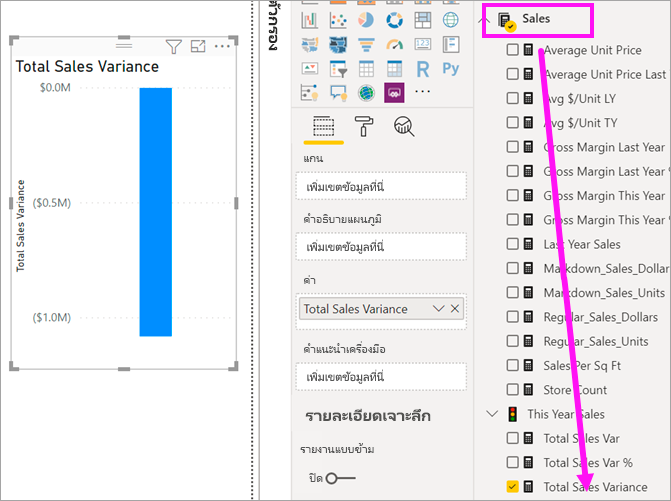
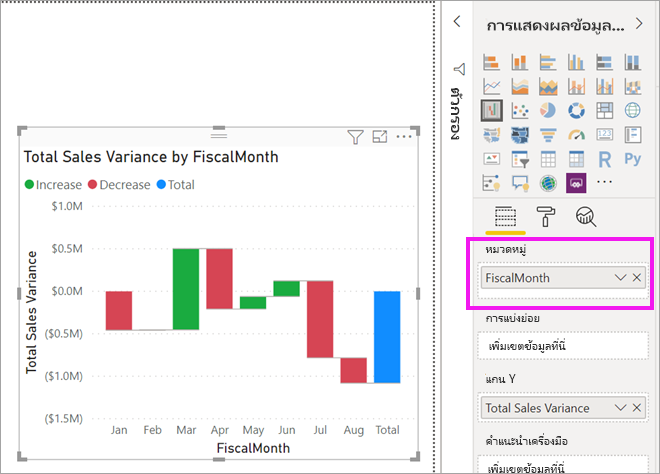
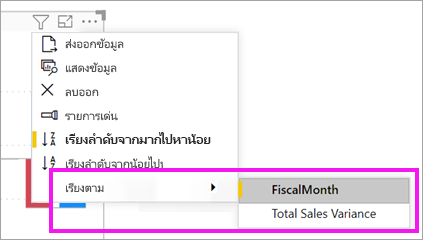
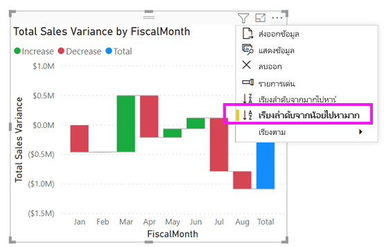
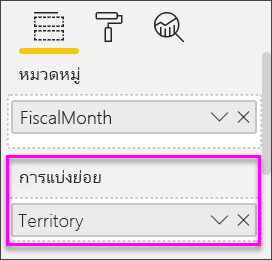
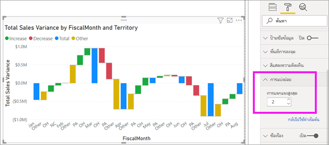

# แผนภูมิแบบน้ำตกใน Power BIWaterfall charts in Power BI

[!INCLUDE[consumer-appliesto-nyyn](../includes/consumer-appliesto-nyyn.md)]

[!INCLUDE [power-bi-visuals-desktop-banner](../includes/power-bi-visuals-desktop-banner.md)]

แผนภูมิแบบน้ำตกจะแสดงผลรวมสะสมเป็นค่าของ Power BI ที่เพิ่มขึ้นหรือลดลงWaterfall charts show a running total as Power BI adds and subtracts values. แผนภูมิเหล่านี้มีประโยชน์สำหรับการวิเคราะห์ว่าค่าเริ่มต้น (ตัวอย่างเช่น กำไรสุทธิ) ได้รับผลกระทบอย่างไร เมื่อมีการเปลี่ยนแปลงเชิงบวก และเชิงลบที่เกิดขึ้นอย่างต่อเนื่องในช่วงระยะเวลาหนึ่งThey're useful for understanding how an initial value (like net income) is affected by a series of positive and negative changes.

คอลัมน์เป็นสีที่แสดงรหัส เพื่อให้คุณสามารถสังเกตการเพิ่มขึ้นและการลดลงได้อย่างรวดเร็วThe columns are color coded so you can quickly notice increases and decreases. คอลัมน์ค่าเริ่มต้นและคอลัมน์ค่าสุดท้ายมัก[เริ่มต้นบนแกนนอน](https://support.office.com/article/Create-a-waterfall-chart-in-Office-2016-for-Windows-8de1ece4-ff21-4d37-acd7-546f5527f185#BKMK_Float "เริ่มต้นบนแกนนอน")ขณะที่ค่ากลางจะเป็นคอลัมน์แบบลอยตัวThe initial and the final value columns often [start on the horizontal axis](https://support.office.com/article/Create-a-waterfall-chart-in-Office-2016-for-Windows-8de1ece4-ff21-4d37-acd7-546f5527f185#BKMK_Float "start on the horizontal axis"), while the intermediate values are floating columns. เนื่องจากมี "สไตล์" แบบนี้ จึงยังเรียกแผนภูมิแบบน้ำตกอีกชื่อหนึ่งว่าแผนภูมิแบบสะพานBecause of this style, waterfall charts are also called bridge charts.

## เมื่อต้องการใช้แผนภูมิแบบน้ำตกWhen to use a waterfall chart

แผนภูมิแบบน้ำตกเป็นตัวเลือกที่เหมาะสมอย่างยิ่ง ในกรณีต่อไปนี้:Waterfall charts are a great choice:

* เมื่อคุณมีการเปลี่ยนแปลงข้อมูลตัวเลขตลอดช่วงระยะเวลาหนึ่งหรือตามประเภทต่างๆWhen you have changes for the measure across time, a series, or different categories.

* เมื่อต้องการตรวจสอบการเปลี่ยนแปลงหลักที่ส่งผลให้เกิดค่าผลรวมTo audit the major changes contributing to the total value.

* เมื่อต้องการลงจุดกำไรรายปีของบริษัทคุณ โดยแสดงแหล่งข้อมูลต่างๆ ของรายได้ และจนถึงกำไร (หรือขาดทุน) รวมTo plot your company's annual profit by showing various sources of revenue and arrive at the total profit (or loss).

* เมื่อต้องการแสดงจำนวนพนักงานตอนต้นปีและปลายปีในบริษัทของคุณในหนึ่งปีTo illustrate the beginning and the ending headcount for your company in a year.

* เมื่อต้องการแสดงภาพจำนวนเงินที่หาได้และใช้จ่ายในแต่ละเดือน และยอดคงเหลือสะสมสำหรับบัญชีของคุณTo visualize how much money you make and spend each month, and the running balance for your account.

## เงื่อนไขเบื้องต้นPrerequisite

บทช่วยสอนนี้ใช้[ไฟล์ PBIX ตัวอย่างการวิเคราะห์การค้าปลีก](https://download.microsoft.com/download/9/6/D/96DDC2FF-2568-491D-AAFA-AFDD6F763AE3/Retail%20Analysis%20Sample%20PBIX.pbix)This tutorial uses the [Retail Analysis sample PBIX file](https://download.microsoft.com/download/9/6/D/96DDC2FF-2568-491D-AAFA-AFDD6F763AE3/Retail%20Analysis%20Sample%20PBIX.pbix).

1. จากด้านบนซ้ายของแถบเมนู เลือก **ไฟล์** > **เปิด**From the upper left section of the menubar, select **File** > **Open**
   
2. ค้นหาสำเนา **ไฟล์ PBIX ตัวอย่างการวิเคราะห์การค้าปลีก**Find your copy of the **Retail Analysis sample PBIX file**

1. เปิด **ไฟล์ PBIX ตัวอย่างการวิเคราะห์การค้าปลีก** ในมุมมองรายงาน Open the **Retail Analysis sample PBIX file** in report view .

1. เลือกSelect  หากต้องการเพิ่มหน้าใหม่to add a new page.

> [!NOTE]
> การแชร์รายงานของคุณกับผู้ร่วมงาน Power BI กำหนดให้คุณต้องมีสิทธิ์การใช้งาน Power BI Pro แต่ละรายการ หรือรายงานจะถูกบันทึกในความจุแบบพรีเมียมSharing your report with a Power BI colleague requires that you both have individual Power BI Pro licenses or that the report is saved in Premium capacity.    

## สร้างแผนภูมิแบบน้ำตกCreate a waterfall chart

คุณจะสร้างแผนภูมิแบบน้ำตกที่แสดงผลต่างของยอดขาย (ประมาณการยอดขายเทียบกับยอดขายจริง) เป็นรายเดือนYou'll create a waterfall chart that displays sales variance (estimated sales versus actual sales) by month.

### สร้างแผนภูมิน้ำตกBuild the waterfall chart

1. ในส่วนบานหน้าต่าง **เขตข้อมูล** ให้เลือก **ยอดขาย** >  **ผลต่างของยอดขายรวม**From the **Fields** pane, select **Sales** > **Total Sales Variance**.

   

1. เลือกไอคอนน้ำตกSelect the waterfall icon 

    

1. เลือก **เวลา** > **เดือนตามรอบบัญชี** เพื่อเพิ่มไปยังแอ่ง **ประเภท**Select **Time** > **FiscalMonth** to add it to the **Category** well.

    

### เรียงลำดับแผนภูมิน้ำตกSort the waterfall chart

1. ตรวจสอบให้แน่ใจว่า Power BI เรียงลำดับแผนภูมิแบบน้ำตกตามลำดับเดือนMake sure Power BI sorts the waterfall chart chronologically by month. จากมุมบนขวาของแผนภูมิ ให้เลือก **ตัวเลือกเพิ่มเติม** (...)From the top-right corner of the chart, select **More options** (...).

    สำหรับตัวอย่างนี้ ให้เลือก **เรียงลำดับตาม** และเลือก **FiscalMonth (เดือนงบประมาณ)**For this example, select **Sort by** and choose **FiscalMonth**. ตัวบ่งชี้สีเหลืองที่อยู่ถัดจากสิ่งที่คุณเลือกจะแสดงขึ้นเมื่อมีการใช้ตัวเลือกการเลือกของคุณA yellow indicator next to your selection indicates when your selection option is being applied.

    
    
    เพื่อแสดงเดือนตามลำดับเวลา ให้เลือก **เรียงลำดับจากน้อยไปหามาก**To display the months in chronological order, select **Sort ascending**. เช่นเดียวกับขั้นตอนก่อนหน้า ให้ตรวจสอบว่ามีตัวบ่งชี้สีเหลืองอยู่ถัดจากด้านซ้ายของตัวเลือก **การเรียงลำดับจากน้อยไปมาก** หรือไม่As with the previous step, check that there is a yellow indicator next to the left of **Sort ascending.** ซึ่งเป็นการระบุว่าตัวเลือกที่คุณเลือกกำลังถูกปรับใช้This indicates that your selected option is being applied.

    

    

    โปรดสังเกตว่าแผนภูมิของคุณถูกจัดเรียงตั้งแต่เดือนมกราคมถึงเดือนสิงหาคมสำหรับ FiscalMonth (เดือนงบประมาณ)Notice that your chart is sorted from January to August for FiscalMonth.  

### สำรวจแผนภูมิน้ำตกExplore the waterfall chart

ดูรายละเอียดเพิ่มเติมอีกเล็กน้อย เพื่อดูว่าอะไรคือปัจจัยที่สนับสนุนให้เกิดการเปลี่ยนแปลงมากที่สุดในแต่ละเดือนDig in a little more to see what's contributing most to the changes month to month.

1.  เลือก **ร้านค้า** > **พื้นที่** ซึ่งจะเป็นการเพิ่ม **พื้นที่** ไปยังบักเก็ต **แยกย่อย**Select **Store** > **Territory**, which will add **Territory** to the **Breakdown** bucket.

    

    Power BI ใช้ค่าใน **แยกย่อย** เพื่อเพิ่มข้อมูลเพิ่มเติมไปยังการแสดงผลข้อมูลด้วยภาพPower BI uses the value in **Breakdown** to add additional data to the visualization. ซึ่งจะเพิ่มปัจจัยสนับสนุนห้าอันดับแรกที่จะเพิ่ม หรือลดสำหรับแต่ละเดือนงบประมาณIt adds the top five contributors to increases or decreases for each fiscal month. ตัวอย่างเช่นในเดือนกุมภาพันธ์ มีจุดข้อมูลหกจุดแทนที่จะเป็นเพียงจุดเดียวThis means that February, for example, now has six data points instead of just one.  

    

    สมมติว่าคุณสนใจเฉพาะปัจจัยสนับสนุน 2 อันดับแรกLet's say that you're only interested in the top two contributors.

1. ในบานหน้าต่าง **การจัดรูปแบบ** ให้เลือก **การแบ่งย่อย** แล้วตั้ง **การแบ่งย่อยสูงสุดเป็น** **2**In the **Format** pane, select **Breakdown** and set **Max breakdowns** to **2**.

    

    การตรวจสอบอย่างรวดเร็วแสดงให้เห็นว่าเขตโอไฮโอ และเพนซิลเวเนียเป็นปัจจัยสนับสนุนที่มีอิทธิพลมากที่สุดที่ทำให้เกิดการเปลี่ยนแปลงทั้งในเชิงบวกและเชิงลบในแผนภูมิแบบน้ำตกของเราA quick review reveals that the territories of Ohio and Pennsylvania are the biggest contributors to movement, both negative and positive, in your waterfall chart.

    

## ขั้นตอนถัดไปNext steps

* [เปลี่ยนวิธีการที่การแสดงผลด้วยภาพโต้ตอบในรายงาน Power BIChange how visuals interact in a Power BI report](../create-reports/service-reports-visual-interactions.md)

* [ชนิดการแสดงภาพใน Power BIVisualization types in Power BI](power-bi-visualization-types-for-reports-and-q-and-a.md)

