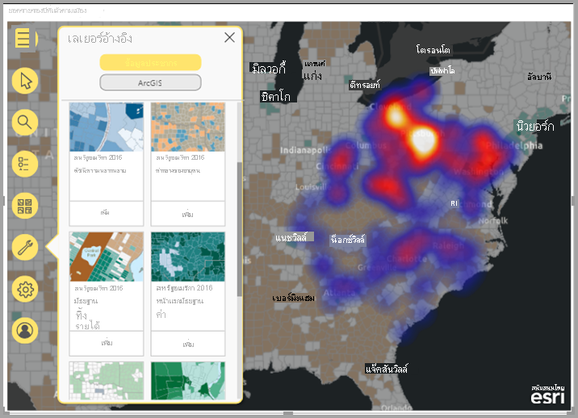

# สร้างแผนที่ ArcGIS ใน Power BI

[!INCLUDE[consumer-appliesto-yyyn](../includes/consumer-appliesto-yyyn.md)]    

> [!NOTE]
> ภาพเหล่านี้สามารถจัดทำและเรียกดูได้ทั้งจาก Power BI Desktop และบริการของ Power BI ขั้นตอนและภาพในบทความนี้นำมาจาก Power BI Desktop

ภาพรวมนี้ถูกเขียนขึ้นจากมุมมองของผู้สร้างแผนที่ ArcGIS สำหรับ Power BI เมื่อ _ผู้ออกแบบ_ แชร์แผนที่ ArcGIS Map สำหรับ Power BI กับเพื่อนร่วมงาน เพื่อนร่วมงานดังกล่าวสามารถดูและโต้ตอบกับแผนที่ได้ แต่ไม่สามารถบันทึกการเปลี่ยนแปลงได้ หากการเรียนรู้เพิ่มเติมเกี่ยวกับการดูแผนที่ ArcGIS ให้ดูที่[การสำรวจแผนที่ ArcGIS สำหรั Power BI](https://doc.arcgis.com/en/power-bi/use/explore-maps.htm)

การรวมกันระหว่างแผนที่ ArcGIS และ Power BI ทำให้การนำเสนอจุดต่าง ๆ บนแผนที่ก้าวขึ้นไปอีกระดับ เลือกแผนที่พื้นฐาน ชนิดของสถานที่ตั้ง ธีม สไตล์สัญลักษณ์ และเลเยอร์อ้างอิง เพื่อสร้างการแสดงภาพแผนที่ที่สวยงามและสื่อความหมาย การรวมกันของ เลเยอร์ข้อมูลที่เป็นทางการบนแผนที่ และการวิเคราะห์ทางตำแหน่ง ให้คุณทำความเข้าใจการแสดงภาพของคุณที่ลึกซึ้งขึ้น ถึงแม้ว่าคุณไม่สามารถสร้าง ArcGIS Map สำหรับ Power BI บนอุปกรณ์เคลื่อนที่ได้ แต่คุณสามารถดู และโต้ตอบกับแผนที่ได้

> [!NOTE]
> ArcGIS สำหรับ Power BI รองรับเซิร์ฟเวอร์รายงาน Power BI ในสภาพแวดล้อมออนไลน์เท่านั้น ซึ่งไม่ได้รับการรองรับในสภาพแวดล้อมแบบออฟไลน์

> [!TIP]
> GIS ย่อมาจากระบบข้อมูลทางภูมิศาสตร์

ตัวอย่างด้านล่างใช้พื้นที่สีเทาเข้ม เพื่อแสดงยอดขายตามภูมิภาคในรูป แผนที่คลื่นความร้อน เทียบกับเลเยอร์รายได้หลังหักภาษีของประชากรปี 2016 ตามที่คุณจะเห็นในขณะที่คุณอ่าน การใช้แผนที่ ArcGIS สำหรับ Power BI จะนำเสนอความสามารถในการทำแผนที่ที่ได้รับการปรับปรุงให้ดีขึ้น ข้อมูลประชากร และการแสดงภาพแผนที่ที่น่าดึงดูดใจได้มากขึ้น เพื่อให้คุณสามารถบอกเล่าเรื่องราวที่ดีที่สุดของคุณได้

> [!TIP]
> เยี่ยมชม [ **หน้าเพจของ Esri บนแผนที่ ArcGIS สำหรับ Power BI**](https://www.esri.com/powerbi) เพื่อดูหลายๆ ตัวอย่าง และอ่านคำบอกเล่าจากผู้ใช้ นอกจากนี้ดูแผนที่ **[ArcGIS ของ Esri สำหรับ Power BI](https://doc.arcgis.com/en/power-bi/get-started/about-maps-for-power-bi.htm) ช่วยเหลือ** ออนไลน์

## ความยินยอมของผู้ใช้

ArcGIS สำหรับ Power BI ให้บริการโดย Esri ([https://www.esri.com](https://www.esri.com/)) การใช้แผนที่ ArcGIS สำหรับ Power BI ของคุณต้องอยู่ภายใต้ [ข้อกำหนด](https://go.microsoft.com/fwlink/?LinkID=826322)และ[นโยบายความเป็นส่วนตัว](https://go.microsoft.com/fwlink/?LinkID=826323)ของ Esri ผู้ใช้ Power BI ที่ต้องการใช้ภาพแผนที่ ArcGIS สำหรับ Power BI จำเป็นต้องตอบรับในกล่องโต้ตอบความยินยอม กล่องโต้ตอบนี้จะปรากฏในครั้งแรกที่คุณใช้แผนที่ ArcGIS สำหรับ Power BI

## ข้อกำหนดเบื้องต้น

บทช่วยสอนนี้ใช้ Power BI Desktop และ[ตัวอย่างการวิเคราะห์การค้าปลีก](https://download.microsoft.com/download/9/6/D/96DDC2FF-2568-491D-AAFA-AFDD6F763AE3/Retail%20Analysis%20Sample%20PBIX.pbix) PBIX นอกจากนี้ยังสามารถสร้างแผนที่ ArcGIS สำหรับ Power BI ได้โดยใช้บริการของ Power BI

1. จากด้านบนซ้ายของแถบเมนู เลือก **ไฟล์** > **เปิดรายงาน**
2. ค้นหา **ไฟล์ PBIX ตัวอย่างการวิเคราะห์การค้าปลีก** ที่บันทึกไว้ในเครื่องภายในของคุณ
3. เปิด **ตัวอย่างการวิเคราะห์ร้านค้าปลีก** ในมุมมองรายงานของ 
4. เลือก  ในการเพิ่มหน้าใหม่ลงในรายงาน

## สร้างการแสดภาพแผนที่ ArcGIS สำหรับ Power BI

ในการเพิ่มแผนที่ไปยังรายงานให้ทำตามขั้นตอนเหล่านี้:

1. เลือกไอคอนแผนที่ ArcGIS สำหรับ Power BI จากบานหน้าต่างการจัดรูปแบบการแสดงข้อมูล

    

2. Power BI เพิ่มเแม่แบบว่างในพื้นที่ของรายงาน ในภาพรวมนี้ เราจะใช้เวอร์ชัน **มาตรฐาน** ที่มาพร้อมกับ Power BI หากคุณลงชื่อเข้าใช้บัญชี ArGIS ที่ถูกต้องตามสิทธิ์การใช้งานที่เหมาะสม คุณจะสามารถเข้าถึงฟีเจอร์เพิ่มเติมได้; สำหรับรายละเอียด โปรดดูที่[การช่วยเหลือแบบออนไลน์ของแผนที่ ArcGIS สำหรับ Power BI ](https://doc.arcgis.com/en/power-bi/get-started/account-types.htm)

    

3. จากบานหน้าต่าง **เขตข้อมูล** ให้ลากเขตข้อมูลไปยังเขตข้อมูล **สถานที่ตั้ง** หรือลากพิกัดลงไปในบักเก็ต **ละติจูด** และ/หรือ **ลองจิจูด** ที่เหมาะสม ในตัวอย่างนี้ เรากำลังใช้ **ร้าน > เมือง**

    > [!NOTE]
    > แผนที่ ArcGIS สำหรับ Power BI จะตรวจโดยอัตโนมัติ ว่าเขตข้อมูลที่คุณเลือกควรจะแสดงเป็นรูปร่างหรือจุดบนแผนที่ถึงจะดีที่สุด คุณสามารถปรับเปลี่ยนค่าเริ่มต้นในการตั้งค่า (ดู[จัดรูปแบบการแสดงภาพแผนที่ ArcGIS สำหรับ Power BI](#format-the-arcgis-for-power-bi-visualization))

    

4. จากบานหน้าต่าง **เขตข้อมูล** ลากเป็นหน่วยวัดไปบักเก็ต **ขนาด** เพื่อปรับปรุงวิธีแสดงข้อมูล ในตัวอย่างนี้ เรากำลังใช้ **ยอดขาย > ยอดขายปีที่แล้ว**

    

คุณได้สร้างแผนที่ ArcGIS Map สำหรับ Power BI แรกแล้ว ในตอนนี้ เรามาปรับแต่งและจัดรูปแบบแผนที่ของเราโดยใช้แผนที่พื้นฐาน ชนิดของสถานที่ตั้ง ธีม และอื่น ๆ อีกมากมาย

## จัดรูปแบบการแสดงภาพแผนที่ ArcGIS สำหรับ Power BI

เพื่อเข้าถึงฟีเจอร์การจัดรูปแบบ **ArcGIS Maps สำหรับ Power BI**:

1. ในบานหน้าต่างการแสดงผลข้อมูลด้วยภาพ ให้คลิกแท็บ **จัดรูปแบบ** เพื่อดูตัวเลือกการจัดรูปแบบ

    

    ตัวเลือกการจัดรูปแบบแผนที่ ArcGIS ประกอบด้วย:

    * **เลเยอร์:** เปลี่ยนชื่อของรายการเลเยอร์ (ToC) ให้เปิดหรือปิดรายการเลเยอร์แล้วยึดรายการบนแผนที่ และให้กำหนดตำแหน่งของรายการที่มีการอ้างอิง รายการเลเยอร์จะเปิดตามค่าเริ่มต้นและพร้อมใช้งานในการขยายเครื่องมือการทำแผนที่ 
    * **เครื่องมือแผนที่:** เปิดหรือปิดเครื่องมือนำทาง ล็อกขอบเขตของแผนที่ในตำแหน่งปัจจุบันแล้วให้กำหนดตำแหน่งของการ์ดอินโฟกราฟิกบนแผนที่ ปุ่มขยายและปุ่มย่อจะถูกปิดใช้งานตามค่าเริ่มต้น
    * **ชนิดของสถานที่ตั้ง:** การระบุประเทศ/ภูมิภาค ที่ข้อมูลของคุณจะการช่วยในการปรับปรุงความแม่นยำของตำแหน่งที่ตั้งบนแผนที่ของคุณ ถ้าข้อมูลของคุณอยู่ในประเทศ/ภูมิภาคเดียว ให้เลือกประเทศ/ภูมิภาคจากรายการดรอปดาวน์ ถ้าข้อมูลของคุณเป็นส่วนกลาง ให้เลือกโลก
    * **ค้นหา:** เปิดหรือปิดฟังก์ชันค้นหาแล้วเปลี่ยนสีเริ่มต้นของหมุด การค้นหาจะเปิดตามค่าเริ่มต้นและพร้อมใช้งานในเครื่องมือแผนที่ที่ขยายของ 

### แก้ไขแผนที่ ArcGIS สำหรับ Power BI

หลังจากที่คุณเพิ่มข้อมูลไปในการแสดงภาพของแผนที่ เครื่องมือแผนที่จะพร้อมใช้งาน

> [!NOTE]
> บทช่วยสอนนี้จะแสดงเฉพาะฟีเจอร์และตัวเลือกที่พร้อมใช้งานในเวอร์ชัน **มาตรฐาน** ของแผนที่  ArcGIS สำหรับ Power BI หากคุณลงชื่อเข้าใช้ [บัญชี ArcGIS](https://doc.arcgis.com/en/power-bi/get-started/account-types.htm) ที่ถูกต้อง ด้วยสิทธิ์การใช้งานที่เหมาะสมคุณจะสามารถเข้าถึงคุณลักษณะเพิ่มเติมได้

ในการขยายเครื่องมือแผนที่:

1. คลิกที่ปุ่มเครื่องมือแผนที่เพื่อขยายเครื่องมือ

    

เครื่องมือแผนที่ขยายเพื่อแสดงคุณลักษณะที่พร้อมใช้งาน แต่ละคุณลักษณะ เมื่อเลือก บานหน้าต่างงานที่มีรายละเอียดตัวเลือกจะเปิดออกมา

> [!TIP]
> Esri มี[เอกสารที่ครอบคลุม](https://go.microsoft.com/fwlink/?LinkID=828772)เกี่ยวกับการใช้แผนที่ ArcGIS สำหรับ Power BI

#### เปลี่ยนแผนที่พื้นฐาน

แผนที่พื้นฐานมีพื้นหลังหรือบริบทของวิชวลสำหรับข้อมูลในแผนที่ ตัวอย่างเช่น แผนที่พื้นฐานแสดงถนนที่สามารถให้บริบทสำหรับข้อมูลที่อยู่ของคุณ การใช้บัญชี **มาตรฐาน** มีการกำหนดแผนที่หลักสี่รายการ: พื้นที่สีเทาเข้ม, พื้นที่สีเทาอ่อน, OpenStreetMap และแผนที่ถนน

เมื่อต้องการเปลี่ยนแผนที่พื้นฐาน ให้ทำตามขั้นตอนเหล่านี้:

1. คลิกปุ่ม **แผนที่พื้นฐาน**  เพื่อแสดงแกลเลอรี
2. เลือก **พื้นที่ทำงานสีเทาเข้ม** ของแผนที่พื้นฐาน

    

    การอัปเดตการแผนที่โดยใช้แผนที่พื้นฐานใหม่

สำหรับข้อมูลเพิ่มเติม โปรดดูที่การ[เปลี่ยนแผนที่พื้นฐาน](https://doc.arcgis.com/en/power-bi/design/change-the-basemap.htm)ในความช่วยเหลือออนไลน์ของแผนที่ ArcGIS สำหรับ Power BI

#### แสดงเลเยอร์แผนที่

ในแผนที่ ArcGIS สำหรับ Power BI คุณจะทำงานกับข้อมูลทางภูมิศาสตร์ผ่านเลเยอร์ได้ เลเยอร์คือคอลเลกชันเชิงตรรกะของข้อมูลทางภูมิศาสตร์ที่ใช้ในการสร้างแผนที่ ข้อมูลนั้นยังเป็นพื้นฐานสำหรับการวิเคราะห์ทางภูมิศาสตร์

ในการแสดงรายการเลเยอร์ให้คลิกปุ่ม **เลเยอร์**  ในเครื่องมือแผนที่

รายการเลเยอร์จะแสดงแต่ละเลเยอร์ที่สร้างแผนที่ และแต่ละเลเยอร์มีชุดตัวเลือกของตัวเองเพื่อช่วยให้คุณสามารถกำหนดค่าและทำงานกับแผนที่ได้ ตัวเลือกที่แตกต่างกันจะปรากฏในเมนูโดยขึ้นอยู่กับชนิดของเลเยอร์ที่เลือก; ตัวอย่างเช่น คุณสามารถเปลี่ยนชนิดของการใช้สัญลักษณ์และตำแหน่งที่ตั้งสำหรับเลเยอร์ที่สร้างขึ้นโดยใช้ข้อมูล Power BI—เช่นเลเยอร์ **เมือง** ที่คุณสร้างขึ้นสำหรับตัวอย่างนี้—แต่ตัวเลือกเหล่านั้นไม่พร้อมใช้งานสำหรับการอ้างอิงหรือเลเยอร์เวลาของไดรฟ์

สำหรับข้อมูลเพิ่มเติม โปรดดูที่[ทำงานกับเลเยอร์](https://doc.arcgis.com/en/power-bi/design/work-with-layers.htm)ในความช่วยเหลือออนไลน์ของแผนที่ ArcGIS สำหรับ Power BI

#### ระบุชนิดของตำแหน่งที่ตั้ง

แผนที่ ArcGIS สำหรับ Power BI ใช้ระบบภูมิศาสตร์ที่มีประสิทธิภาพในการทำงานกับข้อมูลตำแหน่งที่ตั้งบนแผนที่อย่างถูกต้องและแสดงรายการเป็นจุดหรือขอบเขตตามค่าเริ่มต้นโดยอัตโนมัติตามชนิดของข้อมูล ตัวอย่างเช่น พิกัดละติจูด-ลองจิจูดจะแสดงเป็นจุดบนแผนที่ ในขณะที่เขตข้อมูลสถานะจะแสดงเป็นขอบเขตหรือรูปหลายเหลี่ยม คุณสามารถเปลี่ยนวิธีแสดงตำแหน่งได้โดยระบุประเภทสถานที่

ใช้คุณลักษณะประเภทสถานที่เพื่อปรับปรุงความแม่นยำของตำแหน่งบนแผนที่ของคุณ คุณสามารถทำได้อย่างรวดเร็วโดยเลือกประเทศ/ภูมิภาค ในบานหน้าต่างรูปแบบของการแสดงภาพ (ขยายประเภทประเภทสถานที่ตั้งและเลือกประเทศ/ภูมิภาค ที่เหมาะสม) หรือเข้าถึงตัวเลือกเพิ่มเติมโดยใช้คุณลักษณะประเภทสถานที่ตั้งแบบเต็มในบานหน้าต่างตัวเลือกเลเยอร์

คุณลักษณะ **ประเภทสถานที่ตั้ง** แบบเต็มสามารถเข้าถึงได้ผ่านเมนูตัวเลือกเลเยอร์และช่วยให้คุณเลือกได้ว่าจะแสดงข้อมูลของคุณเป็นจุดหรือขอบเขต (รูปหลายเหลี่ยม) นอกเหนือจากการระบุประเทศ/ภูมิภาคที่ข้อมูลนั้นอยู่ เขตแดนมักกำหนดเป็นพื้นที่ทางภูมิศาสตร์มาตรฐาน เช่น ประเทศ จังหวัด รหัสไปรษณีย์ เป็นต้น หากคุณเลือกเขตแดนและประเทศ/ภูมิภาค ที่เฉพาะเจาะจงสำหรับตำแหน่งข้อมูลของคุณ คุณสามารถเลือกจากขอบเขตมาตรฐานที่หลากหลาย เช่น เขตการปกครอง เขตสำมะโนประชากร มณฑล หรือเทศบาล มีสถานที่ตั้งที่แตกต่างกันสำหรับแต่ละประเทศ/ภูมิภาค

ในการแก้ไขชนิดตำแหน่งข้อมูลของคุณให้ทำตามขั้นตอนเหล่านี้:

1. ในรายการเลเยอร์ ให้เลือกชั้นข้อมูลที่คุณต้องการใช้งาน
2. คลิกปุ่ม **ตัวเลือกเลเยอร์** และเลือก **ชนิดสถานที่ตั้ง**

    

    ยอมรับค่าเริ่มต้นเพื่อแสดงสถานที่ตั้งเป็นจุดบนแผนที่และระบุ **หนึ่งประเทศ> สหรัฐอเมริกา**

    

สำหรับข้อมูลเพิ่มเติมโ ปรดดูที่การ[ระบุชนิดสถานที่ตั้ง](https://doc.arcgis.com/en/power-bi/design/specify-location-type.htm)ในความช่วยเหลือออนไลน์ของแผนที่ ArcGIS สำหรับ Power BI

#### ปรับแต่งสัญลักษณ์ของแผนที่

แผนที่ ArcGIS สำหรับ Power BI ใช้ค่าในบานหน้าต่างเขตข้อมูลเพื่อกำหนดวิธีแสดงตำแหน่งบนแผนที่อย่างชาญฉลาด คุณลักษณะ **การใช้สัญลักษณ์** ช่วยให้คุณสามารถปรับเปลี่ยนรูปแบบเริ่มต้นเพื่อบอกเล่าเรื่องราวของคุณได้ดีขึ้น คุณสามารถเลือกธีมแผนที่อื่น ๆ และปรับแต่งสัญลักษณ์และสีที่ใช้แทนตำแหน่งที่ตั้งบนแผนที่ได้ ธีมแผนที่และตัวเลือกรูปแบบต่าง ๆ จะพร้อมใช้งานโดยขึ้นอยู่กับค่าที่คุณเพิ่มลงในบานหน้าต่างฟิลด์ของภาพแผนที่

หากต้องการเปลี่ยนสัญลักษณ์ของเลเยอร์ ให้ทำตามขั้นตอนเหล่านี้:

1. ในรายการเลเยอร์ ให้เลือกชั้นข้อมูลที่คุณต้องการใช้งาน

2. คลิกปุ่ม **ตัวเลือกเลเยอร์** และเลือก **การใช้สัญลักษณ์**

บานหน้าต่าง การใช้สัญลักษณ์ จะปรากฏขึ้นพร้อมกับขยายประเภทธีมแผนที่

##### เปลี่ยนธีมแผนที่

ในตัวอย่างนี้ เนื่องจากเราได้เพิ่มค่าลงในเขตข้อมูล **สถานที่ตั้ง** และ **ขนาด** แผนที่จะใช้ธีม **ขนาด** ตามค่าเริ่มต้น

ในการเปลี่ยนธีมแผนที่ ให้ทำตามขั้นตอนเหล่านี้:

1. เลือกธีมแผนที่อื่น ๆ เพื่อดูว่าแผนที่ของคุณเปลี่ยนแปลงไปอย่างไร

    

2. เลือกธีม **ขนาด**

สำหรับข้อมูลโดยละเอียด ให้ดูที่[เปลี่ยนธีมแผนที่](https://doc.arcgis.com/en/power-bi/design/change-the-map-theme.htm)ในความช่วยเหลือออนไลน์ของแผนที่ ArcGIS สำหรับ Power BI

##### ความโปร่งใสของเลเยอร์

หากแผนที่ของคุณมีหลายเลเยอร์ การแสดงเลเยอร์ด้วยความโปร่งใสในระดับหนึ่งอาจเป็นประโยชน์เพื่อให้ยังคงมองเห็นรายการในเลเยอร์อื่น

ในการตั้งค่าความโปร่งใสสำหรับเลเยอร์ ให้ทำตามขั้นตอนเหล่านี้:

1. ในบานหน้าต่าง **การใช้สัญลักษณ์** ให้ขยายหมวดหมู่ **ความโปร่งใส**

2. พิมพ์เปอร์เซ็นต์ในกล่องข้อความหรือเลื่อนแถบเลื่อนไปทางซ้าย (โปร่งใสน้อยกว่า) หรือไปทางขวา (โปร่งใสมากขึ้น)

##### ลักษณะของสัญลักษณ์

รูปแบบสัญลักษณ์ช่วยให้คุณปรับแต่งวิธีการนำเสนอข้อมูลบนแผนที่ได้อย่างละเอียด รูปแบบสัญลักษณ์ตามค่าเริ่มต้นจะขึ้นอยู่กับประเภทสถานที่ตั้งและธีมแผนที่ที่เลือก และตัวเลือกการกำหนดลักษณะที่มีจะแตกต่างกันไป ขึ้นอยู่กับว่าช่องใดมีค่าและลักษณะของค่าเหล่านั้น

ในการเปลี่ยนรูปแบบสัญลักษณ์ให้ทำตามขั้นตอนเหล่านี้:

1. ในบานหน้าต่าง **การใช้สัญลักษณ์** ขยายหมวดหมู่ **รูปแบบสัญลักษณ์**

2. เปลี่ยนการตั้งค่าสัญลักษณ์ตามต้องการ เลือกรูปร่างสัญลักษณ์ สี ความโปร่งใส และสีโครงร่าง ความหนา และความโปร่งใส ขยายหมวดหมู่ขนาดสัญลักษณ์เพื่อเปลี่ยนตัวเลือกเหล่านั้น; ตัวเลือกต่าง ๆ จะปรากฏขึ้นโดยขึ้นอยู่กับลักษณะของข้อมูลของคุณและธีมแผนที่ที่เลือก

    ตัวอย่างด้านล่างแสดงชุดธีมแผนที่ที่ตั้งค่าเป็น **ขนาด** และการปรับเปลี่ยนรูปแบบสัญลักษณ์ต่าง ๆ ให้เป็นความโปร่งใส รูปแบบ และขนาด

    

3. เมื่อคุณตั้งค่าตัวเลือกรูปแบบเสร็จแล้วให้ปิดบานหน้าต่าง การใช้สัญลักษณ์

### วิเคราะห์ข้อมูลของคุณ

แผนที่ ArcGIS สำหรับ Power BI มีเครื่องมือมากมายที่ช่วยให้คุณค้นพบรูปแบบในข้อมูลของคุณและบอกเล่าเรื่องราวที่น่าสนใจด้วยแผนที่

คุณลักษณะการวิเคราะห์ประกอบด้วย:

- การเลือกสถานที่ตั้งบนแผนที่
- ค้นหาที่อยู่ สถานที่ หรือจุดสนใจที่ต้องการ
- การเพิ่มเลเยอร์อ้างอิงเพื่อให้บริบทเพิ่มเติม
- การค้นหาสถานที่ตั้งภายในรัศมีที่กำหนดหรือพื้นที่เวลาขับรถ
- การเพิ่มการ์ดที่แสดงรายละเอียดข้อมูลประชากรเกี่ยวกับพื้นที่ที่แสดงบนแผนที่

#### เลือกสถานที่ตั้ง

แผนที่ ArcGIS สำหรับ Power BI มีเครื่องมือการเลือกต่างๆ มากมายเพื่อช่วยคุณเลือกสถานที่บนแผนที่ เครื่องมือต่าง ๆ จะปรากฏขึ้นโดยขึ้นอยู่กับประเภทของเลเยอร์ที่เลือกในรายการเลเยอร์ในปัจจุบัน

ในการแสดงเครื่องมือการเลือก ให้ทำตามขั้นตอนเหล่านี้:

1. จากเครื่องมือแผนที่คลิกปุ่ม **เครื่องมือการเลือก**  เพื่อขยายชุดเครื่องมือ

    มีเครื่องมือให้เลือกสี่แบบ; เครื่องมือต่าง ๆ อาจปรากฏในเมนู **เครื่องมือการเลือก** ขึ้นอยู่กับชนิดของเลเยอร์ที่ใช้งานอยู่ เนื่องจากแผนที่ในตัวอย่างนี้มีเพียงเลเยอร์ข้อมูล จึงปรากฏเฉพาะเครื่องมือ **เลือกครั้งเดียว** และ **เลือกเป็นช่อง**
    
    | **เครื่องมือ** | **คำอธิบาย** |
    | --- | --- |
    |  | **เลือกครั้งเดียว** — นี่คือเครื่องมือการเลือกรายการเดียวที่สามารถใช้เพื่อคลิกสถานที่แต่ละแห่ง; เป็นเครื่องมือการเลือกค่าเริ่มต้น กด Ctrl และคลิกเพื่อเลือกสถานที่หลายแห่ง การคลิกตำแหน่งข้อมูลบนแผนที่จะเป็นการเลือกตำแหน่งเหล่านั้นและทริกเกอร์การโต้ตอบกับการแสดงภาพอื่น ๆ การคลิกหมุดหรือตำแหน่งบนเลเยอร์อ้างอิงจะแสดงคำแนะนำเครื่องมือ |
    |   | **เลือกเป็นช่อง** — ลากตัวเลือกสี่เหลี่ยมผืนผ้าเพื่อเลือกสถานที่หลายแห่งหรือเลือกสถานที่แต่ละแห่งโดยการคลิก เช่นเดียวกับเครื่องมือเลือก การคลิกหมุดหรือตำแหน่งบนเลเยอร์อ้างอิงจะแสดงคำแนะนำเครื่องมือ เมื่อเครื่องมือเลือกเป็นช่องใช้งานอยู่คุณจะไม่สามารถเลื่อนแผนที่ได้ |
    |   | **เลเยอร์อ้างอิงเลือก** — หากคุณเพิ่ม [เลเยอร์อ้างอิง](https://doc.arcgis.com/en/maps-for-powerbi/design/add-a-reference-layer.htm) ลงในแผนที่ ให้ใช้เครื่องมือนี้เพื่อเลือกสถานที่โดยคลิกพื้นที่บนเลเยอร์อ้างอิง สถานที่ที่อยู่ในพื้นที่ที่คั่นด้วยข้อมูลอ้างอิงจะถูกไฮไลท์; ตำแหน่งในพื้นที่อื่น ๆ ของแผนที่ไม่สามารถใช้งานได้ เครื่องมือนี้จะปรากฏเฉพาะในกรณีที่แผนที่มีชั้นอ้างอิงอย่างน้อยหนึ่งชั้นและชั้นอ้างอิงทำงานอยู่ |
    |   | **เลือกเวลาขับรถ** — หากคุณเพิ่ม [พื้นที่เวลาขับรถ](https://doc.arcgis.com/en/maps-for-powerbi/design/find-nearby-locations.htm) ลงในแผนที่ของคุณให้ใช้เครื่องมือเลือกพื้นที่เวลาขับรถเพื่อเลือกตำแหน่งข้อมูลภายในพื้นที่ที่กำหนด |
    
2. เลือกสถานที่อย่างน้อยหนึ่งแห่งบนแผนที่ คุณสามารถเลือกจุดข้อมูลได้สูงสุด 250 จุดต่อครั้ง

สำหรับข้อมูลเพิ่มเติม โปรดดูที่การ[เลือกสถานที่ตั้งบนแผนที่](https://doc.arcgis.com/en/power-bi/design/select-features-on-the-map.htm)ในความช่วยเหลือออนไลน์ของแผนที่ ArcGIS สำหรับ Power BI

#### ปักหมุดสถานที่ตั้ง

ปักหมุดที่อยู่ สถานที่ หรือจุดที่น่าสนใจบนแผนที่ สำหรับตัวอย่างนี้คุณจะค้นหาสนามบินนานาชาติพิตต์สเบิร์ก

หากต้องการปักหมุดตำแหน่งที่ตั้ง ให้ทำตามขั้นตอนเหล่านี้:

1. จากเครื่องมือแผนที่ คลิกปุ่ม **ค้นหา**  เพื่อเปิดบานหน้าต่างค้นหา
2. พิมพ์คำหลัก **นานาชาติพิตต์สเบิร์ก** ในช่องค้นหา

    คำหลักอาจรวมถึงที่อยู่ สถานที่ หรือจุดที่สนใจ ขณะที่คุณพิมพ์การค้นหาหรือคำแนะนำล่าสุดที่คล้ายกันซึ่งอิงจากคำหลักที่คล้ายกันจะปรากฏขึ้น

3. จากรายการผลลัพธ์ ให้เลือก **สนามบินนานาชาติพิตต์สเบิร์ก** แล้วคลิก **ปิด**

    สัญลักษณ์จะปรากฏขึ้นบนแผนที่ และแผนที่ขยายไปยังตำแหน่งที่ตั้งให้โดยอัตโนมัติ หมุดจะยังคงอยู่บนแผนที่ในช่วงเซสชันปัจจุบันเท่านั้น; คุณจะไม่สามารถบันทึกตำแหน่งที่ตรึงไว้ด้วยแผนที่ได้ ตำแหน่งที่ปักหมุดยังปรากฏเป็นเลเยอร์ในรายการเลเยอร์; คุณสามารถเปลี่ยนชื่อเลเยอร์แสดงหรือซ่อนหรือลบออกจากแผนที่ได้เช่นเดียวกับเลเยอร์อื่น ๆ

4. หากต้องการเปลี่ยนสีของหมุดให้ขยายหมวดหมู่ **ค้นหา** ในบานหน้าต่าง **รูปแบบ** ของภาพแผนที่แล้วเลือกสีใหม่

> [!NOTE]
> ฟีเจอร์ **ค้นหา** จะแทนที่ฟีเจอร์หมุดก่อนหน้านี้ที่มีอยู่ในแผนที่ ArcGIS สำหรับ Power BI

สำหรับข้อมูลเพิ่มเติม โปรดดูที่การ[ปักหมุดตำแหน่งที่ตั้ง](https://doc.arcgis.com/en/power-bi/design/pin-locations.htm)ในความช่วยเหลือออนไลน์ของแผนที่ ArcGIS สำหรับ Power BI

#### เพิ่มเลเยอร์อ้างอิง

เลเยอร์อ้างอิงให้บริบทสำหรับข้อมูล Power BI ที่คุณกำลังแสดงอยู่บนแผนที่ เลเยอร์อ้างอิงสามารถรวมข้อมูลประชากรเช่นรายได้ครัวเรือน อายุ หรือการศึกษา นอกจากนี้ยังสามารถรวมเลเยอร์คุณลักษณะที่แชร์แบบสาธารณะที่มีอยู่ใน ArcGIS ออนไลน? ซึ่งให้ข้อมูลเพิ่มเติมเกี่ยวกับพื้นที่โดยรอบสถานที่บนแผนที่ของคุณ

##### เพิ่มเลเยอร์ประชากร

บัญชีมาตรฐาน ArcGIS สำหรับ Power BI มีเลเยอร์ประชากรของสหรัฐอเมริกาให้เลือกจำนวนหนึ่งเพื่อช่วยแสดงบริบทของข้อมูลจาก Power BI

หากต้องการเพิ่มเลเยอร์ประชากร ให้ทำตามขั้นตอนเหล่านี้:

1. จากเครื่องมือแผนที่ให้คลิกปุ่ม **เครื่องมือการวิเคราะห์** ปุ่ม  เพื่อขยายชุดเครื่องมือ
2. คลิกปุ่ม **เลเยอร์การอ้างอิง** 

    บานหน้าต่าง **ชั้นอ้างอิง** จะปรากฏขึ้นโดยแสดงแท็บ **ข้อมูลประชากร** และการเลือกเลเยอร์

3. เลื่อนผ่านแกลเลอรีและคลิก **เพิ่ม** บนรูปขนาดย่อของเลเยอร์ที่คุณต้องการเพิ่มลงในแผนที่ของคุณ

    สำหรับตัวอย่างนี้ค้นหาเลเยอร์ **รายได้ครัวเรือนโดยเฉลี่ยในสหรัฐอเมริกาปี 2016** แล้วคลิก **เพิ่ม**
    
    การอัปเดตแผนที่เพื่อแสดงเลเยอร์ใหม่
    
    
    
เลเยอร์อ้างอิงข้อมูลประชากรเป็นแบบโต้ตอบ;  คลิกพื้นที่เพื่อดูคำแนะนำเครื่องมือที่มีข้อมูลเพิ่มเติม คุณยังสามารถใช้เครื่องมือ **การอ้างอิงเลือก** เพื่อ [ เลือกพื้นที่บนแผนที่](https://doc.arcgis.com/en/power-bi/design/select-features-on-the-map.htm) ที่อยู่ภายในพื้นที่บนเลเยอร์อ้างอิง

##### เพิ่มเลเยอร์อ้างอิงจาก ArcGIS

แผนที่ ArcGIS สำหรับ Power BI ช่วยให้คุณสามารถค้นหาเลเยอร์ของฟีเจอร์ที่แชร์แบบสาธารณะบน ArcGIS ได้ ให้คุณสามารถเข้าถึงหลายพันเลเยอร์อ้างอิงที่ให้ข้อมูลเกี่ยวกับพื้นที่โดยรอบที่ตั้งบนชั้นข้อมูลของคุณ เมื่อคุณลงชื่อเข้าใช้แผนที่ ArcGIS สำหรับ Power BI โดยใช้บัญชี ArcGIS ที่ถูกต้อง คุณสามารถค้นหาเนื้อหาในองค์กรของคุณกลุ่มองค์กรของคุณหรือเนื้อหาสาธารณะได้ ในตัวอย่างนี้ เนื่องจากคุณใช้บัญชีมาตรฐาน เนื้อหาที่แชร์แบบสาธารณะเท่านั้นที่จะปรากฏในผลลัพธ์การค้นหา

ในการเพิ่มเลเยอร์อ้างอิง ArcGIS ให้ทำตามขั้นตอนเหล่านี้:

1. ในบานหน้าต่างการอ้างอิงคลิกแท็บ **ArcGIS**

2. ในช่องค้นหา พิมพ์ **เขตรัฐสภาของสหรัฐอเมริกา** แล้วกด **ป้อน**

    แกลเลอรีจะแสดงผลลัพธ์ที่เป็นไปได้หลายประการ

3. ค้นหาในเลเยอร์เขตรัฐสภาของสหรัฐอเมริกาที่ 116 และคลิกเพิ่ม

    การอัปเดตแผนที่เพื่อแสดงเลเยอร์ใหม่
    
    
    
การอ้างอิงเลเยอร์ ArcGIS เป็นแบบโต้ตอบ; คลิกพื้นที่เพื่อดูคำแนะนำเครื่องมือที่มีข้อมูลเพิ่มเติม คุณยังสามารถใช้เครื่องมือ **การอ้างอิงเลือก** เพื่อ [ เลือกพื้นที่บนแผนที่](https://doc.arcgis.com/en/power-bi/design/select-features-on-the-map.htm) ที่อยู่ภายในพื้นที่บนเลเยอร์อ้างอิง

#### ค้นหาตำแหน่งที่ตั้งใกล้เคียง

คุณสามารถใช้ตำแหน่งบนแผนที่ของคุณ—รวมถึงสถานที่ที่ปักหมุดไว้—เป็นจุดเริ่มต้นในการค้นหาและเลือกสถานที่ใกล้เคียงบนแผนที่ของคุณ ตัวอย่างเช่น หากคุณค้นหาสถานที่ที่น่าสนใจคุณสามารถเลือกสถานที่บนแผนที่ของคุณที่อยู่ภายในระยะเวลาขับรถหรือระยะทางที่กำหนดจากสถานที่นั้น

ในตัวอย่างนี้ คุณจะใช้สนามบินนานาชาติพิตต์สเบิร์กที่คุณปักหมุดไว้ก่อนหน้านี้เป็นจุดเริ่มต้น ในการค้นหาสถานที่ภายใน 100 ไมล์จากสนามบิน ใช้ขั้นตอนที่คล้ายกันเพื่อค้นหาสถานที่ภายในเวลาในการขับรถที่กำหนด

หากต้องการค้นหาสถานที่ภายในระยะทางขับรถเฉพาะจากจุดต้นทาง ให้ทำตามขั้นตอนเหล่านี้:

1. จากเครื่องมือแผนที่ให้คลิกปุ่ม **เครื่องมือการวิเคราะห์** ปุ่ม  เพื่อขยายชุดเครื่องมือ

2. คลิกปุ่ม **เวลาในการขับรถ** 

    บานหน้าต่าง **เวลาในการขับรถ** จะปรากฏขึ้น

3. คลิกที่เครื่องมือเลือกรายการเดียวและ บนแผนที่เลือกสถานที่ **สนามบินนานาชาติพิตต์สเบิร์ก** ที่คุณปักหมุดไว้ก่อนหน้านี้
4. จากเมนูแบบเลื่อนลง **พื้นที่ค้นหา** เลือก **รัศมี** และระบุระยะทาง **100** ไมล์
5. คลิก **ตกลง**

    แผนที่แสดงวงกลมโดยรอบตำแหน่งที่ตั้งสนามบินที่ปักหมุดไว้ บานหน้าต่างเวลาเวลาในการขับรถจะขยายเพื่อแสดงตัวเลือกรูปแบบสำหรับพื้นที่ระยะห่างในการขับขี่
    
    
    
    พื้นที่ระยะการขับขี่ยังปรากฏเป็นเลเยอร์ในรายการเลเยอร์ คุณสามารถเปลี่ยนชื่อเลเยอร์แสดงหรือซ่อนหรือลบออกจากแผนที่ได้เช่นเดียวกับเลเยอร์อื่น ๆ ได้

6. เมื่อเลเยอร์เวลาขับเคลื่อนทำงานอยู่ในรายการเลเยอร์ให้ใช้เครื่องมือเลือกเวลาขับรถเพื่อคลิกพื้นที่ระยะทางในการขับขี่

    ตำแหน่งที่ตั้งที่อยู่ในพื้นที่การค้นหาที่เลือก; สถานที่ที่ไม่ได้เลือกบนแผนที่จะมีขนาดเล็กลงหรือโปร่งใสมากขึ้น การแสดงภาพอื่น ๆ ได้รับการอัปเดตเพื่อแสดงตำแหน่งที่ตั้งที่เลือก

สำหรับข้อมูลเพิ่มเติม โปรดดูที่ [ค้นหาสถานที่ใกล้เคียง](https://doc.arcgis.com/en/power-bi/design/find-nearby-locations.htm) ในความช่วยเหลือออนไลน์ของแผนที่ ArcGIS สำหรับ Power BI

#### เพิ่มการ์ดอินโฟกราฟิก

เช่นเลเยอร์อ้างอิง การ์ดอินโฟกราฟิกให้รายละเอียดเพิ่มเติมเกี่ยวกับพื้นที่บนแผนที่ การ์ดอินโฟกราฟิกวางอยู่ด้านบนของแผนที่และแสดงข้อมูลประชากรเฉพาะเกี่ยวกับพื้นที่โดยรอบตำแหน่งที่ตั้งที่เลือกทันทีหรือเกี่ยวกับพื้นที่ทั่วไปที่แสดงในขอบเขตแผนที่ปัจจุบัน สำหรับข้อมูลโดยละเอียด โปรดดูที่[เพิ่มการ์ดอินโฟกราฟิก](https://doc.arcgis.com/en/power-bi/design/add-infographics.htm)ในความช่วยเหลือออนไลน์ของแผนที่ ArcGIS สำหรับ Power BI

### รับความช่วยเหลือ

Esri มีเอกสารออนไลน์ที่ครอบคลุมบนแผนที่ ArcGIS สำหรับ Power BI

หากต้องการเข้าถึงความช่วยเหลือออนไลน์ของแผนที่ ArcGIS สำหรับ Power BI จากการแสดงภาพ ให้ทำตามขั้นตอนเหล่านี้:

1. จากเครื่องมือแผนที่ ให้คลิกปุ่ม **การตั้งค่า** 

2. ในบานหน้าต่าง **การตั้งค่า** คลิกปุ่ม **ความช่วยเหลือ**
3. คลิก **ตกลง** บนหน้าต่างการยืนยันที่ปรากฏขึ้น

    ความช่วยเหลือออนไลน์ของแผนที่ ArcGIS สำหรับ Power BI จะเปิดขึ้นในหน้าต่างเบราว์เซอร์
    
    - ค้นหาคำตอบสำหรับ[คำถามที่พบบ่อย](https://doc.arcgis.com/en/power-bi/get-started/pbi-faq.htm#anchor5)บนความช่วยเหลือออนไลน์ของแผนที่ ArcGIS สำหรับ Power BI
    - คุณสามารถถามคำถาม ค้นหาข้อมูลล่าสุด รายงานปัญหา และค้นหาคำตอบใน [ชุดข้อความชุมชนที่เกี่ยวข้องกับ **แผนที่ ArcGIS สำหรับ Power BI**](https://go.microsoft.com/fwlink/?LinkID=828771) ได้
    - ถ้าคุณมีคำแนะนำเพื่อการปรับปรุง โปรดส่งไปยัง[รายการแนวคิด Power BI](https://ideas.powerbi.com/)
    
### จัดการการใช้แผนที่ ArcGIS สำหรับ Power BI ภายในองค์กรของคุณ

Power BI ช่วยให้นักออกแบบ ผู้ดูแลระบบ Power BI และผู้ดูแลระบบผู้ใช้สามารถจัดการการใช้แผนที่ ArcGIS สำหรับ Power BI ได้ ส่วนด้านล่างเค้าร่างการดำเนินการที่แต่ละบทบาทที่ทำได้

#### ตัวเลือกการออกแบบ

ใน Power BI Desktop นักออกแบบสามารถปิดใช้งานแผนที่ ArcGIS สำหรับ Power BI บนแท็บความปลอดภัยได้ เลือก **ไฟล์**  >  **ตัวเลือกและการตั้งค่า** จากนั้นเลือก **ตัวเลือก**  >  **ความปลอดภัย** เมื่อปิดใช้งาน แผนที่ ArcGIS จะไม่โหลดตามค่าเริ่มต้น

#### ตัวเลือกผู้ดูแลระบบ

ในบริการ PowerBI ผู้ดูแลระบบสามารถปิดแผนที่ ArcGIS สำหรับ Power BI สำหรับผู้ใช้ทั้งหมดได้ เลือก **การตั้งค่า** > **พอร์ทัลผู้ดูแลระบบ** > **การตั้งค่าผู้เช่า** . เมื่อปิดใช้งาน Power BI จะไม่แสดงไอคอนแผนที่ ArcGIS สำหรับ Power BI ในบานหน้าต่างการจัดรูปแบบการแสดงภาพ

#### ตัวเลือกผู้ดูแลระบบผู้ใช้

Power BI Desktop รองรับการใช้ **นโยบายกลุ่ม** เพื่อปิดใช้แผนที่ ArcGIS สำหรับ Power BI ในคอมพิวเตอร์ของหน่วยงานทุกเครื่อง

| **แอตทริบิวต์** | **ค่า** |
| --- | --- |
| คีย์ | Software\Policies\Microsoft\Power BI Desktop |
| valueName | EnableArcGISMaps |

ค่า 1 (เลขฐานสิบ) เปิดใช้งานแผนที่ ArcGIS สำหรับ Power BI

ค่า 1 (เลขฐานสิบ) เปิดใช้งาแผนที่ ArcGIS สำหรับ Power BI

## ข้อควรพิจารณาและข้อจำกัด

แผนที่ ArcGIS สำหรับ Power BI มีให้ใช้งานในบริการและแอปพลิเคชันต่อไปนี้:

| การบริการ/ใบสมัคร | ความพร้อมใช้งาน |
| --- | --- |
| Power BI Desktop | ใช่ |
| การบริการ Power BI (powerbi.com) | ใช่ |
| แอปพลิเคชัน Power BI สำหรับอุปกรณ์เคลื่อนที่\* | ใช่ |
| Power BI ที่เผยแพร่ไปยังเว็บ | ใช่ สำหรับนักออกแบบที่ลงชื่อเข้าใช้ในบัญชี ArcGIS ที่ถูกต้องด้วยสิทธิ์การใช้งานเพิ่มเติมที่เหมาะสม ผู้บริโภคไม่จำเป็นต้องมีสิทธิ์การใช้งานเพิ่มเติมเพื่อดูเนื้อหาที่เผยแพร่ |
| Power BI แบบฝังตัว | ใช่ สำหรับนักออกแบบที่ลงชื่อเข้าใช้ในบัญชี ArcGIS ที่ถูกต้องด้วยสิทธิ์การใช้งานเพิ่มเติมที่เหมาะสม ผู้บริโภคไม่จำเป็นต้องมีสิทธิ์การใช้งานเพิ่มเติมเพื่อดูเนื้อหาที่เผยแพร่ |
| การฝังบริการ Power BI (powerbi.com) | ไม่ใช่ |
| เซิร์ฟเวอร์รายงาน Power BI | ใช่ ในสภาพแวดล้อมออนไลน์เท่านั้น; ไม่ได้รับการรองรับในสภาพแวดล้อมที่มีการเชื่อมต่อ |

\*ในสภาพแวดล้อมของอุปกรณ์เคลื่อนที่ คุณสามารถดูแผนที่ที่สร้างขึ้นโดยใช้การแสดงภาพแผนที่ ArcGIS สำหรับ Power BI ที่มาพร้อมกับ Power BI ([บัญชีมาตรฐาน ](https://doc.arcgis.com/en/maps-for-powerbi/get-started/account-types.htm)) ได้ แผนที่ที่มีเนื้อหาพรีเมียมจาก ArcGIS ไม่ได้รับการสนับสนุนในสภาพแวดล้อมของอุปกรณ์เคลื่อนที่

ในบริการหรือแอปพลิเคชันที่ไม่มีแผนที่ ArcGIS สำหรับ Power BI ให้ใช้งาน การแสดงภาพจะแสดงเป็นภาพว่างที่มีโลโก้ Power BI

ตารางต่อไปนี้เปรียบเทียบคุณลักษณะมาตรฐานที่มีให้สำหรับผู้ใช้ Power BI ทั้งหมดกับผู้ใช้ ArcGIS ที่ลงชื่อเข้าใช้:

|  มาตรฐาน (ที่รวมอยู่ใน Power BI) |   ด้วยบัญชี ArcGIS ของคุณ |
| --- | --- | --- |
| แผนที่ฐาน |
| 4 แผนที่ฐานพื้นฐาน | แผนที่ฐาน Esri ทั้งหมดพร้อมการเข้าถึงแผนที่ฐานขององค์กรของคุณ รวมถึงแผนที่ฐานที่กำหนดเอง |
| ภูมิศาสตร์ |
| 3,500 ตำแหน่งที่ตั้งต่อแผนที่ | 10,000 ตำแหน่งที่ตั้งต่อแผนที่ |
 | 10,000 ตำแหน่งที่ตั้งต่อเดือน | ไม่จำกัดรายเดือน |
| เลเยอร์การอ้างอิง |
| เลเยอร์อ้างอิง 10 เลเยอร์ที่มีข้อมูลประชากรของสหรัฐอเมริกา | เข้าถึงแผนที่เว็บและเลเยอร์ทั้งหมดจากองค์กร ArcGIS ของคุณ |
 | เลเยอร์คุณสมบัติที่แชร์แบบสาธารณะใน ArcGIS | เลเยอร์คุณสมบัติที่แชร์แบบสาธารณะใน ArcGIS |
 | เข้าถึง ArcGIS Living Atlas ของแผนที่และเลเยอร์ของโลก (บริการคุณลักษณะ) |
| อินโฟกราฟิก |
| แกลเลอรีของตัวแปรข้อมูลประชากรสหรัฐอเมริกา (7 หมวดหมู่) | การเข้าถึงเบราว์เซอร์ข้อมูล ArcGIS GeoEnrichment แบบสมบูรณ์ รวมถึงตัวแปรข้อมูลประชากรในสหรัฐอเมริกาและทั่วโลก |
|

## ขั้นตอนถัดไป

- [โต้ตอบกับแผนผังที่ ArcGIS ที่ถูกแชร์กับคุณ](https://doc.arcgis.com/en/power-bi/use/explore-maps.htm)
- [บล็อกโพสต์ที่ประกาศแผนที่ ArcGIS สำหรับการอัปเดต Power BI](https://www.esri.com/arcgis-blog/?s=#ArcGIS%20for%20Power%20BI)
- มีคำถามเพิ่มเติมหรือไม่ [ลองถามชุมชน Power BI](https://community.powerbi.com/)