# เริ่มต้นใช้งานบานหน้าต่างการจัดรูปแบบGetting started with the formatting pane

[!INCLUDE[consumer-appliesto-nyyn](../includes/consumer-appliesto-nyyn.md)]    

หากคุณมีสิทธิ์แก้ไขสำหรับรายงาน มีตัวเลือกการจัดรูปแบบมากมายให้พร้อมใช้งานIf you have edit permissions for a report, there are numerous formatting options available. ในรายงาน Power BI คุณสามารถเปลี่ยนสีของชุดข้อมูล จุดข้อมูล และแม้แต่พื้นหลังของการแสดงผลข้อมูลด้วยภาพได้In Power BI reports, you can change the color of data series, data points, and even the background of visualizations. คุณสามารถเปลี่ยนวิธีการแสดงแกน x และแกน yYou can change how the x-axis and y-axis are presented. คุณยังสามารถจัดรูปแบบคุณสมบัติแบบอักษรของการแสดงภาพ รูปร่าง และชื่อเรื่องได้You can even format the font properties of visualizations, shapes, and titles. Power BI ช่วยให้คุณสามารถควบคุมวิธีที่รายงานของคุณปรากฏได้อย่างเต็มที่Power BI provides you with full control over how your reports appear.

ในการเริ่มต้น ให้เปิดรายงานใน Power BI Desktop หรือบริการ Power BITo get started, open a report in Power BI Desktop or the Power BI service. ทั้งสองมีตัวเลือกการจัดรูปแบบเกือบเหมือนกันBoth provide almost identical formatting options. เมื่อคุณเปิดรายงานในบริการของ Power BI โปรดตรวจสอบให้แน่ใจว่าได้เลือก **แก้ไข** จากแถบเมนูWhen you open a report in the Power BI service, be sure to select **Edit** from the menu bar. 

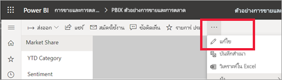

เมื่อคุณกำลังแก้ไขรายงาน และคุณมีการแสดงภาพที่เลือกไว้ บานหน้าต่าง **การแสดงภาพ** จะปรากฏขึ้นWhen you’re editing a report and you have a visualization selected, the **Visualizations** pane appears. ใช้บานหน้าต่างนี้เพื่อเปลี่ยนการแสดงภาพUse this pane to change visualizations. ด้านล่างของบานหน้าต่าง **การแสดงภาพ** จะมีไอคอนสามไอคอน: ไอคอน **เขตข้อมูล** (แถบเรียงซ้อน) ไอคอน **รูปแบบ** (แปรงลูกกลิ้ง) และไอคอน **การวิเคราะห์** (แว่นขยาย)Directly below the **Visualizations** pane are three icons: the **Fields** icon (a stack of bars), the **Format** icon (a paint roller), and the **Analytics** icon (a magnifying glass). ในรูปด้านล่าง ไอคอน **เขตข้อมูล** ถูกเลือกไว้ โดยสังเกตได้จากแถบสีเหลืองที่อยู่ด้านล่างไอคอนIn the image below, the **Fields** icon is selected, indicated by a yellow bar below the icon.

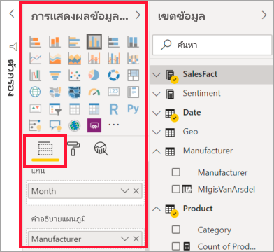

เมื่อคุณเลือก **รูปแบบ** พื้นที่ด้านล่างไอคอนจะแสดงการกำหนดรูปแบบที่พร้อมใช้งานสำหรับการแสดงภาพที่เลือกไว้ในปัจจุบันWhen you select **Format**, the area below the icon displays the customizations available for the currently selected visualization.  

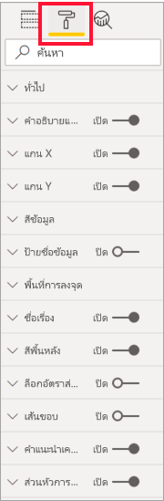

คุณสามารถกำหนดองค์ประกอบของแต่ละการแสดงภาพเองได้มากมายYou can customize many elements of each visualization. ตัวเลือกที่พร้อมใช้งานขึ้นอยู่กับประเภทของการแสดงภาพที่เลือกThe options available depend on the visual selected. บางตัวเลือกเหล่านั้นคือ:Some of those options are:

* คำอธิบายแผนภูมิLegend
* แกน XX-axis
* แกน YY-axis
* สีข้อมูลData colors
* ป้ายชื่อข้อมูลData labels
* ป้ายชื่อทั้งหมดTotal labels
* รูปร่างShapes
* พื้นที่การลงจุดPlot area
* ชื่อเรื่องTitle
* พื้นหลังBackground
* ล็อกอัตราส่วนLock aspect
* เส้นขอบBorder
* คำแนะนำเครื่องมือTooltips
* ส่วนหัวของวิชวลVisual headers
* รูปร่างShapes
* ตำแหน่งPosition    
และอีกมากมายand more.

> [!NOTE]
>  
> คุณจะไม่เห็นองค์ประกอบเหล่านี้ทั้งหมดรวมทั้งการแสดงภาพแต่ละชนิดYou won’t see all these elements with each visualization type. การแสดงภาพที่คุณเลือกไว้จะมีผลต่อรูปแบบการกำหนดเองที่พร้อมใช้งาน ตัวอย่างเช่น คุณจะไม่เห็นแกน X ถ้าคุณมีแผนภูมิวงกลมที่เลือกไว้ เนื่องจากแผนภูมิวงกลมไม่มีแกน XThe visualization you select will affect which customizations are available; for example, you won’t see an X-Axis if you have a pie chart selected because pie charts don’t have an X-axis.

นอกจากนี้ โปรดทราบว่า ถ้าคุณไม่มีการแสดงภาพที่เลือกไว้ **ตัวกรอง** ก็จะปรากฏขึ้นแทนไอคอนซึ่งจะช่วยให้คุณสามารถนำตัวกรองไปใช้กับการแสดงภาพทั้งหมดในหน้าได้Also note that if you don’t have any visualization selected, **Filters** appears in place of the icons, which lets you apply filters  to all visualizations on the page.

วิธีที่ดีที่สุดในการเรียนรู้วิธีการใช้ตัวเลือกการจัดรูปแบบคือการลองใช้เครื่องมือเหล่านั้นดู คุณสามารถยกเลิกการเปลี่ยนแปลงของคุณหรือแปลงกลับเป็นค่าเริ่มต้นได้เสมอThe best way to learn how to use the Formatting options is to try them out. You can always undo your changes or revert to default. มีตัวเลือกมากมายที่พร้อมใช้งานและมีการเพิ่มรายการใหม่ตลอดเวลาThere are an incredible amount of options available, and new ones being added all the time. ซึ่งเป็นไปไม่ได้ที่จะอธิบายตัวเลือกการจัดรูปแบบทั้งหมดในหนึ่งบทความIt's just not possible to describe all formatting options in one article. แต่เพื่อให้คุณได้เริ่มต้นใช้งาน มาลองทบทวนด้วยกันสักสองสามรายการBut to get you started, let's review a few together. 

1. เปลี่ยนสีที่ใช้ในวิชวลChange colors used in the visual   
2. ใช้งานลักษณะApply a style    
3. การเปลี่ยนแปลงคุณสมบัติแกนChange axis properties    
4. เพิ่มป้ายชื่อข้อมูลAdd data labels    
1. เพิ่มป้ายชื่อทั้งหมดAdd total labels

## การใช้งานแบบมีสีสันWorking with colors

ลองทำตามขั้นตอนสำคัญที่จะต้องใช้ในการกำหนดรูปแบบสีบนการแสดงภาพLet’s walk through the steps necessary to customize colors on a visualization.

1. เลือกการแสดงภาพเพื่อเปิดใช้งานSelect a visualization to make it active.

2. เลือกไอคอนแปรงลูกกลิ้งเพื่อเปิดแท็บการจัดรูปแบบ แท็บการจัดรูปแบบจะแสดงองค์ประกอบของการจัดรูปแบบทั้งหมดที่พร้อมใช้งานสำหรับวิชวลที่เลือกSelect the paint roller icon to open the Formatting tab. The Formatting tab displays all the formatting elements available for the selected visual.

    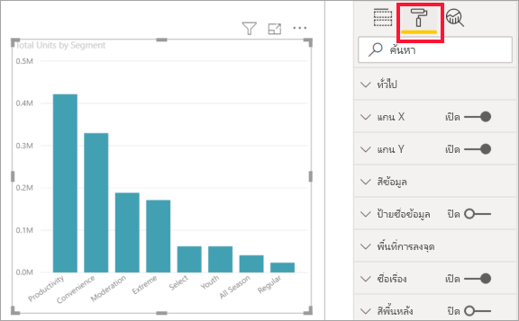

3. เลือก **สีข้อมูล** เพื่อขยายการกำหนดเองที่พร้อมใช้งานSelect **Data Colors** to expand its available customizations.  

    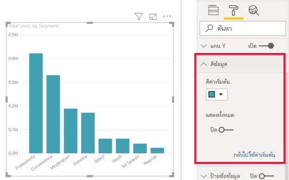

4. เปลี่ยน **แสดงทั้งหมด** เป็นเปิด และเลือกสีที่แตกต่างกันสำหรับคอลัมน์Change **Show all** to On, and select different colors for columns.

    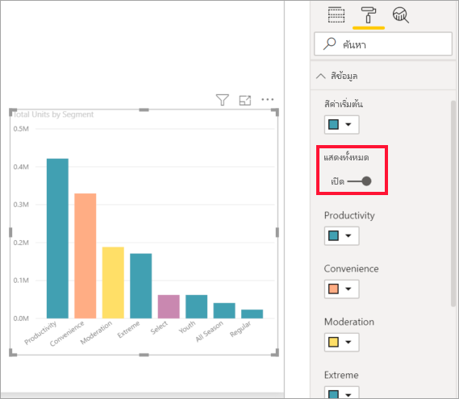

ต่อไปนี้คือเคล็ดลับบางอย่างที่มีประโยชน์สำหรับการทำงานกับสีHere are a few useful tips for working with colors. ตัวเลขในรายการต่อไปนี้จะยังปรากฏอยู่ในหน้าจอต่อไปนี้ โดยจะระบุว่าคุณจะสามารถเข้าใข้งานหรือเปลี่ยนแปลงองค์ประกอบใดบ้างในองค์ประกอบที่มีประโยขน์เหล่านี้The numbers in the following list are also shown on the following screen, indicating where these useful elements can be accessed or changed.

1. ไม่ชอบสีสันใช่ไหมDon’t like the color? ไม่มีปัญหา เพียงเลือก **แปลงกลับเป็นค่าเริ่มต้น** และสิ่งที่คุณเลือกจะเปลี่ยนกลับเป็นการตั้งค่าเริ่มต้นNo problem, just select **Revert to default** and your selection reverts to the default setting. 

2. ไม่ชอบสีที่เปลี่ยนใช่ไหมDon't like any of the color changes? เลือก **แปลงกลับเป็นค่าเริ่มต้น** จากด้านล่างของส่วน   **สีข้อมูล** และสีของคุณแปลงกลับเป็นการตั้งค่าเริ่มต้นSelect **Revert to default** from the bottom of the **Data color** section, and your colors revert to the default settings. 

3. ต้องการสีที่คุณไม่เห็นในชุดแบบสีหรือไม่Want a color you don’t see in the palette? เพียงเลือก **สีแบบกำหนดเอง** และเลือกจากแถบสเปกตรัมสีJust select **Custom color**, and choose from the spectrum.  

   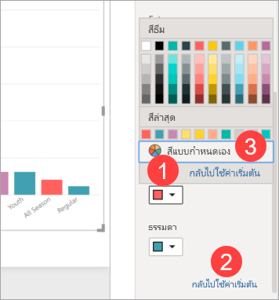

ไม่ได้ชื่นชอบกับการเปลี่ยนแปลงที่คุณเพิ่งทำใช่หรือไม่Not crazy about the change you just made? ใช ้ **CTRL + Z** เมื่อต้องการเลิกทำ ในลักษณะเดียวกับที่คุณใช้ดำเนินการUse **CTRL+Z** to undo , just like you’re used to doing.

## ใช้งานลักษณะกับตารางApplying a style to a table
การแสดงภาพ Power BI บางรายการจะมีตัวเลือก **ลักษณะ**Some Power BI visualizations have a **Style** option. ด้วยการคลิกเพียงครั้งเดียว จะมีการใช้ตัวเลือกการจัดรูปแบบเต็มรูปแบบกับการแสดงภาพของคุณทั้งหมดในครั้งเดียวWith one click, a full set of formatting options are applied to your visualization, all at once. 

1. เลือกตารางหรือเมทริกซ์เพื่อเปิดใช้งานSelect a table or matrix to make it active.   
1. เปิดบานหน้าต่างการจัดรูปแบบ และเลือก **ลักษณะ**Open the Formatting tab and select **Style**.

   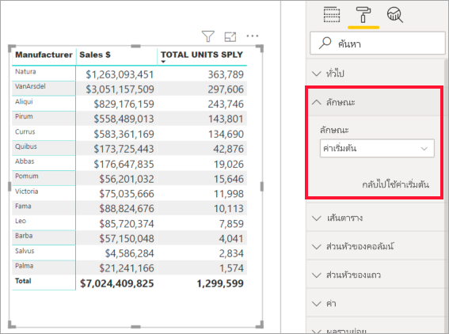

1. เลือกลักษณะจากรายการดรอปดาวน์Select a style from the dropdown. 

   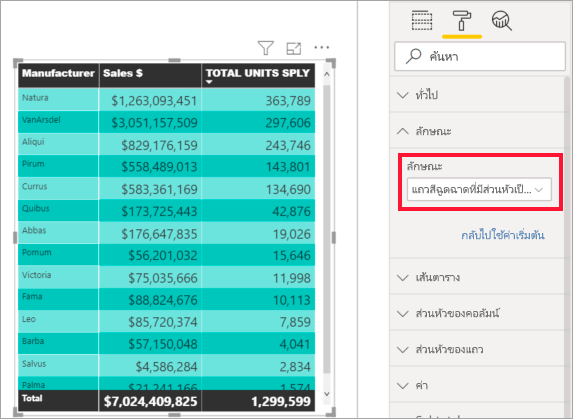

แม้ว่าหลังจากที่คุณนำลักษณะไปใช้แล้ว คุณสามารถดำเนินการจัดรูปแบบคุณสมบัติต่อได้ ซึ่งรวมถึง สี สำหรับการแสดงภาพนั้นEven after you apply a Style, you can continue formatting properties, including color, for that visualization.

## การเปลี่ยนแปลงคุณสมบัติแกนChanging axis properties

มักจะมีประโยชน์ในการปรับเปลี่ยนแกน X หรือแกน YIt’s often useful to modify the X-axis or the Y-axis. คล้ายกับการใช้งานแบบมีสีสัน คุณสามารถปรับเปลี่ยนแกนได้โดยเลือกไอคอนลูกศรชี้ลงทางด้านซ้ายของแกนคุณต้องการเปลี่ยนแปลง ดังที่แสดงในรูปต่อไปนี้Similar to working with colors, you can modify an axis by selecting the down-arrow icon to the left of the axis you want to change, as shown in the following image.  
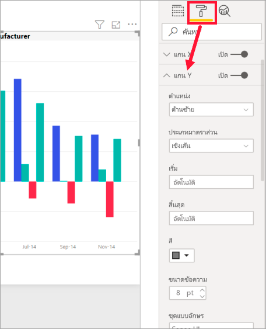

ในตัวอย่างด้านล่าง เราได้จัดรูปแบบแกน Y โดย:In the example below, we've formatted the Y axis by:
- ย้ายป้ายชื่อไปยังด้านขวาของการแสดงภาพmoving the labels to the right side of the visualization

- เปลี่ยนค่าเริ่มต้นเป็นศูนย์changing the starting value to zero.

- เปลี่ยนสีตัวอักษรของป้ายชื่อเป็นสีดำchanging the label font color to black

- เพิ่มขนาดแบบอักษรของป้ายชื่อเป็น 12increasing label font size to 12

- เพิ่มชื่อเรื่องแกน Yadding a Y-axis title

    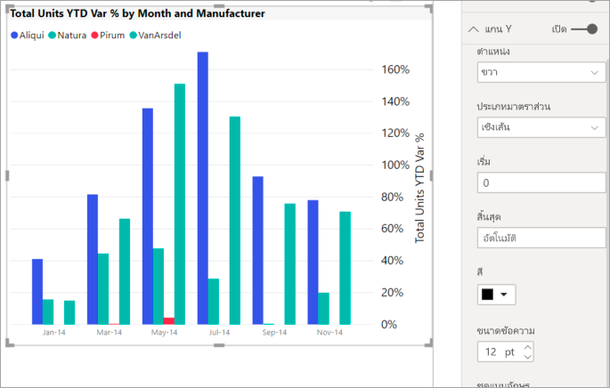

คุณสามารถนำป้ายชื่อแกน X ออกได้ ทั้งหมด โดยสลับปุ่มตัวเลือกที่อยู่ด้านข้าง **แกน X** หรือ **แกน Y**You can remove the axis labels entirely, by toggling the radio button beside **X-Axis** or **Y-Axis**. คุณยังสามารถเลือกได้ว่าจะเปิดหรือปิดใช้งานชื่อแกนได้ โดยเลือกปุ่มตัวเลือกที่อยู่ถัดจาก **ชื่อเรื่อง** ได้You can also choose whether to turn axis titles on or off by selecting the radio button next to **Title**.  

## เพิ่มป้ายชื่อข้อมูลAdding data labels    

ลองเพิ่มป้ายชื่อข้อมูลลงในแผนภูมิพื้นที่Let's add data labels to an area chart. 

ต่อไปนี้คือรูปภาพ *ก่อน*Here is the *before* picture. 

และนี่คือรูปภาพ *หลัง*And, here is the *after* picture.

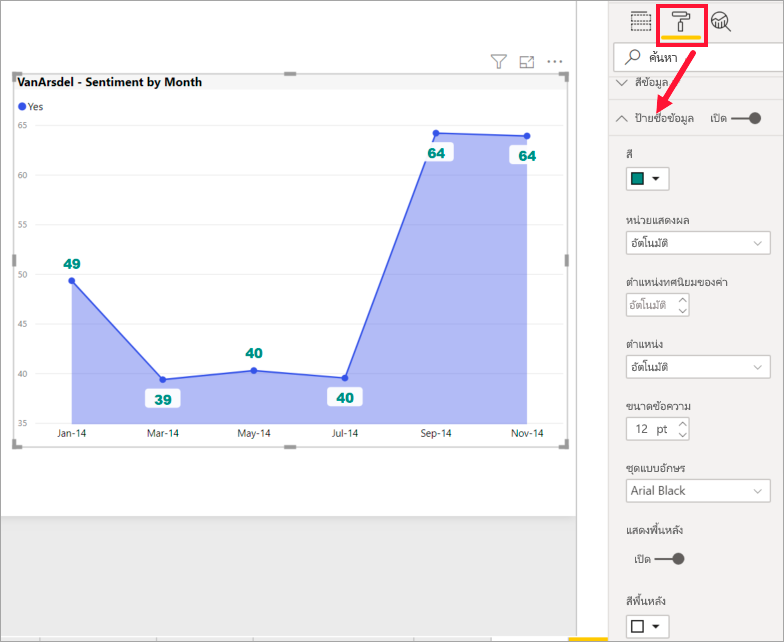

เราเลือกการแสดงภาพเพื่อทำให้ใช้งานได้และเปิดแท็บการจัดรูปแบบ  เราเลือก **ป้ายชื่อข้อมูล** และเปิดใช้งานWe selected the visualization to make it active and opened the Formatting tab.  We selected **Data labels** and turned them On. และเรายังเพิ่มขนาดตัวอักษรเป็น 12 เปลี่ยนตระกูลแบบอักษรเป็น Arial Black เปิด **แสดงพื้นหลัง** และเปลี่ยนพื้นหลังเป็นสีขาวที่มีความโปร่งใส 5%Then we increased font to 12, changed font family to Arial Black, turned **Show background** to On and background color to white with a transparency of 5%.

นี่เป็นเพียงบางส่วนของการจัดรูปแบบที่สามารถทำได้These are just a few of the formatting tasks that are possible. เปิดรายงานในโหมดการแก้ไขและสนุกกับการสำรวจบานหน้าต่างการจัดรูปแบบเพื่อสร้างการแสดงภาพที่สวยงามและให้ข้อมูลOpen a report in Editing mode and have fun exploring the Formatting pane to create beautiful and informative visualizations.

## การเพิ่มป้ายชื่อทั้งหมดAdding total labels    

อีกหนึ่งตัวอย่างสุดท้ายของการจัดรูปแบบก่อนที่คุณจะเริ่มต้นลองทำด้วยตัวคุณเองOne last formatting example before you start exploring on your own.  ลองเพิ่มป้ายชื่อทั้งหมดลงในแผนภูมิคอลัมน์แบบเรียงซ้อนLet's add total labels to a stacked column chart. ป้ายชื่อทั้งหมดจะพร้อมใช้งานสำหรับแผนภูมิแบบเรียงซ้อน แผนภูมิผสม และแผนภูมิพื้นที่Total labels are available for stacked charts, combo charts, and area charts.

เมื่อคุณเปิดใช้งานป้ายชื่อทั้งหมด Power BI จะแสดงการรวมหรือผลรวมของข้อมูลWhen you turn on total labels, Power BI displays the aggregate, or total, of the data. มาลองดูตัวอย่างกันLet's look at an example. 

ที่นี่เรามีแผนภูมิคอลัมน์แบบเรียงซ้อนพร้อมป้ายชื่อข้อมูลที่แสดงค่าของแต่ละส่วนของสแต็กเต็มแต่ละชุดHere, we have a stacked column chart with data labels showing the value of each portion of each full stack.  นี่คือมุมมองค่าเริ่มต้นThis is the default view. 

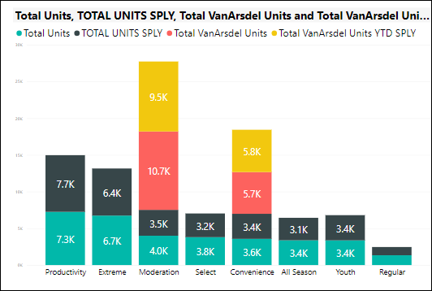

ด้วยการเปิดวิชวลในมุมมองการแก้ไข คุณสามารถเปลี่ยนการแสดงผลสำหรับป้ายชื่อข้อมูลและป้ายชื่อทั้งหมดได้By opening the visual in Editing view, you can change the display for data labels and total labels. เลือกภาพเพื่อเปิดใช้งานและเปิดพื้นที่การจัดรูปแบบSelect the visual to make it active and open the Formatting pane. เลื่อนลงไปที่ **ป้ายชื่อข้อมูล** และ **ป้ายชื่อทั้งหมด**Scroll down to **Data labels** and **Total labels**. **ป้ายชื่อข้อมูล** เปิดอยู่ และ **ป้ายชื่อทั้งหมด** ปิดอยู่**Data labels** is On and **Total labels** is Off. 

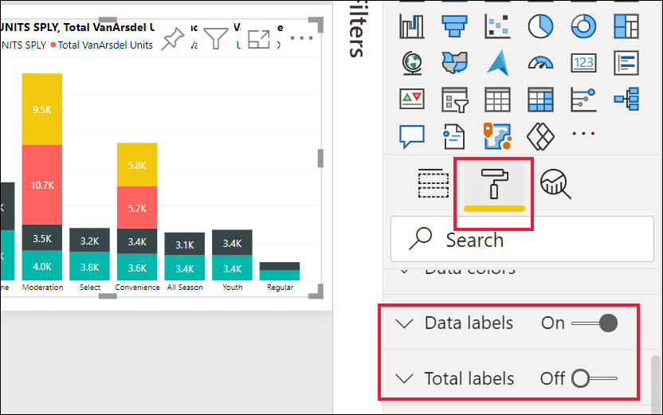

ปิด **ป้ายชื่อข้อมูล** และเปิด **ป้ายชื่อทั้งหมด**Turn **Data labels** Off, and turn **Total labels** On. ตอนนี้ Power BI แสดงการรวมสำหรับแต่ละคอลัมน์Power BI now displays the aggregate for each column.    
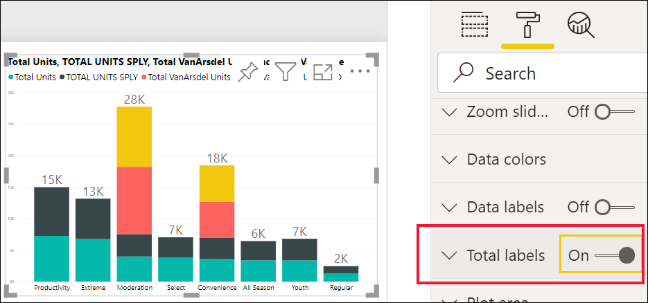

นี่เป็นเพียงบางส่วนของการจัดรูปแบบที่สามารถทำได้These are just a few of the formatting tasks that are possible. เปิดรายงานในโหมดการแก้ไขและสนุกกับการสำรวจบานหน้าต่างการจัดรูปแบบเพื่อสร้างการแสดงภาพที่สวยงามและให้ข้อมูลOpen a report in Editing mode and have fun exploring the Formatting pane to create beautiful and informative visualizations.

## ขั้นตอนถัดไปNext steps
สำหรับข้อมูลเพิ่มเติม โปรดดูบทความต่อไปนี้:For more information, see the following article: 

* [การแชร์รายงานSharing reports](../collaborate-share/service-share-reports.md)

* [คำแนะนำและเคล็ดลับในการจัดรูปแบบสีใน Power BITips and tricks for color formatting in Power BI](service-tips-and-tricks-for-color-formatting.md)  
* [การจัดรูปแบบตามเงื่อนไขในตารางConditional formatting in tables](../create-reports/desktop-conditional-table-formatting.md)

