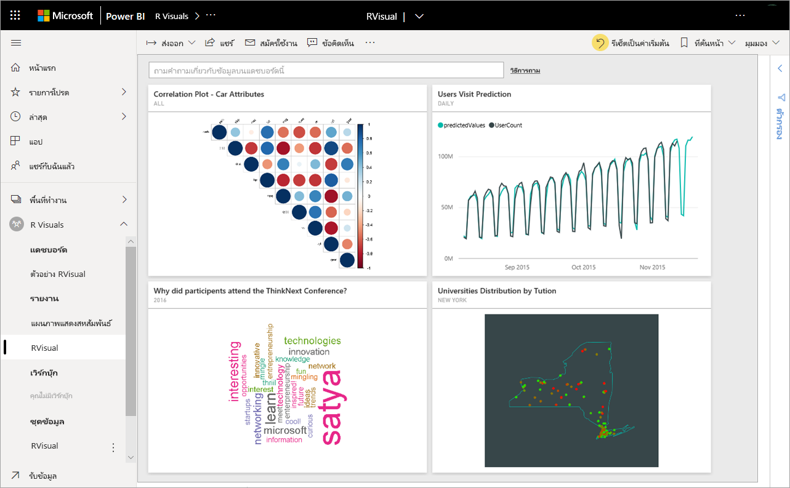
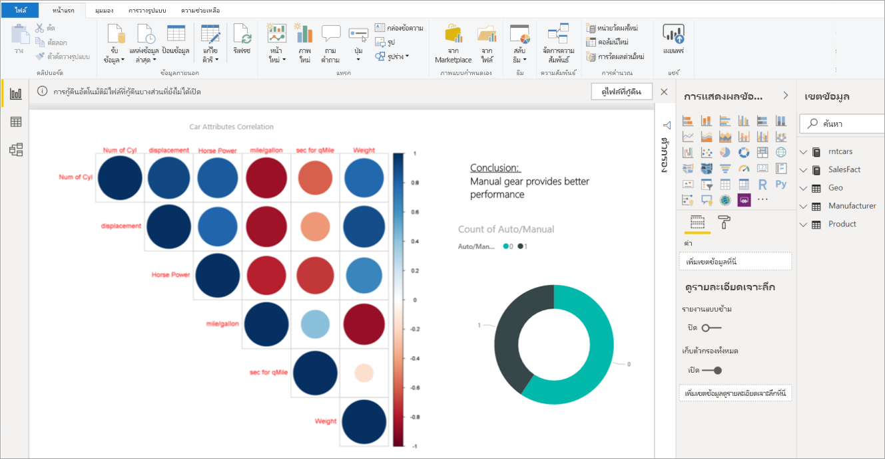
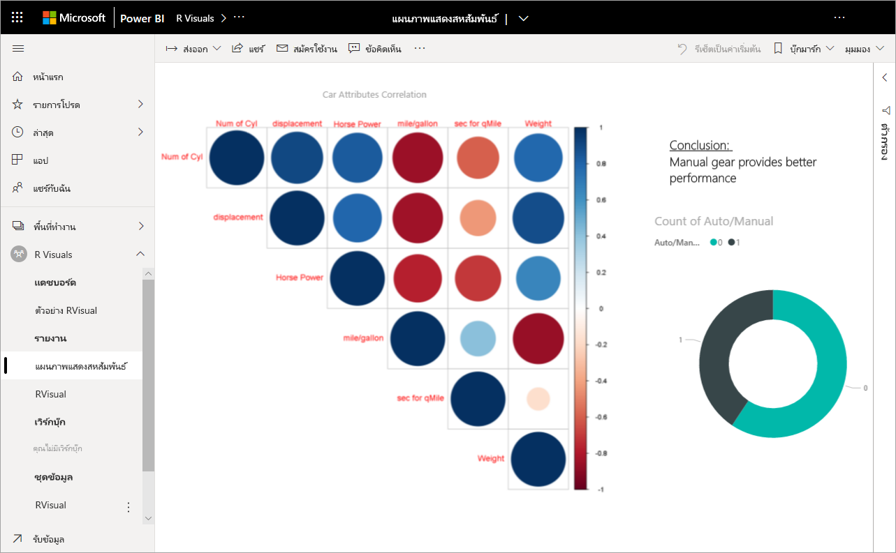
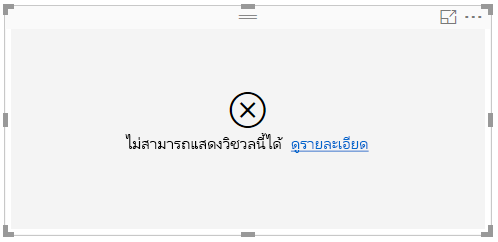
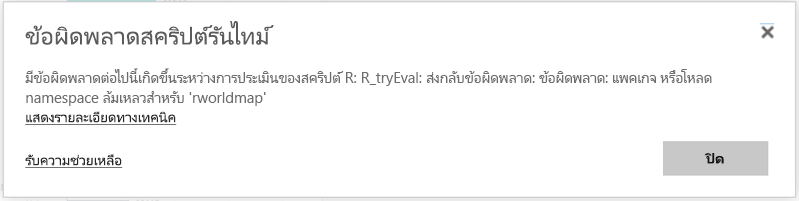

# <a name="create-and-use-r-visuals-in-power-bi"></a><span data-ttu-id="0b643-103">สร้างและใช้วิชวล R ใน Power BI </span><span class="sxs-lookup"><span data-stu-id="0b643-103">Create and use R visuals in Power BI</span></span>

[!INCLUDE[consumer-appliesto-nnyn](../includes/consumer-appliesto-nnyn.md)]

<span data-ttu-id="0b643-104">ในปัจจุบันสามารถสร้างภาพ R ได้ใน **Power BI Desktop** เท่านั้น จากนั้นเผยแพร่ไปยังบริการ Power BI</span><span class="sxs-lookup"><span data-stu-id="0b643-104">R visuals currently can only be created in **Power BI Desktop**, and then published to the Power BI service.</span></span> <span data-ttu-id="0b643-105">สำหรับข้อมูลเพิ่มเติมเกี่ยวกับการสร้างวิชวล R โปรดดู [สร้างวิชวล Power BI โดยใช้ภาษา R ](../create-reports/desktop-r-visuals.md)</span><span class="sxs-lookup"><span data-stu-id="0b643-105">For more information on creating R visuals, see [Create Power BI visuals using R ](../create-reports/desktop-r-visuals.md).</span></span>

## <a name="viewing-r-visuals-in-the-power-bi-service"></a><span data-ttu-id="0b643-106">การดูวิชวล R ในบริการ Power BI</span><span class="sxs-lookup"><span data-stu-id="0b643-106">Viewing R visuals in the Power BI service</span></span>
<span data-ttu-id="0b643-107">บริการ Power BI สนับสนุนการดูและโต้ตอบกับภาพที่สร้างขึ้น ด้วยสคริปต์ R</span><span class="sxs-lookup"><span data-stu-id="0b643-107">The Power BI service supports viewing and interacting with visuals created with R scripts.</span></span> <span data-ttu-id="0b643-108">ภาพที่สร้างขึ้นด้วยสคริปต์ R มักเรียกว่า *ภาพ R* ซึ่งสามารถนำเสนอการปรับรูปร่างข้อมูลและการวิเคราะห์ขั้นสูง เช่น การทำนายโดยใช้การวิเคราะห์ที่มีข้อมูลเต็มเปี่ยมและพลังของการแสดงภาพ R</span><span class="sxs-lookup"><span data-stu-id="0b643-108">Visuals created with R scripts, commonly called *R visuals*, can present advanced data shaping and analytics such as forecasting, using the rich analytics and visualization power of R.</span></span>

> [!NOTE]
> <span data-ttu-id="0b643-109">[ภาษาการเขียนโปรแกรม R](https://www.r-project.org/)เป็นหนึ่งในภาษาที่ใช้กันอย่างแพร่หลายที่สุดโดยนักสถิติ นักวิทยาศาสตร์ข้อมูล และนักวิเคราะห์ทางธุรกิจในการเขียนโปรแกรม</span><span class="sxs-lookup"><span data-stu-id="0b643-109">The [R programming language](https://www.r-project.org/) is among the most widely used programming languages by statisticians, data scientists, and business analysts.</span></span> <span data-ttu-id="0b643-110">ภาษา R มีชุมชนทรัพยากรเปิดที่นำเสนอแพคเกจที่เพิ่มเข้ามากกว่า 7,000 แพคเกจ รวมถึงแพคเกจที่ใช้งานอย่างแพร่หลายในกลุ่มผู้ใช้ R</span><span class="sxs-lookup"><span data-stu-id="0b643-110">The R language has an open source community that offers over 7,000 add-on packages, as well as widely used R User Groups.</span></span> <span data-ttu-id="0b643-111">เวอร์ชัน R ที่ปรับใช้ในบริการ Power BI เป็น *Microsoft R 3.4.4.*</span><span class="sxs-lookup"><span data-stu-id="0b643-111">The version of R deployed in the Power BI service is *Microsoft R 3.4.4.*</span></span>
> 
> 

<span data-ttu-id="0b643-112">รูปต่อไปนี้แสดงแดชบอร์ด Power BI ที่มีคอลเลกชันของภาพ R ที่ใช้สำหรับการวิเคราะห์ขั้นสูง</span><span class="sxs-lookup"><span data-stu-id="0b643-112">The following image shows a Power BI dashboard with a collection of R visuals used for advanced analytics.</span></span>



<span data-ttu-id="0b643-114">ภาพ R จะถูกสร้างขึ้นใน[รายงาน Power BI Desktop](../fundamentals/desktop-get-the-desktop.md) เช่นรายงานที่แสดงในรูปต่อไปนี้</span><span class="sxs-lookup"><span data-stu-id="0b643-114">R visuals are created in a [Power BI Desktop report](../fundamentals/desktop-get-the-desktop.md), like the report shown in the following image.</span></span>



<span data-ttu-id="0b643-116">เมื่อสร้างรายงานใน **Power BI Desktop** แล้ว คุณสามารถเผยแพร่รายงานที่ประกอบด้วยอย่างน้อยหนึ่งภาพ R ไปยังบริการ Power BI ได้</span><span class="sxs-lookup"><span data-stu-id="0b643-116">Once the report is created in **Power BI Desktop**, you can publish the report containing one or more R visuals to the Power BI service.</span></span> 

 <span data-ttu-id="0b643-117">ในบริการนี้ไม่ได้รองรับแพ็คเกจ R ทุกแพ็คเกจ</span><span class="sxs-lookup"><span data-stu-id="0b643-117">In the service, not all of the R packages are supported.</span></span> <span data-ttu-id="0b643-118">ดูแพคเกจที่สนับสนุนที่ส่วนท้ายของบทความนี้สำหรับรายการแพคเกจที่สนับสนุนในบริการ Power BI ในปัจจุบัน</span><span class="sxs-lookup"><span data-stu-id="0b643-118">See supported packages at the end of this article for the list of packages currently supported in the Power BI service.</span></span>

<span data-ttu-id="0b643-119">คุณสามารถดาวน์โหลด[ตัวอย่างไฟล์ Power BI Desktop](https://download.microsoft.com/download/D/9/A/D9A65269-D1FC-49F8-8EC3-1217E3A4390F/RVisual_correlation_plot_sample%20SL.pbix) (ไฟล์ .pbix) นี้ที่ประกอบด้วยบางภาพ R เพื่อดูวิธีการทำงานและทดลองใช้ได้</span><span class="sxs-lookup"><span data-stu-id="0b643-119">You can download this [sample Power BI Desktop file](https://download.microsoft.com/download/D/9/A/D9A65269-D1FC-49F8-8EC3-1217E3A4390F/RVisual_correlation_plot_sample%20SL.pbix) (.pbix file) that contains a few R visuals to see how this works, and to experiment.</span></span>

<span data-ttu-id="0b643-120">ภาพ R ที่สร้างขึ้นใน **Power BI Desktop** จากนั้นเผยแพร่ไปยังบริการ Power BI ส่วนใหญ่แล้วจะทำงานเหมือนภาพอื่น ๆ ในบริการ Power BI คุณสามารถโต้ตอบ กรอง แบ่งส่วน และปักหมุดภาพเหล่านั้นไปยังแดชบอร์ด หรือแชร์ไฟล์เหล่านั้นกับผู้อื่นได้</span><span class="sxs-lookup"><span data-stu-id="0b643-120">R visuals that are created in **Power BI Desktop**, and then published to the Power BI service, for the most part behave like any other visual in the Power BI service; you can interact, filter, slice, and pin them to a dashboard, or share them with others.</span></span> <span data-ttu-id="0b643-121">สำหรับข้อมูลเพิ่มเติมเกี่ยวกับการแชร์แดชบอร์ดและรูปภาพ ดู[แชร์แดชบอร์ดกับเพื่อนร่วมงานและผู้อื่น](../collaborate-share/service-share-dashboards.md)</span><span class="sxs-lookup"><span data-stu-id="0b643-121">For more information about sharing dashboards and visuals, see [share a dashboard with colleagues and others](../collaborate-share/service-share-dashboards.md).</span></span> <span data-ttu-id="0b643-122">สิ่งหนึ่งที่แตกต่างจากภาพอื่น ๆ คือภาพ R ไม่สามารถแสดงเคล็ดลับเครื่องมือได้ และไม่สามารถใช้เพื่อกรองภาพอื่น ๆ ได้</span><span class="sxs-lookup"><span data-stu-id="0b643-122">One difference from other visuals is that R visuals cannot show tool tips and cannot be used to filter other visuals.</span></span>

<span data-ttu-id="0b643-123">ดังที่คุณจะเห็นในรูปต่อไปนี้ ภาพ R ในบริการ Power BI ในแดชบอร์ดหรือในรายงาน ส่วนใหญ่แล้วจะปรากฏขึ้นและทำงานเหมือนกับภาพอื่น ๆ และผู้ใช้ไม่จำเป็นทราบสคริปต์ R พื้นฐานที่สร้างภาพนั้นขึ้น</span><span class="sxs-lookup"><span data-stu-id="0b643-123">As you can see in the following image, R visuals in the Power BI service, either in dashboards or reports, largely appear and behave like any other visual, and users don't need to be aware of the underlying R script that created the visual.</span></span>



## <a name="r-scripts-security"></a><span data-ttu-id="0b643-125">การรักษาความปลอดภัยสคริปต์ R</span><span class="sxs-lookup"><span data-stu-id="0b643-125">R scripts security</span></span>
<span data-ttu-id="0b643-126">ภาพ R ถูกสร้างขึ้นจากสคริปต์ R ซึ่งอาจประกอบด้วยโค้ดที่มีความเสี่ยงต่อความปลอดภัยหรือความเป็นส่วนตัว</span><span class="sxs-lookup"><span data-stu-id="0b643-126">R visuals are created from R scripts, which could potentially contain code with security or privacy risks.</span></span>

<span data-ttu-id="0b643-127">ความเสี่ยงเหล่านี้มีอยู่ในขั้นตอนการเขียนเมื่อผู้เขียนสคริปต์เรียกใช้สคริปต์บนคอมพิวเตอร์ของตนเป็นหลัก</span><span class="sxs-lookup"><span data-stu-id="0b643-127">These risks mainly exist in the authoring phase when the script author run the script on their own computer.</span></span>

<span data-ttu-id="0b643-128">บริการ Power BI นำเทคโนโลยี *sandbox* มาใช้เพื่อปกป้องผู้ใช้และบริการจากความเสี่ยงด้านความปลอดภัย</span><span class="sxs-lookup"><span data-stu-id="0b643-128">The Power BI service applies a *sandbox* technology to protect users and the service from security risks.</span></span>

<span data-ttu-id="0b643-129">ซึ่ง *sandbox* จะทำให้มีข้อจำกัดบางอย่างบนสคริปต์ R ที่ทำงานในบริการ Power BI เช่น การเข้าถึงอินเทอร์เน็ต หรือการเข้าถึงแหล่งข้อมูลอื่น ๆ ที่ไม่จำเป็นต้องมีสำหรับการสร้างภาพ R</span><span class="sxs-lookup"><span data-stu-id="0b643-129">This *sandbox* approach imposes some restrictions on the R scripts running in the Power BI service, such as accessing the Internet, or accessing to other resources that are not required to create the R visual.</span></span>

## <a name="r-scripts-error-experience"></a><span data-ttu-id="0b643-130">ประสบการณ์การใช้งานข้อผิดพลาดสคริปต์ R</span><span class="sxs-lookup"><span data-stu-id="0b643-130">R scripts error experience</span></span>
<span data-ttu-id="0b643-131">เมื่อสคริปต์ R พบข้อผิดพลาด ภาพ R จะไม่มีการลงจุดและระบบจะแสดงข้อผิดพลาดขึ้น</span><span class="sxs-lookup"><span data-stu-id="0b643-131">When an R script encounters an error, the R visual is not plotted and an error message is displayed.</span></span> <span data-ttu-id="0b643-132">สำหรับรายละเอียดเกี่ยวกับข้อผิดพลาด เลือก **ดูรายละเอียด** จากข้อผิดพลาดวิชวล R บนพื้นที่ทำงานดังแสดงในรูปภาพดังต่อไปนี้</span><span class="sxs-lookup"><span data-stu-id="0b643-132">For details on the error, select **See details** from the R visual error on the canvas, as shown in the following image.</span></span>



<span data-ttu-id="0b643-134">อีกหนึ่งตัวอย่าง รูปต่อไปนี้แสดงข้อผิดพลาดที่ปรากฏขึ้นเมื่อสคริปต์ R ล้มเหลวในการทำงานอย่างถูกต้องเนื่องจากแพคเกจ R ใน Azure ขาดหายไป</span><span class="sxs-lookup"><span data-stu-id="0b643-134">As another example, the following image shows the error message that appears when an R script failed to run properly due to a missing R package in Azure.</span></span>



## <a name="licensing"></a><span data-ttu-id="0b643-136">การมอบสิทธิ์การใช้งาน</span><span class="sxs-lookup"><span data-stu-id="0b643-136">Licensing</span></span>
<span data-ttu-id="0b643-137">วิชวล R จำเป็นต้องมีสิทธิ์การใช้งาน [Power BI Pro](../fundamentals/service-self-service-signup-for-power-bi.md) เพื่อแสดงในรายงาน รีเฟรช กรอง และกรองข้าม</span><span class="sxs-lookup"><span data-stu-id="0b643-137">R visuals require a [Power BI Pro](../fundamentals/service-self-service-signup-for-power-bi.md) license to render in reports, refresh, filter, and cross-filter.</span></span> <span data-ttu-id="0b643-138">สำหรับข้อมูลเพิ่มเติมเกี่ยวกับสิทธิ์การใช้งาน Power BI Pro และความแตกต่างจากสิทธิ์การใช้งานฟรี ดู[เนื้อหา Power BI Pro - นี่คืออะไร?](../admin/service-admin-purchasing-power-bi-pro.md)</span><span class="sxs-lookup"><span data-stu-id="0b643-138">For more information about Power BI Pro licenses, and how they differ from free licenses, see [Power BI Pro content - what is it?](../admin/service-admin-purchasing-power-bi-pro.md)</span></span>

<span data-ttu-id="0b643-139">ผู้ใช้ที่ใช้งาน Power BI ฟรีสามารถใช้ไทล์ที่แชร์กับตนได้เท่านั้นในพื้นที่ทำงานระดับ Premium</span><span class="sxs-lookup"><span data-stu-id="0b643-139">Free users of Power BI can only consume tiles shared with them in Premium workspaces.</span></span> <span data-ttu-id="0b643-140">สำหรับข้อมูลเพิ่มเติม ดู[ซื้อ Power BI Pro](../admin/service-admin-purchasing-power-bi-pro.md)</span><span class="sxs-lookup"><span data-stu-id="0b643-140">See [purchasing Power BI Pro](../admin/service-admin-purchasing-power-bi-pro.md) for more information.</span></span>

<span data-ttu-id="0b643-141">ตารางต่อไปนี้อธิบายเกี่ยวกับความสามารถของภาพ R ตามสิทธิ์การใช้งาน</span><span class="sxs-lookup"><span data-stu-id="0b643-141">The following table describes R visuals capabilities based on licensing.</span></span>


|  |<span data-ttu-id="0b643-142">ผู้เขียน R วิชวลใน Power BI Desktop</span><span class="sxs-lookup"><span data-stu-id="0b643-142">Author R visuals in Power BI Desktop</span></span>  | <span data-ttu-id="0b643-143">สร้างรายงานบริการ PBI ด้วยวิชวล R</span><span class="sxs-lookup"><span data-stu-id="0b643-143">Create PBI service reports with R visuals</span></span> |<span data-ttu-id="0b643-144">ดูวิชวล R ในรายงาน</span><span class="sxs-lookup"><span data-stu-id="0b643-144">View R visuals in reports</span></span>  | <span data-ttu-id="0b643-145">มุมมองไทล์ R ในแดชบอร์ด</span><span class="sxs-lookup"><span data-stu-id="0b643-145">View R tiles in dashboards</span></span> |
|---------|---------|---------|---------|--------|
|<span data-ttu-id="0b643-146">**ผู้เยี่ยมชม** Power BI Embedded</span><span class="sxs-lookup"><span data-stu-id="0b643-146">**Guest** (Power BI embedded)</span></span>     |  <span data-ttu-id="0b643-147">สนับสนุน</span><span class="sxs-lookup"><span data-stu-id="0b643-147">Supported</span></span>|  <span data-ttu-id="0b643-148">ไม่ได้รับการสนับสนุน</span><span class="sxs-lookup"><span data-stu-id="0b643-148">Not supported</span></span>      | <span data-ttu-id="0b643-149">ได้รับการสนับสนุนในความจุ Premium/Azure เท่านั้น</span><span class="sxs-lookup"><span data-stu-id="0b643-149">Supported in Premium/Azure capacity only</span></span>  | <span data-ttu-id="0b643-150">ได้รับการสนับสนุนในความจุ Premium/Azure เท่านั้น</span><span class="sxs-lookup"><span data-stu-id="0b643-150">Supported in Premium/Azure capacity only</span></span> |
|<span data-ttu-id="0b643-151">**ผู้เช่าที่ไม่มีการจัดการ**(ไม่ได้ยืนยันโดเมน)</span><span class="sxs-lookup"><span data-stu-id="0b643-151">**Unmanaged tenant** (domain not verified)</span></span> | <span data-ttu-id="0b643-152">สนับสนุน</span><span class="sxs-lookup"><span data-stu-id="0b643-152">Supported</span></span> | <span data-ttu-id="0b643-153">ไม่ได้รับการสนับสนุน</span><span class="sxs-lookup"><span data-stu-id="0b643-153">Not supported</span></span> |  <span data-ttu-id="0b643-154">ไม่ได้รับการสนับสนุน</span><span class="sxs-lookup"><span data-stu-id="0b643-154">Not supported</span></span> |<span data-ttu-id="0b643-155">ได้รับการสนับสนุน (สถานการณ์ B2B)</span><span class="sxs-lookup"><span data-stu-id="0b643-155">Supported (B2B scenario)</span></span> |
|<span data-ttu-id="0b643-156">**ผู้เช่าที่ได้รับการจัดการ** ซึ่งมีใบอนุญาตฟรี</span><span class="sxs-lookup"><span data-stu-id="0b643-156">**Managed tenant** with free license</span></span>    |  <span data-ttu-id="0b643-157">สนับสนุน</span><span class="sxs-lookup"><span data-stu-id="0b643-157">Supported</span></span>       |  <span data-ttu-id="0b643-158">ไม่ได้รับการสนับสนุน</span><span class="sxs-lookup"><span data-stu-id="0b643-158">Not supported</span></span>       |    <span data-ttu-id="0b643-159">ได้รับการสนับสนุนในความจุ Premium เท่านั้น</span><span class="sxs-lookup"><span data-stu-id="0b643-159">Supported in Premium capacity only</span></span>    | <span data-ttu-id="0b643-160">สนับสนุน</span><span class="sxs-lookup"><span data-stu-id="0b643-160">Supported</span></span> |
<span data-ttu-id="0b643-161">**ผู้เช่าที่ได้รับการจัดการ** ซึ่งมีใบอนุญาต Pro</span><span class="sxs-lookup"><span data-stu-id="0b643-161">**Managed tenant** with Pro license</span></span>     |   <span data-ttu-id="0b643-162">สนับสนุน</span><span class="sxs-lookup"><span data-stu-id="0b643-162">Supported</span></span>      | <span data-ttu-id="0b643-163">สนับสนุน</span><span class="sxs-lookup"><span data-stu-id="0b643-163">Supported</span></span>      | <span data-ttu-id="0b643-164">สนับสนุน</span><span class="sxs-lookup"><span data-stu-id="0b643-164">Supported</span></span>    |<span data-ttu-id="0b643-165">สนับสนุน</span><span class="sxs-lookup"><span data-stu-id="0b643-165">Supported</span></span>|


## <a name="known-limitations"></a><span data-ttu-id="0b643-166">ข้อจำกัดที่ทราบ</span><span class="sxs-lookup"><span data-stu-id="0b643-166">Known Limitations</span></span>
<span data-ttu-id="0b643-167">ภาพ R ในบริการ Power BI มีข้อจำกัดบางอย่าง:</span><span class="sxs-lookup"><span data-stu-id="0b643-167">R visuals in the Power BI service have a few limitations:</span></span>

* <span data-ttu-id="0b643-168">การสนับสนุนวิชวล R จะถูกจำกัดสำหรับแพคเกจที่ระบุ [ในการเรียนรู้เรื่อง แพคเกจ R ตัวใดบ้างที่ได้รับการสนับสนุน](../connect-data/service-r-packages-support.md)</span><span class="sxs-lookup"><span data-stu-id="0b643-168">R visuals support is limited to the packages identified [in Learn which R packages are supported](../connect-data/service-r-packages-support.md).</span></span> <span data-ttu-id="0b643-169">ในขณะนี้ยังไม่สนับสนุนสำหรับแพคเกจแบบกำหนดเอง</span><span class="sxs-lookup"><span data-stu-id="0b643-169">There currently is no support for custom packages.</span></span>
* <span data-ttu-id="0b643-170">ข้อจำกัดของขนาดข้อมูล – ข้อมูลที่ใช้โดยวิชวล R สำหรับการลงจุดจะถูกจำกัดไว้ที่ 150,000 แถว</span><span class="sxs-lookup"><span data-stu-id="0b643-170">Data size limitations – data used by the R visual for plotting is limited to 150,000 rows.</span></span> <span data-ttu-id="0b643-171">ถ้าเลือกมากกว่า 150,000 แถว จะใช้งานเฉพาะ 150,000 แถวบนสุด และข้อความจะแสดงบนรูปภาพ</span><span class="sxs-lookup"><span data-stu-id="0b643-171">If more than 150,000 rows are selected, only the top 150,000 rows are used and a message is displayed on the image.</span></span> <span data-ttu-id="0b643-172">นอกจากนี้ ข้อมูลป้อนเข้าจะมีขีดจำกัดที่ 250 MB</span><span class="sxs-lookup"><span data-stu-id="0b643-172">Additionally, the input data has a limit of 250 MB.</span></span>
* <span data-ttu-id="0b643-173">ความละเอียด - วิชวล R ทั้งหมดจะแสดงที่ 72 DPI</span><span class="sxs-lookup"><span data-stu-id="0b643-173">Resolution - all R visuals are displayed at 72 DPI.</span></span>
* <span data-ttu-id="0b643-174">อุปกรณ์การลงจุด - รองรับเฉพาะการลงจุดไปยังอุปกรณ์เริ่มต้นเท่านั้น</span><span class="sxs-lookup"><span data-stu-id="0b643-174">Plotting device - only plotting to the default device is supported.</span></span> 
* <span data-ttu-id="0b643-175">ข้อจำกัดด้านเวลาคำนวณ – ถ้าการคำนวณภาพ R เกิน 60 วินาทีซึ่งหมดเวลาการดำเนินการสคริปต์ จะส่งผลให้เกิดข้อผิดพลาด</span><span class="sxs-lookup"><span data-stu-id="0b643-175">Calculation time limitation – if an R visual calculation exceeds 60 seconds the script times out, resulting in an error.</span></span>
* <span data-ttu-id="0b643-176">วิชวล R ถูกรีเฟรชเมื่อมีการปรับปรุงข้อมูล การกรอง และการเน้น</span><span class="sxs-lookup"><span data-stu-id="0b643-176">R visuals are refreshed upon data updates, filtering, and highlighting.</span></span> <span data-ttu-id="0b643-177">อย่างไรก็ตาม รูปภาพนั้นไม่ได้เป็นแบบโต้ตอบและไม่สนับสนุนเคล็ดลับเครื่องมือ</span><span class="sxs-lookup"><span data-stu-id="0b643-177">However, the image itself is not interactive and does not support tool tips.</span></span>
* <span data-ttu-id="0b643-178">วิชวล R ตอบสนองต่อการเน้นภาพอื่น ๆ แต่คุณไม่สามารถคลิกที่องค์ประกอบในวิชวล R เพื่อที่กรองข้ามองค์ประกอบอื่น ๆ ได้</span><span class="sxs-lookup"><span data-stu-id="0b643-178">R visuals respond to highlighting other visuals, but you cannot click on elements in the R visual in order to cross filter other elements.</span></span>
* <span data-ttu-id="0b643-179">ปัจจุบัน ภาพ R ยังไม่สนับสนุนสำหรับชนิดข้อมูลที่เป็น *เวลา*</span><span class="sxs-lookup"><span data-stu-id="0b643-179">R visuals are currently not supported for the *Time* data type.</span></span> <span data-ttu-id="0b643-180">โปรดใช้วันที่/เวลาแทน</span><span class="sxs-lookup"><span data-stu-id="0b643-180">Please use Date/Time instead.</span></span>
* <span data-ttu-id="0b643-181">วิชวล R จะไม่สามารถแสดงผลได้เมื่อใช้การ **เผยแพร่ไปยังเว็บ**</span><span class="sxs-lookup"><span data-stu-id="0b643-181">R visuals do not display when using **Publish to web**.</span></span>
* <span data-ttu-id="0b643-182">วิชวล R ไม่รองรับการเปลี่ยนชื่อคอลัมน์ช่องป้อนข้อมูล</span><span class="sxs-lookup"><span data-stu-id="0b643-182">R visuals do not support renaming input columns.</span></span> <span data-ttu-id="0b643-183">คอลัมน์จะถูกอ้างอิงโดยใช้ชื่อเดิมของคอลัมน์นั้นในระหว่างการประมวลผลสคริปต์</span><span class="sxs-lookup"><span data-stu-id="0b643-183">Columns will be referred to by their original name during script execution.</span></span>
* <span data-ttu-id="0b643-184">ในขณะนี้ ภาพ R ไม่สามารถพิมพ์ได้ด้วยการพิมพ์แดชบอร์ดหรือรายงาน</span><span class="sxs-lookup"><span data-stu-id="0b643-184">R visuals currently do not print with dashboard and reports printing</span></span>
* <span data-ttu-id="0b643-185">ภาพ R ไม่สนับสนุนสำหรับโหมด DirectQuery ของ Analysis Services</span><span class="sxs-lookup"><span data-stu-id="0b643-185">R visuals are currently not supported in the DirectQuery mode of Analysis Services</span></span>
* <span data-ttu-id="0b643-186">วิชวล R มีความสามารถในการแปลงป้ายชื่อข้อความเป็นองค์ประกอบกราฟิก</span><span class="sxs-lookup"><span data-stu-id="0b643-186">R visuals have the ability to convert text labels into graphical elements.</span></span> <span data-ttu-id="0b643-187">การทำเช่นนี้ในบริการ Power BI ต้องการขั้นตอนเพิ่มเติมต่อไปนี้:</span><span class="sxs-lookup"><span data-stu-id="0b643-187">Doing so in the Power BI service requires the following additional step:</span></span>
  
  * <span data-ttu-id="0b643-188">เพิ่มบรรทัดต่อไปนี้ที่ตอนต้นของสคริปต์ R:</span><span class="sxs-lookup"><span data-stu-id="0b643-188">Add the following line at the beginning of the R script:</span></span>
    
```powerbi_rEnableShowText =  1```

* <span data-ttu-id="0b643-189">ฟอนต์ภาษาจีน ญี่ปุ่น และภาษาเกาหลีจำเป็นต้องดำเนินการตามขั้นตอนต่อไปนี้ทั้งหมดเพื่อให้สามารถทำงานได้อย่างถูกต้องในบริการ Power BI:</span><span class="sxs-lookup"><span data-stu-id="0b643-189">Chinese, Japanese, and Korean fonts require all of the additional following steps to work properly in the Power BI service:</span></span>
  
  * <span data-ttu-id="0b643-190">ก่อนอื่น ติดตั้งแพคเกจ R *showtext* และอ้างอิงที่เกี่ยวเนื่องทั้งหมด</span><span class="sxs-lookup"><span data-stu-id="0b643-190">First, install the R package *showtext* and all of its dependencies.</span></span> <span data-ttu-id="0b643-191">คุณสามารถดำเนินการนี้ได้โดยการเรียกใช้สคริปต์ต่อไปนี้:</span><span class="sxs-lookup"><span data-stu-id="0b643-191">You can do this by running the following script:</span></span>
    
```install.packages("showtext")```

  * <span data-ttu-id="0b643-192">ถัดไป เพิ่มบรรทัดต่อไปนี้ที่จุดเริ่มต้นของสคริปต์ R:</span><span class="sxs-lookup"><span data-stu-id="0b643-192">Next, add the following line at the beginning of the R script:</span></span>
    
```R script
powerbi_rEnableShowTextForCJKLanguages =  1
```

## <a name="overview-of-r-packages"></a><span data-ttu-id="0b643-193">ภาพรวมของแพคเกจ R</span><span class="sxs-lookup"><span data-stu-id="0b643-193">Overview of R packages</span></span>
<span data-ttu-id="0b643-194">แพคเกจ R เป็นคอลเลกชันของ R ฟังก์ชัน ข้อมูล และการรวมกันของโค้ดที่จะถูกรวมในรูปแบบที่กำหนดไว้อย่างดี</span><span class="sxs-lookup"><span data-stu-id="0b643-194">R packages are collections of R functions, data, and compiled code that are combined in a well-defined format.</span></span> <span data-ttu-id="0b643-195">เมื่อมีการติดตั้ง R แพคเกจจะมาพร้อมกับชุดมาตรฐาน และแพคเกจอื่น ๆ จะพร้อมสำหรับการดาวน์โหลดและติดตั้ง</span><span class="sxs-lookup"><span data-stu-id="0b643-195">When R is installed, it comes with a standard set of packages, and other packages are available for download and installation.</span></span> <span data-ttu-id="0b643-196">เมื่อติดตั้งแล้ว คุณจะต้องโหลดแพคเกจ R ลงในเซสชันที่จะใช้</span><span class="sxs-lookup"><span data-stu-id="0b643-196">Once installed, an R package must be loaded into the session to be used.</span></span> <span data-ttu-id="0b643-197">แหล่งข้อมูลหลักของแพคเกจ R ฟรีคือ CRAN [Comprehensive R Archive Network](https://cran.r-project.org/web/packages/available_packages_by_name.html)</span><span class="sxs-lookup"><span data-stu-id="0b643-197">The primary source of free R packages is CRAN, the [Comprehensive R Archive Network](https://cran.r-project.org/web/packages/available_packages_by_name.html).</span></span>

<span data-ttu-id="0b643-198">**Power BI Desktop** สามารถใช้แพคเกจ R ประเภทใดก็ได้โดยไม่มีข้อจำกัด</span><span class="sxs-lookup"><span data-stu-id="0b643-198">**Power BI Desktop** can use any type of R packages without limitation.</span></span> <span data-ttu-id="0b643-199">คุณสามารถติดตั้งแพคเกจ R สำหรับใช้ใน **Power BI Desktop** ด้วยตนเอง (ยกตัวอย่างเช่น โดยใช้ [RStudio IDE](https://www.rstudio.com/))</span><span class="sxs-lookup"><span data-stu-id="0b643-199">You can install R packages for use in **Power BI Desktop** on your own (using the [RStudio IDE](https://www.rstudio.com/), for example).</span></span>

<span data-ttu-id="0b643-200">ภาพ R ในการ **บริการ Power BI** สนับสนุนโดยแพคเกจที่พบในส่วน **แพคเกจที่สนับสนุน** ที่ดูได้ใน [บทความนี้](../connect-data/service-r-packages-support.md)</span><span class="sxs-lookup"><span data-stu-id="0b643-200">R visuals in the **Power BI service** are supported by the packages found in the **Supported Packages** section found in [this article](../connect-data/service-r-packages-support.md).</span></span> <span data-ttu-id="0b643-201">ถ้าคุณไม่พบแพคเกจที่คุณสนใจในรายการแพคเกจที่สนับสนุน คุณสามารถร้องขอการสนับสนุนแพคเกจได้</span><span class="sxs-lookup"><span data-stu-id="0b643-201">If you don't find a package you're interested in among the supported packages list, you can request the support of the package.</span></span> <span data-ttu-id="0b643-202">สำหรับข้อมูลเกี่ยวกับวิธีการขอรับการสนับสนุน ดู[แพคเกจ R ในบริการ Power BI](../connect-data/service-r-packages-support.md)</span><span class="sxs-lookup"><span data-stu-id="0b643-202">See [R packages in the Power BI service](../connect-data/service-r-packages-support.md) for information on how to request support.</span></span>

### <a name="requirements-and-limitations-of-r-packages"></a><span data-ttu-id="0b643-203">แพ็คเกจข้อกำหนดและขีดจำกัดของ R</span><span class="sxs-lookup"><span data-stu-id="0b643-203">Requirements and Limitations of R packages</span></span>
<span data-ttu-id="0b643-204">มีข้อกำหนดและขีดจำกัดสำหรับแพคเกจ R อยู่เล็กน้อยดังนี้:</span><span class="sxs-lookup"><span data-stu-id="0b643-204">There are a handful of requirements and limitations for R packages:</span></span>

* <span data-ttu-id="0b643-205">บริการ Power BI ส่วนใหญ่สนับสนุนแพคเกจ R ที่มีใบอนุญาตซอฟต์แวร์แบบเปิดและฟรี เช่น GPL-2 GPL-3 MIT+ และอื่น ๆ</span><span class="sxs-lookup"><span data-stu-id="0b643-205">The Power BI service, for the most part, supports R packages with free and open-source software licenses such as GPL-2, GPL-3, MIT+, and so on.</span></span>
* <span data-ttu-id="0b643-206">บริการ Power BI สนับสนุนแพคเกจที่เผยแพร่ใน CRAN</span><span class="sxs-lookup"><span data-stu-id="0b643-206">The Power BI service supports packages published in CRAN.</span></span> <span data-ttu-id="0b643-207">บริการไม่สนับสนุนแพคเกจ R ส่วนตัว หรือแบบกำหนดเอง</span><span class="sxs-lookup"><span data-stu-id="0b643-207">The service does not support private or custom R packages.</span></span> <span data-ttu-id="0b643-208">เราแนะนำให้ผู้ใช้งานทำให้แพ็คเกจส่วนตัวของพวกเขาพร้อมใช้งานบน CRAN ก่อนที่จะร้องขอแพ็คเกจที่มีอยู่ในบริการ Power BI</span><span class="sxs-lookup"><span data-stu-id="0b643-208">We encourage users to make their private packages available on CRAN prior to requesting the package be available in the Power BI service.</span></span>
* <span data-ttu-id="0b643-209">สำหรับ **Power BI Desktop** มีแพ็คเกจ R ที่แตกต่างกันสองแพ็คเกจ:</span><span class="sxs-lookup"><span data-stu-id="0b643-209">For **Power BI Desktop** has two variations for R packages:</span></span>
  
  * <span data-ttu-id="0b643-210">สำหรับภาพ R คุณสามารถติดตั้งแพคเกจใดก็ได้ รวมถึงแพคเกจ R แบบกำหนดเอง</span><span class="sxs-lookup"><span data-stu-id="0b643-210">For R visuals, you can install any package, including custom R packages</span></span>
  * <span data-ttu-id="0b643-211">สำหรับภาพ R แบบกำหนดเอง เฉพาะแพ็คเกจ CRAN สาธารณะที่ได้รับการสนับสนุนสำหรับการติดตั้งโดยอัตโนมัติของแพคเกจ</span><span class="sxs-lookup"><span data-stu-id="0b643-211">For Custom R visuals, only public CRAN packages are supported for auto-installation of the packages</span></span>
* <span data-ttu-id="0b643-212">สำหรับเหตุผลทางด้านความปลอดภัยและความเป็นส่วนตัว ปัจจุบันเรายังไม่สนับสนุนแพคเกจ R ที่มีการสอบถามจากไคลเอนต์-เซิร์ฟเวอร์ทั่วเครือข่ายเวิลด์ไวด์เว็บ (เช่น RgoogleMaps) ในบริการ</span><span class="sxs-lookup"><span data-stu-id="0b643-212">For security and privacy reasons, we currently don't support R packages that provide client-server queries over the World-Wide Web (such as RgoogleMaps) in the service.</span></span> <span data-ttu-id="0b643-213">ระบบเครือข่ายบล็อกการกระทำดังกล่าว</span><span class="sxs-lookup"><span data-stu-id="0b643-213">Networking is blocked for such attempts.</span></span> <span data-ttu-id="0b643-214">ดู[แพคเกจ R ในบริการ Power BI](../connect-data/service-r-packages-support.md)สำหรับรายการของแพคเกจ R ที่สนับสนุนและไม่สนับสนุน</span><span class="sxs-lookup"><span data-stu-id="0b643-214">See [R packages in the Power BI service](../connect-data/service-r-packages-support.md) for a list of supported and unsupported R packages.</span></span>
* <span data-ttu-id="0b643-215">กระบวนการอนุมัติสำหรับแพ็คเกจ R ใหม่รวมถึงมีแผนภูมิของความสัมพันธ์ การอ้างอิงบางอย่างที่จำเป็นต้องติดตั้งในการบริการที่ไม่ได้รับการสนับสนุน</span><span class="sxs-lookup"><span data-stu-id="0b643-215">The approval process for including a new R package has a tree of dependencies; some dependencies required to be installed in the service cannot be supported.</span></span>

### <a name="supported-packages"></a><span data-ttu-id="0b643-216">แพคเกจ R ที่สนับสนุน:</span><span class="sxs-lookup"><span data-stu-id="0b643-216">Supported Packages:</span></span>
<span data-ttu-id="0b643-217">สำหรับรายการของแพคเกจ R ที่สนับสนุน (และรายการสั้น ๆ ของแพคเกจที่่สนับสนุน) โปรดดูบทความต่อไปนี้:</span><span class="sxs-lookup"><span data-stu-id="0b643-217">For a long list of supported R packages (and the short list of unsupported packages) please see the following article:</span></span>

* [<span data-ttu-id="0b643-218">แพคเกจ R ในบริการ Power BI</span><span class="sxs-lookup"><span data-stu-id="0b643-218">R packages in the Power BI service</span></span>](../connect-data/service-r-packages-support.md)
