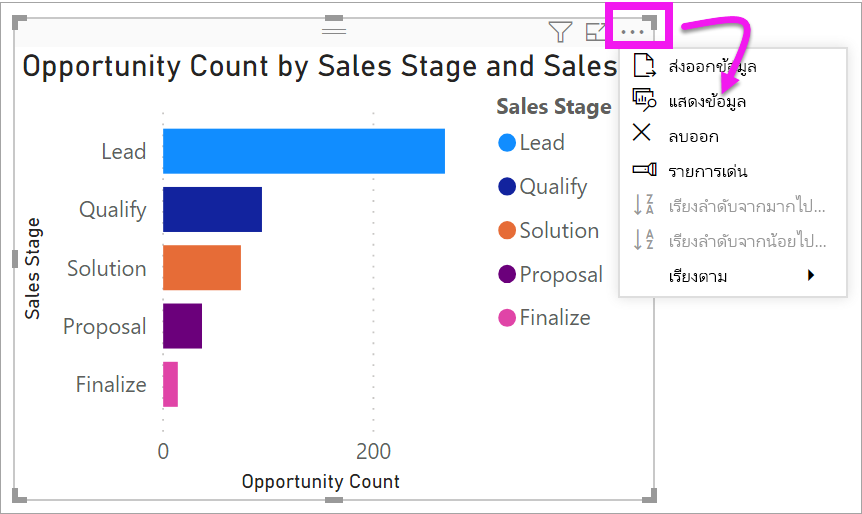
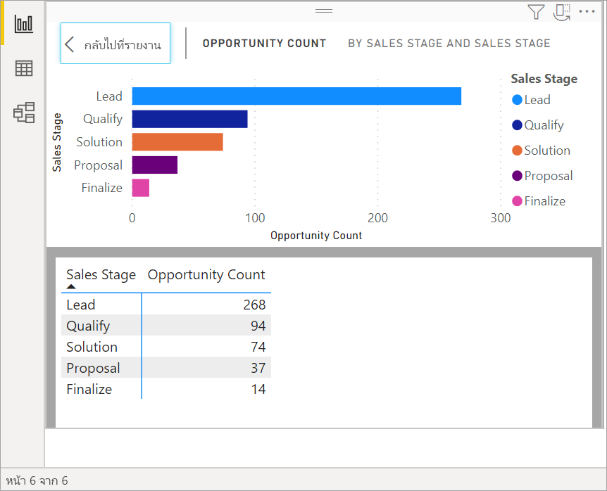
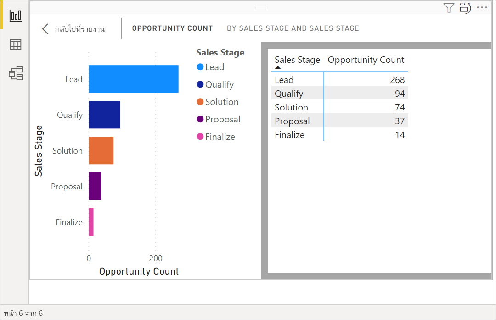
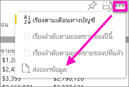
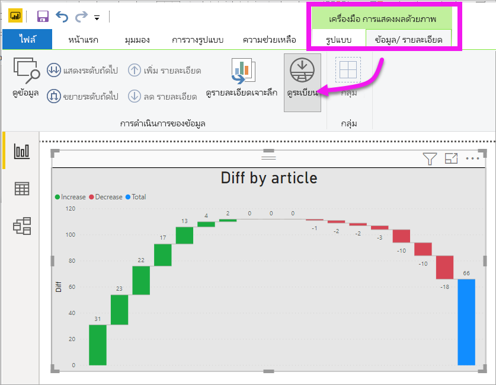
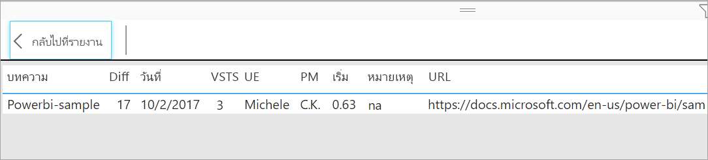

# แสดงข้อมูลเบื้องต้นของการจัดรูปแบบการแสดงข้อมูลDisplay a visualization's underlying data

[!INCLUDE[consumer-appliesto-yyyn](../includes/consumer-appliesto-nyyn.md)]    

## แสดงข้อมูลShow data
การแสดงภาพ Power BI จะถูกสร้างขึ้นโดยใช้ข้อมูลจากชุดข้อมูลของคุณA Power BI visualization is constructed using data from your datasets. หากคุณสนใจที่เห็นเบื้องหลัง Power BI ให้คุณสามารถ *แสดง* ข้อมูลที่กำลังกำลังมีการใช้เพื่อสร้างภาพดังกล่าวIf you're interested in seeing behind-the-scenes, Power BI lets you *display* the data that is being used to create the visual. เมื่อคุณเลือก **แสดงข้อมูล** Power BI แสดงข้อมูลด้านล่าง (หรือถัดจาก) การแสดงภาพWhen you select **Show Data**, Power BI displays the data below (or next to) the visualization.

นอกจากนี้ คุณยังสามารถส่งออกข้อมูลที่กำลังมีการใช้งานเพื่อสร้างการแสดงภาพเป็นไฟล์ .xlsx หรือ .csv และดูใน ExcelYou can also export the data that is being used to create the visualization as an .xlsx or .csv file and view it in Excel. สำหรับข้อมูลเพิ่มเติม ดู[ส่งออกข้อมูลจากการแสดงภาพ Power BI](power-bi-visualization-export-data.md)For more information, see [Export data from Power BI visualizations](power-bi-visualization-export-data.md).

> [!NOTE]
> ทั้ง *แสดงข้อมูล* และ *ส่งออกข้อมูล* มีใช้งานในบริการ Power BI และ Power BI Desktop*Show Data* and *Export Data* are both available in Power BI service and Power BI Desktop. อย่างไรก็ตาม Power BI Desktop มีรายละเอียดเพิ่มเติมอีกหนึ่งขั้น [*แสดงบันทึก* จะแสดงแถวจริงจากชุดข้อมูล](../create-reports/desktop-see-data-see-records.md)However, Power BI Desktop provides one additional layer of detail; [*Show Records* displays the actual rows from the dataset](../create-reports/desktop-see-data-see-records.md).
> 
> 

## ใช้ *แสดงข้อมูล*Using *Show Data* 
1. ใน Power BI Desktop ให้เลือกการแสดงผลข้อมูลด้วยภาพเพื่อเปิดใช้งานIn Power BI Desktop, select a visualization to make it active.

2. เลือก **การดำเนินการเพิ่มเติม** (...) และเลือก **แสดงข้อมูล**Select **More actions** (...) and choose **Show data**. 
    

3. ตามค่าเริ่มต้น ข้อมูลจะแสดงที่ด้านล่างภาพBy default, the data displays below the visual.
   
   

4. หากต้องการเปลี่ยนการวางแนว โปรดเลือกเค้าโครงแนวตั้งTo change the orientation, select vertical layout  บริเวณมุมบนขวาของการแสดงผลภาพfrom the top-right corner of the visualization.
   
   
5. เมื่อต้องการส่งออกข้อมูลไปยังไฟล์ .csv เลือกจุดไข่ปลาแล้วเลือก **ส่งออกข้อมูล**To export the data to a .csv file, select the ellipses and choose **Export data**.
   
    
   
    สำหรับข้อมูลเพิ่มเติมในการส่งออกข้อมูลไปยัง Exel ดู[ส่งออกข้อมูลจากการแสดงภาพ Power BI](power-bi-visualization-export-data.md)For more information on exporting the data to Excel, see [Export data from Power BI visualizations](power-bi-visualization-export-data.md).
6. เมื่อต้องซ่อนข้อมูล ยกเลิกเลือก **สำรวจ** > **แสดงข้อมูล**To hide the data, de-select **Explore** > **show data**.

## ใช้แสดงเรกคอร์ดUsing Show records
คุณยังสามารถมุ่งเน้นไปที่บันทึกข้อมูลเดียวในการแสดงภาพและเจาะลึกรายละเอียดเบื้องหลังYou can also focus on one data record in a visualization, and drill into the details behind it. 

1. หากต้องการใช้ **ดูเรกคอร์ด** ให้เลือกการแสดงผลข้อมูลด้วยภาพเพื่อเปิดใช้งานTo use **See records**, select a visualization to make it active. 

2. ในริบบอน Desktop ให้เลือกแท็บสำหรับ **เครื่องมือวิชวล** > **ข้อมูล/เจาะรายละเอียด** > **ดูเรกคอร์ด**In the Desktop ribbon, select the tab for **Visual tools** > **Data/Drill** > **See records**. 

    

3. เลือกจุดข้อมูลหรือแถวบนการแสดงผลข้อมูลด้วยภาพSelect a data point or row on the visualization. ในตัวอย่างนี้ เราได้เลือกคอลัมน์ที่สี่จากด้านซ้ายIn this example, we've selected the fourth column from the left. Power BI แสดงเรกคอร์ดชุดข้อมูลสำหรับจุดข้อมูลนี้ให้เราPower BI shows us the dataset record for this data point.

    

4. เลือก **กลับไปยังรายงาน** เพื่อกลับไปยังพื้นที่รายงานบน DesktopSelect **Back to report** to return to the Desktop report canvas. 

## ข้อควรพิจารณาและการแก้ไขปัญหาConsiderations and troubleshooting

- ถ้าปุ่ม **ดูเรกคอร์ด** ในริบบอนถูกปิดใช้งาน และแสดงเป็นสีเทา แสดงว่า การแสดงผลข้อมูลด้วยภาพที่เลือกไม่สนับสนุน ดูเรกคอร์ดIf the **See records** button in the ribbon is disabled and grayed-out, it means the selected visualization does not support See Records.
- คุณไม่สามารถเปลี่ยนข้อมูลในมุมมอง ดูเรกคอร์ด และบันทึกกลับไปยังรายงานได้You can't change the data in the See Records view and save it back to the report.
- คุณไม่สามารถใช้ ดูระเบียน เมื่อวิชวลของคุณใช้หน่วยวัดจากการคำนวณในแบบจำลองหลายมิติYou can't use See Records when your visual uses a calculated measure in a multidimensional model.
- คุณไม่สามารถใช้ ดูเรกคอร์ด เมื่อคุณเชื่อมต่อกับแบบจำลองสดแบบหลายมิติ (MD)You can't use See Records when you are connected to a live multidimensional (MD) model.  

## ขั้นตอนถัดไปNext steps
[ส่งออกข้อมูลจากการแสดงผลข้อมูลด้วยภาพของ Power BIExport data from Power BI visualizations](power-bi-visualization-export-data.md)    

มีคำถามเพิ่มเติมหรือไม่More questions? [ลองไปที่ชุมชน Power BITry the Power BI Community](https://community.powerbi.com/)

