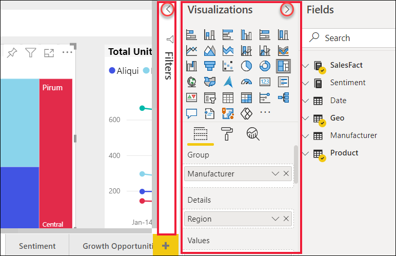

# เคล็ดลับและลูกเล่นในการจัดรูปแบบในรายงานTips and tricks for formatting in reports

[!INCLUDE[consumer-appliesto-nyyn](../includes/consumer-appliesto-nyyn.md)]    

Power BI มีหลายวิธีในการปรับแต่งรายงานของคุณPower BI provides many different ways to customize your reports. บทความนี้ให้รายละเอียดคอลเลกชันของเคล็ดลับที่สามารถทำให้การแสดงภาพ Power BI ของคุณดึงดูดใจ น่าสนใจ และตรงตามความต้องการของคุณมากขึ้นThis article details a collection of tips that can make your Power BI visualizations more compelling, interesting, and customized to your needs.

มีเคล็ดลับต่อไปนี้ให้The following tips are provided. มีเคล็ดลับที่ดีอื่น ๆ หรือไม่?Have another great tip? เยี่ยม!Great! ส่งมาที่เราและเราจะดูว่าสามารถเพิ่มลงในรายการนี้ได้หรือไม่Send it our way and we’ll see about adding it to this list.

* นำธีมไปใช้กับรายงานทั้งหมดApply a theme to the entire report
* เปลี่ยนสีของจุดข้อมูลเดียวChange the color of a single data point
* การจัดรูปแบบแบบมีเงื่อนไขConditional formatting
* ยึดตามสีของแผนภูมิสำหรับค่าตัวเลขBase the colors of a chart on a numeric value
* ยึดตามสีของจุดข้อมูลค่าสำหรับเขตข้อมูลBase the color of data points on a field value
* กำหนดสีที่ใช้ในระดับสีเองCustomize colors used in the color scale
* ใช้ระดับสีที่แยกออกจากกันUse diverging color scales
* เพิ่มสีให้แถวตารางAdd color to table rows
* วิธีการยกเลิกการกระทำใน Power BIHow to undo in Power BI

เพื่อทำการเปลี่ยนแปลง คุณต้องแก้ไขสิทธิ์สำหรับรายงานTo make any changes, you must have edit permissions for the report. ใน Power BI Desktop เปิดรายงานในมุมมอง **รายงาน**In Power BI Desktop, open the report in **Report** view. ในบริการของ Power BI นั่นหมายความว่าเปิดรายงานและเลือก **แก้ไข** จากแถบเมนูดังที่แสดงในรูปต่อไปนี้In the Power BI service, that means opening the report and selecting **Edit** from the menu bar, as shown in the following image.

เมื่อบานหน้าต่าง **ตัวกรอง** และ **การแสดงผลข้อมูลด้วยภาพ** ปรากฏทางด้านขวาของพื้นที่รายงาน คุณก็พร้อมที่จะเริ่มการกำหนดค่าเองได้When the **Filters** and **Visualizations** panes appear along the right side of the report canvas, you’re ready to start customizing. ถ้าบานหน้าต่างเมนูไม่ปรากฏ เลือกลูกศร จากมุมบนขวา เพื่อเปิดIf the panes do not appear, select the arrow, from the top-right corner, to open them.

## นำธีมไปใช้Apply a theme
ด้วยธีมรายงาน คุณสามารถใช้การเปลี่ยนแปลงการออกแบบกับรายงานทั้งหมดของคุณได้ เช่น การใช้สีสำหรับองค์กร การเปลี่ยนชุดไอคอน หรือการใช้การจัดรูปแบบภาพตามค่าเริ่มต้นใหม่With report themes you can apply design changes to your entire report, such as using corporate colors, changing icon sets, or applying new default visual formatting. เมื่อคุณใช้ธีมรายงาน การแสดงผลด้วยภาพทั้งหมดในรายงานของคุณจะใช้สีและการจัดรูปแบบจากธีมที่คุณเลือกWhen you apply a report theme, all visuals in your report use the colors and formatting from your selected theme. เมื่อต้องการเรียนรู้เพิ่มเติม โปรดดู [ใช้ธีมรายงาน](../create-reports/desktop-report-themes.md)To learn more, see [Use report themes](../create-reports/desktop-report-themes.md)

ที่นี่ เราได้ใช้ธีม **Innovate** กับรายงานยอดขายและการตลาดHere, we've applied the **Innovate** theme to the Sales and Marketing report.

## เปลี่ยนสีของจุดข้อมูลเดียวChange the color of a single data point
ในบางครั้งคุณต้องการไฮไลท์จุดข้อมูลจุดใดจุดหนึ่งSometimes you want to highlight one particular data point. อาจเป็นตัวเลขยอดขายสำหรับการเปิดตัวผลิตภัณฑ์ใหม่ หรือคะแนนคุณภาพที่เพิ่มขึ้นหลังจากเปิดตัวโปรแกรมใหม่Perhaps it’s a sales figure for the launch of a new product, or increased quality scores after launching a new program. ด้วย Power BI คุณสามารถไฮไลท์จุดข้อมูลเฉพาะได้โดยการเปลี่ยนสีWith Power BI, you can highlight a particular data point by changing its color.

แสดงการจัดลำดับภาพต่อไปนี้ของหน่วยที่ขายตามส่วนของผลิตภัณฑ์The following visualization ranks units sold by product segment. 

ตอนนี้สมมติว่า คุณต้องการเรียกใช้เซกเมนต์ **ความสะดวกสบาย** เพื่อจะดูว่าเซกเมนต์ใหม่นี้แสดงผลโดยใช้สีออกมาได้ดีNow imagine you want to call out the **Convenience** segment to show how well this brand new segment is performing, by using color. ต่อไปนี้คือขั้นตอน:Here are the steps:

ขยายการ์ด **สีข้อมูล** และเปิดแถบเลื่อนสำหรับ **แสดงทั้งหมด**Expand the **Data colors** card and turn the slider On for **Show all**. ขั้นตอนนี้จะแสดงสีต่าง ๆ สำหรับแต่ละองค์ประกอบข้อมูลในการแสดงภาพThis displays the colors for each data element in the visualization. ตอนนี้คุณสามารถปรับเปลี่ยนจุดข้อมูลใดก็ตามYou can now modify any of the data points.

ตั้งค่า **ความสะดวกสบาย** ให้เป็นสีส้มSet **Convenience** to orange. 

เมื่อเลือกแล้ว จุดข้อมูล **ความสะดวกสบาย** จะเป็นสีส้มสวยงามและโดดเด่นมากOnce selected, the **Convenience** data point is a nice shade of orange, and certainly stands out.

แม้ว่าคุณจะเปลี่ยนชนิดการแสดงภาพ Power BI จะยังคงจดจำสิ่งที่คุณเลือกและทำให้ **ความสะดวกสบาย** ยังคงเป็นสีส้มอยู่Even if you change visualization types, then return, Power BI remembers your selection and keeps **Convenience** orange.

คุณสามารถเปลี่ยนสีของจุดข้อมูลสำหรับจุดเดียว หลายๆ จุด หรือองค์ประกอบข้อมูลทั้งหมดในการแสดงภาพได้You can change the color of a data point for one, several, or all data elements in the visualization. บางทีคุณอาจต้องการให้วิชวลของคุณมีสีเหมือนกับสีขององค์กรคุณ สีเหลือง สีเขียว และสีน้ำเงินPerhaps you want your visual to mimic your corporate colors of yellow, green, and blue. 

มีหลากหลายสิ่งที่คุณสามารถทำได้ด้วยสีThere are all sorts of things you can do with colors. ในส่วนถัดไป เราจะไปดูที่การจัดรูปแบบแบบมีเงื่อนไขIn the next section, we take a look at conditional formatting.

## การจัดรูปแบบตามเงื่อนไขสำหรับการแสดงผลข้อมูลด้วยภาพConditional formatting for visualizations
การแสดงผลข้อมูลด้วยภาพมักจะได้รับประโยชน์จากการตั้งค่าสีแบบไดนามิกที่ยึดตามค่าตัวเลขของเขตข้อมูลVisualizations often benefit from dynamically setting color based on the numeric value of a field. ด้วยการทำเช่นนี้ คุณสามารถแสดงค่าที่แตกต่างจากค่าที่เคยใช้ได้สำหรับขนาดของแถบ และแสดงค่าสองค่าในกราฟเดียวได้By doing this, you could show a different value than what’s used for the size of a bar, and show two values on a single graph. หรือคุณสามารถใช้ขั้นตอนนี้เพื่อไฮไลท์จุดข้อมูลเหนือ (หรือใต้) ค่าบางค่าได้ โดยอาจไฮไลท์พื้นที่ของกาทำกำไรที่ต่ำOr you can use this to highlight data points over (or under) a certain value – perhaps highlighting areas of low profitability.

ส่วนต่อไปนี้สาธิตวิธีการที่แตกต่างกันในการยึดสีตามค่าตัวเลขThe following sections demonstrate different ways to base color on a numeric value.

### ยึดตามสีของจุดข้อมูลสำหรับค่าหนึ่งBase the color of data points on a value
หากต้องการเปลี่ยนสีตามค่า ให้เลือกการแสดงผลข้อมูลด้วยภาพเพื่อทำให้ใช้งานได้To change color based on a value, select a visualization to make it active. เปิดบานหน้าต่างจัดรูปแบบโดยเลือกไอคอนแปรงลูกกลิ้ง และเลือกการ์ด **สีข้อมูล**Open the Formatting pane by selecting the paint roller icon and then choose the **Data colors** card. ด้านล่าง **สีเริ่มต้น** ให้เลือกไอคอน fxBelow **Default color**, select the fx icon.  

ในบานหน้าต่าง **สีเริ่มต้น** ใช้ดรอปดาวน์เพื่อระบุเขตข้อมูลที่จะใช้การจัดรูปแบบตามเงื่อนไขIn the **Default color** pane, use the dropdowns to identify the fields to use for conditional formatting. ในตัวอย่างนี้ เราได้เลือกเขตข้อมูล **ข้อเท็จจริงเกี่ยวกับยอดขาย** > **ผลรวมหน่วย** และเลือกสีฟ้าอ่อนสำหรับการ **ค่าต่ำสุด** และสีน้ำเงินเข้มสำหรับ **ค่าสูงสุด**In this example, we've selected the **Sales fact** > **Total Units** field and selected light blue for the **Lowest value** and dark blue for **Highest value**. 

คุณยังสามารถจัดรูปแบบสีของภาพโดยใช้เขตข้อมูลที่ไม่ได้อยู่ในภาพYou can also format the color of the visual using a field that is not part of the visual. ในรูปต่อไปนี้ มีการใช้ **%Market Share SPLY YTD**In the following image, **%Market Share SPLY YTD** is being used. 

อย่างที่คุณเห็น แม้ว่าเราขายต่อหน่วยได้มากกว่าทั้งในแง่ของ **ประสิทธิภาพ** และ **ระดับสุดยอด** (คอลัมน์ของทั้งคู่ขึ้นสูงกว่า) แต่ **การจัดการดูแล** มี **%Market Share SPLY YTD** ที่ใหญ่กว่า (คอลัมน์มีความเข้มของสีมากกว่า)As you can see, although we've sold more units of both **Productivity** and **Extreme** (their columns are higher), **Moderation** has a larger **%Market Share SPLY YTD** (its column has more color saturation).

### กำหนดสีที่ใช้ในระดับสีเองCustomize the colors used in the color scale
คุณยังสามารถเปลี่ยนวิธีที่ค่าแมปไปยังสีเหล่านี้ได้You can also change the way the values map to these colors. ในรูปต่อไปนี้ สีสำหรับ **ต่ำสุด** และ **สูงสุด** จะถูกตั้งค่าเป็นสีส้มและสีเขียวตามลำดับIn the following image, the colors for **Minimum** and **Maximum** are set to orange and green, respectively.

ในรูปภาพแรกนี้โปรดสังเกตว่า แท่งในแผนภูมิแสดงการไล่ระดับสีที่แสดงในแถบดังกล่าว โดยที่ค่าสูงสุดเป็นสีเขียว ค่าต่ำสุดเป็นสีส้ม และแต่ละแถบในระหว่างนี้จะเป็นหนึ่งสีในสเปกตรัมระหว่างสีเขียวและสีส้มIn this first image, notice how the bars in the chart reflect the gradient shown in the bar; the highest value is green, the lowest is orange, and each bar between is colored with a shade of the spectrum between green and orange.

ตอนนี้ มาดูว่าจะเกิดอะไรขึ้นถ้าเรามีค่าตัวเลขในกล่องค่า **ต่ำสุด** และ **สูงสุด**Now, let’s see what happens if we provide numeric values in the **Minimum** and **Maximum** value boxes. เลือก **กำหนดเอง** จากดรอปบ็อกซ์สำหรับทั้ง **ต่ำสุด** และ **สูงสุด** และตั้งค่า **ต่ำสุด** เป็น 3,500 และตั้งค่า **สูงสุด** เป็น 6,000Select **Custom** from the dropboxes for both **Minimum** and **Maximum**, and set **Minimum** to 3,500, and set **Maximum** to 6,000.

ด้วยการตั้งค่าเหล่านั้น จะไม่นำการไล่ระดับสีไปใช้กับค่าบนแผนภูมิที่อยู่ด้านล่าง **ต่ำสุด** หรือสูงกว่า **สูงสุด** อีกต่อไป แถบใดที่มีค่าเหนือค่า **สูงสุด** จะเป็นสีเขียว และแถบใดที่มีค่าที่อยู่ต่ำกว่าค่า **ต่ำสุด** จะเป็นสีแดงBy setting those values, gradient is no longer applied to values on the chart that are below **Minimum** or above **Maximum**; any bar with a value over **Maximum** value is colored green, and any bar with a value under **Minimum** value is colored red.

### ใช้ระดับสีที่แยกออกจากกันUse diverging color scales
ในบางครั้งข้อมูลของคุณอาจมีมาตราส่วนแยกออกจากกันอย่างเป็นธรรมชาติSometimes your data may have a naturally diverging scale. ตัวอย่างเช่น ช่วงอุณหภูมิมีศูนย์กลางที่เป็นธรรมชาติที่จุดการเยือกแข็ง และมีคะแนนกำไรจากจุดกลาง (ศูนย์) ที่เป็นธรรมชาติFor example, a temperate range has a natural center at freezing point, and a profitability score has a natural mid-point (zero).

หากต้องการใช้ระดับสีที่แยกออกจากกัน ให้เลือกช่องทำเครื่องหมายสำหรับ **เลือกแยกจากกัน**To use diverging color scales, select the checkbox for  **Diverging**. เมื่อเปิดใช้งาน **เลือกแยกจากกัน** แล้ว ตัวเลือกสีเพิ่มเติมที่เรียกว่า **ศูนย์** จะปรากฏขึ้น ดังที่แสดงในรูปต่อไปนี้When **Diverging** is turned on, an additional color selector, called **Center**, appears, as shown in the following image.

เมื่อเปิดใช้งานตัวเลื่อน **เลือกแยกจากกัน** แล้ว คุณสามารถตั้งค่าสีต่าง ๆ สำหรับ **ต่ำสุด**, **สูงสุด** และ **ศูนย์** แยกกันได้When the **Diverging** slider is on, you can set the colors for **Minimum**, **Maximum** and **Center** separately. ในรูปต่อไปนี้ **ศูนย์** ถูกตั้งค่าเป็น .2 สำหรับ **% Market Share SPLY YTD** ดังนั้น แถบที่มีค่ามากกว่า .2 จะมีสีไล่ระดับเป็นสีเขียว และแถบที่น้อยกว่าหนึ่งจะมีสีไล่ระดับเป็นสีแดงIn the following image, **Center** is set to .2 for **% Market Share SPLY YTD**, so bars with values above .2 are a gradient shade of green, and bars below one are shades of red.

## เพิ่มสีให้แถวตารางAdd color to table rows
ตารางและเมทริกซ์มีตัวเลือกมากมายสำหรับการจัดรูปแบบสีTables and matrixes offer many options for color formatting. 

หนึ่งในวิธีที่เร็วที่สุดในการนำสีไปใช้กับตารางหรือเมทริกซ์คือการเปิดแท็บการจัดรูปแบบและเลือก **ลักษณะ**One of the quickest ways to apply color to a table or matrix is to open the Formatting tab and select **Style**.  ในรูปด้านล่างเราได้เลือก **แถวสีฉูดฉาดที่มีส่วนหัวเป็นตัวหนา**In the image below, we've selected **Bold header flashy rows**.

ทดลองใช้ตัวเลือกการจัดรูปแบบสีอื่นๆExperiment with other color formatting options. ในรูปนี้เราได้เปลี่ยนสีพื้นหลังภายใต้ **ส่วนหัวของคอลัมน์** และเปลี่ยนทั้ง **สีพื้นหลัง** และ **สีพื้นหลังสำรอง** สำหรับ **ค่า** (แถว)In this image, we've changed the background color under **Column headers** and changed both the **Background color** and **Alternate background color** for the **Values** (rows).

## วิธีการยกเลิกการกระทำใน Power BIHow to undo in Power BI
เช่นเดียวกับบริการและซอฟต์แวร์อื่น ๆ อีกมากมายของ Microsoft, Power BI มีวิธีง่าย ๆ ในการยกเลิกคำสั่งล่าสุดของคุณLike many other Microsoft services and software, Power BI provides an easy way to undo your last command. ตัวอย่างเช่น สมมติว่าคุณเปลี่ยนสีของจุดข้อมูลหรือชุดของจุดข้อมูล และคุณไม่ชอบสีดังกล่าวเมื่อปรากฏขึ้นในการแสดงภาพFor example, let’s say you change the color of a data point, or a series of data points, and you don’t like the color when it appears in the visualization. คุณจำไม่ได้แน่ชัดว่าสีใดที่ใช้ก่อนหน้านี้ คุณรู้แค่ว่าคุณต้องการให้สีนั้นกลับมาYou don’t recall exactly which color it was before, but you know you want that color back!

หากต้องการ **เลิกทำ** การกระทำล่าสุด หรือสองสามการกระทำล่าสุด สิ่งที่คุณต้องทำคือพิมพ์ CTRL + ZTo **undo** your last action, or the last few actions, all you have to do is type CTRL+Z.

หากต้องการละทิ้งการเปลี่ยนแปลงทั้งหมดที่คุณทำบนการ์ดการจัดรูปแบบ ให้เลือก **แปลงกลับเป็นค่าเริ่มต้น**To discard all the changes you made on a Formatting card, select **Revert to default**.

## ให้คำติชมของคุณแก่เราGive us your feedback
คุณมีคำแนะนำที่คุณต้องการแชร์หรือไม่?Do you have a tip you’d like to share? โปรดส่งมาหาเรา และเราจะดูว่าสามารถรวมไว้ที่นี่ได้หรือไม่Please send it our way, and we’ll see about including it here.

## ขั้นตอนถัดไปNext steps
[เริ่มใช้งานด้วยคุณสมบัติแกนและการจัดรูปแบบสีGetting started with color formatting and axis properties](service-getting-started-with-color-formatting-and-axis-properties.md)

[การแชร์รายงาน](../collaborate-share/service-share-reports.md)[Sharing reports](../collaborate-share/service-share-reports.md).

